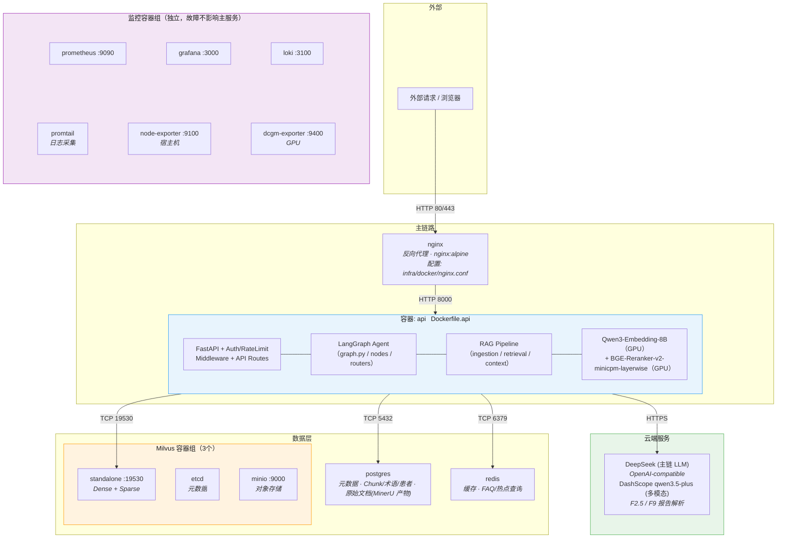

# 1. 项目总览

> 作者本地开发环境：CPU 9800X3D，GPU RTX 5070 Ti（16GB），RAM 48GB。文档中涉及"GPU 显存"的部署/选型决策均以此硬件为基准。

## 1.1 项目亮点：

**Spec-driven 协作开发**：本 `DEV_SPEC.md` 是单一事实源（架构 / schema / §8.4 进度表 / §9 全局契约），由作者主导架构与取舍判断，与 Claude 协作完成快速实现。`.claude/skills/auto-coder/scripts/sync_spec.py` 是配套内部工具，按章节生成 `references/` 镜像，供 Claude 按章节加载，避免一次塞 4976 行进上下文。


深入实际业务场景，根据业务场景进行优化，听取了经验丰富主任医师的意见进行多次商讨


可观测、可视化管理、集成评估

## 1.2 目录
```
1. 项目总览
   1.1 项目亮点
   1.2 目录
   1.3 总体架构

2. 技术选型
   2.1 Embedding 模型选型
   2.2 Agent 及 RAG 系统模型选型
      2.2.1 理论选型
      2.2.2 选型测评结果
   2.3 Reranker 模型选型
   2.4 数据存储选型及具体设计
      2.4.1 Milvus 医学文献向量库
      2.4.2 PostgreSQL 元数据存储
      2.4.3 PostgreSQL 会话与对话记录
      2.4.4 原始文档存储：PostgreSQL raw_documents 表
      2.4.5 PostgreSQL 病人信息
      2.4.6 Milvus 术语向量库

3. RAG 系统 Pipeline
   3.1 数据摄取
      3.1.1 数据加载及处理（MinerU）
      3.1.2 Chunking
      3.1.3 Transform & Enrichment
      3.1.4 幂等性设计
      3.1.5 Embedding
      3.1.6 索引存储
   3.2 召回策略
      3.2.1 查询预处理（Query Processing）
      3.2.2 召回（Dense + Sparse + RRF 融合）
      3.2.3 精确过滤与重排

4. Agent 设计
   4.1 工作流（LangGraph StateGraph，16 节点 + 2 条件路由）
   4.2 上下文管理（Select + Compress 两层架构）

5. 基础设施
   5.1 性能优化层（Redis 缓存、连接池）
   5.2 监控层（Prometheus + Grafana + Loki + 审计系统）
   5.3 管理层（动态配置、权限系统）

6. 评估
   6.1 RAG 检索评估
   6.2 Agent 决策评估
   6.3 端到端系统评估
   6.4 三层评估的关系

7. Prompt 模板

8. 项目排期
   8.1 排期原则
   8.2 阶段总览
   8.3 详细排期
   8.4 进度跟踪表

9. 全局实现契约（跨章节，实现前必读）
   9.1 统一机制（with_structured_output + 重试 + 分级失败处理）
   9.2 Schema 演进兼容性
   9.3 全量结构化输出清单
   9.4 不需要结构化输出的 LLM 调用
   9.5 全量 Pydantic Schema 定义
   9.6 审计埋点契约（rag_trace 写入规则）
   9.7 运行时常量集中（agent_limits）
   9.8 跨章节数据契约快速参考（terms_collection 等）
```

## 1.3 总体架构
### 1.3.1 项目文件目录结构
```
Agentic-RAG-Medical-care-Assistant/
│
├── docker-compose.yml                  # 容器编排（共 13 个）：nginx, api, Milvus（standalone+etcd+minio）, PostgreSQL, Redis, Prometheus, Grafana, Loki, Promtail, Node Exporter, DCGM Exporter（LLM 推理通过云端 API 调用）
├── .dockerignore                       # docker build 上下文排除（.venv / tests / data / infra/{grafana,prometheus,...}），J0 新增
├── .env.example                        # 环境变量模板（不提交 .env）
├── .gitignore
├── pyproject.toml                      # 项目依赖与构建配置（含 [tool.uv].extra-index-url cu128）
├── alembic.ini                         # 数据库迁移配置（Alembic）
├── README.md                           # 中文 README
├── README.en.md                        # 英文 README（J5 完善前为占位）
├── DEV_SPEC.md                         # 技术文档
│
├── config/                             # 静态配置文件
│   ├── settings.py                     # 全局配置（含模型配置 EmbeddingSettings/RerankerSettings/LLMSettings,从 .env 加载）
│   ├── milvus_schema.py                # Milvus Collection Schema 定义（docs_collection + terms_collection）
│   └── logging_config.py               # 日志格式与 Promtail 适配
│
├── src/
│   ├── __init__.py
│   │
│   ├── api/                            # API 网关 / 入口服务
│   │   ├── __init__.py
│   │   ├── app.py                      # FastAPI 应用入口
│   │   ├── routes/
│   │   │   ├── __init__.py
│   │   │   ├── diagnosis.py            # 问诊接口（POST /diagnose, 追问交互）
│   │   │   ├── auth.py                 # 登录注册（JWT）
│   │   │   ├── patient.py              # 患者信息 CRUD
│   │   │   ├── admin.py                # 管理员：知识库上传、配置修改
│   │   │   └── health.py               # 健康检查 & Prometheus /metrics
│   │   ├── middleware/
│   │   │   ├── __init__.py
│   │   │   ├── auth_middleware.py       # JWT 验证 + 角色判断（admin/patient）
│   │   │   └── rate_limiter.py         # 限流（防止 API 超配额）
│   │   └── schemas/                    # Pydantic 请求/响应模型
│   │       ├── __init__.py
│   │       ├── diagnosis_schema.py
│   │       └── patient_schema.py
│   │
│   ├── agent/                          # Agent 编排层（LangGraph StateGraph）
│   │   ├── __init__.py
│   │   ├── graph.py                    # StateGraph 定义：节点注册、边与条件边连接
│   │   ├── state.py                    # MedicalState Schema（Pydantic BaseModel）+ 嵌套 BaseModel + create_initial_state 工厂
│   │   ├── nodes/                      # 各节点实现
│   │   │   ├── __init__.py
│   │   │   ├── info_collect.py         # 节点 ①：主诉提取 + 病史/报告加载（单轮无交互）
│   │   │   ├── analyze_initial_reports.py  # 节点 ①.5：初始报告解析（多模态 LLM 直读，提取结构化发现）
│   │   │   ├── build_query.py          # 节点 ②：NER + Entity Linking + 术语扩展 + Query 构建/改写
│   │   │   ├── retrieve.py             # 节点 ③：全量向量召回
│   │   │   ├── extract_symptoms.py     # 节点 ④：症状提取（TF-IDF + 分层术语归一化，零 LLM）
│   │   │   ├── select_symptom.py       # 节点 ⑤：维度缺口优先 + 选择高区分度追问症状（信息增益）
│   │   │   ├── generate_followup.py    # 节点 ⑥a：生成追问问题
│   │   │   ├── wait_followup_answer.py # 节点 ⑥b：interrupt 等待用户回答
│   │   │   ├── process_followup.py     # 节点 ⑦：处理追问回答
│   │   │   ├── recommend_exam.py       # 节点 ⑧a：生成检查建议
│   │   │   ├── wait_exam_report.py     # 节点 ⑧b：interrupt 等待检查结果回传
│   │   │   ├── process_exam_result.py  # 节点 ⑨：处理检查结果回传
│   │   │   ├── diagnose.py             # 节点 ⑩：诊断推理（Cross-Encoder 截断 + 三步分阶段 LLM 推理）
│   │   │   ├── safety_gate.py           # 节点 ⑪：安全约束门控（规则+LLM）
│   │   │   ├── generate_advice.py      # 节点 ⑫：生成建议（用药/检查/高危提示）
│   │   │   └── format_response.py      # 节点 ⑬：格式化最终回复
│   │   ├── schemas/                    # LLM 结构化输出 Pydantic Schema（详见 §9.5）
│   │   │   ├── __init__.py
│   │   │   ├── info_collect.py         # InfoCollectOutput
│   │   │   ├── report_parser.py        # ReportFinding, ReportFindings
│   │   │   ├── ner.py                  # NEREntity, NERResult
│   │   │   ├── entity_linking.py       # EntityLinkingMatch（三层归一化返回结构，零 LLM）
│   │   │   ├── query_construction.py   # QueryConstructionOutput
│   │   │   ├── symptom_selection.py    # DimensionSelection, AskabilityJudgment
│   │   │   ├── followup.py             # FollowupParseResult
│   │   │   ├── diagnosis.py            # HistoryFactor, SlotRelevance, ReportEvidence, CandidateEvidence, EvidenceSheet, RankedDisease, DiagnosisRanking, DiagnosisOutput
│   │   │   ├── safety_gate.py          # SafetyGateOutput
│   │   │   ├── advice.py               # AdviceOutput
│   │   │   ├── ingestion.py            # ChunkEnrichmentOutput
│   │   │   └── evaluation.py           # LLM Judge 评分 Schema
│   │   ├── utils/                      # Agent 层共享工具
│   │   │   └── report_parser.py        # 报告解析共享逻辑（多模态 LLM 直读 + 结构化发现提取，①.5 和 ⑨ 共用）
│   │   └── routers/                    # 条件边路由逻辑
│   │       ├── __init__.py
│   │       ├── should_continue.py      # 追问/诊断 两路路由
│   │       └── diagnose_router.py      # 诊断后路由（need_exam / safety_gate）
│   │
│   ├── rag/                            # RAG 系统 Pipeline
│   │   ├── __init__.py
│   │   ├── ingestion/                  # 3.1 数据摄取
│   │   │   ├── __init__.py
│   │   │   ├── mineru_loader.py        # 3.1.1 MinerU 产物加载（读取 markdown + content_list）
│   │   │   ├── chunking.py             # 3.1.2 父子分块：目录权威清单 + 节内三遍切【】+(一)+1. + size 驱动子块切
│   │   │   ├── enrichment.py           # 3.1.3 LLM 增强（title/summary/questions）
│   │   │   ├── idempotency.py          # 3.1.4 幂等性：source_id / heading_path_id / chunk_id（含父块 "parent" 约定）/ content_hash
│   │   │   ├── embedding.py            # 3.1.5 多向量 Embedding（Dense: Qwen3-Embedding-8B, Sparse: Milvus BM25）
│   │   │   ├── storage.py              # 3.1.6 写入 PostgreSQL + Milvus（含僵尸清理）
│   │   │   └── pipeline.py             # 完整摄取 Pipeline 编排（串联以上步骤）
│   │   │
│   │   ├── retrieval/                  # 3.2 召回策略
│   │   │   ├── __init__.py
│   │   │   ├── query_processing.py     # 3.2.1 查询预处理（指代消歧、关键词提取、术语扩展、多角度改写）
│   │   │   ├── sparse_retriever.py     # 3.2.2 Sparse Route（Milvus BM25 全文检索）
│   │   │   ├── dense_retriever.py      # 3.2.2 Dense Route（单次 ANN）
│   │   │   ├── fusion.py               # 3.2.2 单阶段多路 RRF 融合 + 多向量聚合
│   │   │   └── reranker.py             # 3.2.3 Cross-Encoder 精排（diagnose ⑩ 前置截断，非检索阶段调用 / 回退策略）
│   │   │
│   │   └── context/                    # Agent 上下文管理（4.2）
│   │       └── __init__.py             # 当前固定流程下无需独立 compact/select 节点（见 4.2.4 / 4.2.5），上下文管理逻辑内嵌于各业务节点；compressor.py / selector.py 为未来开放式交互场景预留，阶段一不实现
│   │
│   ├── models/                         # 模型推理层
│   │   ├── __init__.py
│   │   ├── llm_client.py              # LLM 推理客户端（DashScope OpenAI-compatible API）
│   │   ├── embedding_model.py         # Qwen3-Embedding-8B（GPU 推理，INT8）
│   │   └── reranker_model.py          # BGE-Reranker-v2-minicpm-layerwise（GPU 推理，与 Embedding 共享显卡）
│   │
│   ├── db/                            # 数据与缓存层
│   │   ├── __init__.py
│   │   ├── postgres/
│   │   │   ├── __init__.py
│   │   │   ├── connection.py           # PostgreSQL 连接池
│   │   │   ├── models.py               # ORM 模型（sources, raw_documents, chunks, users, patients, conversations 等）
│   │   │   ├── metrics.py              # SQLAlchemy 事件订阅 → Prometheus Histogram（依赖层指标，§5.2.1 ③）
│   │   │   └── migrations/             # 数据库迁移脚本（Alembic）
│   │   │       └── ...
│   │   ├── milvus/
│   │   │   ├── __init__.py
│   │   │   ├── connection.py           # Milvus 连接管理
│   │   │   ├── client.py               # 统一调用封装 + Prometheus Histogram（依赖层指标，§5.2.1 ③）
│   │   │   ├── docs_collection.py      # 医学文献向量库操作（2.4.1）
│   │   │   └── terms_collection.py     # 术语向量库操作（2.4.6）
│   │   └── redis/
│   │       ├── __init__.py
│   │       └── cache.py                # Redis 缓存（仅配置缓存，MVP 阶段不做 RAG 响应缓存，见 §5.1）
│   │
│   ├── prompts/                       # LLM Prompt 模板
│   │   ├── __init__.py
│   │   ├── ingestion.py               # 数据摄取增强 Prompts（title/summary/hypothetical_questions）
│   │   ├── agent.py                   # Agent 节点 Prompts（病史采集、Query 构建、追问、诊断、安全门控、建议生成）
│   │   └── evaluation.py              # LLM Judge 评估 Prompts
│   │
│   └── common/                        # 公共工具
│       ├── __init__.py
│       ├── normalize.py               # 文本规范化函数（全角转半角、NFC 等，见 3.1.4.2）
│       ├── hashing.py                 # SHA256 工具（chunk_id、content_hash、heading_path_id）
│       └── metrics.py                 # Prometheus 指标埋点
│
├── terms/                             # 术语库构建脚本(项目内代码;原始数据走数据卷,见目录树后说明)
│   └── build_icd10.py                 # ICD-10 灌库脚本(→ terms_collection)
│                                      # CMeSH 等其他术语来源 YAGNI,按需补
│
├── evaluation/                        # 6. 评估系统
│   ├── __init__.py
│   ├── datasets/                      # 测试集（JSON/JSONL）
│   │   ├── rag_eval.jsonl             # RAG 检索质量测试集
│   │   └── agent_eval.jsonl           # Agent 决策测试集（L1-L5 梯度）
│   ├── offline/
│   │   ├── rag_evaluator.py           # RAG 离线评估（召回率、准确率）
│   │   ├── agent_evaluator.py         # Agent 离线评估（轨迹、工具调用、容错）
│   │   └── llm_judge.py               # LLM Judge 评分
│   └── online/
│       └── tracing.py                 # 在线追踪（端到端延时、Token 统计）
│
├── infra/                             # 基础设施配置
│   ├── docker/
│   │   ├── Dockerfile.api             # API 服务镜像（FastAPI + Agent + RAG + Embedding + Reranker）
│   │   └── nginx.conf                 # Nginx 反向代理配置
│   ├── prometheus/
│   │   └── prometheus.yml             # Prometheus 采集配置
│   ├── grafana/
│   │   └── dashboards/               # Grafana 仪表盘 JSON
│   ├── loki/
│   │   └── loki-config.yml
│   └── promtail/
│       └── promtail-config.yml
│
├── scripts/                           # 运维脚本
│   ├── init_db.py                     # 初始化 PostgreSQL 表结构 + 索引
│   ├── init_milvus.py                 # 初始化 Milvus Collection + 索引
│   ├── ingest.py                      # 文档摄取入口（调用 rag.ingestion.pipeline）
│   └── batch_parse_pdfs.sh            # 批量 mineru 解析 raw-pdf/ 下所有 PDF(幂等,跳过已完成)
│
└── tests/
    ├── unit/
    │   ├── test_normalize.py
    │   ├── test_hashing.py
    │   ├── test_chunking.py
    │   └── test_fusion.py
    ├── integration/                    # Mock LLM + Mock DB 的模块集成测试
    │   ├── test_ingestion_pipeline.py
    │   ├── test_retrieval.py
    │   └── test_agent_workflow.py
    └── e2e/                            # 真实 DashScope + 真实 Milvus/PG 的端到端冒烟（阶段 J）
        ├── test_ingestion_e2e.py       # J1
        ├── test_retrieval_e2e.py       # J2
        ├── test_agent_workflow_e2e.py  # J3
        └── test_api_e2e.py             # J4
```

> 本节只描述项目目录(代码)。原始数据、模型权重、解析产物等本机路径全部由 `.env` 配置,见 `.env.example`,spec 不重复列出。

### 1.3.2 目录与文档章节对应关系

| DEV_SPEC 章节 | 对应目录 |
|---|---|
| 2.1 Qwen3-Embedding-8B 模型 | `src/models/embedding_model.py` |
| 2.2 云端 LLM API（DashScope） | `src/models/llm_client.py` |
| 2.3 BGE-Reranker-v2-minicpm-layerwise 精排模型 | `src/models/reranker_model.py` |
| 2.4.1 Milvus 医学文献向量库 | `src/db/milvus/docs_collection.py` |
| 2.4.2 PostgreSQL 元数据存储 | `src/db/postgres/` |
| 2.4.3 PostgreSQL 会话与对话记录 | `src/db/postgres/models.py` → sessions / conversations |
| 2.4.4 原始文档存储 raw_documents 表 | `src/db/postgres/models.py`（raw_documents ORM 类） |
| 2.4.5 PostgreSQL 病人信息 | `src/db/postgres/models.py` → patients 等 |
| 2.4.6 Milvus 术语向量库 | `src/db/milvus/terms_collection.py` + `terms/` |
| 3.1.1 MinerU 数据加载 | `src/rag/ingestion/mineru_loader.py` |
| 3.1.2 Chunking | `src/rag/ingestion/chunking.py` |
| 3.1.3 Transform & Enrichment | `src/rag/ingestion/enrichment.py` |
| 3.1.4 幂等性设计 | `src/rag/ingestion/idempotency.py` + `src/common/hashing.py` |
| 3.1.5 Embedding | `src/rag/ingestion/embedding.py` |
| 3.1.6 索引存储 | `src/rag/ingestion/storage.py` |
| 3.2.1 查询预处理 | `src/rag/retrieval/query_processing.py` |
| 3.2.2 召回（Dense + Sparse + RRF） | `src/rag/retrieval/` |
| 3.2.3 Cross-Encoder 精排（diagnose ⑩ 前置） | `src/rag/retrieval/reranker.py` |
| 4.1 Agent 工作流（16 节点 + 2 路由） | `src/agent/graph.py` + `nodes/`（①~⑬ 含 ①.5，⑥/⑧ 各拆 a/b）+ `routers/`（should_continue / diagnose_router） |
| 4.2 上下文管理 | `src/rag/context/` |
| 5.1 Redis 缓存 | `src/db/redis/cache.py` |
| 5.2 监控层 | `infra/prometheus/` + `infra/grafana/` + `infra/loki/` |
| 5.2.3 PostgreSQL 审计系统 | `src/db/postgres/models.py` → rag_trace / kb_change_log / config_change_log / diagnosis_feedback |
| 5.3 动态配置管理 | `src/db/postgres/models.py` → system_config |
| 5.3 权限与配置 | `src/api/middleware/` + `src/db/postgres/` |
| 6. 评估系统 | `evaluation/` |
| 7. Prompt 模板 | `src/prompts/` |
| 9. 全局实现契约（跨章节） | `src/agent/schemas/`（Pydantic Schema 权威定义）+ `src/common/metrics.py`（模块级 Prometheus 指标对象 + `RetryObserver` callback，**不含装饰器/helper 封装**）；规则贯穿 3/4/6/7 章所有 LLM 调用实现，各调用点按 §9.1 模板裸写 |

### 1.3.3 项目层级

#### 逻辑层级说明

**客户端层**

- Nginx 反向代理（`infra/docker/nginx.conf`），暴露 REST 接口
- 认证中间件（`src/api/middleware/auth_middleware.py`）与限流中间件（`src/api/middleware/rate_limiter.py`），防止 API 超配额，确保系统稳定

**API 服务层**（含 Agent 编排、RAG、Embedding/Reranker，同进程内调用）

- FastAPI 应用（`src/api/app.py`），提供诊断、患者管理、健康检查、管理等路由
- 请求/响应 Schema 校验（`src/api/schemas/`）
- 状态图驱动的多步诊断流程（`src/agent/graph.py`），基于信息增益收敛的迭代式工作流
- 节点（16 个）：病史采集、初始报告解析、Query 构建、向量召回、症状提取、区分度选择、追问生成（⑥a）、追问等待（⑥b）、追问处理、建议检查（⑧a）、检查结果等待（⑧b）、检查结果处理、诊断推理、安全约束门控、建议生成、格式化回复（`src/agent/nodes/`）
- 路由器（2 个）：should_continue（追问/诊断两路路由）、diagnose_router（诊断后路由：need_exam / safety_gate）（`src/agent/routers/`）
- 数据摄取 Pipeline：MinerU 文档解析 → Chunking → LLM 增强（摘要/问题生成/图片描述） → 幂等写入 → Embedding → 向量存储（`src/rag/ingestion/`）
- 检索 Pipeline：查询处理 → Dense/Sparse 双路检索 → RRF 融合（`src/rag/retrieval/`）
- 上下文管理：上下文筛选与压缩（`src/rag/context/`）
- Embedding 推理：Qwen3-Embedding-8B，GPU 推理（INT8），与 Reranker 共享显卡（`src/models/embedding_model.py`）
- Reranker 推理：BGE-Reranker-v2-minicpm-layerwise，GPU 推理，与 Embedding 共享显卡（`src/models/reranker_model.py`）

> **设计决策**：Agent/RAG 为 Python 函数调用，与 FastAPI 运行在同一进程内，无需跨容器网络通信。Embedding 和 Reranker 通过 Python 直接调用 GPU，合并进 `api` 容器可避免不必要的 HTTP 延迟，同时简化部署与调试。

**LLM 推理层（云端 API）**

- LLM 推理：通过 OpenAI-compatible API 调用（`src/models/llm_client.py`）
- 云端方案：DeepSeek-V3 / Qwen-Max 等，GPU 显存全部释放给 Embedding + Reranker

> **设计决策**：LLM 推理迁移至云端后，RTX 5070 Ti 16GB 显存全部分配给 Embedding（Qwen3-Embedding-8B，INT8 约 8.5-8.8GB）和 Reranker（BGE-Reranker-v2-minicpm-layerwise，INT8 约 2.6GB），大幅提升检索质量和推理速度。

**数据与缓存层**

- 向量存储：Milvus（Dense + Sparse 向量，容器化部署，由 `milvus-standalone` + `milvus-etcd` + `milvus-minio` 三个容器组成）（`src/db/milvus/`）
- 元数据存储：PostgreSQL（Chunk 元数据、来源文档、医学术语等）（`src/db/postgres/`）
- 原始文档存储：PostgreSQL `raw_documents` 表（MinerU 解析后的原始文档，与 `sources` 同库）（`src/db/postgres/`）
- 缓存：Redis（FAQ、热点查询等）（`src/db/redis/`）

**日志与监控层**

- 指标采集与告警：Prometheus（`infra/prometheus/`）
- 可视化面板：Grafana（`infra/grafana/`）
- 日志收集：Loki + Promtail（`infra/loki/`、`infra/promtail/`）
- 应用指标埋点（`src/common/metrics.py`）

**基础设施层（本地部署）**

- 容器编排：Docker Compose（`docker-compose.yml`）
- 容器镜像：API 服务使用自定义 Dockerfile（`infra/docker/Dockerfile.api`）构建；LLM 推理通过 DashScope 云端 API 调用，无需本地容器
- 存储：本地磁盘
- 密钥管理：环境变量配置（`.env.example`）

---

#### 容器划分总览



容器清单（共 14 个）：
- **主链路**：nginx → api（LLM 推理通过 DashScope 云端 API 调用，不占本地容器）
- **数据层**：milvus-standalone、milvus-etcd、milvus-minio、postgres、redis
- **监控层**：prometheus、grafana、loki、promtail、node-exporter、dcgm-exporter
