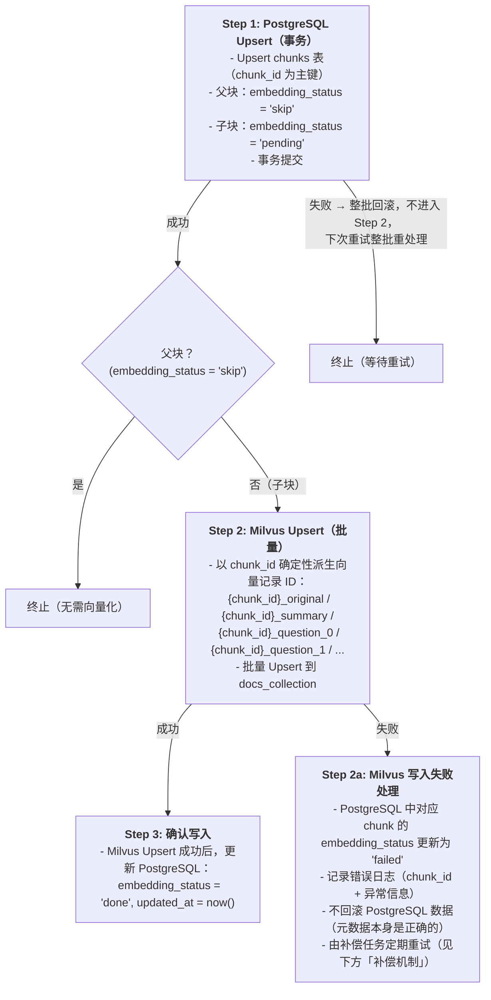

# 3. RAG系统设计：
## 3.1 数据摄取

### 3.1.1 数据加载及处理

#### 文档解析器选型：MinerU

医疗场景的文档具有高度复杂性与专业性，对解析精度要求极高。选用 MinerU 作为文档解析器，核心优势如下：

| 能力 | 说明 |
|------|------|
| 扫描件与影像报告支持 | 医院文档大量以扫描 PDF 形式存在（如检验报告、病历归档），MinerU 内置高精度 OCR 引擎 |
| 复杂表格高精度还原 | 基于深度学习的表格识别模型，可准确还原行列结构，确保表格数据进入向量库后语义完整 |
| 医学公式与专业符号识别 | 支持 LaTeX 格式的公式输出，准确提取计量单位、化学式及统计公式 |
| 图文混排文档处理 | 具备多模态解析能力，可对图表进行结构化处理，而非直接丢弃 |

#### MinerU 输出结构

通过命令行运行 MinerU 解析后，输出目录结构如下(子目录名随 backend 而变,hybrid-auto-engine → `hybrid_auto/`,vlm-auto-engine → `vlm_auto/`,pipeline → `pipeline_auto/`):

```
/project_folder/mineru_output/target_document/{backend}_auto/
├── images/                                   # 提取的图片资源(SHA 命名)
├── target_document.md                        # 最终 Markdown 输出(给人预览,不直接灌库)
├── target_document_content_list_v2.json      # ⭐ 下游 chunking 实际消费(页级嵌套,块带完整语义)
├── target_document_content_list.json         # v1 扁平结构(向后兼容,本项目不消费)
├── target_document_middle.json               # 中间解析结果(含 spans/score/lines,体积大,默认仅留磁盘不入库)
├── target_document_model.json                # 模型原始推理(归一化 bbox,默认仅留磁盘不入库)
├── target_document_origin.pdf                # 原始 PDF 拷贝
└── target_document_layout.pdf                # 版面分析框图(肉眼检查用)
```

#### 多类型内容处理策略

项目数据源中存在大量多类型内容（表格、照片/简笔画、坐标图、思维导图），各类型处理策略如下：

**1. 表格 —— 双粒度存储（整表摘要 + 逐行拆分）**

采用"整表摘要 + 分行存储"双存策略，兼顾宏观问题与细粒度检索：

- **逐行拆分存储（细粒度）**：将每一行转为自然语言句子后 embedding，例如：
  > "肺血管疾病包括：肺栓塞、肺动脉高压、肺静脉闭塞病"
  > "神经肌肉疾病包括：肌萎缩侧索硬化症、吉兰-巴雷综合征"

- **整表摘要存储（粗粒度）**：存储一条整表概括性描述，用于回答"这张表讲什么"类宏观问题，例如：
  > "表2-1-1是呼吸疾病分类表，按类别列举了气流受限性肺疾病、肺实质疾病、肺血管疾病、感染性肺疾病、恶性肿瘤、呼吸衰竭等十大类及其代表性疾病"

- **保留元数据**：存储时附带原始表格位置信息，便于溯源。单行存储格式示例：

```json
{
  "text": "肺血管疾病包括：肺栓塞、肺动脉高压",
  "source": "第2章第1节",
  "table": "表2-1-1",
  "row": 5
}
```

**2. 思维导图 —— 暂不支持内容理解**

思维导图结构杂乱且可能包含嵌套图片，当前版本不支持内容解析。仅保留图名以便引用。

**3. 坐标图 —— 暂不支持内容理解**

不支持理解坐标图中的复杂内涵。仅保留图名以便引用。

**4. 照片/简笔画/影像图 —— 暂不支持内容理解**

不支持理解影像类内容。仅保留图名以便引用。

---

> **关于图像内容理解的设计原则**：当前摄取管道**只对表格做内容理解**（双粒度存储），其他图像类型（思维导图、坐标图、照片/简笔画、影像图）一律仅保留图名/位置信息，不引入 Vision LLM 生成 caption。理由有三：
> 1. **医学教材约定图配文**：图表达的核心信息几乎总在周围正文里重复，丢图不丢信息
> 2. **Vision LLM 对医学图像理解准确性不足**：坐标轴读错、教学图的"结论"被当作真实证据等，会向 Milvus 注入幻觉证据并长期污染检索
> 3. **医疗合规**：诊断依据需可追溯到权威文本，不依赖 Vision LLM 的概率性输出
>
> 患者实时上传的检查报告走独立路径（见 Agent ①.5 / ⑨），Vision LLM 直读并结构化为 `report_findings`，与本节知识库摄取不共用机制。

#### MinerU 解析的已知限制与下游补救

实测 hybrid-auto-engine 在医学教科书上整体质量优秀(表格 HTML 行列完整、caption/footnote 单独成字段、chart 把曲线图 OCR 成 markdown 数据表、page_header/footer/number 单独识别可干净过滤),但有两处**系统性限制**需要在加载/切分阶段主动处理。这两点不是某本书的特例,换 backend 或重跑无法解决,**必须在代码层补救**。

**限制 1:image 块的 `content` 字段约 50% 含 VLM 幻觉(loader 阶段补救)**

MinerU 对 `sub_type=text_image`(含文字的图片)会调用 VLM 自动生成 `content` 字段,实测 50% 是无意义重复(如把"获取数字资源步骤页"识别成 "1. 体验智能学习, 2-99. 站体教学")。`natural_image / flowchart` 类相对可靠但仍不可信。

**应对**:`mineru_loader.py` 加载时对所有 `type=image` 的块**直接丢弃 content 字段**,只保留 `image_caption / image_footnote / bbox / image_source.path`。本设计与上文"图像内容理解的设计原则"一致(不依赖 Vision LLM 概率性输出)。

注意:`type=table` 和 `type=chart` 块的 `content` 字段必须**保留**(分别是 HTML 表格和 markdown 数据表,质量高且为信息核心载体)。仅 `type=image` 丢弃 content。

**限制 2:`title.level` 全部退化为 1(已弃案:正则重建 → 改用目录权威清单)**

MinerU 输出的 `content_list_v2.json` 中所有 title 块的 `level` 字段统一是 1,丢失原始多级标题结构。同时实测还发现:**同一格式的 anchor 在同一书内被 mineru 标 type=title 还是 type=paragraph 完全不一致**(POC §1.3 bug 5),导致即使"按文本正则重建 level"也补救不全。

**已弃案**:早期方案是按文本正则匹配重建 level(篇/章/节/数字编号 → L1/L2/L3/L4),但 POC 验证发现:
- 不同书的章节命名约定差异极大(《临床用药指南》99.9% fallback 因每药品名独成 title),正则归级跨书不可复用
- 即使本书命中率 80%,production code 维护代价过高
- 节内子节(【】/(一)/1.) mineru type 标记完全不可信,正则重建解决不了节内切分问题

**新方案**(2026-05-03 用户拍板):**完全放弃 mineru `title.level`,改用"目录权威清单"思路** —— 从 mineru 目录页(`page_header` 含"目录")抽出本书完整目录结构作为唯一层级真值,正文匹配时 fuzzy match 到目录条目得到权威 level/heading_path。详见 §3.1.2 切分主流程。

**给消费者的结论**:任何 chunking / 父子索引代码都不应该读 `title.level` 字段(永远是 1,无意义)。父块层级与边界由"目录字典 + 正文匹配"决定。


## 3.1.2 chunking(目录权威清单 + 三遍切 + size 驱动子块)

**核心方法论**(2026-05-03 经《内分泌代谢病学第4版上册》POC 验证):

- **完全不依赖 mineru `title.level`**(永远是 1,无意义,见 §3.1.1 限制 2)
- **不用 `RecursiveCharacterTextSplitter`**(已弃案)
- 父块由"书的目录结构"切(节 + 节内三遍切【】+(一)+1.),子块由"父块大小"切(size 累积驱动)
- 父子结构**仅对真正大的父块有意义**:小父块直接当 child(避免 degenerate "父=子")
- POC 实现与详细方法论见 [`scripts/poc_chunking_endocrinology_v4/METHODOLOGY.md`](scripts/poc_chunking_endocrinology_v4/METHODOLOGY.md);production 实现位 `src/rag/ingestion/chunking.py`(待 port)

### Block 白名单与文本抽取规则(消费 `content_list_v2` 前必读)

`raw_documents.content_list` 的真实结构与 10 种 `block.type` 见 §2.4.4.1。chunking 阶段**必须**按下表分类处理。

**白名单(进入 chunking pipeline 的 6 种 type)**:

| type | 抽取规则(从 `block.content` 取正文) | 用途 |
|---|---|---|
| `title` | 拼 `title_content[].content`(`type=text` 子项)。**忽略 `level` 字段**(永远 1,见 §3.1.1 限制 2),改用目录权威清单匹配确定 level | 父块边界候选(节级匹配)+ 节内子标题边界候选(【】/(一)/1. 正则) |
| `paragraph` | 拼 `paragraph_content[].content`(`type=text` 子项) | 父块/子块的正文输入 |
| `list` | 递归遍历 `list_items[].item_content[].content`(深 4 层),按 `list_type` 决定是否加 `1./- ` 前缀。**整体作为不可分语义单元**,首项 `1.` 不当子标题切点 | 父块/子块累积输入 |
| `table` | `table_caption` + `html` + `table_footnote`,**双粒度**:① 整表摘要 chunk(LLM 改写 → 一句"这张表讲什么")② 逐行 chunk(parse HTML 把每行转自然语言句子) | 整表 chunk + N 个行 chunk,共享 `parent_chunk_id` |
| `chart` | `chart_caption` + `content`(content 已是 markdown 数据表) | 同 table 双粒度 |
| `equation_interline` | `math_content`(latex 字符串)+ 上下文 paragraph | 不单独成 chunk,作为所在父块 inline 内容 |

**黑名单(直接丢弃,不进 chunks 表)**:

| type | 丢弃理由 |
|---|---|
| `page_header` / `page_footer` / `page_number` | 页眉/脚/页码,与正文无关 |
| `image` | content 字段 50% VLM 幻觉(§3.1.1 限制 1);`image_caption/bbox` 在 raw_documents 保留供版面追溯,但不进 chunks |

**实现位置**:`src/rag/ingestion/chunking.py::extract_chunkable_text(block) -> str | None` 已实现 block 抽取适配器,返回 None 即跳过。

### 切分主流程(4 步)

#### Step 1:目录权威清单提取

扫 `content_list_v2` 的目录页(`page_header` 含"目录"的页),对所有 paragraph/title/list block 抽行,按本书的 anchor pattern 分级(L1 篇 / L2 章 / L3 节 / L4 数字编号):

- 跨条目粘连拆分(mineru 会把"第2节...56第3节..."焊一行)
- 黑名单剔除("上册/下册/全书概览/目录")
- normalize:删 `\n` 残留,折叠空白,剥页码尾,合并节号
- strict_key:进一步去掉所有空白(应对 mineru 中文/ASCII 间空格风格不一致)

输出:`{normalized_title: (level, parent_path)}` 字典,作为后续匹配的权威真值。

**注意**:不同书的 anchor pattern 差异大(《用药指南》是药典结构,99.9% 命中失败),每本书需单独适配 pattern。

#### Step 2:正文节边界匹配(REAL_START 选取)

正文范围 `page_idx > max(toc_pages)`,对每个 type=title block 做 strict_key 匹配字典,加 3 类预处理:

- **A1 章合并**:mineru 把"第N章"和"章名"拆成两个 title block,合并
- **A2 篇前缀重建**:篇标题丢失"第N篇"前缀,从字典 L1 反查 alias 补回
- **A3 mini-TOC paragraph**:扩展资源等被标 paragraph,严格双条件采纳(末尾带页码 + 命中字典)

每个字典 title 在正文里可能出现多次(章/篇页 mini-TOC + 真章节起始),按以下规则选 REAL_START:
1. 优先级 1:按文档顺序最后一个满足"强信号"的 match(`PART_REBUILT/CHAP_MERGED` 或 `AS_IS gap_chars≥50`)
2. 优先级 2:都没强信号 → 取最后一次出现位置

输出:159 个节起点位置(节级原父块边界)。

#### Step 3:全书层面截断 + 节内参考文献丢弃

**书末截断**:扫 flat block 序列,第一个命中 `BODY_END_MARKERS = ('中文名词索引', '英文缩略语索引', '彩色插图')` 的 title 即截断,后续全丢。

**参考文献丢弃**:节内扫到 `^参考文献\s*$` 标题即截断,该位置及之后的所有 block 全部丢弃(包括 ref 条目 + 紧随其后的扩展资源占位列表)。理由:英文学术 ref 与中文医学查询语义不匹配,扩展资源是外部链接占位,均无 RAG 召回价值。

#### Step 4:父块构建(节内三遍切 + 严格层级合并)

每个节本身就是默认父块。如果节字符 > **`PARENT_SPLIT_THRESHOLD = 4000`**,启动三遍逐级细化:

| Pass | 触发 | 加边界 pattern | level |
|---|---|---|---|
| 1 | 段 > 4000 字 | `^【.+?】` | 1 (BRACE) |
| 2 | Pass 1 后段仍 > 4000 字 | `^[（(][一二三四五六七八九十百]+[)）]` | 2 (PAREN) |
| 3 | Pass 2 后段仍 > 4999 字 | `^\d+\s*[.、]\s` | 3 (NUM) |

排除:`type=list` block(整体语义单元)、`^表/图\s*[\d-]+`、长度 < 4 字符的残片。

**小父块合并**(< **`PARENT_MERGE_TINY_THRESHOLD = 500`** 字):

严格按层级关系。**吸收方 level ≤ 被吸收方 level**:
- Forward: `cur_level ≤ next_level`(允许同级兄弟、上级吸子主题、节首段;禁止下级跨上级)
- Backward: `prev_level ≤ cur_level`

例:1./2. 不能跨 (一)、(一) 不能跨【】合并;但同节下【】兄弟可以合并(同节都算相关主题)。

#### Step 5:子块构建(size 驱动)

每个父块独立判断:

- **父块 ≤ `CHILD_SPLIT_THRESHOLD = 1200` 字**:**不切**,1 child = parent 整段(避免 degenerate)
- **父块 > 1200 字**:按 mineru block 累积切多 child,目标 `CHILD_TARGET_SIZE = 600` 字
  - 算法:每加一个 block 看"加 vs 不加"哪个 acc_len 更接近 target,选更近的
  - 强制最小 `CHILD_MIN_SIZE = 200` 字:当前累积 < 200 时无视距离判断,force-add 防止孤儿
  - 末段 < target/2 时 backward 并入上一 child
  - 单 mineru block 即使 > target 也独立成 child(block 是不可分的最小语义单元)

子块切分**完全不用标题 pattern**,只看大小 + mineru block 边界。这样父块切法和子块切法解耦,避免 degenerate。

### 关键阈值(目标 ~3000 token 父块,~600 字子块)

实测 Qwen tokenizer 1 token ≈ 1.39 字符。

| 常量 | 值 | 用途 |
|---|---|---|
| `PARENT_SPLIT_THRESHOLD` | 4000 字(~2877 token) | 父块切【】+(一)阈值 |
| `PARENT_PASS3_THRESHOLD` | 5000 字(~3597 token) | 父块切 1./2. 阈值(稍宽,避免过切) |
| `PARENT_MERGE_TINY_THRESHOLD` | 500 字 | 小父块合并阈值 |
| `CHILD_SPLIT_THRESHOLD` | 1200 字(~864 token) | 父块 ≤ 此值不切子块 |
| `CHILD_TARGET_SIZE` | 600 字(~432 token) | 大父块切子块的目标 size |
| `CHILD_MIN_SIZE` | 200 字 | 子块强制最小,< 此值 force-add 防孤儿 |

### 父子索引(Small-to-Big 检索模式)

**设计动机**:医疗知识天然分层(疾病 → 亚型 → 治疗方案 → 剂量/禁忌)。小块精确命中"剂量"时,禁忌证可能在同节另一小块,导致危险遗漏。父块作为完整上下文的兜底锚点,确保临床信息的完整性。

**实现策略**:
1. **父块**:按上述 Step 4 切分,写入 `chunks` 表,`parent_chunk_id = NULL`,**不做向量化**(`embedding_status='skip'`,仅作内容存储)
2. **子块**:按 Step 5 size 驱动切,记录 `parent_chunk_id` 指向所属父块。子块正常进行多向量 Embedding(见 3.1.5)
3. **顶层兜底**:文档开头无标题的散文片段(罕见),`parent_chunk_id = NULL`,精排后直接使用该小块原文
4. **父块 ID 生成**:父块使用与子块相同的 `heading_path_id` 方案 + 后缀("parent")生成稳定 `chunk_id`,幂等逻辑见 §3.1.4
5. **Milvus 不变**:父块不写入 Milvus,向量检索仅针对子块
6. **不变量**:total_parent_len == total_child_len(父子内容完整守恒,任何切分逻辑改动后必须验证 mismatch=0)

### 数据快照(本书 POC 结果,2026-05-03)

| 指标 | 值 |
|---|---|
| 节数(节级原父块) | 159 |
| 父块数(三遍切+合并后) | 1204 |
| 父块 size median / max | 1346 / 5218 字 |
| 子块数 | 3012 |
| 子块 size median / max | 616 / 1528 字 |
| 书末截断丢弃 | 1676 blocks / 20721 字 |
| 参考文献丢弃 | 607 blocks / 16257 字 |
| 父子覆盖完整性 | mismatch=0 (1932461 字) |


## 3.1.3 Transform & Enrichment（结构转换与深度增强）

### 3.1.3.1 结构转换

§3.1.2 chunking 主流程的输出是两类 dict 列表:
- `parents: list[ParentChunk]` — 父块,每条含 `parent_idx / section_title / level / title / head / pg_start / len`
- `children: list[ChildChunk]` — 子块,每条含 `parent_idx / section_title / head / pg_start / len / blocks`

本步骤将 chunk 文本与各阶段元数据整合,写入 `chunks` 表(字段定义详见 §2.4 → chunks 表)。父块 `embedding_status='skip'`,子块进入下游 enrichment / embedding pipeline。

### 3.1.3.2 增强策略

**语义元数据注入 (Semantic Metadata Enrichment)**：

策略：在基础元数据之上，利用 LLM 提取高维语义特征。
产出：为每个 Chunk 通过**单次 LLM 调用**统一生成以下字段，注入到 Metadata 中：
- **Title**（精准小标题）
- **Summary**（内容摘要）：同时作为摘要向量的文本来源（见 3.1.5）
- **Tags**（主题标签）
- **Hypothetical Questions**（假设性问题）：以患者口语视角，针对本 Chunk 内容生成 2~3 个患者可能提出的问题（见 3.1.5）。医疗场景中患者 query 多为口语症状描述，知识库内容多为临床陈述，该字段用于弥合二者之间的语义鸿沟，提升召回率。

**工程特性**：Transform 步骤为原子化操作，每个 Chunk 独立处理，失败时仅需重试该 Chunk，不影响其他已完成的 Chunk。

> 注：本节不包含图像 Caption 生成/注入——知识库摄取管道对图像类内容的处理策略见 3.1.1 节末的"关于图像内容理解的设计原则"。


## 3.1.4 幂等性设计(Idempotency)

**核心机制**：

三层存储均通过 Upsert 保证幂等写入，同一文档无论被处理多少次，均不产生重复数据：

| 存储层 | Upsert 主键 | 说明 |
|--------|------------|------|
| PostgreSQL `sources` 表 | `source_id` | 同一文档重复导入时直接覆盖，不新增记录（详见 3.1.4.1） |
| PostgreSQL `chunks` 表 | `chunk_id` | 配合 `content_hash` 实现增量更新，内容未变则跳过 Embedding（详见 3.1.4.2、3.1.4.3） |
| Milvus 向量记录 | 派生 ID | 由 `chunk_id` 确定性派生，如 `{chunk_id}_summary`（详见 3.1.6） |

**原子性保证**：Upsert 以 Batch 为单位进行事务性写入。若批次内某条写入失败，整批回滚，不产生部分写入的脏数据，下次重试时整批重新处理即可。


### 3.1.4.1 source_id

`source_id` 是来源文档的唯一标识符，代表文档的 **逻辑身份** 而非特定版本。同一份指南/教材重新上传（内容可能有修订）应命中同一个 `source_id`，触发 Upsert 更新而非新增记录。

**生成规则**：基于文件名的确定性哈希。

**构建步骤**（顺序执行）：

1. **去除扩展名**：取文件名的 stem 部分（如 `2024心力衰竭指南.pdf` → `2024心力衰竭指南`）
2. **normalize**：复用 3.1.4.2 中定义的 `normalize` 函数（Unicode NFC 规范化 → 全角转半角 → 转小写 → 去除首尾空白 → 合并内部连续空白）
3. **SHA-256 哈希并截断**：对 normalize 后的字符串取 UTF-8 编码的 SHA-256，截取前 16 位十六进制字符（64 bit）

```python
import hashlib
from pathlib import Path

def generate_source_id(file_name: str) -> str:
    stem = Path(file_name).stem                          # 去扩展名
    norm = normalize(stem)                               # 复用 3.1.4.2 的 normalize
    return hashlib.sha256(norm.encode("utf-8")).hexdigest()[:16]
```

**示例**：

| 输入文件名 | normalize 后 | source_id |
|-----------|-------------|-----------|
| `2024心力衰竭指南.pdf` | `2024心力衰竭指南` | `a3b1c9...`（16 位 hex） |
| `2024心力衰竭指南.md` | `2024心力衰竭指南` | 同上（扩展名不影响） |
| `　２０２４心力衰竭指南.pdf`（含全角） | `2024心力衰竭指南` | 同上（全角归一化） |

**设计决策与边界情况**：

- **为什么不用文件内容哈希**：内容一改 `source_id` 就变，无法 Upsert 更新旧记录，导致旧 chunks 变僵尸、新记录重复插入，与幂等设计矛盾。
- **为什么不用随机 UUID**：不可复现，同一文件重复上传会产生两条 source 记录，破坏幂等性。
- **同名不同文档**：会被视为"同一文档的更新"——这是 Upsert 语义下的期望行为。若确实是不同文档，管理员应修改文件名以区分。
- **文件改名**：同一份指南改了文件名会产生新 `source_id`，旧记录不会自动清理。可通过管理后台的知识库变更记录（见 5.2.3.2 `kb_change_log`）提供"合并/替换 source"的操作。
- **碰撞概率**：16 位 hex = 64 bit，在医疗文档量级（千～万级）下碰撞概率可忽略（生日攻击阈值约 2^32 ≈ 40 亿）。

**幂等写入**：每次文档摄取时，以 `source_id` 为主键对 `sources` 表执行 Upsert，更新 `updated_at` 等可变字段，不重复插入记录。


### 3.1.4.2 heading_path_id 的构建


**设计动机**：避免使用绝对位置编码——若使用绝对位置，文档中任意一处修改都会导致其后所有 Chunk 的位置编码全部失效。改用标题路径作为定位锚点，则只有标题本身变更才会影响对应的 `chunk_id`。

**构建步骤**：

**`normalize` 函数定义**

对标题文本执行以下操作（顺序执行）：

1. **Unicode 规范化**：转换为 NFC 形式，统一字符的组合方式
2. **全角转半角**：将全角字母、数字、空格转为对应半角字符（如 `Ａ→A`、`１→1`、`　→ `）
3. **大小写统一**：所有拉丁字母转为小写
4. **去除首尾空白**：trim 前后的空格、制表符
5. **合并内部空白**：将连续的空白字符（空格、制表符）压缩为单个空格

```python
import unicodedata
import re

def normalize(title: str) -> str:
    # 1. Unicode NFC 规范化
    s = unicodedata.normalize("NFC", title)
    # 2. 全角转半角
    s = s.translate(str.maketrans(
        "　！＂＃＄％＆＇（）＊＋，－．／０１２３４５６７８９：；＜＝＞？"
        "＠ＡＢＣＤＥＦＧＨＩＪＫＬＭＮＯＰＱＲＳＴＵＶＷＸＹＺ［＼］＾＿"
        "｀ａｂｃｄｅｆｇｈｉｊｋｌｍｎｏｐｑｒｓｔｕｖｗｘｙｚ｛｜｝～",
        " !\"#$%&'()*+,-./0123456789:;<=>?"
        "@ABCDEFGHIJKLMNOPQRSTUVWXYZ[\\]^_"
        "`abcdefghijklmnopqrstuvwxyz{|}~"
    ))
    # 3. 转小写
    s = s.lower()
    # 4. 去除首尾空白
    s = s.strip()
    # 5. 合并内部连续空白
    s = re.sub(r'\s+', ' ', s)
    return s
```

**设计说明**：
- 中文字符不做额外处理，NFC 已保证其规范性
- 不去除标点符号——标题中的标点（如冒号、括号）可能是有意义的区分因素
- 不做 stemming 或同义词处理，保持哈希的确定性和可复现性

---

**步骤 1：标准化各级标题，生成层级哈希**

将每个层级标题映射成一个稳定标识符（对标题文本规范化后取哈希）：

```
H1_id = hash(normalize(title_level1))
H2_id = hash(normalize(title_level2))
H3_id = hash(normalize(title_level3))
...
更深层的标题以此类推
```

结果为一个层级哈希序列，如 `[H1_id, H2_id, H3_id]`。

**步骤 2：拼接层级哈希，生成 heading_path_id**

将层级哈希按顺序拼接（冒号分隔），再整体哈希一次，得到固定长度的十六进制字符串。**只拼接实际存在的层级**，不补空位：

```
# 两级标题
heading_path_id = SHA256( H1_id + ":" + H2_id )

# 三级标题
heading_path_id = SHA256( H1_id + ":" + H2_id + ":" + H3_id )

# 通用形式
heading_path_id = SHA256( join(":", [H1_id, H2_id, ..., Hn_id]) )
```

**步骤 3：结合相对块索引，生成 chunk_id**

`relative_chunk_index` 为同一标题路径下的 Chunk 顺序编号（从 0 开始），确保同标题下多个 Chunk 各有唯一 ID，代入最终公式即得 `chunk_id`。

**最终公式**：

```
chunk_id = SHA256( source_id + ":" + heading_path_id + ":" + relative_chunk_index )
```

> **父块约定**：父块代表整个 heading 节，不属于任何子块序列，固定使用字符串 `"parent"` 作为 `relative_chunk_index` 参与哈希：
> ```
> parent_chunk_id = SHA256( source_id + ":" + heading_path_id + ":" + "parent" )
> ```
> 这确保同一 heading 节下只会产生一个父块 ID，且与所有子块 ID 不冲突。


### 3.1.4.3 content_hash

**作用**：`content_hash` 是变动检测信号字段，与 `chunk_id` 分离，单独存储。

**生成方式**：

```
content_hash = SHA256( chunk_raw_text )
```

**职责边界**：

| 字段 | 职责 | 是否作为主键 |
|---|---|---|
| `chunk_id` | 结构定位（标题路径 + 块序号），稳定不变 | 是 |
| `content_hash` | 内容变动信号，触发更新 | 否 |

**更新逻辑**：

- Upsert 时，以 `chunk_id` 为主键进行匹配。
- 若 `content_hash` 与数据库中已有值相同 → 跳过 Embedding 计算，复用已有向量（注意：此"跳过"仅针对 Embedding 步骤，chunk_id 的遍历生成始终在全文档范围内完整执行）。
- 若 `content_hash` 不同 → 内容已变更，覆盖写入并重新触发 Embedding 计算。

这样即使文档局部修改，`chunk_id` 保持稳定（结构未变），仅通过 `content_hash` 的差异驱动增量更新，避免全量重建。

**注意：**修改标题时，`chunk_id` 会跟随变化，原标题下的旧 chunk 记录不会被自动覆盖，形成僵尸数据。需在每次文档处理流程中执行以下三步清理：

**文档处理的三步分层逻辑：**

1. **完整遍历（轻量）**：对整篇文档执行完整解析，生成当前版本所有 chunk 的 `chunk_id` 和 `content_hash`，此步骤仅涉及哈希计算，开销极低。
2. **僵尸清理**：以 `source_id` 为范围，从数据库中查出该文档所有已有 `chunk_id`（旧集合），与本次遍历生成的全量 `chunk_id`（新集合）做差集：
   ```
   待删除 = 旧集合 - 新集合   # 在旧集合中存在、但新集合中不存在的记录
   ```
   由于 `parent_chunk_id` 是自引用外键，**必须严格按以下顺序删除**，否则触发 foreign key violation：
   1. 从待删除集合中取出子块（`parent_chunk_id IS NOT NULL`），先删 Milvus 向量，再删 PostgreSQL 记录（走 `idx_chunks_parent_chunk_id` 索引分拣）
   2. 再取出父块（`embedding_status = 'skip'`），无 Milvus 向量，直接删 PostgreSQL 记录
3. **按需重算 Embedding**：对新集合中 `content_hash` 发生变化（或为全新）的**子块**，触发 Embedding 计算；父块（`embedding_status = 'skip'`）始终跳过此步骤；`content_hash` 未变的子块直接复用已有向量。


## 3.1.5 Embedding (多向量化)
在执行的 Embedding 计算之前，计算 Chunk 的内容哈希（Content Hash）。仅针对数据库中不存在的新内容哈希执行向量化计算，对于文件名变更但内容未变的片段，直接复用已有向量，显著降低计算开销。**父块（`embedding_status = 'skip'`）不参与本步骤，直接跳过。**

**混合检索双路架构（Dense + BM25）：**
为了支持高精度的混合检索（Hybrid Search），系统采用两套独立机制：
- Dense Embeddings（语义向量）：调用 Qwen3-Embedding-8B 生成 4096 维浮点向量，捕捉文本的深层语义关联，解决”词不同意同”的检索难题。8B 参数量确保对医学术语的细粒度语义差异有充足的编码能力。
- BM25 全文检索（关键词匹配）：利用 Milvus 2.4+ 内置 BM25 引擎对 `original_content` 建立倒排索引，基于词频/逆文档频率实现精确关键词匹配，解决医学专有名词查找问题。相比 learned sparse（如 SPLADE），传统 BM25 对长尾专业术语更稳定，且可配合医学分词器定制分词。

**多向量表示（文本多向量，Multi-Vector Representation）：**
为进一步提升召回率，系统对每个 Chunk 生成多条向量记录，均指向同一份原始 Chunk 内容。各向量记录携带 `vector_type` 字段加以区分：

| vector_type | 文本来源 | 作用 |
|---|---|---|
| `original` | Chunk 原文 | 主向量，捕捉原始语义 |
| `summary` | 3.1.3 生成的 Summary | 摘要向量，提升对模糊 query 的匹配能力 |
| `question` | 3.1.3 生成的 Hypothetical Questions | 问题向量，弥合患者口语描述与临床文本之间的语义鸿沟 |

每个 Chunk 产出 1 条 `original` + 1 条 `summary` + 2~3 条 `question` 向量记录，各条记录均通过 `source_chunk_id` 指向原始 Chunk，检索命中补充向量后统一回溯取原始内容（见 3.1.6、3.2.2）。

批处理优化：所有计算均采用 batch_size 驱动的批处理模式，最大化 CPU 利用率并减少网络 RTT。


## 3.1.6 Storage（索引存储）

### 3.1.6.1写入顺序：PostgreSQL 先写，Milvus 后写（串行，不并行）

**设计决策**：采用 **PostgreSQL-first** 串行写入策略，不支持并行写入。

**原因**：
1. **PostgreSQL 是元数据权威源**：Milvus 向量记录通过 `source_chunk_id` 回查 PostgreSQL `chunks` 表获取标题、正文等展示字段（见 2.4.1）。若 Milvus 先写成功但 PostgreSQL 未写入，检索命中的向量将无法关联到元数据，产生**悬挂引用**。
2. **`embedding_status` 天然充当两阶段状态机**：`chunks` 表已有 `embedding_status` 字段（`pending → done → failed`，父块固定为 `skip`），可精确标记 Milvus 写入是否完成，无需额外引入分布式事务。
3. **不并行写入**：两层存储无共享事务协调器，并行写入时任一方失败会产生难以自动修复的不一致状态（一层有数据、另一层没有），排查和补偿逻辑远比串行复杂，收益（节省几十毫秒网络 IO）不值得。

### 3.1.6.2 写入流程（以 Batch 为单位）



### 3.1.6.3 失败场景分析

| 失败点 | PostgreSQL 状态 | Milvus 状态 | 系统行为 |
|--------|----------------|-------------|---------|
| Step 1 失败（PG 写入异常） | 无数据（事务已回滚） | 无数据 | 干净状态，直接重试整批 |
| Step 2 失败（Milvus 写入异常） | 有数据，`embedding_status = 'failed'` | 无数据或部分数据 | 元数据正确但无法被检索命中；补偿任务会重试 |
| Step 3 失败（状态回写异常） | 有数据，`embedding_status = 'pending'` | 有数据 | 向量已可检索；补偿任务发现 pending 时会校验 Milvus 侧是否已存在，存在则直接标记 done |

### 3.1.6.4 补偿机制

利用已有的 `embedding_status` 索引（`WHERE embedding_status != 'done'`）定期扫描需要补偿的 chunk：

```python
# 补偿任务伪代码（可作为定时任务或 ingestion 结束后的收尾步骤）
pending_or_failed = db.query(chunks).filter(
    chunks.embedding_status.in_(['pending', 'failed']),  # 显式排除 'skip'（父块），避免死循环
    chunks.updated_at < now() - interval('5 minutes')  # 避免与正在进行的写入冲突
)
for batch in batched(pending_or_failed, size=BATCH_SIZE):
    # 检查 Milvus 侧是否已有对应向量
    existing_ids = milvus.query(ids=[derive_vector_ids(c) for c in batch])

    need_write = [c for c in batch if derive_vector_ids(c) not in existing_ids]
    already_done = [c for c in batch if derive_vector_ids(c) in existing_ids]

    # 补写缺失的向量
    if need_write:
        milvus.upsert(build_vectors(need_write))

    # 统一更新状态为 done
    db.update(already_done + need_write, embedding_status='done')
```

### 3.1.6.5 不回滚 PostgreSQL 的理由

Milvus 写入失败时，**不回滚** PostgreSQL 中已写入的 chunk 元数据：

1. **元数据本身是正确的**：chunk 的文本、标题、摘要等信息与向量化无关，回滚会丢弃有效工作。
2. **回滚后重试成本更高**：若回滚 PG，下次重试需要重新执行 LLM 增强（摘要/问题生成），浪费计算资源。
3. **`embedding_status` 已提供精确的恢复点**：`failed` / `pending` 状态让补偿任务只需处理 Milvus 侧写入，无需重做整条 pipeline。
4. **对用户无感知影响**：`embedding_status != 'done'` 的 chunk 不会出现在检索结果中（Milvus 中无对应向量），不会产生错误的检索体验。

## 3.2 召回策略
采用双路混合检索策略，并行执行稀疏与稠密两条召回路径：
### 3.2.1 内容查询预处理 (Query Processing)

各步骤均在 `build_query` ② 节点内完成，产出 `dense_query`（str）和 `sparse_queries`（list[str]）两个 State 字段，分别作为稠密/稀疏两路的检索输入：

**Sparse Route 专用处理**
1. 关键词识别 (Keyword Extraction)：利用 NLP 工具从清洁 Query 中提取关键实体（去停用词），生成症状维度列表。
2. 术语扩展 (Synonym Expansion)：直接复用节点 ② build_query Step 2 产出的 Entity Linking 结果——以已规范化术语的 `concept_id` 为主键，从 `terms_collection`（见 2.4.6）查出该概念下的全部别名（含口语、缩写、英文）。**每个症状维度**的别名拼成一个词袋字符串，生成 `sparse_queries` 列表（一个维度一项）；过滤长度 ≤ 1 的过短别名防止泛化匹配。每项作为一次独立 BM25 查询，N 个维度 = N 次查询。

**Dense Route 专用处理**
3. Query 整合改写 (Dense Query Construction)：LLM 将所有确认症状（`preferred_term`）、病史关键项、`report_findings` 的 `positive_findings`/`impressions`，以及 `present_illness_slots` 中已填充的维度信息（诱因、加重/缓解因素、症状性质等）整合，改写为语义连贯的自然语言查询句（如"进食后加重的上腹胀痛伴反酸，白细胞升高，既往糖尿病史"），生成单一的 `dense_query`，用于 1 次向量检索。维度信息的纳入使 query 从泛化症状描述细化为具有鉴别特征的临床描述，显著提升召回精度。

### 3.2.2 召回
注意，召回前可以使用元数据提前过滤，缩小候选集、降低成本。

**并行召回 (Parallel Execution)：**
检索范围：两条路径均在 Milvus **全量记录**上执行，不区分 `vector_type`，`original` / `summary` / `question` 三类向量记录均参与召回。

1. **Sparse Route (Milvus BM25)**：以 3.2.1 Step 2 产出的 `sparse_queries` 为输入，对每个症状维度词袋分别做 Milvus BM25 检索（N 个维度 = N 次查询），每次返回关键词匹配候选。
2. **Dense Route (Embedding)**：以 3.2.1 Step 3 产出的 `dense_query` 为输入，做 Qwen3-Embedding-8B 编码 -> Milvus ANN 向量检索（Cosine Similarity）-> 返回语义相似候选（1 次检索）。

**结果融合 (Fusion)：**
将 Dense 结果（1 路）+ 每个 Sparse 维度结果（各 1 路）做**单阶段多路 RRF**：

```
Final_Score(d) = Σ  1 / (k + rank_i(d)),    k = 60
                i ∈ {Dense} ∪ {Sparse 各维度}
```

每路贡献 1 票，等权融合，不依赖分数绝对值，仅基于排名倒数加权，消除跨模态的分数量纲差异。

**自调节权重特性：** 某 chunk 只命中 1 个 Sparse 维度时，Sparse 有效贡献 ≈ Dense（自动 ≈1:1）；命中 m 个维度时，Sparse 有效贡献 ≈ m × Dense（自动 ≈m:1）——命中维度越多关键词证据越强，权重自动越大，无需手动设定 Dense/Sparse 权重比。

按 RRF 融合分数降序取 Top-N（`settings.agent_limits.RETRIEVE_TOP_N`，初始值 200，**权威定义见 §9.7**；阈值调优改 `.env` 不改代码）截断，丢弃低分长尾候选。

**多向量去重 (Multi-Vector Deduplication)：**
由于 3.1.5 为每个 Chunk 生成了多条向量记录（original / summary / question），同一 Chunk 的不同向量可能同时出现在召回结果中。Top-N 截断后按 `source_chunk_id` 去重，保留同一 Chunk 下 **RRF 分数最高** 的那条记录。`original_content` 字段在所有记录中冗余存储，取哪条记录内容均相同，传给 LLM 的始终是原文。

### 3.2.3 精确过滤与重排

**Metadata Filtering Strategy（元数据过滤策略）**
核心原则：**能前置则前置，无法前置则后置兜底**。

- **解析**：Query Processing 阶段将结构化约束解析为通用 filters（如 collection / doc_type / language / time_range / access_level 等）。
- **Pre-filter（硬约束）**：若底层索引支持，在 Dense/Sparse 检索阶段提前过滤，缩小候选集、降低成本。
- **Post-filter（兜底）**：索引不支持或字段质量不稳的过滤，在 Rerank 前统一执行；字段缺失时默认"宽松包含"（missing → include），避免误杀召回。
- **软偏好（Soft Preference）**：如"更近期更好"，不做硬过滤，作为排序信号在融合/重排阶段加权处理。
---
**Rerank Backend（可插拔精排后端 — diagnose ⑩ 前置，非检索阶段）**

Cross-Encoder 精排**不在 `retrieve` ③ 中调用**。检索阶段（`retrieve` ③）首轮召回量大（~500 chunks），不适合 Cross-Encoder 逐对打分。Reranker 在 `diagnose` ⑩ 前置调用——经过多轮追问/检查后候选集已收敛至可控规模，此时对 `candidate_chunks` 做 Cross-Encoder 精排截断至 Top-K，再交由 LLM 做临床决策排序。

该模块**必须可关闭**，并提供稳定回退策略。

| 模式 | 说明 | 适用场景 |
|------|------|----------|
| **None（关闭）** | 跳过 Cross-Encoder，直接将 `candidate_chunks` 原序传入 LLM 诊断 | 低延迟/资源受限 |
| **Cross-Encoder** | 输入 [Query, Chunk] 对，输出相关性分数排序，截断至 Top-K | 稳定、结构化输出；提供超时回退 |

**默认策略**：优先保证"可用与可控"。Cross-Encoder 不可用、超时或失败时，**必须回退至 `candidate_chunks` 原序**，确保 `diagnose` ⑩ 可正常执行。

---
**父块扩展(Parent Chunk Expansion — diagnose ⑩ 内置,非独立检索步骤)**

Cross-Encoder 精排截断出 Top-K 小块后,在构建 LLM prompt 前执行父块扩展(Small-to-Big 模式,见 §3.1.2):
- 按各小块的 `parent_chunk_id` 批量回查 PostgreSQL,取父块全文(`chunk_raw_text`)
- 若 `parent_chunk_id IS NULL`,保留小块原文兜底
- 父块全文**仅用于当次 LLM prompt 构建**,不写回 `candidate_chunks` State 字段
- `candidate_chunks` 全程存储小块,其余节点(`select_discriminative_symptom ⑤`、`extract_symptoms ④`)对父子索引完全无感知

**父块大小**(2026-05-03 POC 验证):新切分方案下父块 median 1346 字 / p95 3563 字 / max 5218 字(~720~3700 token),约 56% 父块 > 1200 字会切多 child(其余 44% 父块 ≤ 1200 字,1 child = parent 整段)。父块全文塞入 LLM prompt 完全可控,**不需要做任何"展开整节为多 chunk"的额外扩展逻辑** — 直接用父块文本即可。

