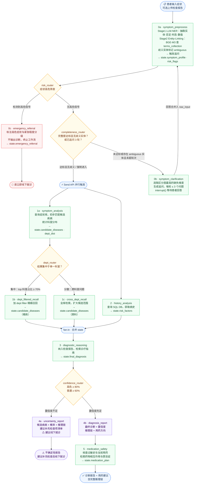

# 3. Agent设计
## 3.1 Agent工作流
诊断基于临床标准诊断流程
1. 问诊（病史采集）：医生询问症状、病史
2. 体格检查：医生亲自体检（听诊、触诊等）
3. 辅助检查：实验室化验、影像学（CT/X光）、病理等
```
医疗诊断 Agentic RAG
编排框架：LangGraph（StateGraph）
症状采集阶段支持有限人机交互（≤3轮追问），诊断推理阶段全自动运行


【前端】
  患者界面
    ├─ 输入症状描述
    ├─ 上传已有检查报告（可选）
    ├─ 响应系统追问（症状采集阶段，最多 3 轮）
    └─ 查看诊断建议与推理链

【LangGraph 工作流图】
  工作流为单一 StateGraph，共享一个 DiagnosisState，
  各节点为专职工具调用节点，由图的边和条件边控制执行顺序。
  interrupt() 仅用于症状采集阶段的追问交互，诊断推理及后续节点全程自动运行。

  节点列表：
  ├─ 节点 0a: symptom_preprocess（症状预处理）
  │   两阶段设计：LLM 负责语义理解与抽取，向量检索负责精准编码，避免 LLM 幻造标准码。
  │
  │   [Stage 1 — LLM NER + 结构化]
  │   → 实体抽取：提取症状实体、解剖部位、否定修饰词（"没有发烧"→ negated:true）、
  │     时态（当前症状 / 既往史）、数值型症状（"发烧38.5度"→ value:38.5 unit:℃）
  │   → 症状结构化：提取性质、持续时间、诱因、伴随症状、严重程度
  │   → 无法推断的维度标记为 unknown
  │
  │   [Stage 2 — Entity Linking（向量检索 + LLM 候选选择）]
  │   → 对每个抽取实体，用 BGE-M3 查询 terms_collection（ICD-10-CN/CMeSH/CHIP 术语库，见 1.2.4.6）
  │   → 返回 Top-5 候选术语，LLM 从候选中选择最佳映射（不允许 LLM 自行生成编码）
  │   → 歧义实体（如"心慌"可映射心悸/焦虑）置信度低于阈值时标记为 ambiguous，优先触发追问
  │
  │   state.symptom_profile 结构示例：
  │   {
  │     "symptoms": [
  │       {"raw_text": "肚子疼", "term": "腹痛", "icd10": "R10.4",
  │        "snomed": "21522001", "negated": false, "status": "active",
  │        "severity": "moderate", "confidence": 0.92},
  │       {"raw_text": "发烧", "term": "发热", "icd10": "R50.9",
  │        "negated": true, "status": "active", "confidence": 0.98},
  │       {"raw_text": "以前有高血压", "term": "高血压", "icd10": "I10",
  │        "negated": false, "status": "historical", "confidence": 0.95}
  │     ]
  │   }
  │   → 写入 state.symptom_profile、state.symptom_completeness、state.risk_flags
  │
  ├─ 条件边：risk_router（症状高危筛查）
  │   → 基于 state.risk_flags 检测高危信号
  │     （胸痛放射至手臂/下颌、突发剧烈头痛、静息呼吸困难、
  │      喉头水肿、腹部剧痛板状腹、大量呕血/便血等）
  │   → 检测到高危信号 → 进入节点 0c，终止诊断流程
  │   → 无高危信号    → 进入 completeness_router，继续正常流程
  │
  ├─ 节点 0c: emergency_referral（高危转诊）
  │   → 标注触发的高危症状与紧急程度分级
  │     · 立即拨打 120（生命体征危急）
  │     · 尽快前往急诊（数小时内）
  │     · 当日内线下就诊（病情紧迫但非即刻危及生命）
  │   → 不输出任何诊断结论，不进行后续推理
  │   → 写入 state.emergency_referral，终止工作流
  │
  ├─ 条件边：completeness_router（追问循环）
  │   → state.symptom_completeness 达标且无 ambiguous 实体，或已追问 3 轮 → 进入并行节点 1 & 2
  │   → 未达标或存在 ambiguous 实体，且未超轮次 → 进入节点 0b
  │   ※ 未达标强制进入后续时，state.symptom_confidence 按缺失比例下调
  │   ※ 仍存在 ambiguous 实体时，state.symptom_confidence 按歧义比例下调
  │
  ├─ 节点 0b: symptom_clarification（追问引导）
  │   → 基于 state.symptom_profile 中的 unknown 维度和 ambiguous 实体，
  │     优先选取对诊断区分度最高的缺失项或歧义项生成追问
  │     （如"心慌"歧义时追问："是感觉心跳加速、漏跳，还是以焦虑紧张为主？"）
  │   → 每轮最多追问 2~3 个问题，避免患者疲劳
  │   → interrupt()，等待患者回答
  │   → 将患者回答合并入 state.raw_input，回到节点 0a 重新预处理
  │   → 写入 state.clarification_round（当前已追问轮次）
  │
  ├─ 节点 1a: symptom_analysis（症状初步分析）
  │   → 基于 state.symptom_profile 查询症状库，初步匹配候选疾病（带概率）
  │   → 统计候选疾病的科室分布，写入 state.dept_dist
  │   → 写入 state.candidate_diseases（初始）
  │   降级：症状库不可用时基于 LLM 先验给出候选，state.confidence 自动下调
  │
  ├─ 条件边：dept_router（科室集中度路由）
  │   → 计算 top 科室在候选集中的占比
  │   → 集中（top 科室占比 ≥ 70%）→ 进入节点 1b，按科室过滤精细召回
  │   → 分散（跨多科室）         → 进入节点 1c，全库扩大召回
  │
  ├─ 节点 1b: dept_filtered_recall（科室精细召回）
  │   → 以 top 科室为 filter，在症状库中精细召回
  │   → 更新 state.candidate_diseases（精炼）
  │
  ├─ 节点 1c: cross_dept_recall（跨科室全库召回）
  │   → 不加科室限制，全库检索，扩大候选疾病范围
  │   → 更新 state.candidate_diseases（跨科）
  │
  ├─ 节点 2: history_analysis（患者历史分析）
  │   → 查询 SQL DB 获取病史、家族史、当前用药
  │   → 写入 state.risk_factors
  │   降级：DB 不可用时以空历史继续，state.confidence 自动下调
  │
  │   ※ 节点 1a 与节点 2 通过 LangGraph Send API 并行触发，
  │     1b / 1c 在 1a 后串行执行；fan-in 节点等待 1b/1c 与节点 2 全部完成后继续
  │
  ├─ 节点 3: diagnostic_reasoning（诊断推理）
  │   → 读取 state.candidate_diseases + state.risk_factors
  │   → 若患者已上传检查报告，一并纳入推理
  │   → 查询向量DB 检索相关诊疗指南与历史病例
  │   → 写入 state.final_diagnosis（含置信度和推理链）
  │
  ├─ 条件边：confidence_router
  │   → 高危疾病（心梗、肿瘤等）：置信度 < 80% → 跳转节点 4a
  │   → 普通疾病：置信度 < 60% → 跳转节点 4a
  │   → 否则 → 直接进入节点 4b
  │   ※ 阈值配置存储于 system_config 表，运行时读取
  │
  ├─ 节点 4a: uncertainty_report（低置信度输出，终止）
  │   → 输出所有候选疾病及各自概率
  │   → 输出完整推理链（含每步引用的文献来源）
  │   → 给出建议补充的检查项清单
  │   → 标注免责声明："当前信息不足以确诊，建议线下就诊"
  │   → 写入 state.output，终止工作流（不进入节点 5）
  │   ※ 置信度不足时无法给出确定用药方案，跳过用药安全检查
  │
  ├─ 节点 4b: diagnosis_report（高置信度输出）
  │   → 输出最终诊断 + 置信度
  │   → 输出推理链 + 用药方向
  │   → 写入 state.output，进入节点 5
  │
  └─ 节点 5: medication_safety（用药安全检查）
      → 查询 SQL DB 检查患者过敏史与当前用药
      → 查询向量DB 检索药物相互作用文献
      → 检查禁忌症
      → 写入 state.medication_plan

【存储层】
  ├─ PostgreSQL
  │   └─ 患者信息、诊断记录、用药记录、审计日志
  │
  └─ Milvus（向量DB）
      └─ 医学文献、诊疗指南、历史病例、药物相互作用文献

```

<!-- #项目agent诊断流程示意图 (点击左侧箭头折叠) -->

<!-- #endregion -->

## 3.2 agent上下文管理

使用 LangGraph，你仍然需要理解这些概念，但 LangGraph 极大地降低了你手动实现的成本。

🧠 LangGraph 帮你做了什么？
表格
功能	LangGraph 内置支持	你还需要做什么
Write（写入记忆）	✅ State / MemorySaver / Store	设计 State Schema
Select（选择上下文）	⚠️ 部分支持（Checkpointer）	需要自定义筛选逻辑
Compress（压缩上下文）	❌ 基本不内置	需要自己实现！
Isolate（隔离上下文）	✅ thread_id 天然隔离	多租户场景需额外设计
🔍 四个策略在 LangGraph 中的对应关系
1️⃣ Write — 写入记忆
LangGraph 有三层存储：

短期：State（图内流转）
跨轮：Checkpointer（SQLite/Redis）
长期：BaseStore（结构化持久化）
✅ 框架基本覆盖，理解概念有助于选型

2️⃣ Select — 选择上下文
LangGraph 不会自动帮你筛选哪些历史该传给 LLM。

默认会把 messages 全量传入
Token 爆炸问题依然存在
⚠️ 你必须自己写节点逻辑来过滤/截断
3️⃣ Compress — 压缩上下文
这是 LangGraph 最薄弱的地方：

没有内置摘要压缩
需要你自定义一个 compress_node
例如：每隔 N 轮，调用 LLM 生成摘要替换历史消息
❗ 这块必须自己实现，理解原理至关重要
4️⃣ Isolate — 隔离上下文
✅ LangGraph 用 thread_id 天然做到了会话隔离：

python
config = {"configurable": {"thread_id": "user_123"}}
但多 Agent 之间的上下文隔离，仍需设计 4

💡 实际建议
如果你只是跑 Demo              → 了解概念即可，LangGraph 够用
如果你做生产级 Agent           → 必须深入理解四个策略
如果你做面试准备               → 更要搞清楚底层逻辑！
重点掌握优先级：
🔴 Compress（最重要，框架不帮你）
🟠 Select（需要自定义筛选逻辑）
🟡 Write（理解 LangGraph 三层存储映射）
🟢 Isolate（thread_id 已经很好了）


