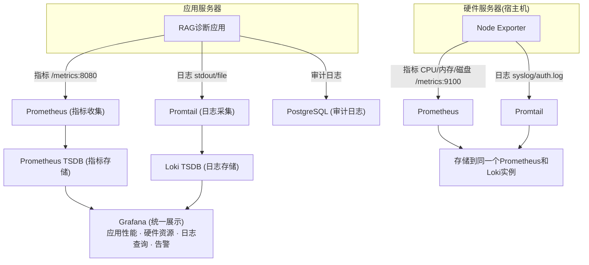

# 4. 基础设施
### 4.1 性能优化层：
#### 1. 缓存：Redis（纯内存模式，不开启持久化）

Redis 作为可丢弃的临时加速层，重启后缓存清空属于预期行为，数据源始终以 PostgreSQL / Milvus 为准。

**初期缓存两类数据：**

| 缓存对象 | Key 设计 | TTL | 说明 |
|---|---|---|---|
| 动态配置（system_config） | `config:<key_name>` | 60s | 短 TTL 保证管理员改配置后最多 60s 生效，无需手动刷新 |
| 完整 RAG 响应 | `rag:<hash(query_text)>` | 1h | 相同问题命中缓存后跳过向量检索和 LLM 调用，响应从秒级降至毫秒级 |

**冷启动行为：** 系统重启后缓存为空，前几个请求走完整 RAG 流程并将结果写入缓存，后续相同问题直接命中缓存，系统自动从冷变热，无需人工干预。

**后续扩展策略：** 上线后通过 Prometheus 观测 LLM 调用耗时分布和 query 频率，发现新热点后再针对性添加缓存，避免过早优化。

### 4.3 管理层：
#### 1. 动态配置管理：PostgreSQL（system_config 表）
使用已有 PostgreSQL 实例存储配置，服务定时轮询读取，无需引入额外组件。
适用配置项：RAG Top-K、LLM温度参数、相似度阈值、Agent开关等。

#### 2. 权限系统：PostgreSQL + 代码层角色判断
角色设计（共两类真实用户）：
- admin（管理员）：上传/更新知识库、修改系统配置、查看审计日志、管理用户
- patient（患者）：发起问诊、查看自己的历史记录
- AI后端服务使用固定 service token，不参与用户角色体系

实现方式：users 表包含 role 字段，JWT token 携带角色，API层直接判断

### 4.2 监控层：
#### 1. 应用监控

| 应用指标监控项 | 收集工具 | 存储工具 | 说明 |
|--------|----------|----------|------|
| 向量检索耗时，LLM调用耗时 Token统计，诊断准确率 请求QPS，错误率 | Prometheus Client | Prometheus | 应用内埋点上报 |

| 应用日志日志类型 | 内容 | 收集工具 | 存储工具 | 说明 |
|----------|------|----------|----------|------|
| 诊断日志 | RAG检索结果、LLM输出 | Promtail | Loki | 业务关键信息 |
| 错误日志 | 异常堆栈、失败原因 | Promtail | Loki | 故障排查 |
| 审计日志 | 用户操作、诊断结果 | 直接写PostgreSQL | PostgreSQL | 医疗合规要求 |
| 访问日志 | HTTP请求记录 | Promtail | Loki | 性能分析 |

#### 2. 硬件监控

| 硬件指标监控项 | 收集工具 | 存储工具 | 说明 |
|--------|----------|----------|------|
| CPU使用率，内存使用率 磁盘使用率，网络I/O 进程信息，磁盘I/O | Node Exporter | Prometheus | 宿主机基础指标 |

| 硬件日志类型 | 内容 | 收集工具 | 存储工具 | 说明 |
|----------|------|----------|----------|------|
| 系统日志 | 内核、驱动、系统事件 | Promtail | Loki | 故障排查 |
| 服务日志 | systemd日志 | Promtail | Loki | 进程启动/停止记录 |
| 安全日志 | 登录、权限变更 | Promtail | Loki | 审计需求 |
| 应用容器日志 | Docker/Kubernetes日志 | Promtail | Loki | 容器运维 |

<!-- #监控层示意图 (点击左侧箭头折叠) -->

<!-- #endregion -->

