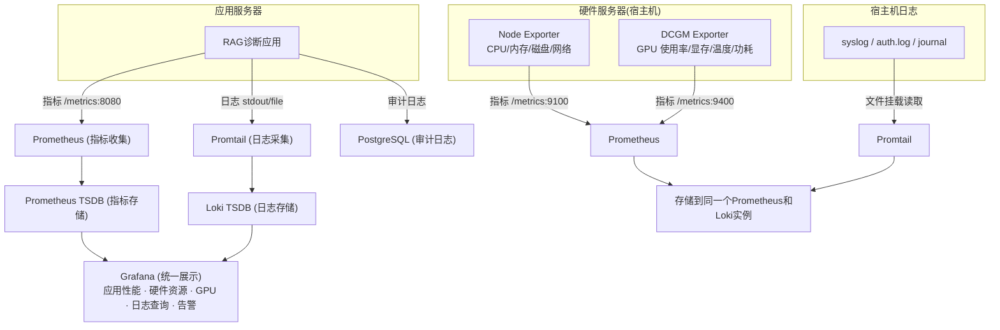

# 5. 基础设施
### 5.1 性能优化层：
#### 1. 缓存：Redis（开启 RDB 持久化）

Redis 作为加速层，开启 RDB 持久化（数据卷挂载 `/data/volumes/redis:/data`），重启后缓存可恢复，避免冷启动时全部请求穿透到后端存储。数据源始终以 PostgreSQL / Milvus 为准，缓存数据即使丢失也不影响正确性。

**初期缓存：仅动态配置**

| 缓存对象 | Key 设计 | TTL | 说明 |
|---|---|---|---|
| 动态配置（system_config） | `config:<key_name>` | 60s | 短 TTL 保证管理员改配置后最多 60s 生效，无需手动刷新 |

**读取路径（Cache-Aside 模式）：**
- 动态配置：应用先读 Redis `config:<key>`，命中则直接返回；未命中（TTL 过期或冷启动）则回源读 PostgreSQL system_config 表，写入 Redis 并设置 60s TTL。管理员修改配置写入 PG 后，最多 60s 全部节点自动生效。

**为何不做 RAG 响应级缓存（重要设计取舍）**：

Agentic 工作流下，同一 `patient_input` 在不同 State（`confirmed_symptoms` / `denied_symptoms` / `present_illness_slots` / `report_findings` / `followup_round`）下应产出不同诊断结果。若用 `rag:<hash(query_text)>` 作为 key 缓存完整响应，会在**跨患者**、**跨追问轮次**、**跨检查循环**命中同一条缓存，返回错误的历史结论——这是正确性 bug，不是性能权衡。

**若后续确需缓存以降低成本**，必须满足两个条件：
1. Key 为"State 检索上下文指纹"：`hash(patient_input + confirmed_symptoms + denied_symptoms + present_illness_slots + report_findings + followup_round)`
2. 缓存层改到**检索层**（缓存 `candidate_chunks`，不缓存 LLM 生成），TTL 缩到 10min

当前 MVP 阶段不做响应级或检索级缓存；基于 rag_trace 审计（见 §5.2.3.1）观察真实流量的重复率后再决定是否引入。

**冷启动行为：** 系统重启后 config 缓存为空，前几个配置读取回源 PostgreSQL 并写入 Redis，后续直接命中，系统自动从冷变热，无需人工干预。

**Redis 不可用时的降级行为：**
- 配置读取：直接回源 PostgreSQL，功能不受影响，仅增加少量延迟
- 应用启动时检测 Redis 连接状态，不可用时记录 Warning 日志并进入降级模式，Redis 恢复后自动切回正常模式

**Redis 内存策略：** 设置 `maxmemory-policy: allkeys-lru`，内存不足时自动淘汰最久未访问的 key，保证 Redis 不会因内存满而拒绝写入。

**后续扩展策略：** 上线后通过 Prometheus 观测 LLM 调用耗时分布和 query 频率，发现新热点后再针对性添加缓存，避免过早优化。

#### 2. 连接池

| 连接目标 | 方案 | 说明 |
|----------|------|------|
| PostgreSQL | SQLAlchemy 内置连接池（`pool_size=5, max_overflow=10`） | 避免每次请求新建连接，复用空闲连接 |
| Redis | redis-py 连接池（`max_connections=10`） | 同上 |
| Milvus | pymilvus 内置连接池 | 向量检索复用连接 |

连接池参数为初始值，上线后根据并发量调整。


### 5.2 监控层：
#### 5.2.1. 应用监控

应用监控分 4 组：**业务指标**（手动埋点，权威定义在 §4.2.7 / §9.1）、**HTTP 层**（中间件自动采集）、**依赖层**（SDK 原生指标）、**应用日志**（Promtail → Loki / PostgreSQL）。

**① 业务指标**（手动埋点，已在 §4.2.7 与 §9.1 定义，此处仅汇总指向）

| 指标组 | 指标名（示例） | 采集工具 | 权威定义位置 |
|--------|---------------|----------|-------------|
| 上下文/会话级（4 项） | `context_tokens_per_llm_call` / `context_structured_fields_size` / `context_messages_count` / `context_loop_iterations` | Prometheus Client | §4.2.7 "上下文/会话级" 表 |
| 结构化输出健康度（6 项） | `structured_output_attempt_total` / `_retry_total` / `_failure_total` / `_fallback_triggered_total` / `diagnose_failure_reason_total` / `_latency_seconds` | Prometheus Client | §4.2.7 "结构化输出健康度" 表 + §9.1 裸代码样板 |
| 业务延迟（汇总） | 向量检索耗时、LLM 调用耗时、Token 统计、诊断准确率 | Prometheus Client | §4.2.7 |

**② HTTP 层指标**（`prometheus-fastapi-instrumentator` 自动采集，无需业务代码埋点）

| 指标 | 标签 | 说明 |
|------|------|------|
| `http_request_duration_seconds` | `method` / `handler` / `status` | 端到端响应延迟 Histogram；可按 `/diagnose` / `/patient` / `/admin` 分桶 |
| `http_requests_total` | `method` / `handler` / `status` | 请求计数，供 QPS / 错误率（4xx/5xx 占比）派生 |
| `http_requests_in_progress` | `method` / `handler` | 并发请求数 Gauge |
| `http_request_size_bytes` / `http_response_size_bytes` | `method` / `handler` | 请求/响应体大小 Histogram |

**接入方式**：`src/api/main.py` 中 `from prometheus_fastapi_instrumentator import Instrumentator; Instrumentator().instrument(app).expose(app, endpoint="/metrics")`，一行完成。`/healthz` / `/readyz` / `/metrics` 本身**排除**出采集（避免自污染），通过 `should_group_status_codes=False, excluded_handlers=["/healthz", "/readyz", "/metrics"]` 配置。

**③ 依赖层指标**（SDK 原生或轻量 wrapper，不手动埋点）

| 依赖 | 指标 | 采集方式 |
|------|------|---------|
| PostgreSQL（SQLAlchemy） | `sqlalchemy_pool_size` / `sqlalchemy_pool_checkedout` / `sqlalchemy_pool_overflow` / `sqlalchemy_query_duration_seconds` | 订阅 SQLAlchemy `before_cursor_execute` / `after_cursor_execute` 事件，在 `src/db/postgres/metrics.py` 以 ≤ 30 行注册 Prometheus Histogram 和 Gauge；连接池 Gauge 直接读 `engine.pool.size()` / `engine.pool.checkedout()` |
| Redis（redis-py） | `redis_command_duration_seconds{command}` / `redis_connection_pool_size` | `redis.Redis` 构造时传 `connection_pool`，用 `redis-py` ≥ 4.2 的 `response_callbacks` + Histogram 封装（≤ 20 行），不影响现有调用点 |
| Milvus（pymilvus） | `milvus_rpc_latency_seconds{collection, operation}` / `milvus_rpc_errors_total{collection, operation, error_code}` | `src/db/milvus/client.py` 封装的调用入口处用 Histogram 记录（operation 取 `search` / `query` / `insert` / `upsert`）；集合维度区分 `docs_collection` / `terms_collection` |
| DashScope（LLM 上游） | 不单独埋点——`structured_output_latency_seconds` / `_failure_total`（§9.1）已覆盖 LLM 延迟与错误，额外的 DashScope 专属指标等需要时再加（见 §5.2.5 演进路径） | — |

**④ 应用日志**

| 应用日志日志类型 | 内容 | 收集工具 | 存储工具 | 说明 |
|----------|------|----------|----------|------|
| 诊断日志 | 结构化 JSON：`trace_id` + 摘要信息（query 前100字符、总耗时、是否命中 config 缓存），完整结构化数据由审计系统 rag_trace 表承载 | Promtail | Loki | 实时监控与 grep 排查，不存完整 prompt/chunk 文本 |
| 错误日志 | 结构化 JSON：异常堆栈、失败原因、`trace_id` | Promtail | Loki | 故障排查 |
| 审计日志 | 用户操作、诊断结果、RAG链路、知识库/配置变更、反馈标注 | 直接写PostgreSQL | PostgreSQL | 医疗合规要求，详见下方「3. 审计系统」 |
| 访问日志 | HTTP请求记录（由 HTTP 层中间件产出） | Promtail | Loki | 性能分析 |

##### 5.2.1.1 结构化日志字段约定（`trace_id` 全链路贯通）

**问题**：rag_trace 审计表以 `trace_id` 为主键，若 Loki 日志未强制携带同一 `trace_id`，排查问题时无法从 grep 日志快速关联到审计表详情，审计系统价值打对折。

**约定**：所有应用日志必须以 JSON 格式输出，强制包含以下字段：

| 字段 | 类型 | 说明 |
|------|------|------|
| `trace_id` | `str (UUID)` | 对应 `rag_trace.trace_id`；G4 endpoint 进入时生成或从 context 读取；Agent 节点内通过 LangGraph `config["metadata"]["trace_id"]` 传递 |
| `session_id` | `str (UUID)` | 对应 `sessions.session_id` |
| `patient_id` | `str (UUID)` | 对应 `users.user_id`（患者视角）；admin 接口填 operator 的 user_id |
| `node` | `str \| null` | Agent 节点名（如 `diagnose_step1`、`build_query_step1_ner`）；非 Agent 路径（admin API / ingestion）为 `null` |
| `level` | `str` | `DEBUG` / `INFO` / `WARNING` / `ERROR` |
| `message` | `str` | 日志正文 |
| `exc_info` | `str \| null` | 异常堆栈（ERROR 级别携带） |
| `timestamp` | `str (ISO 8601)` | 由 JsonFormatter 自动注入 |

**实现位置**：`config/logging_config.py`
- 用 `python-json-logger` 的 `JsonFormatter` 替换默认 `logging.Formatter`
- 用 `contextvars.ContextVar` 在请求入口（FastAPI middleware）注入 `trace_id / session_id / patient_id`
- 自定义 `logging.Filter` 从 ContextVar 读上下文写到 `LogRecord.__dict__`，JsonFormatter 统一序列化
- Agent 节点内调用 `logger.info(..., extra={"node": "diagnose_step1"})` 即可自动合并

**`trace_id` 的生成与透传路径**：
1. G4 `POST /diagnose` endpoint 入口处 `trace_id = uuid.uuid4()`，写入 ContextVar
2. 同时放入 LangGraph `config = {"configurable": {"thread_id": ...}, "metadata": {"trace_id": str(trace_id), ...}}`
3. Agent 节点内通过 `RunnableConfig` 回读（LangChain 原生），记 log 时自动带上
4. G4 endpoint 写 rag_trace 时用同一个 `trace_id`，与日志、审计表三路数据一一对应

**规则**：
- 未携带 `trace_id` 的日志视为实现违规（code review 须检查）
- `/healthz` / `/readyz` / `/metrics` 日志可豁免（无业务上下文）

#### 5.2.2. 硬件监控

| 硬件指标监控项 | 收集工具 | 存储工具 | 说明 |
|--------|----------|----------|------|
| CPU使用率，内存使用率<br>磁盘使用率，网络I/O<br>进程信息，磁盘I/O | Node Exporter | Prometheus | 宿主机基础指标（:9100） |
| GPU 使用率，GPU 显存使用率<br>GPU 温度，GPU 功耗<br>Tensor Core 活跃度 | NVIDIA DCGM Exporter | Prometheus | GPU 指标（:9400），监控 Embedding/Reranker 推理负载 |

| 硬件日志类型 | 内容 | 收集工具 | 存储工具 | 说明 |
|----------|------|----------|----------|------|
| 系统日志 | 内核、驱动、系统事件 | Promtail | Loki | 故障排查 |
| 服务日志 | systemd日志 | Promtail | Loki | 进程启动/停止记录 |
| 安全日志 | 登录、权限变更 | Promtail | Loki | 审计需求 |
| 应用容器日志 | Docker/Kubernetes日志 | Promtail | Loki | 容器运维 |


<!-- #监控层示意图 (点击左侧箭头折叠) -->

<!-- #endregion -->

**告警规则（Grafana Alerting）：**

| 告警项 | 触发条件 | 严重级别 | 说明 |
|--------|----------|---------|------|
| LLM 调用延迟 | P95 > 10s（5min 窗口） | Warning | 阈值为初始值，上线后根据基线调整 |
| LLM 调用失败率 | > 5% / 5min | Critical | 可能是 DashScope API 异常、网络故障或配额耗尽 |
| 向量检索延迟 | P95 > 500ms（5min 窗口） | Warning | Milvus 性能异常 |
| 请求错误率 | HTTP 5xx > 5% / 5min | Critical | 应用层异常 |
| 磁盘使用率 | > 85% | Warning | PG/Milvus/Loki 数据增长 |
| Redis 连接失败 | 连续 3 次健康检查失败 | Warning | 触发降级模式（详见 5.1） |

告警通知渠道初期使用邮件，后续按需接入企业微信/钉钉 Webhook。所有阈值为初始估计值，上线后根据实际基线数据校准。

#### 5.2.3. 审计系统：PostgreSQL

审计系统是上方应用日志表中"审计日志 → PostgreSQL"这一行的具体展开。应用日志表定义了数据流向（直接写 PostgreSQL），本节定义数据内容——记什么字段、表怎么设计、怎么查询和利用。

审计系统由四个子模块组成，各自解决不同问题：

| 子模块 | 核心作用 | 主要受益场景 |
|--------|----------|-------------|
| RAG 链路追踪 | 记录每次问诊的完整处理链路 | RAG 调优、问题定位、质量回溯 |
| 知识库变更记录 | 追踪知识库内容的每次变动 | 检索质量下降时快速定位变更源 |
| 配置变更记录 | 记录动态配置参数的修改历史 | 参数调优前后对比分析 |
| 反馈与标注 | 对问诊结果进行质量标注 | 构建评测数据集、回归测试 |

##### 5.2.3.1 RAG 链路追踪记录

**作用：** 每次问诊交互记录一条完整链路，覆盖从用户输入到最终回复的每个中间环节。这是调优帮助最大的部分——上方应用日志表只记了"RAG检索结果、LLM输出"，粒度不足以定位问题出在哪个环节（是检索不准？rerank 排序错误？还是 prompt 拼装有问题？）。

**表结构：`rag_trace`**

| 字段 | 类型 | 说明 |
|------|------|------|
| `trace_id` | UUID, PK | 链路唯一标识，同时作为其他审计表的关联键 |
| `session_id` | UUID, FK → sessions | 所属会话，用于串联同一患者的多轮对话 |
| `user_id` | UUID, FK → users | 发起问诊的患者 |
| `raw_query` | TEXT | 用户原始输入，原文保留不做处理 |
| `intent_result` | JSONB | 意图识别结果（意图类型、置信度、识别出的实体等） |
| `retrieved_chunks` | JSONB | 向量检索返回的文档片段列表，每项含：chunk_id、source_id、文本片段、相似度分数 |
| `reranked_chunks` | JSONB | rerank 之后的排序结果，每项含：chunk_id、rerank 分数、最终排名 |
| `final_prompt` | TEXT | 最终送给 LLM 的完整 prompt（含 system prompt + 检索上下文 + 用户问题）。**正常诊断场景为 NULL**；仅在 ⑩ `diagnose` 失败兜底路径填充（来源：State 的 `last_diagnose_prompt`，见 §9.6） |
| `llm_raw_output` | TEXT | LLM 的原始输出，未经后处理。**正常诊断场景为 NULL**；仅在 ⑩ `diagnose` 失败兜底路径填充（来源：State 的 `last_diagnose_raw_output`，见 §9.6） |
| `final_response` | TEXT | 后处理后返回给用户的最终回复 |
| `model_name` | VARCHAR(64) | 使用的 LLM 模型标识 |
| `token_usage` | JSONB | Token 统计：`{prompt_tokens, completion_tokens, total_tokens}` |
| `latency_ms` | JSONB | 各环节耗时（毫秒）：`{intent, retrieval, rerank, llm_call, post_process, total}` |
| `error_info` | JSONB | 若任一环节出错，记录错误类型和信息；正常时为 NULL。Node ⑩ `diagnose` 的失败场景（追问触顶 / Step 1-3 LLM 结构化输出失败）会通过 `diagnosis_result[0].failure_reason` 持久化，写入本字段形式：`{"source": "diagnose", "failure_reason": "<原始字符串>", "step": <1\|2\|3\|null>}`，便于运维按失败来源/步骤聚合统计 |
| `created_at` | TIMESTAMPTZ | 记录创建时间 |

**索引设计：**
- `idx_rag_trace_session` ON `(session_id, created_at DESC)` — 按会话查链路
- `idx_rag_trace_user` ON `(user_id, created_at DESC)` — 按患者查历史
- `idx_rag_trace_created` ON `(created_at)` — 按时间范围筛选

**典型查询场景：**
- 调优时：按时间范围查出链路，对比 `retrieved_chunks` 和 `reranked_chunks` 的分数分布，判断检索 vs rerank 哪个环节需要优化
- 定位问题：某个回复不准确 → 通过 `trace_id` 查出完整链路，逐环节检查
- 性能分析：聚合 `latency_ms` 中各环节耗时，找出瓶颈环节

##### 5.2.3.2 知识库变更记录

**作用：** admin 上传或更新知识库时，记录谁在什么时间改了什么内容、改之前是什么版本。调优过程中经常会改知识库内容或 chunk 策略，如果某天发现检索质量突然下降，翻变更记录就能快速定位是哪次改动导致的。

**表结构：`kb_change_log`**

| 字段 | 类型 | 说明 |
|------|------|------|
| `change_id` | UUID, PK | 变更记录唯一标识 |
| `operator_id` | UUID, FK → users | 执行操作的管理员 |
| `operation` | VARCHAR(32) | 操作类型：`UPLOAD` / `UPDATE` / `DELETE` / `RECHUNK` |
| `source_id` | VARCHAR(255) | 受影响的知识源标识（关联 Ingestion Pipeline 中的 source_id） |
| `source_name` | VARCHAR(255) | 文件名或知识源名称，便于人类阅读 |
| `prev_version` | VARCHAR(64) | 变更前的版本标识（文件 hash 或版本号），首次上传为 NULL |
| `new_version` | VARCHAR(64) | 变更后的版本标识 |
| `chunk_strategy` | JSONB | 本次使用的分块策略：`{method, chunk_size, overlap, ...}` |
| `affected_chunks` | INTEGER | 受影响的 chunk 数量（新增/修改/删除的总数） |
| `change_summary` | TEXT | 变更摘要（可选，管理员手动填写或系统自动生成） |
| `created_at` | TIMESTAMPTZ | 变更时间 |

**索引设计：**
- `idx_kb_change_source` ON `(source_id, created_at DESC)` — 按知识源查变更历史
- `idx_kb_change_operator` ON `(operator_id, created_at DESC)` — 按操作人查记录
- `idx_kb_change_created` ON `(created_at)` — 按时间范围筛选

**典型查询场景：**
- 质量回溯：检索质量在某日下降 → 查该日前后的知识库变更，定位疑似改动
- 版本对比：对比同一 source_id 的前后两个版本，判断内容变更是否合理
- chunk 策略审计：查某段时间内所有 `RECHUNK` 操作，分析策略调整的效果

##### 5.2.3.3 配置变更记录

**作用：** 补充 system_config 表缺少的变更历史。每次修改 Top-K、温度、阈值等参数时记一条日志，配合 RAG 链路记录做前后对比——"把温度从 0.7 调到 0.3 之后，回复质量是变好了还是变差了"。

**表结构：`config_change_log`**

| 字段 | 类型 | 说明 |
|------|------|------|
| `change_id` | UUID, PK | 变更记录唯一标识 |
| `operator_id` | UUID, FK → users | 执行修改的管理员 |
| `config_key` | VARCHAR(255) | 配置项名称（对应 system_config 表的 key） |
| `old_value` | JSONB | 修改前的值 |
| `new_value` | JSONB | 修改后的值 |
| `change_reason` | TEXT | 修改原因（管理员填写，例如"降低温度以减少幻觉"） |
| `created_at` | TIMESTAMPTZ | 变更时间 |

**索引设计：**
- `idx_config_change_key` ON `(config_key, created_at DESC)` — 按配置项查变更历史
- `idx_config_change_created` ON `(created_at)` — 按时间范围筛选

**典型查询场景：**
- 参数调优：查出 `llm_temperature` 的全部变更记录，结合同时间段的 RAG 链路数据，对比每次调整前后的回复质量
- 回滚决策：某次参数修改后效果不佳 → 查 `old_value` 快速回滚到上一个值
- 变更审计：查某管理员在某时间段内的所有配置修改，用于团队协作时的变更追溯

##### 5.2.3.4 反馈与标注

**作用：** 对每次问诊结果进行质量标注（准确/不准确/有幻觉/分诊错误等）。标注关联到 RAG 链路记录上，积累下来就是评测数据集，后续做回归测试直接用，无需额外构造测试数据。

**表结构：`diagnosis_feedback`**

| 字段 | 类型 | 说明 |
|------|------|------|
| `feedback_id` | UUID, PK | 反馈记录唯一标识 |
| `trace_id` | UUID, FK → rag_trace | 关联的 RAG 链路，通过此字段可回溯完整问诊过程 |
| `reviewer_id` | UUID, FK → users | 标注人（admin 或模拟患者角色） |
| `rating` | VARCHAR(32) | 质量评级：`ACCURATE` / `INACCURATE` / `HALLUCINATION` / `TRIAGE_ERROR` / `PARTIAL` |
| `rating_details` | JSONB | 细粒度标注（可选）：`{retrieval_quality, response_relevance, medical_accuracy}` 各项 1-5 分 |
| `comment` | TEXT | 标注人的文字说明（例如"检索到了正确文档但 LLM 理解错误"） |
| `expected_response` | TEXT | 期望的正确回复（可选），用于后续构建 golden dataset |
| `created_at` | TIMESTAMPTZ | 标注时间 |

**索引设计：**
- `idx_feedback_trace` ON `(trace_id)` — 按链路查关联反馈
- `idx_feedback_rating` ON `(rating, created_at DESC)` — 按评级筛选（例如查出所有标为 HALLUCINATION 的记录）
- `idx_feedback_created` ON `(created_at)` — 按时间范围筛选

**典型查询场景：**
- 构建评测集：导出所有带 `expected_response` 的记录，作为回归测试的 golden dataset
- 质量分析：按 `rating` 聚合统计，了解系统整体准确率和各类错误的占比
- 问题定位：筛选所有 `HALLUCINATION` 标注 → 通过 `trace_id` 关联查出完整链路 → 分析幻觉是检索不足还是 LLM 生成问题

##### 5.2.3.5 审计表整体关联关系

四张审计表通过 `trace_id` 和时间维度形成关联，支持跨模块的联合分析：

```
rag_trace（链路追踪）
  ├── diagnosis_feedback（反馈标注）  ← 通过 trace_id 1:N 关联
  │
  ├── kb_change_log（知识库变更）     ← 通过时间范围关联：
  │     "检索质量下降的链路" 与 "同期知识库变更" 对照
  │
  └── config_change_log（配置变更）   ← 通过时间范围关联：
        "参数修改前后的链路" 对比回复质量变化
```

**联合分析示例：**
1. 发现近3天 `HALLUCINATION` 标注增多 → 查同期 `config_change_log` 发现温度被调高 → 回滚温度参数
2. 某知识源更新后检索质量下降 → 通过 `kb_change_log` 找到变更版本 → 对比新旧 chunk 策略 → 通过 `rag_trace` 中 `retrieved_chunks` 的分数分布确认问题
3. 积累足够 `diagnosis_feedback` 后 → 导出 `trace_id + raw_query + expected_response` 作为自动化回归测试集

**数据保留策略：**
- `rag_trace`：保留 90 天（数据量最大，定期归档到冷存储）
- `kb_change_log` / `config_change_log`：永久保留（数据量小，审计价值高）
- `diagnosis_feedback`：永久保留（评测数据集核心资产）

#### 5.2.4. 健康检查端点

FastAPI 暴露两个端点，供 Docker / K8s 存活与就绪探针使用，以及 Nginx 反向代理的上游健康判断。两个端点职责严格分离。

| 端点 | 语义 | 返回 | 实现 |
|------|------|------|------|
| `GET /healthz` | **Liveness**：进程本身是否存活 | 200 `{"status": "ok"}` | 纯进程健康，**零依赖**——哪怕 DB 挂了也返 200，避免 K8s 错误重启进程反而加剧故障 |
| `GET /readyz` | **Readiness**：是否可接入流量 | 200 `{"status": "ready", "deps": {...}}` / 503 `{"status": "not_ready", "failing": [...]}` | 逐个探测关键依赖：PostgreSQL（`SELECT 1`）、Milvus（`connections.has_connection("default")` + 轻量 ping）；Redis 不可用时仍算 ready（§5.1 降级模式，Redis 不影响功能正确性） |

**实现要点**：
- 两个端点**不经过** JWT 鉴权、不经过限流中间件、**不产生**审计日志（否则健康检查会污染 rag_trace 和 HTTP 指标）
- `/readyz` 的依赖探测超时设为 2s，超时视为失败；并发探测（`asyncio.gather`），不串行累加延迟
- 冷启动阶段 `/readyz` 未通过时 Nginx 不会转发流量，避免半就绪的应用接到请求
- 不单独为健康检查建新指标；若运维需要，可在 Prometheus 抓 `/readyz` 结果作为 Blackbox Exporter 的外部探测（可选，MVP 不做）

**代码位置**：`src/api/routes/health.py`，≤ 40 行，不依赖鉴权中间件。

#### 5.2.5. 监控指标演进路径

MVP 阶段不一次性把所有指标埋齐，遵循"**先上线跑基线，出问题再补指标**"原则。以下指标组**暂不实现**，但在规范中登记清单和触发条件，便于后续补位时对齐命名。

| 指标组 | 触发条件（满足其一则实现） | 待增补指标 |
|--------|---------------------------|-----------|
| 检索分层延迟 | Grafana 看到 `retrieval` 环节 P95 > 500ms 但无法定位子阶段；或 rerank 出现明显长尾 | `retrieval_dense_latency_seconds{collection}` / `retrieval_sparse_latency_seconds` / `retrieval_rrf_fusion_latency_seconds` / `rerank_latency_seconds` / `parent_chunk_expansion_latency_seconds` / `retrieval_candidate_count{stage}` |
| Agent 节点级聚合 | 某节点被反馈"卡慢"但 rag_trace `latency_ms` 5 个粗桶无法区分；或需要分析节点间耗时占比趋势 | `agent_node_duration_seconds{node}` / `agent_node_invocation_total{node}` / `agent_conditional_route_total{router, decision}` / `agent_interrupt_total{type}` / `agent_graph_invocation_duration_seconds` |
| Ingestion 流水线 | admin 批量上传失败率 > 1% 或单批处理 > 10min 仍无可观测抓手 | `ingestion_batch_duration_seconds{stage}` / `ingestion_chunks_by_status{status}`（PG Gauge）/ `ingestion_compensation_triggered_total` / `embedding_batch_latency_seconds` |
| 业务域聚合指标 | 日活数据量 > 1 万，rag_trace SQL 聚合延迟 > 10s 无法实时展示 | `diagnose_differentiation_type_total{type}` / `followup_rounds_per_session`（Histogram）/ `exam_rounds_per_session` / `safety_gate_banned_drugs_total` / `session_abandonment_total{reason}` |
| DashScope LLM 上游专属 | DashScope API 异常频繁但 `structured_output_failure_total` 无法细分是网络/配额/模型问题 | `dashscope_api_latency_seconds{model, api}` / `dashscope_api_error_total{model, error_type}` / `dashscope_quota_remaining` |
| 告警规则扩充 | 系统跑出稳定基线（上线后 1-2 周）后逐条添加；**MVP 期不配告警**避免噪音 | LLM 兜底率飙升、diagnose Step N 失败率、rag_trace 写入失败、PG 连接池耗尽、GPU 温度/显存/功耗过高、Token 消耗日环比异常、Redis 命中率骤降 |
| 分布式追踪（OpenTelemetry） | 出现需要函数级火焰图才能定位的延迟问题；或排查跨节点上下文丢失 | OTel SDK + OTLP exporter → Jaeger / Tempo；**MVP 阶段只预留接入位**——`config/settings.py` 加 `otel_endpoint: str \| None = Field(None, ...)` 配置项，默认不启用 |

**规则（对齐 §9 实现风格）**：
1. 本表中任何指标**在未满足触发条件前禁止预先埋点**——过早埋点没人看且会在重构时被动同步改
2. 触发条件满足后：先在本表行打钩 + 改对应章节（§3 / §4 / §5.2.1）定义指标，**再**实现业务代码埋点，保证规范先行
3. 新增指标命名遵循 Prometheus best practice：Counter 以 `_total` 结尾、Histogram 以 `_seconds` / `_bytes` 等单位结尾、标签名用 snake_case
4. 所有指标统一通过 `/metrics` 端点（§5.2.1 已暴露）采集，不另开端口

### 5.3 管理层：
#### 1. 动态配置管理：PostgreSQL（system_config 表）
使用已有 PostgreSQL 实例作为配置的持久化存储，应用通过 Redis 缓存读取（Cache-Aside，详见 5.1），管理员修改后最多 60s 生效。无需引入额外组件。

**适用配置项**：面向**运营端运行时调优**、需要 admin 界面在线修改的参数，例如 LLM 温度、Reranker 开关等。

**不走 system_config 的配置（重要分界）**：
- **§9.7 `agent_limits` 段的 7 个常量**（`MAX_FOLLOWUP_ROUNDS` / `MAX_EXAM_ROUNDS` / `MAX_FOLLOWUP_QUESTIONS` / `RETRIEVE_TOP_N` / `ASKABLE_GAIN_THRESHOLD` / `ENTITY_LINKING_TIER2_THRESHOLD` / `RERANKER_CUTOFF_LAYERS`）走 `config/settings.py` + `.env` 环境变量，**不存 DB**。理由：这些值属于"一次调优即稳定"的工程常量，不需要 admin 在线修改；进 DB 反而引入缓存同步复杂度与误操作风险
- **基础设施连接串**（PG / Milvus / Redis / DashScope endpoint / JWT secret）走 `.env`，不存 DB
- **Prompt 模板**走 `src/prompts/` 代码文件 + 版本管理，不存 DB

简言之：**system_config = 运行时运营可调的软参；`.env` / settings.py = 部署期固定的硬参**。

**表结构：`system_config`**

| 字段 | 类型 | 说明 |
|------|------|------|
| `key_name` | VARCHAR(255), PK | 配置项名称，如 `rag_top_k`、`llm_temperature` |
| `value` | JSONB | 配置值，JSONB 类型可存储数值、字符串、对象等 |
| `value_type` | VARCHAR(32) | 值的语义类型：`INT` / `FLOAT` / `STRING` / `BOOL` / `JSON`，供前端校验 |
| `description` | TEXT | 配置项说明，供管理界面展示 |
| `updated_by` | UUID, FK → users | 最后修改人 |
| `updated_at` | TIMESTAMPTZ | 最后修改时间 |
| `created_at` | TIMESTAMPTZ | 创建时间 |

管理员修改配置时，应用层在同一事务中更新 system_config 表并向 config_change_log 写入变更记录（详见 5.2.3.3）。

#### 2. 权限系统：PostgreSQL + 代码层角色判断
角色设计（共两类真实用户）：
- admin（管理员）：上传/更新知识库、修改系统配置、查看审计日志、管理用户
- patient（患者）：发起问诊、查看自己的历史记录
- AI后端服务使用固定 service token，不参与用户角色体系

实现方式：users 表包含 role 字段，JWT token 携带角色，API层直接判断

