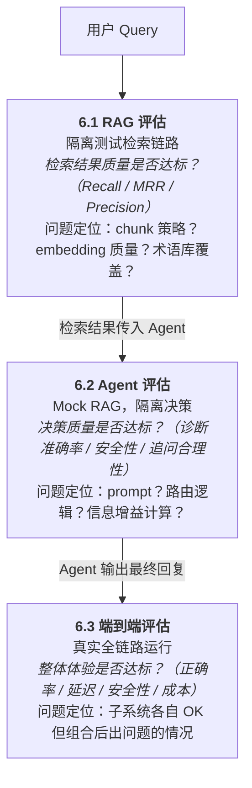

# 6. 评估

系统评估分为三层：**RAG 检索评估**、**Agent 决策评估**、**端到端系统评估**。三层各自隔离测试，定位问题时可快速判断瓶颈在哪一层。

本章聚焦**离线评估**：构建 JSON/JSONL 测试集，批量运行后输出评测报告，用于版本迭代前后的质量对比。在线运行时的实时监控、告警规则、审计追踪等已在 5.2 节完整定义，此处不再重复。

离线评估中，响应质量和轨迹状态采用 **LLM Judge** 方式：将采集到的实际输出与测试集中的期望输出进行比较，由 Judge 模型输出结构化评测报告。

---

## 6.1 RAG 检索评估

**目标**：隔离评估检索链路质量（build_query ② → retrieve ③），不涉及 Agent 决策逻辑。

### 6.1.1 测试集构建

从真实医疗问诊场景出发，人工标注每条 query 对应的 ground-truth chunk ID（即"这个问题应该检索到哪些文档片段"）。

测试集格式：
```jsonl
{
  "query": "二甲双胍有什么副作用？能和格列美脲一起吃吗？",
  "ground_truth_chunk_ids": ["chunk_0a3f", "chunk_1b7e", "chunk_2c9d"],
  "query_type": "药物交互",
  "difficulty": "medium"
}
```

query 类型应覆盖：症状咨询、药物查询、检查解读、疾病科普、药物交互、禁忌症查询。

### 6.1.2 评估指标

| 指标 | 计算方式 | 说明 |
|------|---------|------|
| **Recall@K**（≈ RAGAS Context Recall） | ground-truth chunks 中出现在 Top-K 结果里的比例 | 核心指标，衡量"该找到的有没有找到" |
| **MRR（Mean Reciprocal Rank）** | 第一个正确结果排名的倒数的平均值 | 衡量正确结果是否排在前面 |
| **Precision@K**（≈ RAGAS Context Precision） | Top-K 中属于 ground-truth 的比例 | 衡量结果中噪声的多少 |
| **Faithfulness**（RAGAS内容） | LLM Judge 判断最终回答中每个陈述是否能在检索到的 chunk 中找到依据 | 衡量生成内容对检索上下文的忠实度，防止幻觉 |
| **Answer Relevancy**（RAGAS内容） | LLM Judge 评估最终回答与原始 query 的相关程度 | 衡量回答是否切题，避免答非所问 |
| **Reranker 增益** | Rerank 前后 Recall@K 和 MRR 的差值 | 验证 Reranker 是否真正提升了排序质量 |
| **术语扩展命中率** | 口语化 query 经 Entity Linking（2.4.6 节）扩展后，Recall@K 的提升幅度 | 验证术语库（terms_collection）的实际价值 |
| **检索延迟** | retrieve 节点 P50 / P95 / P99 延迟 | 工程性能指标 |


> 注：Faithfulness 和 Answer Relevancy 两项指标对齐 RAGAS 框架的同名指标定义。实现上不依赖 ragas 库，而是复用本项目已有的 LLM Judge 机制（基于 DashScope 云端 API），在 Judge prompt 中加入对应评分维度即可。

### 6.1.3 分层测试

| 层级 | Query 特征 | 测试重点 |
|------|-----------|---------|
| 简单 | 标准医学术语，单一意图 | 基础召回能力 |
| 中等 | 口语化表述，需术语扩展 | Entity Linking + 术语库是否生效 |
| 困难 | 多意图混合、罕见病、长尾 query | 检索鲁棒性，回退策略是否触发 |

---

## 6.2 Agent 决策评估

**目标**：隔离评估 Agent 的决策质量。Mock 掉 RAG 检索结果，给 Agent 提供固定的、已知的、质量层次不齐的上下文，只观察 Agent 的决策行为。

### 6.2.1 测试方法

- **构建 Agent 专属测试集**：在数据集中预置好"检索结果"（mock `candidate_chunks`），不走真实 RAG，让 Agent 直接基于固定上下文做决策
- **评估 Agent 的节点调用链**：对比实际执行路径 vs 预期路径（如 ①→①.5→②→③→④→⑤→⑥→⑦→④→⑤→⑩→⑪→⑫→⑬）
- **注入异常场景**：故意给 Agent 返回错误/空的工具结果，测试其容错和重规划能力
- **LLM Judge 聚焦决策质量**：Judge 专门评估"Agent 的推理过程是否合理"，而不只是最终答案对不对

### 6.2.2 评估维度

| 评估维度 | 计算方式 | 说明 |
|---|---|---|
| **症状提取准确率** | 以人工标注的 ground-truth 症状列表为基准，计算 Precision / Recall / F1 | extract_symptoms ④ 是否从上下文中正确识别症状，TF-IDF + 分层术语归一化（Tier 1/2/3）是否有效 |
| **追问决策合理性** | LLM Judge 从区分度、必要性、优先级三个子维度打分（各 1-5 分），取加权均分 | select_symptom ⑤ 选择的追问症状是否具有高区分度（信息增益） |
| **收敛判断能力** | 对比实际追问轮数与标注的最优轮数，计算偏差率；同时统计过早收敛率和过晚收敛率 | should_continue 路由是否在合适的时机停止追问、进入诊断 |
| **诊断推理质量** | Top-1 / Top-3 命中率（诊断结果是否包含标注疾病）；LLM Judge 对证据链完整性打分（1-5 分） | diagnose ⑩ 输出的疾病排名、概率、证据链是否合理 |
| **安全约束遵从度** | 二分类指标：对含禁忌场景的 case 统计拦截成功率（Recall）和误拦率（FPR） | safety_gate ⑪ 是否正确拦截禁忌药物、标记高风险交互 |
| **引用溯源准确率** | 回答中每条引用与实际使用 chunk 的匹配率（精确匹配 chunk_id） | 回答中引用的文档来源是否与实际使用的 chunk 匹配 |
| **拒答/转诊能力** | 二分类指标：应拒答 case 的拒答率（Recall）+ 不应拒答 case 的误拒率（FPR） | 超出系统能力范围时（如急症、精神科），Agent 是否明确建议就医而非硬生成建议 |
| **幻觉决策** | LLM Judge 逐条检查 Agent 结论是否有上下文证据支撑，输出无依据结论占比 | Agent 是否在证据不足时仍给出确定性结论 |
| **自我纠错能力** | 注入异常后，统计成功重规划率（恢复正常路径的比例）和平均恢复步数 | 工具返回异常时，Agent 是否能重新规划而不是卡死 |

### 6.2.3 上下文梯度测试

核心思路：通过控制 Mock 检索结果的质量梯度，测试 Agent 在不同信息条件下的决策表现。

| 梯度 | 上下文质量 | 测试目标 | 测试集比例 | Mock 场景示例 | 期望行为 |
|---|---|---|---|---|---|
| **L1** | 完全相关、信息完整 | 基础能力：正常诊断路径能否跑通 | 30% | 返回完整的糖尿病用药指南 chunk，药物名称/剂量/禁忌症/副作用齐全 | 正确提取信息，生成完整用药建议 |
| **L2** | 部分相关、信息不完整 | 追问能力：缺信息时能否补充检索或追问患者 | 25% | 返回的降压药 chunk 缺少肾功能不全患者的禁忌信息 | Agent 识别信息缺口，追问患者肾功能状况或追加检索 |
| **L3** | 相关但有噪声干扰 | 抗噪能力：能否过滤无关 chunk，不被带偏 | 20% | 返回 5 个 chunk，其中 3 个是无关的骨科内容，2 个是相关的心内科内容 | Agent 正确筛选出心内科 chunk，忽略噪声 |
| **L4** | 完全不相关 / 空结果 | 边界能力：知不知道自己"不知道" | 15% | 检索返回空结果（罕见病场景） | Agent 明确告知无法提供建议，建议前往专科就诊 |
| **L5** | 包含错误/矛盾信息 | 鲁棒能力：面对矛盾信息的判断力 | 10% | 两个 chunk 给出矛盾的华法林剂量建议（一个说 2.5mg，一个说 5mg） | Agent 识别冲突，不直接采信任一方，建议患者遵医嘱 |

---

## 6.3 端到端系统评估

**目标**：不拆分子系统，从用户输入到最终回复，评估整个系统的综合表现。这一层能发现子系统各自通过但组合后出问题的情况。

### 6.3.1 测试集构建

构建端到端测试用例，系统真实运行全链路（检索 → 追问 → 诊断 → 安全校验）。多轮追问环节采用 **LLM 模拟患者**：测试集中定义患者画像，由云端 Qwen 扮演该患者，根据画像实时回答 Agent 的追问。

**测试集格式**：
```jsonl
{
  "case_id": "e2e_001",
  "patient_input": "我最近总是口渴，尿也多，体重还降了不少",
  "patient_profile": {
    "age": 52,
    "gender": "男",
    "known_conditions": ["高血压"],
    "family_history": ["母亲2型糖尿病"],
    "recent_tests": {"空腹血糖": "7.8 mmol/L"},
    "medications": ["氨氯地平 5mg/日"],
    "allergies": []
  },
  "expected_diagnosis_contains": ["2型糖尿病"],
  "expected_safety_flags": [],
  "expected_refuse": false,
  "max_followup_rounds": 3
}
```

**模拟患者机制**：
- 模拟患者 LLM 接收 `patient_profile` 作为系统 prompt，指令为"你是一个患者，根据以下画像如实回答医生的提问"
- Agent 每轮追问时，将追问内容发送给模拟患者 LLM，获取自然语言回答后继续流程
- 画像中未涉及的信息，模拟患者回复"不清楚"或"没查过"，避免凭空编造
- `max_followup_rounds` 作为安全上限，超出则强制进入诊断环节

**自动化回归测试集**：

除人工构建的测试用例外，同时利用 4.2 节 `diagnosis_feedback` 中积累的真实反馈数据，导出 `trace_id + raw_query + expected_response` 作为回归测试集。回归测试的核心目的是**防止系统修改引入退化**——每次变更（调整 prompt、修改 chunk 策略、更换模型、更新知识库等）后，自动重跑这批已有标准答案的用例，对比输出与期望结果。如果以前答对的 case 现在答错了，说明本次修改引入了回归问题，需要在合并前修复。

回归测试集随系统运行持续增长：线上每新增一条经人工标注且带有 `expected_response` 的反馈记录，自动纳入回归测试集。测试集本身需版本管理——当测试集内容发生变更（新增用例、修正标注错误、淘汰过时用例）时，需重新运行全量评估以建立新基线，确保前后对比的基准一致。

### 6.3.2 评估指标

| 指标 | 说明 |
|------|------|
| **端到端诊断正确率** | 最终诊断结果是否包含正确疾病（Top-1 / Top-3） |
| **建议完整性** | 用药建议、检查建议、高风险警告是否齐全（LLM Judge 评分） |
| **安全性通过率** | 存在禁忌症/药物交互时，safety_gate ⑪ 是否成功拦截 |
| **拒答准确率** | 应拒答的 case（超范围、信息严重不足）是否正确拒答；不应拒答的是否正常回复 |
| **追问效率** | 达到诊断所需信息量的平均追问轮数（越少越好，但不能以遗漏关键信息为代价） |
| **端到端延迟** | 从用户输入到最终回复的 P50 / P95 / P99 延迟 |
| **Token 消耗** | 每次完整问诊的平均 token 用量（直接关联推理成本） |
| **回归稳定性** | 版本迭代后，回归测试集上各指标的波动幅度 |

### 6.3.3 评估流程

1. **基线建立**：首次全量运行测试集，记录各指标作为基线
2. **迭代对比**：每次修改 RAG 参数（Top-K、chunk 策略）、Agent prompt、模型配置后，重新运行测试集，与基线对比
3. **回归守护**：CI 中集成回归测试，核心指标低于阈值时阻断合并
4. **问题归因**：端到端指标下降时，分别检查 6.1（RAG）和 6.2（Agent）的指标，快速定位瓶颈层

---

## 6.4 三层评估的关系



当端到端指标异常时，排查路径：先查 6.1 确认检索质量 → 再查 6.2 确认 Agent 决策 → 最后查组合问题（如检索延迟导致超时、上下文过长导致 Agent 截断等）。

