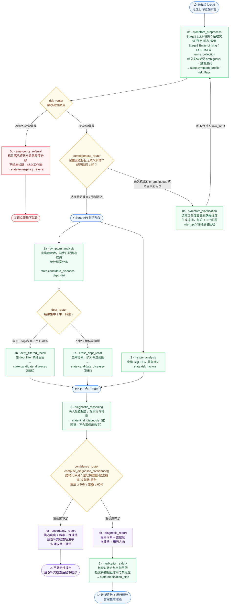
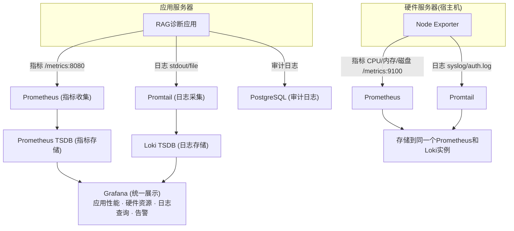

# pending tasks
明确的 TODO / 空白项
高优先级（内容完全缺失）
[第6节 SKILLs] — # 6. SKILLs 只有标题，完全没有内容（DEV_SPEC.md:1589）

[第5节 RAG性能评估] — ## rag性能评估 有标题无内容（DEV_SPEC.md:1583）

[第5节 系统性能评估] — ## 系统性能评估 有标题无内容（DEV_SPEC.md:1586）

[2.1.1 图像处理策略] — 照片/简笔画、表格、坐标图、思维导图四类内容的处理策略全为空（DEV_SPEC.md:806-815）

中等优先级（有 TODO 标注或描述不完整）
[2.1.6 Storage] — 明确 TODO：补充 PostgreSQL 与 Milvus 的写入顺序设计——先写哪个、失败时如何回滚、是否支持并行写入（DEV_SPEC.md:1031）

[2.1.4.1 source_id] — source_id 生成规则详见（TODO：补充链接），生成规则未在文档中说明（DEV_SPEC.md:873）

[3.2 上下文管理] — 内容是笔记/草稿风格（有emoji、未格式化的表格、日语标注），不是正式规范（DEV_SPEC.md:1373-1421）

[5 评估 - Agent部分] — 举例用的是"邮件场景"，不是医疗诊断场景（DEV_SPEC.md:1565-1580），需要替换为项目实际场景

低优先级（结构/一致性问题）
[章节编号顺序] — 第4章节编号顺序为 4.1 → 4.3 → 4.2（DEV_SPEC.md:1427-1456），4.2 和 4.3 顺序颠倒

[1.2.4.5 顺序] — 文档中 1.2.4.5（病人信息）出现在 1.2.4.6（术语向量库）之后，与编号不一致（DEV_SPEC.md:702）

[1.2.2.2 选型测评] — 描述了测评计划，但没有设计具体的测评指标和测试用例结构

建议的完善优先级
优先级	位置	说明
🔴 最高	第6节 SKILLs	这是项目亮点之一，完全空白
🔴 最高	2.1.1 图像处理	影响 Ingestion Pipeline 设计
🟠 高	2.1.6 写入顺序	影响 C7 任务实现
🟠 高	2.1.4.1 source_id 规则	影响幂等性设计实现
🟡 中	3.2 上下文管理	需要规范化
🟡 中	RAG/系统性能评估	影响阶段 I 实现
🟢 低	章节编号修正	纯格式问题


# 技术文档将从项目pipeline，以及项目文件结构两个方面介绍
# 1. 项目总览
## 作者的电脑配置为9800x3d，rtx5070ti (16GB)，RAM：48GB
## 项目亮点：

项目带有SKILL libarary，为众多流程创建其专属SKILL，形成可复用，方便管理，方便调试，避免上下文堆积，节省tokens的优点

与此同时，该项目在开发中使用了SKILL进行自动开发、测试，乃至最后的打包。当然，这高度依赖开发文档使用了非常正确的方案，而开发过程常常需要调试修改返工，因此在本项目中带来的帮助也较为有限。


深入实际业务场景，根据业务场景进行优化，听取了经验丰富主任医师的意见进行多次商讨


可观测、可视化管理、集成评估

## 目录
```
1. 项目总览
   1.1 总体架构
   1.2 技术选型（模型选型 + 数据存储选型）
   
2. RAG系统pipeline
   2.1 数据摄取（MinerU）
   2.2 Chunking
   2.3 Transform & Enrichment
   2.4 幂等性设计
   2.5 Embedding
   2.6 索引存储

3. Agent 设计（整合目前分散的 Agent 内容）
   3.1 工作流（LangGraph StateGraph）
   3.2 检索策略（两步走粗排+精排）
   3.3 上下文管理

4. 基础设施（监控、缓存、权限等）

5. 系统性能评估（RAG 评估 + Agent 评估统一放这里）

6. SKILL

7. 项目排期
   7.1 排期原则
   7.2 阶段总览
   7.3 详细排期
   7.4 进度跟踪表
```

## 1.1 总体架构
### 1.1.1 项目文件目录结构
```
Agentic-RAG-Medical-care-Assistant/
│
├── docker-compose.yml                  # 容器编排：PostgreSQL, Milvus（standalone+etcd+minio）, MongoDB, Redis, Prometheus, Grafana, Loki
├── .env.example                        # 环境变量模板（不提交 .env）
├── .gitignore
├── pyproject.toml                      # 项目依赖与构建配置
├── README.md
├── DEV_SPEC.md                         # 技术文档
│
├── config/                             # 静态配置文件
│   ├── settings.py                     # 全局配置（从环境变量/文件加载）
│   ├── model_config.py                 # 模型配置：BGE-M3、Reranker、Qwen 参数
│   ├── milvus_schema.py                # Milvus Collection Schema 定义（docs_collection + terms_collection）
│   └── logging_config.py               # 日志格式与 Promtail 适配
│
├── src/
│   ├── __init__.py
│   │
│   ├── api/                            # API 网关 / 入口服务
│   │   ├── __init__.py
│   │   ├── app.py                      # FastAPI 应用入口
│   │   ├── routes/
│   │   │   ├── __init__.py
│   │   │   ├── diagnosis.py            # 问诊接口（POST /diagnose, 追问交互）
│   │   │   ├── auth.py                 # 登录注册（JWT）
│   │   │   ├── patient.py              # 患者信息 CRUD
│   │   │   ├── admin.py                # 管理员：知识库上传、配置修改
│   │   │   └── health.py               # 健康检查 & Prometheus /metrics
│   │   ├── middleware/
│   │   │   ├── __init__.py
│   │   │   ├── auth_middleware.py       # JWT 验证 + 角色判断（admin/patient）
│   │   │   └── rate_limiter.py         # 限流，保护本地资源
│   │   └── schemas/                    # Pydantic 请求/响应模型
│   │       ├── __init__.py
│   │       ├── diagnosis_schema.py
│   │       └── patient_schema.py
│   │
│   ├── agent/                          # Agent 编排层（LangGraph StateGraph）
│   │   ├── __init__.py
│   │   ├── graph.py                    # StateGraph 定义：节点注册、边与条件边连接
│   │   ├── state.py                    # DiagnosisState Schema（TypedDict）
│   │   ├── nodes/                      # 各节点实现
│   │   │   ├── __init__.py
│   │   │   ├── symptom_preprocess.py   # 节点 0a：LLM NER + Entity Linking
│   │   │   ├── symptom_clarification.py# 节点 0b：追问引导（interrupt()）
│   │   │   ├── emergency_referral.py   # 节点 0c：高危转诊
│   │   │   ├── symptom_analysis.py     # 节点 1a：症状初步分析 + 科室分布
│   │   │   ├── dept_filtered_recall.py # 节点 1b：科室精细召回
│   │   │   ├── cross_dept_recall.py    # 节点 1c：跨科室全库召回
│   │   │   ├── history_analysis.py     # 节点 2：患者历史分析
│   │   │   ├── diagnostic_reasoning.py # 节点 3：诊断推理
│   │   │   ├── uncertainty_report.py   # 节点 4a：低置信度输出
│   │   │   ├── diagnosis_report.py     # 节点 4b：高置信度输出
│   │   │   └── medication_safety.py    # 节点 5：用药安全检查
│   │   └── routers/                    # 条件边路由逻辑
│   │       ├── __init__.py
│   │       ├── risk_router.py          # 高危信号筛查
│   │       ├── completeness_router.py  # 追问循环判断
│   │       ├── dept_router.py          # 科室集中度路由
│   │       └── confidence_router.py    # 置信度路由
│   │
│   ├── rag/                            # RAG 系统 Pipeline
│   │   ├── __init__.py
│   │   ├── ingestion/                  # 2.1 数据摄取
│   │   │   ├── __init__.py
│   │   │   ├── mineru_loader.py        # 2.1.1 MinerU 产物加载（读取 markdown + content_list）
│   │   │   ├── chunking.py             # 2.1.2 RecursiveCharacterTextSplitter 切分
│   │   │   ├── enrichment.py           # 2.1.3 LLM 增强（title/summary/tags/questions）
│   │   │   ├── image_caption.py        # 2.1.3.2 图像 Caption 关联绑定
│   │   │   ├── idempotency.py          # 2.1.4 幂等性：source_id / heading_path_id / content_hash
│   │   │   ├── embedding.py            # 2.1.5 多向量 Embedding（Dense + Sparse，BGE-M3）
│   │   │   ├── storage.py              # 2.1.6 写入 PostgreSQL + Milvus（含僵尸清理）
│   │   │   └── pipeline.py             # 完整摄取 Pipeline 编排（串联以上步骤）
│   │   │
│   │   ├── retrieval/                  # 2.2 召回策略
│   │   │   ├── __init__.py
│   │   │   ├── query_processing.py     # 2.2.1 查询预处理（指代消歧、关键词提取、术语扩展、多角度改写）
│   │   │   ├── sparse_retriever.py     # 2.2.2 Sparse Route（BM25）
│   │   │   ├── dense_retriever.py      # 2.2.2 Dense Route（MultiQuery + 内层 RRF）
│   │   │   ├── fusion.py               # 2.2.2 外层 RRF 融合 + 多向量去重
│   │   │   └── reranker.py             # 2.2.3 精排（BGE-Reranker-v2-m3 / 回退策略）
│   │   │
│   │   └── context/                    # Agent 上下文管理（3.2）
│   │       ├── __init__.py
│   │       ├── compressor.py           # 上下文压缩（多轮对话摘要）
│   │       └── selector.py             # 上下文选择（历史筛选/截断）
│   │
│   ├── models/                         # 模型推理层
│   │   ├── __init__.py
│   │   ├── llm_client.py              # LLM 推理客户端（Qwen，llama.cpp/vLLM 后端）
│   │   ├── embedding_model.py         # BGE-M3 Embedding（CPU 推理）
│   │   └── reranker_model.py          # BGE-Reranker-v2-m3（CPU 推理）
│   │
│   ├── db/                            # 数据与缓存层
│   │   ├── __init__.py
│   │   ├── postgres/
│   │   │   ├── __init__.py
│   │   │   ├── connection.py           # PostgreSQL 连接池
│   │   │   ├── models.py               # ORM 模型（sources, chunks, users, patients, conversations 等）
│   │   │   └── migrations/             # 数据库迁移脚本（Alembic）
│   │   │       └── ...
│   │   ├── milvus/
│   │   │   ├── __init__.py
│   │   │   ├── connection.py           # Milvus 连接管理
│   │   │   ├── docs_collection.py      # 医学文献向量库操作（1.2.4.1）
│   │   │   └── terms_collection.py     # 术语向量库操作（1.2.4.6）
│   │   ├── mongo/
│   │   │   ├── __init__.py
│   │   │   ├── connection.py           # MongoDB 连接管理
│   │   │   └── raw_documents.py        # raw_documents Collection 操作（1.2.4.4）
│   │   └── redis/
│   │       ├── __init__.py
│   │       └── cache.py                # Redis 缓存（配置缓存 + RAG 响应缓存）
│   │
│   └── common/                        # 公共工具
│       ├── __init__.py
│       ├── normalize.py               # 文本规范化函数（全角转半角、NFC 等，见 2.1.4.2）
│       ├── hashing.py                 # SHA256 工具（chunk_id、content_hash、heading_path_id）
│       └── metrics.py                 # Prometheus 指标埋点
│
├── skills/                            # SKILL Library（见项目亮点）
│   ├── core/                          # Skill 引擎
│   │   ├── __init__.py
│   │   ├── loader.py
│   │   ├── registry.py
│   │   └── executor.py
│   ├── chunk-enrichment/              # Chunk 语义增强 Skill
│   │   ├── SKILL.md
│   │   ├── references/
│   │   ├── scripts/
│   │   └── assets/
│   ├── diagnostic-reasoning/          # 诊断推理 Skill
│   │   ├── references/
│   │   └── scripts/
│   ├── query-disambiguation/          # 查询消歧 Skill
│   │   ├── references/
│   │   └── scripts/
│   ├── symptom-standardize/           # 症状标准化 Skill
│   │   ├── references/
│   │   ├── scripts/
│   │   └── assets/
│   ├── followup-generation/           # 追问生成 Skill
│   │   └── references/
│   └── llm-judge/                     # LLM 评估 Skill
│       ├── references/
│       ├── scripts/
│       └── assets/
│
├── terms/                             # 术语词典数据（1.2.4.6 数据来源）
│   ├── chip_cblue/                    # CHIP/CBLUE 口语→标准术语数据集
│   ├── icd10_cn/                      # ICD-10-CN 国家医保局临床版
│   ├── cmesh/                         # CMeSH 中国医学主题词表
│   └── build_terms.py                 # 术语库构建脚本（→ terms_collection）
│
├── data/                              # 数据目录（.gitignore 排除）
│   ├── raw_pdfs/                      # 原始 PDF 指南/教材
│   └── mineru_output/                 # MinerU 解析产物
│       └── {document_name}/auto/
│           ├── images/
│           ├── {document_name}.md
│           ├── {document_name}_content_list.json
│           ├── {document_name}_middle.json
│           └── {document_name}_model.json
│
├── evaluation/                        # 5. 评估系统
│   ├── __init__.py
│   ├── datasets/                      # 测试集（JSON/JSONL）
│   │   ├── rag_eval.jsonl             # RAG 检索质量测试集
│   │   └── agent_eval.jsonl           # Agent 决策测试集（L1-L5 梯度）
│   ├── offline/
│   │   ├── rag_evaluator.py           # RAG 离线评估（召回率、准确率）
│   │   ├── agent_evaluator.py         # Agent 离线评估（轨迹、工具调用、容错）
│   │   └── llm_judge.py               # LLM Judge 评分
│   └── online/
│       └── tracing.py                 # 在线追踪（端到端延时、Token 统计）
│
├── infra/                             # 基础设施配置
│   ├── docker/
│   │   ├── Dockerfile.api             # API 服务镜像
│   │   ├── Dockerfile.llm             # LLM 推理服务镜像
│   │   └── nginx.conf                 # Nginx 反向代理配置
│   ├── prometheus/
│   │   └── prometheus.yml             # Prometheus 采集配置
│   ├── grafana/
│   │   └── dashboards/               # Grafana 仪表盘 JSON
│   ├── loki/
│   │   └── loki-config.yml
│   └── promtail/
│       └── promtail-config.yml
│
├── scripts/                           # 运维脚本
│   ├── init_db.py                     # 初始化 PostgreSQL 表结构 + 索引
│   ├── init_milvus.py                 # 初始化 Milvus Collection + 索引
│   ├── ingest.py                      # 文档摄取入口（调用 rag.ingestion.pipeline）
│   └── seed_terms.py                  # 术语库初始导入
│
└── tests/
    ├── unit/
    │   ├── test_normalize.py
    │   ├── test_hashing.py
    │   ├── test_chunking.py
    │   └── test_fusion.py
    └── integration/
        ├── test_ingestion_pipeline.py
        ├── test_retrieval.py
        └── test_agent_workflow.py
```
### 目录与文档章节对应关系

| DEV_SPEC 章节 | 对应目录 |
|---|---|
| 1.2.1 BGE-M3 Embedding 模型 | `src/models/embedding_model.py` |
| 1.2.2 Qwen LLM 推理模型 | `src/models/llm_client.py` |
| 1.2.3 BGE-Reranker 精排模型 | `src/models/reranker_model.py` |
| 1.2.4.1 Milvus 医学文献向量库 | `src/db/milvus/docs_collection.py` |
| 1.2.4.2 PostgreSQL 元数据存储 | `src/db/postgres/` |
| 1.2.4.3 PostgreSQL 对话记录 | `src/db/postgres/models.py` → conversations |
| 1.2.4.4 MongoDB 原始文档存储 | `src/db/mongo/raw_documents.py` |
| 1.2.4.5 PostgreSQL 病人信息 | `src/db/postgres/models.py` → patients 等 |
| 1.2.4.6 Milvus 术语向量库 | `src/db/milvus/terms_collection.py` + `terms/` |
| 2.1.1 MinerU 数据加载 | `src/rag/ingestion/mineru_loader.py` |
| 2.1.2 Chunking | `src/rag/ingestion/chunking.py` |
| 2.1.3 Transform & Enrichment | `src/rag/ingestion/enrichment.py` + `image_caption.py` |
| 2.1.4 幂等性设计 | `src/rag/ingestion/idempotency.py` + `src/common/hashing.py` |
| 2.1.5 Embedding | `src/rag/ingestion/embedding.py` |
| 2.1.6 索引存储 | `src/rag/ingestion/storage.py` |
| 2.2.1 查询预处理 | `src/rag/retrieval/query_processing.py` |
| 2.2.2 召回（Dense + Sparse + RRF） | `src/rag/retrieval/` |
| 2.2.3 精排与重排 | `src/rag/retrieval/reranker.py` |
| 3.1 Agent 工作流 | `src/agent/graph.py` + `nodes/` + `routers/` |
| 3.2 上下文管理 | `src/rag/context/` |
| 4.1 Redis 缓存 | `src/db/redis/cache.py` |
| 4.2 监控层 | `infra/prometheus/` + `infra/grafana/` + `infra/loki/` |
| 4.3 权限与配置 | `src/api/middleware/` + `src/db/postgres/` |
| 5. 评估系统 | `evaluation/` |
| SKILL Library | `skills/` |

### 1.1.2 项目层级

#### 逻辑层级说明

**客户端层**

- Nginx 反向代理（`infra/docker/nginx.conf`），暴露 REST 接口
- 认证中间件（`src/api/middleware/auth_middleware.py`）与限流中间件（`src/api/middleware/rate_limiter.py`），确保本地资源稳定

**API 服务层**（含 Agent 编排、RAG、Embedding/Reranker，同进程内调用）

- FastAPI 应用（`src/api/app.py`），提供诊断、患者管理、健康检查、管理等路由
- 请求/响应 Schema 校验（`src/api/schemas/`）
- 状态图驱动的多步诊断流程（`src/agent/graph.py`）
- 节点：症状预处理、症状分析、病史分析、科室检索、跨科召回、诊断推理、用药安全、急诊转诊、诊断报告、不确定性报告、症状澄清（`src/agent/nodes/`）
- 路由器：完整性路由、置信度路由、科室路由、风险路由（`src/agent/routers/`）
- 数据摄取 Pipeline：MinerU 文档解析 → Chunking → LLM 增强（摘要/问题生成/图片描述） → 幂等写入 → Embedding → 向量存储（`src/rag/ingestion/`）
- 检索 Pipeline：查询处理 → Dense/Sparse 双路检索 → RRF 融合 → Reranker 精排（`src/rag/retrieval/`）
- 上下文管理：上下文筛选与压缩（`src/rag/context/`）
- Embedding 推理：BGE-M3，CPU 推理，与 API 进程共存（`src/models/embedding_model.py`）
- Reranker 推理：BGE-Reranker-v2-m3，CPU 推理，与 API 进程共存（`src/models/reranker_model.py`）

> **设计决策**：Agent/RAG/Embedding/Reranker 均为 Python 函数调用，与 FastAPI 运行在同一进程内，无需跨容器网络通信。合并进 `api` 容器可避免不必要的 HTTP 延迟，同时简化部署与调试。

**LLM 推理层（独立容器，GPU 直通）**

- LLM 推理：Qwen 系列，通过 llama.cpp server 部署于本地 GPU（RTX 5070 Ti 16GB）（`src/models/llm_client.py`）
- `api` 容器通过 HTTP 调用 llama.cpp server OpenAI 兼容接口（`http://llm:8080`）

> **设计决策**：llama.cpp server 是独立进程，需 GPU 资源隔离（`deploy.resources.reservations.devices`），必须单独容器。显存全部留给 LLM KV Cache，不与 Embedding/Reranker 竞争。

**数据与缓存层**

- 向量存储：Milvus（Dense + Sparse 向量，容器化部署，由 `milvus-standalone` + `milvus-etcd` + `milvus-minio` 三个容器组成）（`src/db/milvus/`）
- 元数据存储：PostgreSQL（Chunk 元数据、来源文档、医学术语等）（`src/db/postgres/`）
- 原始文档存储：MongoDB（MinerU 解析后的原始文档）（`src/db/mongo/`）
- 缓存：Redis（FAQ、热点查询等）（`src/db/redis/`）

**日志与监控层**

- 指标采集与告警：Prometheus（`infra/prometheus/`）
- 可视化面板：Grafana（`infra/grafana/`）
- 日志收集：Loki + Promtail（`infra/loki/`、`infra/promtail/`）
- 应用指标埋点（`src/common/metrics.py`）

**基础设施层（本地部署）**

- 容器编排：Docker Compose（`docker-compose.yml`）
- 容器镜像：API 服务（`infra/docker/Dockerfile.api`）与 LLM 推理服务（`infra/docker/Dockerfile.llm`）分离构建
- 存储：本地磁盘
- 密钥管理：环境变量配置（`.env.example`）

---

#### 容器划分总览

```
┌─────────────────────────────────────────────────────────────────────┐
│                        外部请求 / 浏览器                              │
└──────────────────────────────┬──────────────────────────────────────┘
                               │ HTTP 80/443
                               ▼
┌──────────────────────────────────────────────────────────────────────┐
│  容器: nginx                                                         │
│  反向代理，暴露 REST 接口，转发至 api:8000                               │
│  镜像: nginx:alpine  |  配置: infra/docker/nginx.conf                 │
└──────────────────────────────┬───────────────────────────────────────┘
                               │ HTTP 8000
                               ▼
┌───────────────────────────────────────────────────────────────────────────────────────────┐
│  容器: api                          [Dockerfile.api]                                       │
│  ┌─────────────────────────────────────────────────────────────────┐                      │
│  │  FastAPI  +  Auth/RateLimit Middleware  +  API Routes           │                      │
│  ├─────────────────────────────────────────────────────────────────┤                      │
│  │  LangGraph Agent（graph.py / nodes / routers）                   │                      │
│  ├─────────────────────────────────────────────────────────────────┤                      │
│  │  RAG Pipeline（ingestion / retrieval / context）                 │                      │
│  ├─────────────────────────────────────────────────────────────────┤                      │
│  │  BGE-M3 Embedding（CPU）  +  BGE-Reranker（CPU）                 │                      │
│  └─────────────────────────────────────────────────────────────────┘                      │
└───┬──────────┬─────────────────────────────────────┬────────────────┬─────────────────┬───┘
    │HTTP      │TCP                                  │TCP             │TCP              │HTTP
    │8080      │19530                                │5432            │27017            │6379
    ▼          ▼                                     ▼                ▼                 ▼
┌─────────┐ ┌──────────────────────────────────┐   ┌────────┐      ┌────────┐       ┌───────┐
│容器: llm │ │  Milvus 容器组（3个）              │   │容器:   │       │容器:   │       │容器:   │
│         │ │ ┌──────────┐  ┌─────┐  ┌───────┐ │   │postgres│      │mongo   │       │redis  │
│llama.cpp│ │ │standalone│  │etcd │  │ minio │ │   │        │      │        │       │       │
│ GPU直通  │ │ │ :19530  │   │     │  │ :900 │  │   │元数据   │      │原始文档 │       │缓存    │
│RTX5070Ti│ │ │ Dense+   │  │元数据│  │ 对象  │  │   │Chunk/  │      │MinerU  │       │FAQ/   │
│[Dfile   │ │ │ Sparse   │  │     │  │ 存储  │  │   │术语/   │       │解析结果 │       │热点    │
│ .llm]   │ │ └──────────┘  └─────┘  └──────┘  │   │患者     │      │        │       │查询    │
└─────────┘ └──────────────────────────────────┘   └────────┘      └────────┘       └───────┘

┌──────────────────────────────────────────────────────────────────────┐
│  监控容器组（独立，故障不影响主服务）                                      │
│                                                                      │
│  ┌────────────┐   ┌─────────┐   ┌──────┐   ┌──────────┐              │
│  │ prometheus │   │ grafana │   │ loki │   │ promtail │              │
│  │ :9090      │   │ :3000   │   │:3100 │   │(日志采集) │              │
│  └────────────┘   └─────────┘   └──────┘   └──────────┘              │
└──────────────────────────────────────────────────────────────────────┘

容器清单（共 13 个）：
  主链路：nginx → api → llm
  数据层：milvus-standalone、milvus-etcd、milvus-minio、postgres、mongo、redis
  监控层：prometheus、grafana、loki、promtail
```

## 1.2 技术选型：
本项目选型使用大模型的时间为2026/3/6
### 1.2.1 embedding模型选型

Embedding 模型负责将文本转换为向量，用于粗排召回

#### 选型结论：BGE-M3（BAAI/bge-m3），部署于 CPU

##### 选型理由

1. **单模型覆盖双路编码需求**：BGE-M3 是目前唯一一个单模型同时输出 Dense、Sparse、ColBERT 三种向量的开源模型。本项目的混合检索架构（见 2.1.5）需要 Dense + Sparse 双路编码，BGE-M3 一个模型即可覆盖，无需额外维护独立的 BM25/SPLADE 稀疏编码器，显著降低部署与维护成本。

2. **中文医疗场景能力强**：由智源（BAAI）开发，中文语料训练充分。本项目涉及大量中文医学术语（ICD-10、SNOMED CT 等），BGE-M3 的中文理解能力在开源 Embedding 模型中属于第一梯队（C-MTEB 榜单前列）。同时支持中英混合，可覆盖英文医学文献检索需求。

3. **长上下文支持（8192 tokens）**：医疗指南的 Chunk 可能较长，8192 token 的上下文窗口远优于多数 Embedding 模型的 512 token 限制，能更完整地编码 Chunk 语义。

4. **与 Milvus 原生集成**：Milvus 官方文档和示例直接支持 BGE-M3 的 Dense + Sparse 输出格式，本项目的 Collection Schema（见 1.2.4.1）中的 `dense_vector` + `sparse_vector` 字段可无缝对接。

##### 部署策略：CPU 推理，不占用 GPU

模型参数量约 568M（~2.2GB），部署于 CPU（本机 48GB RAM 充裕）。理由如下：

- **离线 Embedding（文档入库）**：批量任务，可与 LLM 推理错开时间执行（如夜间跑 pipeline），CPU 批处理即可满足吞吐需求。
- **在线 Query Embedding（实时查询）**：Query 通常很短（几十个 token），CPU 编码延迟仅 10~30ms，用户无感知。
- **显存全部留给推理模型**：Qwen3.5-9B AWQ 4-bit 推理时峰值显存约 10~12GB（含 KV Cache），RTX 5070 Ti 仅 16GB。若 Embedding 模型也上 GPU，会压缩 KV Cache 空间，直接限制可处理的上下文长度，在多轮医疗问诊场景下不可接受。

##### 不追求更大 Embedding 模型的原因

Embedding 的职责是粗排召回，本项目已通过以下多层机制弥补单一 Embedding 精度的不足，无需为 Embedding 环节投入更多资源：

- 多向量表示（original + summary + question）大幅提升召回率（见 2.1.5）
- 混合检索（Dense + Sparse）关键词与语义互补（见 2.2.2）
- Reranker 精排才是决定最终检索精度的关键环节（见 2.2.3）
- Agent 两步检索策略可根据首次结果动态调整召回范围（见 2.2 召回策略）

精度提升的投入应优先放在 Reranker 选型和 Prompt 质量优化上，而非 Embedding 模型本身。

### 1.2.2 agent以及rag系统模型（本地部署）选型
#### 1.2.2.1 理论选型

**模型族系选择：Qwen 系列**

在当前主流开源大模型中，Qwen3.5 / Qwen3 系列是同时满足"参数量小（单卡可部署）"与"中文能力强"两项约束的少数选择之一。其中文语料覆盖广泛，对医学术语与临床文本的理解能力在同量级开源模型中属于第一梯队，是本项目的首选族系。

**验证方式：Ollama（llama.cpp 后端）**

作者使用 Ollama 对各候选模型进行快速原型验证，主要观测指标为显存占用与推理速度（eval rate）。Ollama 底层使用 llama.cpp，在消费级硬件上的端侧推理优化极为成熟——尤其是在显存不足需要 CPU Offload 时，llama.cpp 的资源调度与稳定性明显优于 vLLM（详见候选模型 3 的说明）。在初步筛选后，作者后续使用llama.cpp/vLLM进行后续调优和验证对比（小模型无offload，使用vLLM）。

> 涉及复杂医疗推理时，参数量更大的模型在推理质量上通常更具优势。小参数模型（9B）基本无性能压力，Ollama 快速验证的核心目的是评估较大的模型（14B 及以上）在本机是否可用。

---

#### 候选模型评估与选型策略

**选型优先级**
模型之间的能力明显35B-A3B高于其余二者
```
首选：35B-A3B（MoE） → 调试通过则直接采用
备选：14B / 9B（需实际业务测评后择优）
放弃：27B Dense（推理速度不可接受）
```

---

**🥇 首选：需调试验证（需 CPU Offload）**

**`unsloth/Qwen3.5-35B-A3B-Q4_K_M.gguf`**

该模型为 MoE 架构（Mixture of Experts），模型名称中的 A3B 表示每次前向推理实际激活的参数量约为 3B，总参数虽达 35B，但推理时的实际显存压力远低于同量级的 Dense 模型。由于单卡 16GB 显存不足以容纳全部权重，需启用 CPU Offload。

在 CPU Offload 场景下，llama.cpp 的表现优于 vLLM。vLLM 本身为高并发、大显存、超长上下文的服务端场景设计，即便使用 `--offload-experts-only` 专门避免路由层与注意力层的跨设备调度，也依然无法弥补其架构上对 Offload 场景的天然劣势——Offload 在 vLLM 中本就是兜底功能；而 llama.cpp 对端侧资源（CPU 多线程、极限场景内存管理）有极致优化，在单卡 Offload 场景下更稳定、吞吐更高。

Ollama 实测（显存基本跑满，prompt：`你是谁`）：

| 指标 | 数值 |
|---|---|
| total duration | 3.67s |
| prompt eval rate | 173.72 tokens/s |
| **eval rate** | **19.29 tokens/s** |

eval rate 约 19 tokens/s，体验略慢但基本可接受，仍有调参空间（如调整 `n_gpu_layers`、`--ctx-size` 等）。**只要调试通过、业务场景下推理速度可接受，即优先采用此模型。**

---

**🥈 备选：需业务场景实测对比**

若 35B-A3B 调试后仍无法满足推理速度要求，则在以下两个模型中择优：

1. `Qwen/Qwen3-14B-AWQ`（官方 AWQ 4-bit 量化版本）
2. `cyankiwi/Qwen3.5-9B-AWQ-4bit`

两者均可在显存范围内流畅运行，但参数量与推理质量之间存在权衡。不能仅凭显存占用或速度指标判断优劣，需通过实际业务测评决定（见 1.2.2.2）。

---

**❌ 已放弃（推理速度不可接受）**

**`unsloth/Qwen3.5-27B-Q4_K_M.gguf`**

Dense 架构全量 27B 参数，在单卡显存不足时 CPU Offload 比例更高，推理速度极慢。

Ollama 实测（显存基本跑满，prompt：`你是谁`）：

| 指标 | 数值 |
|---|---|
| total duration | 13.78s |
| prompt eval rate | 26.56 tokens/s |
| **eval rate** | **4.98 tokens/s** |

eval rate 仅约 5 tokens/s，与 35B-A3B（MoE，~19 tokens/s）相差近 4 倍，且无继续优化的空间，**放弃该模型**。

> **对比启示**：在单卡 CPU Offload 场景下，MoE 架构（实际激活参数少）的推理速度远优于同等标称参数量的 Dense 架构。选型时不应只看总参数量，应关注实际激活参数量与显存占用的比例。

---

#### 1.2.2.2 选型测评

1.2.2.1 的评估均基于简单 prompt 的速度测试，尚未反映真实业务场景的推理质量。若 35B-A3B 调试通过则直接采用，无需测评；若需在 14B 与 9B 之间抉择，则需对二者在以下维度进行对比测试：准确率、鲁棒性、推理成本、推理速度。


## 在本项目中，作者没有高质量的数据，也没有医学基础标注，微调需要考虑，目前没有这样的打算
## 厂商做过DPO和RLHF，但如果出现持续输出某类有害回答/不利行为，则可以做DPO对齐


### 1.2.3 reranker模型选型
Rerank 模型则是对召回的候选文档做精排。通常是 cross-encoder 架构——将 query 和 document 拼接在一起输入模型，直接输出一个相关性分数。因为 query 和 document 之间有充分的交互注意力，所以精度更高，但计算成本也更大，不适合直接用于全量检索，只适合对少量候选（比如 top-20 到 top-100）重新排序。

#### 选型结论：BGE-Reranker-v2-m3（BAAI/bge-reranker-v2-m3），部署于 CPU

##### 选型理由

1. **与 Embedding 模型同源，语义对齐**：BGE-Reranker-v2-m3 与本项目 Embedding 模型 BGE-M3 均出自智源（BAAI），对中文医疗术语的理解能力一致。避免出现 Embedding 召回了正确文档但 Reranker 因语言理解差异将其排低的问题，粗排→精排的语义衔接更稳定。

2. **中文医疗场景能力强**：智源中文语料训练充分，对 ICD-10、SNOMED CT 等医学术语有良好的理解能力。同时支持中英双语，可覆盖英文医学文献的精排需求。

3. **长上下文支持（8192 tokens）**：输入长度上限与 BGE-M3 一致，不会因 Chunk 过长被截断而丢失精排信息。医疗指南的 Chunk 可能较长，8192 token 窗口确保 query-document 对的完整交互。

4. **参数量适中，CPU 推理可行**：模型参数量约 568M（~2.2GB），与 BGE-M3 相当。本项目精排候选量为 M=20 左右，CPU 上对 20 个 query-doc pair 做 cross-encoder 打分，延迟约 100~300ms，用户可接受。

##### 部署策略：CPU 推理，不占用 GPU

与 BGE-M3 共享 CPU 推理资源（本机 48GB RAM 充裕），理由如下：

- **二者不会同时高负载**：Embedding 在文档入库时批量执行，Reranker 在用户查询时实时执行，负载天然错峰。
- **显存全部留给推理模型**：与 Embedding 选型逻辑一致，RTX 5070 Ti 16GB 显存全部分配给 Qwen3.5-9B / Qwen3-14B 推理，Reranker 上 GPU 会压缩 KV Cache 空间，在多轮问诊场景下不可接受。
- **候选量有限，CPU 即可满足**：精排仅处理 RRF 融合后的 Top-20 候选（见 2.2.3），不涉及大批量计算。

##### 备选方案与排除理由

| 备选模型 | 排除原因 |
|---------|---------|
| **Cohere Rerank** | 闭源 API 调用，本项目为本地部署架构，引入外部依赖违背设计原则；医疗数据不宜外传，存在合规风险 |
| **LLM Rerank（Qwen 自身做精排）** | 会抢占推理模型的 GPU 资源和推理队列，增加端到端延迟；结构化输出不如 cross-encoder 稳定；成本高于专用 Reranker |
| **BGE-Reranker-large（v1）** | 旧版本，中文能力和长上下文支持不如 v2-m3，最大输入仅 512 tokens，无法覆盖本项目的长 Chunk 场景 |
| **BGE-Reranker-v2-gemma** | 基于 Gemma 2B，参数量约 2B，CPU 推理延迟显著增加（约为 v2-m3 的 3~4 倍），精排精度提升有限，性价比不如 v2-m3 |

##### 与系统架构的衔接

- **输入**：RRF 融合 + 多向量去重后的 Top-M 候选（见 2.2.2），每条候选为 [query, original_content] 对
- **输出**：相关性分数排序后的 Top-K 结果，传给 LLM 生成诊断
- **回退机制**：Reranker 超时或不可用时，直接返回 RRF Top-K，确保系统可用性（见 2.2.3 回退策略）

### 1.2.4 数据存储选型及具体设计：
#### 1.2.4.1. 原始文档向量化的向量库：Milvus

每个 Chunk 在 Milvus 中对应 4~5 条向量记录（1 original + 1 summary + 2~3 question）：

| vector_type | id 规则 | Dense | Sparse | 说明 |
|-------------|---------|:-----:|:------:|------|
| `original` | `{chunk_id}` | ✅ | ✅ | 原文向量，支持语义检索与关键词检索 |
| `summary` | `{chunk_id}_summary` | ✅ | ❌ | 摘要向量，提升对模糊 query 的匹配能力 |
| `question` | `{chunk_id}_q{n}` | ✅ | ❌ | 问题向量，弥合患者口语与临床文本的语义鸿沟 |

summary / question 记录不生成 Sparse Vector——关键词匹配应基于原文，而非 LLM 改写文本，避免语义漂移。

**Milvus Collection Schema**：

```
{
    "id":               str,             # 本条记录唯一 ID（见上表）
    "source_chunk_id":  str,             # 所属原始 chunk_id（original 记录与 id 相同）
    "vector_type":      str,             # "original" | "summary" | "question"
    "dense_vector":     List[float],     # 语义向量（所有记录均有）
    "sparse_vector":    Dict[int,float], # 稀疏向量（仅 original 有，summary/question 存空字典 {}）
    "original_content": str,             # 原始 chunk 文本，冗余存储，命中后无需回查 PostgreSQL
    "source_id":        str,             # Pre-filter 字段：按来源文档过滤（见 1.2.4.2 sources 表）
    "tags":             List[str]        # Pre-filter 字段：按主题过滤
}
```

`title`、`heading_path` 等展示字段不在 Milvus 冗余，检索命中后以 `source_chunk_id` 回查 PostgreSQL `chunks` 表获取。


#### 1.2.4.2. 元数据存储：PostgreSQL

PostgreSQL 负责存储所有 Chunk 的结构性元数据与增强元数据，支撑幂等写入、僵尸清理、增量 Embedding 判断及检索结果的上下文还原。向量数据本身存储于 Milvus，PostgreSQL 不存储向量。

**sources 表**（来源文档注册表，source_id 的权威来源）

```sql
sources (
  source_id    TEXT PRIMARY KEY,          -- 文档唯一 ID（见 2.1.4.1）
  file_name    TEXT NOT NULL,             -- 原始文件名
  file_path    TEXT,                      -- 文件存储路径
  doc_type     VARCHAR(50),               -- 文档类型，如 guideline / textbook / protocol
  created_at   TIMESTAMPTZ NOT NULL DEFAULT now(),
  updated_at   TIMESTAMPTZ NOT NULL DEFAULT now()
)
```

**chunks 表**（Chunk 元数据核心表）

```sql
chunks (
  -- 幂等性字段（见 2.1.4）
  chunk_id              TEXT PRIMARY KEY,   -- SHA256(source_id:heading_path_id:relative_chunk_index)
  source_id             TEXT NOT NULL REFERENCES sources(source_id),
  heading_path_id       TEXT NOT NULL,      -- SHA256(H1_id:H2_id:...) 标题路径哈希
  heading_path          TEXT NOT NULL,      -- 人类可读标题路径，如 "第2章 > 2.1 > 2.1.4"，用于检索结果展示
  relative_chunk_index  INT  NOT NULL,      -- 同标题路径下的块序号（从 0 开始），用于顺序还原
  chunk_raw_text        TEXT NOT NULL,      -- Chunk 原始文本
  content_hash          TEXT NOT NULL,      -- SHA256(chunk_raw_text)，变动检测信号（见 2.1.4.3）

  -- LLM 增强字段（见 2.1.3）
  title                 TEXT,              -- LLM 生成的精准小标题
  summary               TEXT,             -- LLM 生成的内容摘要，同时作为摘要向量文本来源（见 2.1.5）
  tags                  TEXT[],           -- LLM 生成的主题标签数组
  hypothetical_questions TEXT[],          -- LLM 生成的假设性问题数组（2~3 条，见 2.1.5）
  image_captions        TEXT,             -- 多模态增强产出的图像/表格描述（无图时为 NULL）

  -- 运维状态字段
  embedding_status      VARCHAR(20) NOT NULL DEFAULT 'pending',
                                          -- pending / done / failed，用于追踪 Embedding 计算状态
  created_at            TIMESTAMPTZ NOT NULL DEFAULT now(),
  updated_at            TIMESTAMPTZ NOT NULL DEFAULT now()
)
```

**索引**

```sql
CREATE INDEX idx_chunks_source_id        ON chunks (source_id);           -- 僵尸清理差集查询
CREATE INDEX idx_chunks_heading_path_id  ON chunks (heading_path_id);     -- 按标题路径聚合查询
CREATE INDEX idx_chunks_content_hash     ON chunks (content_hash);        -- 跨文档内容去重
CREATE INDEX idx_chunks_embedding_status ON chunks (embedding_status)     -- 增量 Embedding 任务扫描
  WHERE embedding_status != 'done';
```

> `heading_path`（明文）与 `heading_path_id`（哈希）同时存储：前者用于 chunk_id 推导，后者用于检索结果展示来源标题，职责不同，不可合并。

#### 1.2.4.3. 对话记录：PostgreSQL

```sql
-- 对话记录表（功能用途）
conversations (
  id UUID PRIMARY KEY,
  session_id,
  user_id,
  user_input TEXT,
  llm_output TEXT,
  rag_context JSONB,
  created_at TIMESTAMP
)
```
#### 1.2.4.4. 原始指南/教材文档存储：MongoDB

MongoDB 负责存储 MinerU 解析后的所有原始产物，以 `source_id` 为主键聚合，与 PostgreSQL `sources` 表一一对应。

**存储动机**：MinerU 输出物既有深度嵌套的 JSON（`content_list`、`middle`），又有长文本 Markdown，结构异构且以"写一次、按需读"为主要访问模式，MongoDB 文档模型比 PostgreSQL JSONB 更自然，无需预定义 Schema 即可容纳 MinerU 各版本输出格式的差异。

**MongoDB Collection：`raw_documents`**

```json
{
  "source_id":       "string",    // 主键，与 PostgreSQL sources.source_id 完全对应
  "file_name":       "string",    // 原始文件名，如 "2024心力衰竭指南.pdf"
  "stored_at":       "ISODate",   // 本条记录写入时间

  // ── MinerU 文本产物 ──────────────────────────────────────────────
  "markdown_content": "string",   // target_document.md 全文，供 chunking pipeline 直接读取

  // ── MinerU JSON 产物（原样存入，不做二次解析）────────────────────
  "content_list":    [...],       // target_document_content_list.json
                                  // 含每个内容块的类型、文本、页码、坐标 bbox
                                  // Pipeline 用此字段做图像 caption 与 chunk 的位置匹配（见 2.1.3.2）
  "middle":          {...},       // target_document_middle.json
                                  // 含版面分析结构，排查解析异常时使用
  "model":           {...},       // target_document_model.json（可选）
                                  // 体积较大，仅在需要重新调试解析结果时写入，默认 null

  // ── 原始文件引用 ─────────────────────────────────────────────────
  "pdf_path":        "string"     // 原始 PDF 在本地磁盘的绝对路径，文件本身不入库
}
```

**索引**

```
db.raw_documents.createIndex({ "source_id": 1 }, { unique: true })
```

**字段说明**

| 字段 | 来源 | 主要用途 |
|------|------|---------|
| `markdown_content` | `target_document.md` | Chunking pipeline 的直接输入（见 2.1.2） |
| `content_list` | `content_list.json` | 图像/表格 bbox 坐标，支撑 caption 与 chunk 的位置关联（见 2.1.3.2） |
| `middle` | `middle.json` | 版面结构存档，供解析异常排查使用 |
| `model` | `model.json` | 模型推理细节，默认不写入，按需存储 |
| `pdf_path` | 文件系统 | 原始 PDF 路径引用，PDF 本体存本地磁盘 |

**不存入 MongoDB 的内容**

- 原始 PDF 文件本体：体积大，存本地磁盘，MongoDB 只记路径
- `target_document_span.pdf` / `target_document_layout.pdf`：MinerU 调试用中间产物，不纳入系统存储

#### 1.2.4.6. 术语向量库：Milvus（terms_collection）

`terms_collection` 是独立于医学文献向量库（1.2.4.1）的专用术语检索库，服务于节点 0a 的 Entity Linking 和 2.2.1 的术语扩展，两者均直接复用本库，不重复调用 LLM。

**数据来源（三层叠加，优先级从高到低）**：

| 层级 | 来源 | 内容 | 获取方式 |
|------|------|------|---------|
| Layer 1 PROJECT | 项目自建口语词典 | 患者口语、俗称 → 标准术语映射（如"肚子疼"→腹痛） | CHIP/CBLUE 数据集整理 + 医师意见，持续补充 |
| Layer 2 ICD-10-CN | 国家医保局临床版 | 中国医院实际使用的疾病编码，含中文标准名称和部分别名 | 国家医保局官网免费下载 |
| Layer 3 CMeSH | 中国医学主题词表 | 症状/解剖术语的中文规范名称与同义词，由中国医学科学院维护 | 官网免费申请 |

CHIP/CBLUE 医学实体标准化数据集（GitHub 开源）专为中文患者口语 → 标准术语设计，直接提供大量口语别名标注对，作为 Layer 1 的主要数据来源，大幅减少人工整理工作量。

**核心设计原则**：一条记录对应一个别名（alias），多别名同属一个 concept_id，向量化 alias 文本而非 preferred_term，使口语/缩写/英文专业术语均可通过向量检索命中标准术语。

**Milvus Collection Schema（terms_collection）**：

```
{
    "id":             str,          # 记录唯一 ID：{concept_id}_{alias_index}
    "concept_id":     str,          # 概念唯一 ID：优先用 ICD-10-CN 编码（如 "R10.4"）；
                                    # 无 ICD-10-CN 编码时用 CMeSH ID；
                                    # 两者均无时用项目自赋 ID（PROJECT_{hash}）
    "preferred_term": str,          # 该概念的标准首选术语，如"腹痛"
    "alias":          str,          # 本条记录的别名文本，如"肚子疼"/"腹部疼痛"/"abdominal pain"
    "source_vocab":   str,          # 别名来源：PROJECT / ICD10CN / CMESH / CHIP
    "icd10":          str,          # ICD-10-CN 编码，如 "R10.4"（无映射时为空）
    "category":       str,          # 概念类型：symptom / disease / anatomy / drug
    "dense_vector":   List[float]   # alias 文本的 BGE-M3 向量（仅 Dense，不需要 Sparse）
}
```

**与 1.2.4.1 的区别**：

| | 医学文献向量库（1.2.4.1） | 术语向量库（terms_collection） |
|---|---|---|
| 内容 | 医学指南/教材 Chunk | 术语别名条目 |
| 向量文本 | 原文/摘要/假设问题 | alias 字符串 |
| 检索目的 | 召回诊疗依据 | 实体归一化编码 |
| Sparse 向量 | ✅ original 有 | ❌ 不需要 |
| 更新频率 | 随文档导入更新 | 随 ICD-10-CN/CMeSH 版本更新，PROJECT 层持续补充 |

**索引**：

```
db.terms_collection.createIndex({ "concept_id": 1 })  # 按 concept_id 查所有别名（用于术语扩展）
db.terms_collection.createIndex({ "category": 1 })    # 按类型过滤（仅查 symptom 等）
```

#### 1.2.4.5. 病人信息：PostgreSQL

```
users (账号系统)
  └── patients (1:1，补充医疗信息)
        ├── medical_history (1:N，可以有多条病史)
        ├── allergies       (1:N，可以有多条过敏)
        ├── current_medications (1:N，可以有多条用药)
        └── family_history  (1:N，可以有多个亲属)
```

具体设计如下

```sql
-- 用户认证表
users (
  id UUID PRIMARY KEY,
  email TEXT UNIQUE NOT NULL,
  password TEXT NOT NULL,       -- 存储哈希后的密码
  role VARCHAR(20) NOT NULL     -- patient / doctor / admin 等
)
```
```sql
-- 患者基本信息（关联 users 表）
patients (
  id UUID PRIMARY KEY REFERENCES users(id),
  name TEXT,
  gender VARCHAR(10),
  birth_date DATE,
  blood_type VARCHAR(5),        -- 血型，急诊相关
  height_cm INT,
  weight_kg DECIMAL(5,1),
  phone TEXT,
  emergency_contact TEXT        -- 紧急联系人
)
```
```sql
-- 既往病史（一对多）
medical_history (
  id UUID PRIMARY KEY,
  patient_id UUID REFERENCES patients(id),
  condition TEXT,               -- 疾病名称，如"2型糖尿病"
  diagnosed_at DATE,
  resolved_at DATE,             -- NULL表示持续中
  notes TEXT
)

-- 过敏史
allergies (
  id UUID PRIMARY KEY,
  patient_id UUID REFERENCES patients(id),
  allergen TEXT,                -- 过敏原，如"青霉素"
  allergen_type VARCHAR(20),    -- drug/food/other
  reaction TEXT,                -- 过敏反应描述
  severity VARCHAR(10)          -- mild/moderate/severe
)

-- 当前用药
current_medications (
  id UUID PRIMARY KEY,
  patient_id UUID REFERENCES patients(id),
  drug_name TEXT,
  dosage TEXT,                  -- "500mg"
  frequency TEXT,               -- "每日两次"
  started_at DATE,
  prescribed_by TEXT            -- 开药来源备注
)

-- 家族史
family_history (
  id UUID PRIMARY KEY,
  patient_id UUID REFERENCES patients(id),
  relation VARCHAR(20),         -- father/mother/sibling等
  condition TEXT,               -- 疾病名称
  notes TEXT
)
```


# 2. RAG系统pipeline：
## 2.1 数据摄取：
### 2.1.1 数据加载及处理

使用 MinerU 作为文档解析器，以下为选型原因：
医疗场景的文档具有高度复杂性与专业性，对解析精度要求极高，MinerU 在以下几个关键维度上具备明显优势：
1. 扫描件与影像报告支持：医院文档大量以扫描 PDF 形式存在（如检验报告、病历归档），MinerU 内置高精度 OCR 引擎
2. 复杂表格的高精度还原：检验报告、用药记录、手术记录等文档均包含大量结构化表格。MinerU 基于深度学习的表格识别模型可准确还原行列结构，确保表格数据进入向量库后语义完整，避免因解析错乱导致的检索错误。
3. 医学公式与专业符号识别：医学文献、药品说明书中包含大量计量单位、化学式及统计公式，MinerU 支持 LaTeX 格式的公式输出，保障专业内容的准确提取。
4. 图文混排文档处理能力：影像科报告、图解等文档普遍存在图文混排，MinerU 具备多模态解析能力，可对图表进行结构化处理，而非直接丢弃。

由MinerU直接用命令行运行并解析后，将会在项目文件夹下出现如下文档
/project_folder/mineru_output/target_document/auto
- images/
- target_document_content_list.json
- target_document_origin.pdf
- target_document_middle.json
- target_document_model.json
- target_document_span.pdf
- target_document_layout.pdf
- target_document.md


项目使用的数据源资料中，存在大量：照片或简笔画示意图、表格、坐标图、思维导图，
对于照片或简笔画示意图的处理

1. 对于表格的处理：
拆行存储：将每一行转成自然语言句子再embedding，例如：

"肺血管疾病包括：肺栓塞、肺动脉高压、肺静脉闭塞病"
"神经肌肉疾病包括：肌萎缩侧索硬化症、吉兰-巴雷综合征"

保留元数据：存储时附带原始表格位置信息（如"表2-1-1，第X行"），便于溯源

整表摘要+分行双存：同时存一条整表的概括性描述，应对"这张表讲什么"类的宏观问题
整表摘要存储（粗粒度）
单独存一条对整张表的概括，用于回答宏观问题，如：

"表2-1-1是呼吸疾病分类表，按类别列举了气流受限性肺疾病、肺实质疾病、肺血管疾病、感染性肺疾病、恶性肿瘤、呼吸衰竭等十大类及其代表性疾病"

单行存储则是

{
  "text": "肺血管疾病包括：肺栓塞、肺动脉高压",
  "source": "第2章第1节",
  "table": "表2-1-1",
  "row": 5
}

对于坐标图的处理

对于思维导图的处理：


## 2.1.2 chunking（LangChain 负责切分；独立、可控）

实现方案：使用 LangChain 的 `RecursiveCharacterTextSplitter` 进行切分。
优势：该方法对 Markdown 文档的结构（标题、段落、列表、代码块）有天然的适配性，能够通过配置语义断点（Separators）实现高质量、语义完整的切块。
输入：Loader 产出的 Markdown Document。
输出：若干 Chunk（或 Document-like chunks），每个 chunk 必须携带稳定的定位信息与来源信息：source, chunk_index, start_offset/end_offset（或等价定位字段）。


## 2.1.3 Transform & Enrichment（结构转换与深度增强）

### 2.1.3.1 结构转换

`RecursiveCharacterTextSplitter` 的输出为 `List[Document]`，每个 `Document` 对象包含 `page_content`（`str`）与基础 `metadata`（`dict`）。本步骤将 `page_content` 与各阶段元数据整合，写入 `chunks` 表（字段定义详见 1.2 数据存储设计 → chunks 表）。

### 2.1.3.2 增强策略

**语义元数据注入 (Semantic Metadata Enrichment)**：

策略：在基础元数据之上，利用 LLM 提取高维语义特征。
产出：为每个 Chunk 通过**单次 LLM 调用**统一生成以下字段，注入到 Metadata 中：
- **Title**（精准小标题）
- **Summary**（内容摘要）：同时作为摘要向量的文本来源（见 2.1.5）
- **Tags**（主题标签）
- **Hypothetical Questions**（假设性问题）：以患者口语视角，针对本 Chunk 内容生成 2~3 个患者可能提出的问题（见 2.1.5）。医疗场景中患者 query 多为口语症状描述，知识库内容多为临床陈述，该字段用于弥合二者之间的语义鸿沟，提升召回率。

**图像 Caption 注入 (Image Caption Injection)**：

> 注：Vision LLM 对图像的实际理解与 Caption 生成在 **2.1.1** 阶段按文档粒度统一完成，避免在 Chunk 级别重复调用。本步骤仅负责将已生成的 Caption 关联绑定到对应 Chunk，填充 `image_captions` 字段。

关联逻辑：依据 2.1.1 阶段解析出的图像位置（页码或字符偏移量）与 Chunk 的 `start_offset`/`end_offset` 进行范围匹配，将落在该 Chunk 范围内的图像 Caption 注入，实现”搜文出图”能力。

**工程特性**：Transform 步骤为原子化操作，每个 Chunk 独立处理，失败时仅需重试该 Chunk，不影响其他已完成的 Chunk。


## 2.1.4 幂等性设计(Idempotency)

**核心机制**：

三层存储均通过 Upsert 保证幂等写入，同一文档无论被处理多少次，均不产生重复数据：

| 存储层 | Upsert 主键 | 说明 |
|--------|------------|------|
| PostgreSQL `sources` 表 | `source_id` | 同一文档重复导入时直接覆盖，不新增记录（详见 2.1.4.1） |
| PostgreSQL `chunks` 表 | `chunk_id` | 配合 `content_hash` 实现增量更新，内容未变则跳过 Embedding（详见 2.1.4.2、2.1.4.3） |
| Milvus 向量记录 | 派生 ID | 由 `chunk_id` 确定性派生，如 `{chunk_id}_summary`（详见 2.1.6） |

**原子性保证**：Upsert 以 Batch 为单位进行事务性写入。若批次内某条写入失败，整批回滚，不产生部分写入的脏数据，下次重试时整批重新处理即可。


### 2.1.4.1 source_id

`source_id` 是来源文档的唯一标识符，source_id 生成规则详见（TODO：补充链接）。

**幂等写入**：每次文档摄取时，以 `source_id` 为主键对 `sources` 表执行 Upsert，更新 `updated_at` 等可变字段，不重复插入记录。


### 2.1.4.2 heading_path_id 的构建


**设计动机**：避免使用绝对位置编码——若使用绝对位置，文档中任意一处修改都会导致其后所有 Chunk 的位置编码全部失效。改用标题路径作为定位锚点，则只有标题本身变更才会影响对应的 `chunk_id`。

**构建步骤**：

**`normalize` 函数定义**

对标题文本执行以下操作（顺序执行）：

1. **Unicode 规范化**：转换为 NFC 形式，统一字符的组合方式
2. **全角转半角**：将全角字母、数字、空格转为对应半角字符（如 `Ａ→A`、`１→1`、`　→ `）
3. **大小写统一**：所有拉丁字母转为小写
4. **去除首尾空白**：trim 前后的空格、制表符
5. **合并内部空白**：将连续的空白字符（空格、制表符）压缩为单个空格

```python
import unicodedata
import re

def normalize(title: str) -> str:
    # 1. Unicode NFC 规范化
    s = unicodedata.normalize("NFC", title)
    # 2. 全角转半角
    s = s.translate(str.maketrans(
        "　！＂＃＄％＆＇（）＊＋，－．／０１２３４５６７８９：；＜＝＞？"
        "＠ＡＢＣＤＥＦＧＨＩＪＫＬＭＮＯＰＱＲＳＴＵＶＷＸＹＺ［＼］＾＿"
        "｀ａｂｃｄｅｆｇｈｉｊｋｌｍｎｏｐｑｒｓｔｕｖｗｘｙｚ｛｜｝～",
        " !\"#$%&'()*+,-.//0123456789:;<=>?"
        "@ABCDEFGHIJKLMNOPQRSTUVWXYZ[\\]^_"
        "`abcdefghijklmnopqrstuvwxyz{|}~"
    ))
    # 3. 转小写
    s = s.lower()
    # 4. 去除首尾空白
    s = s.strip()
    # 5. 合并内部连续空白
    s = re.sub(r'\s+', ' ', s)
    return s
```

**设计说明**：
- 中文字符不做额外处理，NFC 已保证其规范性
- 不去除标点符号——标题中的标点（如冒号、括号）可能是有意义的区分因素
- 不做 stemming 或同义词处理，保持哈希的确定性和可复现性

---

**步骤 1：标准化各级标题，生成层级哈希**

将每个层级标题映射成一个稳定标识符（对标题文本规范化后取哈希）：

```
H1_id = hash(normalize(title_level1))
H2_id = hash(normalize(title_level2))
H3_id = hash(normalize(title_level3))
...
更深层的标题以此类推
```

结果为一个层级哈希序列，如 `[H1_id, H2_id, H3_id]`。

**步骤 2：拼接层级哈希，生成 heading_path_id**

将层级哈希按顺序拼接（冒号分隔），再整体哈希一次，得到固定长度的十六进制字符串。**只拼接实际存在的层级**，不补空位：

```
# 两级标题
heading_path_id = SHA256( H1_id + ":" + H2_id )

# 三级标题
heading_path_id = SHA256( H1_id + ":" + H2_id + ":" + H3_id )

# 通用形式
heading_path_id = SHA256( join(":", [H1_id, H2_id, ..., Hn_id]) )
```

**步骤 3：结合相对块索引，生成 chunk_id**

`relative_chunk_index` 为同一标题路径下的 Chunk 顺序编号（从 0 开始），确保同标题下多个 Chunk 各有唯一 ID，代入最终公式即得 `chunk_id`。

**最终公式**：

```
chunk_id = SHA256( source_id + ":" + heading_path_id + ":" + relative_chunk_index )
```


### 2.1.4.3 content_hash

**作用**：`content_hash` 是变动检测信号字段，与 `chunk_id` 分离，单独存储。

**生成方式**：

```
content_hash = SHA256( chunk_raw_text )
```

**职责边界**：

| 字段 | 职责 | 是否作为主键 |
|---|---|---|
| `chunk_id` | 结构定位（标题路径 + 块序号），稳定不变 | 是 |
| `content_hash` | 内容变动信号，触发更新 | 否 |

**更新逻辑**：

- Upsert 时，以 `chunk_id` 为主键进行匹配。
- 若 `content_hash` 与数据库中已有值相同 → 跳过 Embedding 计算，复用已有向量（注意：此"跳过"仅针对 Embedding 步骤，chunk_id 的遍历生成始终在全文档范围内完整执行）。
- 若 `content_hash` 不同 → 内容已变更，覆盖写入并重新触发 Embedding 计算。

这样即使文档局部修改，`chunk_id` 保持稳定（结构未变），仅通过 `content_hash` 的差异驱动增量更新，避免全量重建。

**注意：**修改标题时，`chunk_id` 会跟随变化，原标题下的旧 chunk 记录不会被自动覆盖，形成僵尸数据。需在每次文档处理流程中执行以下三步清理：

**文档处理的三步分层逻辑：**

1. **完整遍历（轻量）**：对整篇文档执行完整解析，生成当前版本所有 chunk 的 `chunk_id` 和 `content_hash`，此步骤仅涉及哈希计算，开销极低。
2. **僵尸清理**：以 `source_id` 为范围，从数据库中查出该文档所有已有 `chunk_id`（旧集合），与本次遍历生成的全量 `chunk_id`（新集合）做差集：
   ```
   待删除 = 旧集合 - 新集合   # 在旧集合中存在、但新集合中不存在的记录
   ```
   删除差集中的所有记录，消除僵尸 chunk。
3. **按需重算 Embedding**：对新集合中 `content_hash` 发生变化（或为全新）的 chunk，触发 Embedding 计算；`content_hash` 未变的 chunk 直接复用已有向量。


## 2.1.5 Embedding (多向量化)
差量计算 (Incremental Embedding / Cost Optimization)：
策略：在调用昂贵的 Embedding API 之前，计算 Chunk 的内容哈希（Content Hash）。仅针对数据库中不存在的新内容哈希执行向量化计算，对于文件名变更但内容未变的片段，直接复用已有向量，显著降低 API 调用成本。

**混合检索双路编码（Dense + Sparse）：**
为了支持高精度的混合检索（Hybrid Search），系统对每个 Chunk 并行执行双路编码计算：
- Dense Embeddings（语义向量）：调用 Embedding 模型（如 BGE）生成高维浮点向量，捕捉文本的深层语义关联，解决”词不同意同”的检索难题。
- Sparse Embeddings（稀疏向量）：利用 BM25 编码器或 SPLADE 模型生成稀疏向量（Keyword Weights），捕捉精确的关键词匹配信息，解决专有名词查找问题。

**多向量表示（文本多向量，Multi-Vector Representation）：**
为进一步提升召回率，系统对每个 Chunk 生成多条向量记录，均指向同一份原始 Chunk 内容。各向量记录携带 `vector_type` 字段加以区分：

| vector_type | 文本来源 | 作用 |
|---|---|---|
| `original` | Chunk 原文 | 主向量，捕捉原始语义 |
| `summary` | 2.1.3 生成的 Summary | 摘要向量，提升对模糊 query 的匹配能力 |
| `question` | 2.1.3 生成的 Hypothetical Questions | 问题向量，弥合患者口语描述与临床文本之间的语义鸿沟 |

每个 Chunk 产出 1 条 `original` + 1 条 `summary` + 2~3 条 `question` 向量记录，各条记录均通过 `source_chunk_id` 指向原始 Chunk，检索命中补充向量后统一回溯取原始内容（见 2.1.6、2.2.2）。

批处理优化：所有计算均采用 batch_size 驱动的批处理模式，最大化 CPU 利用率并减少网络 RTT。


## 2.1.6 Storage（索引存储）

TODO：补充 PostgreSQL 与 Milvus 的写入顺序设计——先写哪个、Milvus 写入失败时 PostgreSQL 状态是否回滚、是否支持并行写入。

## 2.2 召回策略
采用双路混合检索策略，并行执行稀疏与稠密两条召回路径：
### 2.2.1 内容查询预处理 (Query Processing)

各步骤按以下顺序执行，并分别产出稀疏/稠密两路的检索输入：

**共享前置预处理（两路均依赖）**
1. 指代消歧 (Disambiguation)：使用 LLM 对原始 Query 进行专业化改写，消除用词不专业、语焉不详及指代不明的问题，产出清洁 Query。

**Sparse Route 专用处理**
2. 关键词识别 (Keyword Extraction)：利用 NLP 工具从清洁 Query 中提取关键实体与动词（去停用词），生成 Token 列表。
3. 术语扩展 (Synonym Expansion)：直接复用节点 0a Stage 2 产出的 Entity Linking 结果——以已规范化术语的 `concept_id` 为主键，从 `terms_collection`（见 1.2.4.6）查出该概念下的全部别名（含口语、缩写、英文），合并为 OR 查询表达式（原始关键词可赋予更高权重以抑制语义漂移）。无需重复调用 LLM，0a 阶段已完成实体归一化。

**Dense Route 专用处理**
4. 上下文补全 (Context Completion)：在多轮对话中，使用 LLM 将历史问题与当前问题合并总结，产出语境完整的语义 Query。
5. 多角度 Query 改写 (MultiQueryRetriever)：使用 LangChain 集成的 MultiQueryRetriever，基于语义 Query 生成多个语义变体（通常 3 个），各自独立生成 Embedding 后检索，路由内部合并后产出 Dense 路的单一 Top-N 候选列表，参与外层 Dense+Sparse RRF 融合（合并设计详见 2.2.2）。

### 2.2.2 召回
注意，召回前可以使用元数据提前过滤，缩小候选集、降低成本。

**并行召回 (Parallel Execution)：**
检索范围：两条路径均在 Milvus **全量记录**上执行，不区分 `vector_type`，`original` / `summary` / `question` 三类向量记录均参与召回。无需任何路由逻辑，按向量相似度返回 Top-N 条记录，命中的记录统一通过 `source_chunk_id` 回溯原始 Chunk 内容，去重后传给 LLM。

1. Sparse Route (BM25)：以 2.2.1 Step 2~3 产出的”关键词 + 同义词/别名 OR 表达式”为输入 -> BM25 检索倒排索引 -> 返回 Top-N 关键词候选。
2. Dense Route (Embedding)：以 2.2.1 Step 4~5 产出的多个语义变体为输入，分别生成 Embedding -> 检索向量库（Cosine Similarity）-> **路由内 RRF 合并** -> 返回 Top-N 语义候选。

   **Dense 路内部合并设计（内层 RRF）：**
   - 每个语义变体独立检索 Milvus，各自返回 Top-N 条记录
   - 对多个变体结果集取并集，按 `id` 去重
   - 对每条记录跨变体汇总排名，应用 RRF：
     ```
     Dense_Internal_Score(d) = Σ  1 / (k + rank_i(d))
                                i ∈ variants
     ```
     其中 `rank_i(d)` 为文档 d 在第 i 个变体结果中的排名（未出现则贡献为 0）
   - 按 `Dense_Internal_Score` 降序取 Top-N，作为 Dense 路输出参与外层融合

   **为何用内层 RRF 而非取最高分：** 各变体的 Cosine Similarity 分数量纲虽相同，但不同变体命中的文档有各自的分数分布，同一分值在不同变体中代表的质量不一致。RRF 只看排名，消除变体间分数分布差异，与外层 Dense+Sparse RRF 的设计逻辑保持一致。

**结果融合 (Fusion)：**
本系统存在两层 RRF，职责不同：

| 层级 | 位置 | 融合对象 | 公式 |
|------|------|---------|------|
| **内层 RRF** | Dense 路由内部 | 多个语义变体的检索结果 | `Dense_Internal_Score(d) = Σ 1/(k + rank_i(d))` |
| **外层 RRF** | 两路融合 | Dense 路 vs Sparse 路 | `Final_Score(d) = 1/(k + Rank_Dense) + 1/(k + Rank_Sparse)` |

外层 RRF 中的 `Rank_Dense` 来自内层 RRF 产出的 Dense Top-N 排名，`Rank_Sparse` 来自 BM25 召回排名。两层 RRF 均不依赖分数绝对值，仅基于排名倒数加权，消除跨模态、跨变体的分数量纲差异。

**多向量去重 (Multi-Vector Deduplication)：**
由于 2.1.5 为每个 Chunk 生成了多条向量记录（original / summary / question），同一 Chunk 的不同向量可能同时出现在召回结果中。融合后须按 `source_chunk_id` 去重，保留同一 Chunk 下得分最高的那条记录，最终将 `original_content` 传给 LLM。去重在 RRF 融合之后、Rerank 之前执行。

### 2.2.3 精确过滤与重排

**Metadata Filtering Strategy（元数据过滤策略）**
核心原则：**能前置则前置，无法前置则后置兜底**。

- **解析**：Query Processing 阶段将结构化约束解析为通用 filters（如 collection / doc_type / language / time_range / access_level 等）。
- **Pre-filter（硬约束）**：若底层索引支持，在 Dense/Sparse 检索阶段提前过滤，缩小候选集、降低成本。
- **Post-filter（兜底）**：索引不支持或字段质量不稳的过滤，在 Rerank 前统一执行；字段缺失时默认"宽松包含"（missing → include），避免误杀召回。
- **软偏好（Soft Preference）**：如"更近期更好"，不做硬过滤，作为排序信号在融合/重排阶段加权处理。
---
**Rerank Backend（可插拔精排后端）**

在 Top-M 候选上执行高精度排序；该模块**必须可关闭**，并提供稳定回退策略。

| 模式 | 说明 | 适用场景 |
|------|------|----------|
| **None（关闭）** | 直接返回 RRF 融合后的 Top-K | 低延迟/资源受限 |
| **Cross-Encoder** | 输入 [Query, Chunk] 对，输出相关性分数排序 | 稳定、结构化输出；CPU 环境建议 M = 10~30，提供超时回退 |
| **LLM Rerank** | 由 LLM 对候选排序/选择，输出严格结构化格式（如 JSON ranked ids） | 无本地模型或需更强指令理解；建议 M ≤ 20 以控制成本 |

**默认策略**：优先保证"可用与可控"，Cross-Encoder 与 LLM 均为可选增强。精排不可用、超时或失败时，**必须回退至 RRF Top-K**，确保系统可用性。


# 3. Agent设计

## 3.1 Agent工作流
诊断基于临床标准诊断流程
1. 问诊（病史采集）：医生询问症状、病史
2. 体格检查：医生亲自体检（听诊、触诊等）
3. 辅助检查：实验室化验、影像学（CT/X光）、病理等
```
医疗诊断 Agentic RAG
编排框架：LangGraph（StateGraph）
症状采集阶段支持有限人机交互（≤3轮追问），诊断推理阶段全自动运行


【前端】
  患者界面
    ├─ 输入症状描述
    ├─ 上传已有检查报告（可选）
    ├─ 响应系统追问（症状采集阶段，最多 3 轮）
    └─ 查看诊断建议与推理链

【LangGraph 工作流图】
  工作流为单一 StateGraph，共享一个 DiagnosisState，
  各节点为专职工具调用节点，由图的边和条件边控制执行顺序。
  interrupt() 仅用于症状采集阶段的追问交互，诊断推理及后续节点全程自动运行。

  节点列表：
  ├─ 节点 0a: symptom_preprocess（症状预处理）
  │   两阶段设计：LLM 负责语义理解与抽取，向量检索负责精准编码，避免 LLM 幻造标准码。
  │
  │   [Stage 1 — LLM NER + 结构化]
  │   → 实体抽取：提取症状实体、解剖部位、否定修饰词（"没有发烧"→ negated:true）、
  │     时态（当前症状 / 既往史）、数值型症状（"发烧38.5度"→ value:38.5 unit:℃）
  │   → 症状结构化：提取性质、持续时间、诱因、伴随症状、严重程度
  │   → 无法推断的维度标记为 unknown
  │
  │   [Stage 2 — Entity Linking（向量检索 + LLM 候选选择）]
  │   → 对每个抽取实体，用 BGE-M3 查询 terms_collection（ICD-10-CN/CMeSH/CHIP 术语库，见 1.2.4.6）
  │   → 返回 Top-5 候选术语，LLM 从候选中选择最佳映射（不允许 LLM 自行生成编码）
  │   → 歧义实体（如"心慌"可映射心悸/焦虑）置信度低于阈值时标记为 ambiguous，优先触发追问
  │
  │   state.symptom_profile 结构示例：
  │   {
  │     "symptoms": [
  │       {"raw_text": "肚子疼", "term": "腹痛", "icd10": "R10.4",
  │        "snomed": "21522001", "negated": false, "status": "active",
  │        "severity": "moderate", "confidence": 0.92},
  │       {"raw_text": "发烧", "term": "发热", "icd10": "R50.9",
  │        "negated": true, "status": "active", "confidence": 0.98},
  │       {"raw_text": "以前有高血压", "term": "高血压", "icd10": "I10",
  │        "negated": false, "status": "historical", "confidence": 0.95}
  │     ]
  │   }
  │   → 写入 state.symptom_profile、state.symptom_completeness、state.risk_flags
  │
  ├─ 条件边：risk_router（症状高危筛查）
  │   → 基于 state.risk_flags 检测高危信号
  │     （胸痛放射至手臂/下颌、突发剧烈头痛、静息呼吸困难、
  │      喉头水肿、腹部剧痛板状腹、大量呕血/便血等）
  │   → 检测到高危信号 → 进入节点 0c，终止诊断流程
  │   → 无高危信号    → 进入 completeness_router，继续正常流程
  │
  ├─ 节点 0c: emergency_referral（高危转诊）
  │   → 标注触发的高危症状与紧急程度分级
  │     · 立即拨打 120（生命体征危急）
  │     · 尽快前往急诊（数小时内）
  │     · 当日内线下就诊（病情紧迫但非即刻危及生命）
  │   → 不输出任何诊断结论，不进行后续推理
  │   → 写入 state.emergency_referral，终止工作流
  │
  ├─ 条件边：completeness_router（追问循环）
  │   → state.symptom_completeness 达标且无 ambiguous 实体，或已追问 3 轮 → 进入并行节点 1 & 2
  │   → 未达标或存在 ambiguous 实体，且未超轮次 → 进入节点 0b
  │   ※ 未达标强制进入后续时，state.symptom_confidence 按缺失比例下调
  │   ※ 仍存在 ambiguous 实体时，state.symptom_confidence 按歧义比例下调
  │
  ├─ 节点 0b: symptom_clarification（追问引导）
  │   → 基于 state.symptom_profile 中的 unknown 维度和 ambiguous 实体，
  │     优先选取对诊断区分度最高的缺失项或歧义项生成追问
  │     （如"心慌"歧义时追问："是感觉心跳加速、漏跳，还是以焦虑紧张为主？"）
  │   → 每轮最多追问 2~3 个问题，避免患者疲劳
  │   → interrupt()，等待患者回答
  │   → 将患者回答合并入 state.raw_input，回到节点 0a 重新预处理
  │   → 写入 state.clarification_round（当前已追问轮次）
  │
  ├─ 节点 1a: symptom_analysis（症状初步分析）
  │   → 基于 state.symptom_profile 查询症状库，初步匹配候选疾病（带概率）
  │   → 统计候选疾病的科室分布，写入 state.dept_dist
  │   → 写入 state.candidate_diseases（初始）
  │   降级：症状库不可用时基于 LLM 先验给出候选，state.confidence 自动下调
  │
  ├─ 条件边：dept_router（科室集中度路由）
  │   → 计算 top 科室在候选集中的占比
  │   → 集中（top 科室占比 ≥ 70%）→ 进入节点 1b，按科室过滤精细召回
  │   → 分散（跨多科室）         → 进入节点 1c，全库扩大召回
  │
  ├─ 节点 1b: dept_filtered_recall（科室精细召回）
  │   → 以 top 科室为 filter，在症状库中精细召回
  │   → 更新 state.candidate_diseases（精炼）
  │
  ├─ 节点 1c: cross_dept_recall（跨科室全库召回）
  │   → 不加科室限制，全库检索，扩大候选疾病范围
  │   → 更新 state.candidate_diseases（跨科）
  │
  ├─ 节点 2: history_analysis（患者历史分析）
  │   → 查询 SQL DB 获取病史、家族史、当前用药
  │   → 写入 state.risk_factors
  │   降级：DB 不可用时以空历史继续，state.confidence 自动下调
  │
  │   ※ 节点 1a 与节点 2 通过 LangGraph Send API 并行触发，
  │     1b / 1c 在 1a 后串行执行；fan-in 节点等待 1b/1c 与节点 2 全部完成后继续
  │
  ├─ 节点 3: diagnostic_reasoning（诊断推理）
  │   → 读取 state.candidate_diseases + state.risk_factors
  │   → 若患者已上传检查报告，一并纳入推理
  │   → 查询向量DB 检索相关诊疗指南与历史病例
  │   → 写入 state.final_diagnosis（仅含推理链与候选诊断排序，不输出置信度数字）
  │   ※ LLM 不负责输出置信度，置信度由后续结构化函数计算
  │
  ├─ 条件边：confidence_router
  │   【置信度计算】：在路由前由结构化函数 compute_diagnostic_confidence() 计算
  │   综合以下可量化信号，结果写入 state.diagnostic_confidence：
  │     · symptom_confidence（症状完整度，已由 completeness_router 结构化计算）
  │     · candidate_diseases[0].probability（症状库匹配的首位候选概率）
  │     · retrieved_docs_count（检索到的支撑文献数量，< 3 篇时乘以 0.8）
  │     · has_lab_reports（有检查报告时信号更强，无则乘以 0.9）
  │   ※ 以上信号均来自流程中已有的结构化数据，不依赖 LLM 自报数字
  │
  │   【路由逻辑】：基于 state.diagnostic_confidence 分流
  │   → 高危疾病（心梗、肿瘤等）：diagnostic_confidence < 0.80 → 跳转节点 4a
  │   → 普通疾病：diagnostic_confidence < 0.60 → 跳转节点 4a
  │   → 否则 → 直接进入节点 4b
  │   ※ 阈值配置存储于 system_config 表，运行时读取
  │
  ├─ 节点 4a: uncertainty_report（低置信度输出，终止）
  │   → 输出所有候选疾病及各自概率
  │   → 输出完整推理链（含每步引用的文献来源）
  │   → 给出建议补充的检查项清单
  │   → 标注免责声明："当前信息不足以确诊，建议线下就诊"
  │   → 写入 state.output，终止工作流（不进入节点 5）
  │   ※ 置信度不足时无法给出确定用药方案，跳过用药安全检查
  │
  ├─ 节点 4b: diagnosis_report（高置信度输出）
  │   → 输出最终诊断 + 置信度
  │   → 输出推理链 + 用药方向
  │   → 写入 state.output，进入节点 5
  │
  └─ 节点 5: medication_safety（用药安全检查）
      → 查询 SQL DB 检查患者过敏史与当前用药
      → 查询向量DB 检索药物相互作用文献
      → 检查禁忌症
      → 写入 state.medication_plan

【存储层】
  ├─ PostgreSQL
  │   └─ 患者信息、诊断记录、用药记录、审计日志
  │
  └─ Milvus（向量DB）
      └─ 医学文献、诊疗指南、历史病例、药物相互作用文献

```

<!-- #项目agent诊断流程示意图 (点击左侧箭头折叠) -->

<!-- #endregion -->

#### 为什么需要 Agent 多步检索

医疗诊断实际相对复杂，必须使用 Agent 分多步检索，才能有全面的考量：

- **第一步**：全库检索（无任何 filter），取 top-K 结果，计算 `score_gap`
- **第二步**：根据 `score_gap` 决策——① 信号清晰则加 `department` filter 精细召回；② 信号模糊则保持全库检索；③ 分数平坦则改写 query 后重试

#### 分步分科室的意义

> 核心结论：分科室 filter **不是为了速度，而是为了检索质量**。

性能差距几乎可以忽略——向量检索的时间复杂度主要取决于索引算法（HNSW），不是线性扫描全库：

| 场景 | 检索范围 | 典型延迟 |
|------|----------|----------|
| 全库检索（无 filter） | 100 万个 chunk | ~10-50ms |
| 加 metadata filter | 10 万个 chunk | ~8-40ms |

差距很小，不是性能瓶颈，瓶颈在 rerank 和 LLM 生成。

**检索质量的差异才是关键：**

- `"心衰的利尿剂用量"` → 全库检索可能混入肾内科、药学的相关 chunk
- 加了 `department = 心内科` filter 后，候选集更纯净，rerank 精度更高
- 但反过来也有风险：如果 Agent 判断科室错了，filter 会把正确答案直接过滤掉

#### score_gap 决策机制

结果分散只是**信号**，不能直接等于结论。除了跨科室，还可能是：

1. **知识库覆盖不均**：某科室文档少，相关 chunk 本来就稀疏，分数被其他科室稀释
2. **Query 本身模糊**：如"发烧怎么办"，语义太泛，向量距离拉不开
3. **Chunk 切分质量问题**：跨页切断导致单个 chunk 语义不完整，分数普遍偏低且分散

更稳的判断方式是让 Agent 看 top 结果的**相关性分数分布**，用 `score_gap`（top-1 与其余结果均值的差距）同时解决两个问题：**判断分数质量** 和 **触发 Step 2 的 filter 决策**，不需要单独计数科室分布。

> **TODO：Step 1 的 top-K 取值未定义**。`score_gap` 的数值直接受 K 影响（K 越大均值越被低分稀释，gap 越大），阈值标定时必须固定 K，建议先以 K=10 作为基准验证。

```python
scores = [r.score for r in top5_results]
score_gap = scores[0] - (sum(scores[1:]) / len(scores[1:]))  # top1 与其余结果均值的差距（排除 top1 自身避免低估）

if score_gap > 0.15:        # ⚠️ 需标定
    filtered = apply_filter(top_results[0].department)
    if len(filtered) < 5 or filtered[0].score < 0.6:  # ⚠️ 需标定
        keep_full_corpus()  # filter 后召回量不足或质量差，降级回全库
    # 否则使用 filtered 结果进入 rerank
elif score_gap > 0.05:      # ⚠️ 需标定
    keep_full_corpus()       # 模糊区，保守保持全库
else:                        # ⚠️ 需标定
    if state.retry_count < 2:
        rewrite_query()      # 分数平坦，尝试改写 query（最多重试 2 次）
    else:
        return_no_result()   # 多次重试仍平坦，知识库可能覆盖不足，提前终止
```

| score_gap | 判断 | 后续动作 |
|-----------|------|----------|
| > **0.15** *(需标定)* | 信号清晰，结果集中于某科室 | 加 `department` filter；若 filter 后数量不足则降级全库 |
| **0.05 ~ 0.15** *(需标定)* | 模糊区 | 保持全库检索 |
| < **0.05** *(需标定)* | Query 有问题或知识库覆盖不足 | 改写 query 后重试，最多 2 次；仍平坦则返回"无相关内容" |

> **⚠️ 阈值待调试**：0.15 / 0.05 为经验起点，需在实际测试集上针对所用 embedding 模型标定后确认。

---

> **TODO：跨科室结果后处理策略（跨科室问题，"保持全库检索"之后是否还需要按科室分组、分别 rerank？否则不同科室的 chunk 混在一起，rerank 模型可能对跨科室结果排序混乱。）**
>
> 当 Step 2 判断为跨科室（保持全库检索）时，混合结果如何送入 reranker 和 LLM 尚未确定，待实现时选择以下方案之一：
>
> - **方案 A（简单）**：不做特殊处理，保证 reranker 输入 top-K 足够大（建议 ≥ 20），依赖 cross-encoder 自行处理跨科室相关性排序
> - **方案 B（精细）**：按 department 分组分别 rerank，取各组 top-N 合并后送 LLM，prompt 中注明"内容来自多个科室"
>
> 方案 A 实现成本低，优先验证；若效果不足再升级为方案 B。


会不会分两步没有必要：

两步的核心价值在于：全库检索 + rerank 这个组合，reranker 的输入质量决定了上限。如果全库检索的 top-20 里混了 10 个跨科室的噪音 chunk，cross-encoder 能排序，但候选集本身已经稀释了，召回上限低了。加 filter 是在 rerank 之前提高候选集纯度，这个逻辑本身没问题。

但有两个前提条件：

你的知识库规模足够大，跨科室噪音确实会对 rerank 造成干扰——如果知识库小（比如不到 10 万 chunk），全库检索本来就比较纯净，分科室收益有限
科室 metadata 标注质量足够高——如果文档入库时科室标注本身不准，filter 加了反而有害
我的实际建议：

两步的方向是对的，但不应该是 MVP 阶段的首选路径。正确的顺序是：

先跑单步全库 + rerank，建立 baseline
测出 baseline 不足的 case，分析是不是跨科室噪音导致的
如果是，再引入 score_gap + filter
现在 spec 里直接把两步作为主流程设计，等于在没有 baseline 的情况下就假设了问题存在。如果后续 baseline 已经够用，这部分设计就变成了白写的复杂度。


## 3.2 agent上下文管理

使用 LangGraph，你仍然需要理解这些概念，但 LangGraph 极大地降低了你手动实现的成本。

🧠 LangGraph 帮你做了什么？
表格
功能	LangGraph 内置支持	你还需要做什么
Write（写入记忆）	✅ State / MemorySaver / Store	设计 State Schema
Select（选择上下文）	⚠️ 部分支持（Checkpointer）	需要自定义筛选逻辑
Compress（压缩上下文）	❌ 基本不内置	需要自己实现！
Isolate（隔离上下文）	✅ thread_id 天然隔离	多租户场景需额外设计
🔍 四个策略在 LangGraph 中的对应关系
1️⃣ Write — 写入记忆
LangGraph 有三层存储：

短期：State（图内流转）
跨轮：Checkpointer（SQLite/Redis）
长期：BaseStore（结构化持久化）
✅ 框架基本覆盖，理解概念有助于选型

2️⃣ Select — 选择上下文
LangGraph 不会自动帮你筛选哪些历史该传给 LLM。

默认会把 messages 全量传入
Token 爆炸问题依然存在
⚠️ 你必须自己写节点逻辑来过滤/截断
3️⃣ Compress — 压缩上下文
这是 LangGraph 最薄弱的地方：

没有内置摘要压缩
需要你自定义一个 compress_node
例如：每隔 N 轮，调用 LLM 生成摘要替换历史消息
❗ 这块必须自己实现，理解原理至关重要
4️⃣ Isolate — 隔离上下文
✅ LangGraph 用 thread_id 天然做到了会话隔离：

python
config = {"configurable": {"thread_id": "user_123"}}
但多 Agent 之间的上下文隔离，仍需设计 4

💡 实际建议
如果你只是跑 Demo              → 了解概念即可，LangGraph 够用
如果你做生产级 Agent           → 必须深入理解四个策略
如果你做面试准备               → 更要搞清楚底层逻辑！
重点掌握优先级：
🔴 Compress（最重要，框架不帮你）
🟠 Select（需要自定义筛选逻辑）
🟡 Write（理解 LangGraph 三层存储映射）
🟢 Isolate（thread_id 已经很好了）


# 4. 基础设施
### 4.1 性能优化层：
#### 1. 缓存：Redis（纯内存模式，不开启持久化）

Redis 作为可丢弃的临时加速层，重启后缓存清空属于预期行为，数据源始终以 PostgreSQL / Milvus 为准。

**初期缓存两类数据：**

| 缓存对象 | Key 设计 | TTL | 说明 |
|---|---|---|---|
| 动态配置（system_config） | `config:<key_name>` | 60s | 短 TTL 保证管理员改配置后最多 60s 生效，无需手动刷新 |
| 完整 RAG 响应 | `rag:<hash(query_text)>` | 1h | 相同问题命中缓存后跳过向量检索和 LLM 调用，响应从秒级降至毫秒级 |

**冷启动行为：** 系统重启后缓存为空，前几个请求走完整 RAG 流程并将结果写入缓存，后续相同问题直接命中缓存，系统自动从冷变热，无需人工干预。

**后续扩展策略：** 上线后通过 Prometheus 观测 LLM 调用耗时分布和 query 频率，发现新热点后再针对性添加缓存，避免过早优化。

### 4.3 管理层：
#### 1. 动态配置管理：PostgreSQL（system_config 表）
使用已有 PostgreSQL 实例存储配置，服务定时轮询读取，无需引入额外组件。
适用配置项：RAG Top-K、LLM温度参数、相似度阈值、Agent开关等。

#### 2. 权限系统：PostgreSQL + 代码层角色判断
角色设计（共两类真实用户）：
- admin（管理员）：上传/更新知识库、修改系统配置、查看审计日志、管理用户
- patient（患者）：发起问诊、查看自己的历史记录
- AI后端服务使用固定 service token，不参与用户角色体系

实现方式：users 表包含 role 字段，JWT token 携带角色，API层直接判断

### 4.2 监控层：
#### 1. 应用监控

| 应用指标监控项 | 收集工具 | 存储工具 | 说明 |
|--------|----------|----------|------|
| 向量检索耗时，LLM调用耗时<br>Token统计，诊断准确率<br>请求QPS，错误率 | Prometheus Client | Prometheus | 应用内埋点上报 |


| 应用日志日志类型 | 内容 | 收集工具 | 存储工具 | 说明 |
|----------|------|----------|----------|------|
| 诊断日志 | RAG检索结果、LLM输出 | Promtail | Loki | 业务关键信息 |
| 错误日志 | 异常堆栈、失败原因 | Promtail | Loki | 故障排查 |
| 审计日志 | 用户操作、诊断结果 | 直接写PostgreSQL | PostgreSQL | 医疗合规要求 |
| 访问日志 | HTTP请求记录 | Promtail | Loki | 性能分析 |

#### 2. 硬件监控

| 硬件指标监控项 | 收集工具 | 存储工具 | 说明 |
|--------|----------|----------|------|
| CPU使用率，内存使用率<br>磁盘使用率，网络I/O<br>进程信息，磁盘I/O | Node Exporter | Prometheus | 宿主机基础指标 |

| 硬件日志类型 | 内容 | 收集工具 | 存储工具 | 说明 |
|----------|------|----------|----------|------|
| 系统日志 | 内核、驱动、系统事件 | Promtail | Loki | 故障排查 |
| 服务日志 | systemd日志 | Promtail | Loki | 进程启动/停止记录 |
| 安全日志 | 登录、权限变更 | Promtail | Loki | 审计需求 |
| 应用容器日志 | Docker/Kubernetes日志 | Promtail | Loki | 容器运维 |


<!-- #监控层示意图 (点击左侧箭头折叠) -->

<!-- #endregion -->


# 5. 评估
系统中主要使用离线测试和在线追踪两种方式对Agent进行评估。

离线测试中，我们会构建 JSON/JSONL 的数据测试集文件。主要从对应的响应质量，轨迹状态和效率 三个方面对Agent系统做测评。

响应质量主要包括：

分类的结果：比如邮件是否和行程相关。
邮件提取内容：包含主题，地点，人物等。
轨迹状态：数据集中会指定预期的Agent标准输出路径和工具调用情况。比如第一步是分析邮件->提取信息->发送通知 的路径，会将输出和数据集路径对比，判断Agent是否遵循了标准流程。

响应质量和轨迹状态 会采用LLM Judge的方式，将采集到的输出和数据集Json进行比较，输出评测报告。

在线追踪是指：对于过程也会统计整个过程端对端延时，每一步token占用情况，每次系统运行时都会统计并且上传到云端面板，实时分析。制定阈值方案，当发生异常时，也会及时报警。


## agent性能评估
如何单独评估 Agent？
核心思路是 Mock 掉 RAG检索结果，同时给 Agent 提供固定的、已知的、质量层次不齐的上下文，然后只观察 Agent 的决策行为：

具体做法：
构建 Agent 专属测试集：在数据集中预置好"检索结果"，不走真实 RAG，让 Agent 直接基于固定上下文做决策
评估 Agent 的规划链：对比实际工具调用链 vs 预期调用链（你图中已有这个思路，可以细化）
注入异常场景：故意给 Agent 返回错误/空的工具结果，测试其容错和重规划能力
LLM Judge 聚焦决策质量：让 Judge 专门评估"Agent 的推理过程是否合理"，而不只是最终答案对不对

| 评估维度 | 说明 |  
|---|---|  
| **工具选择准确率** | Agent 是否选对了工具（搜索 vs 提取 vs 通知） |  
| **工具调用参数质量** | 传入工具的参数是否正确、完整 |  
| **任务分解能力** | 面对复杂任务，Agent 能否合理拆解步骤 |  
| **自我纠错能力** | 工具返回异常时，Agent 是否能重新规划 |  
| **幻觉决策** | Agent 是否在没有足够信息时仍然做出错误决策 |  


| 梯度 | 上下文质量 | 测试目标 |  
|---|---|---|  
| **L1** | 完全相关、信息完整 | Agent 在理想情况下能否做出正确决策 |  
| **L2** | 部分相关、信息不完整 | Agent 能否识别信息缺口，追加工具调用 |  
| **L3** | 相关但有噪声干扰 | Agent 能否过滤无关信息，不被干扰 |  
| **L4** | 完全不相关 / 空结果 | Agent 能否拒绝回答或重新规划，而不是硬生成 |  
| **L5** | 包含错误/矛盾信息 | Agent 能否识别冲突，不直接采信 |  

L1 → 基础能力：正常路径能否跑通
L2 → 追问能力：缺信息时会不会补充调用
L3 → 抗噪能力：会不会被无关内容带偏
L4 → 边界能力：知不知道自己"不知道"
L5 → 鲁棒能力：面对矛盾信息的判断力


实际构建建议
针对你的邮件场景，举个具体例子：

L1：Mock 返回完整的邮件内容，主题/地点/人物齐全
L2：Mock 返回的邮件缺少时间信息 → 看 Agent 会不会去追加查询
L3：Mock 返回多封邮件，只有一封相关 → 看 Agent 会不会筛选
L4：Mock 返回空结果 → 看 Agent 是报错、重试还是编造
L5：Mock 返回两封时间冲突的行程邮件 → 看 Agent 怎么处理矛盾
测试集比例建议
不需要均等分配，可以参考：

L1: 30%  ← 保证基础能力覆盖
L2: 25%  ← 最常见的真实场景
L3: 20%  ← 噪声是RAG的常态
L4: 15%  ← 边界case很重要
L5: 10%  ← 极端情况，但不能没有


## rag性能评估


## 系统性能评估


# 6. SKILLs

适合 SKILL：
  ✓ 纯 LLM 调用，无需读写 Graph State
  ✓ 可跨多个节点/工作流复用
  ✓ 需要独立测试和调试
  ✓ 无 interrupt() 交互需求

必须留在 LangGraph Node：
  ✗ 需要读写 DiagnosisState
  ✗ 包含 interrupt() 用户交互
  ✗ 执行条件路由决策
  ✗ 协调并行子任务


# 7. 项目排期

## 7.1 排期原则

严格对齐本 DEV_SPEC 的架构分层与第 6 节目录结构。

1. **只按本文档设计落地**：以第 6 节目录树为"交付清单"，每一步都要在文件系统上产生可见变化。
2. **先打通主闭环，再逐层增强**：优先做"可跑通的端到端路径（Ingestion → Retrieval → Agent 单轮诊断）"，再补齐追问循环、多步检索、用药安全等增强节点。
3. **外部依赖可替换/可 Mock**：LLM（Qwen）/ Embedding（BGE-M3）/ Reranker / Milvus / PostgreSQL / MongoDB 的真实调用在单元测试中一律用 Fake/Mock，集成测试再开真实后端。
4. **每个小阶段给出验收标准**：明确"完成"的定义，避免模糊交付。
5. **基础设施按需引入**：Docker Compose 在阶段 A 搭建基座，监控/缓存等在主链路跑通后再逐步接入。

## 7.2 阶段总览

| 阶段 | 名称 | 目的 |
|------|------|------|
| **A** | 工程骨架与基础设施基座 | 建立可运行、可配置、可测试的工程骨架；Docker Compose 拉起全部存储依赖 |
| **B** | 数据层与模型客户端 | 打通 PostgreSQL / Milvus / MongoDB 连接；封装 BGE-M3、Reranker、Qwen 推理客户端 |
| **C** | Ingestion Pipeline（MinerU → Chunk → Embedding → 存储） | 离线摄取链路跑通，样例文档写入 Milvus + PostgreSQL + MongoDB，支持幂等与增量 |
| **E** | 术语库与 Entity Linking | 构建 terms_collection，实现口语→标准术语映射，为 Retrieval 术语扩展和 Agent 症状预处理提供基础 |
| **D** | Retrieval（Dense + Sparse + RRF + Rerank） | 在线查询链路跑通，得到 Top-K chunks（含引用信息），具备稳定回退策略 |
| **F** | Agent 工作流（LangGraph StateGraph） | 按 3.1 节设计落地全部节点与条件边，实现完整诊断工作流 |
| **G** | API 层与权限系统 | FastAPI 入口服务、JWT 认证、角色权限、限流，暴露问诊接口 |
| **H** | 基础设施增强（监控、缓存、日志） | Prometheus + Grafana 指标监控，Loki 日志采集，Redis 缓存客户端与缓存层 |
| **I** | 评估体系 | 离线评估（RAG + Agent）、在线追踪、LLM Judge |
| **J** | 端到端验收与文档收口 | 真实环境（非 Mock）全链路 E2E 冒烟测试，README 完善，确保开箱即用 |

## 7.3 详细排期

---

### 阶段 A：工程骨架与基础设施基座

**目的**：建立可运行、可配置、可测试的工程骨架；Docker Compose 拉起全部存储依赖（PostgreSQL、Milvus、MongoDB、Redis），后续所有模块都能以 TDD 方式落地。

| 编号 | 任务 | 产出文件 | 验收标准 |
|------|------|---------|---------|
| A1 | 初始化目录树与最小可运行入口 | 第 6 节完整目录结构、`pyproject.toml`、`src/__init__.py` 等 | `python -m src` 不报错；目录结构与第 6 节一致 |
| A2 | Docker Compose 搭建存储基座 | `docker-compose.yml`、`infra/docker/` | `docker compose up -d` 可拉起 PostgreSQL + Milvus + MongoDB + Redis，各服务健康检查通过 |
| A3 | 配置加载与校验 | `config/settings.py`、`config/model_config.py`、`.env.example` | 从 `.env` 加载配置，缺失必填项时抛明确错误；单元测试覆盖 |
| A4 | pytest 测试基座 | `tests/`、`pyproject.toml [tool.pytest]` | `pytest` 可运行，冒烟测试通过 |
| A5 | 公共工具模块 | `src/common/normalize.py`、`hashing.py`、`metrics.py` | normalize + SHA256 哈希函数单元测试通过；与 2.1.4.2 定义一致 |

---

### 阶段 B：数据层与模型客户端

**目的**：打通三层存储连接（PostgreSQL / Milvus / MongoDB），封装三个模型推理客户端（BGE-M3 / Reranker / Qwen），使上层业务代码可通过统一接口调用。Redis 缓存客户端延至阶段 H 与缓存业务对接一并落地。

| 编号 | 任务 | 产出文件 | 验收标准 |
|------|------|---------|---------|
| B1 | PostgreSQL 连接池 + ORM 模型 | `src/db/postgres/connection.py`、`models.py` | 连接池可用；sources / chunks / users / patients / conversations 等表 ORM 模型与 1.2.4 定义一致 |
| B2 | PostgreSQL 迁移脚本 | `src/db/postgres/migrations/` | Alembic `upgrade head` 可创建全部表结构与索引（与 1.2.4.2、1.2.4.3、1.2.4.5 一致） |
| B3 | Milvus 连接管理 + docs_collection | `src/db/milvus/connection.py`、`docs_collection.py`、`config/milvus_schema.py` | Collection Schema 与 1.2.4.1 定义一致；upsert + search 集成测试通过 |
| B4 | Milvus terms_collection | `src/db/milvus/terms_collection.py` | Schema 与 1.2.4.6 一致；upsert + 向量检索集成测试通过 |
| B5 | MongoDB 连接管理 + raw_documents | `src/db/mongo/connection.py`、`raw_documents.py` | raw_documents Collection 操作与 1.2.4.4 一致；upsert 集成测试通过 |
| B6 | BGE-M3 Embedding 客户端 | `src/models/embedding_model.py` | CPU 推理；单条/批量编码接口；Dense + Sparse 双路输出；单元测试（Mock）+ 集成测试 |
| B7 | BGE-Reranker-v2-m3 客户端 | `src/models/reranker_model.py` | CPU 推理；输入 [query, doc] 对，输出相关性分数；超时回退机制；单元测试 |
| B8 | Qwen LLM 推理客户端 | `src/models/llm_client.py` | 对接 llama.cpp 后端；支持流式/非流式输出；单元测试（Mock） |

---

### 阶段 C：Ingestion Pipeline（MinerU → Chunk → Embedding → 存储）

**目的**：离线摄取链路跑通，能把样例 PDF 文档经 MinerU 解析 → 切分 → 增强 → 向量化 → 写入 Milvus + PostgreSQL + MongoDB，支持幂等写入与增量更新。

| 编号 | 任务 | 产出文件 | 验收标准 |
|------|------|---------|---------|
| C1 | MinerU 产物加载器 | `src/rag/ingestion/mineru_loader.py` | 读取 `mineru_output/` 下的 `.md` + `content_list.json`；写入 MongoDB `raw_documents`；单元测试 |
| C2 | Chunking（Markdown 切分） | `src/rag/ingestion/chunking.py` | 基于 `RecursiveCharacterTextSplitter`；输出携带 heading_path、relative_chunk_index；单元测试 |
| C3 | 幂等性工具 | `src/rag/ingestion/idempotency.py` | source_id / heading_path_id / chunk_id / content_hash 生成逻辑与 2.1.4 一致；单元测试覆盖 normalize + 多级哈希 |
| C4 | LLM 语义增强 | `src/rag/ingestion/enrichment.py` | 单次 LLM 调用生成 title / summary / tags / hypothetical_questions；Prompt 复用 `skills/chunk-enrichment/`；单元测试（Mock LLM） |
| C5 | 图像 Caption 关联 | `src/rag/ingestion/image_caption.py` | 基于 content_list 中的 bbox 坐标与 Chunk offset 范围匹配；填充 image_captions 字段；单元测试 |
| C6 | 多向量 Embedding | `src/rag/ingestion/embedding.py` | 对每个 Chunk 生成 1 original + 1 summary + 2~3 question 向量记录；original 含 Dense + Sparse，其余仅 Dense；批处理；content_hash 增量判断；单元测试 |
| C7 | 三层存储写入 + 僵尸清理 | `src/rag/ingestion/storage.py` | PostgreSQL chunks 表 upsert + Milvus 向量 upsert + 僵尸 chunk 差集清理（2.1.4.3 三步逻辑）；集成测试 |
| C8 | Pipeline 编排 | `src/rag/ingestion/pipeline.py` | 串联 C1~C7；`python scripts/ingest.py <pdf_path>` 可完整摄取一份文档；集成测试 |
| C9 | 摄取入口脚本 | `scripts/ingest.py`、`scripts/init_db.py`、`scripts/init_milvus.py` | CLI 可用；支持单文件/批量摄取；初始化脚本可创建表结构和 Collection |

---

### 阶段 E：术语库与 Entity Linking

**目的**：构建 `terms_collection`（1.2.4.6），导入 CHIP/CBLUE + ICD-10-CN + CMeSH 三层术语数据，实现口语→标准术语的向量检索映射，为阶段 D 查询预处理的术语扩展和阶段 F Agent 节点 0a 的 Entity Linking 提供基础。

| 编号 | 任务 | 产出文件 | 验收标准 |
|------|------|---------|---------|
| E1 | 术语数据整理与清洗 | `terms/chip_cblue/`、`terms/icd10_cn/`、`terms/cmesh/` | 三层数据源格式统一为 `{concept_id, preferred_term, alias, source_vocab, icd10, category}` |
| E2 | 术语库构建脚本 | `terms/build_terms.py`、`scripts/seed_terms.py` | 对 alias 文本做 BGE-M3 Dense 编码 → upsert 到 terms_collection；幂等；集成测试 |
| E3 | 术语检索接口 | `src/db/milvus/terms_collection.py` 扩展 | 输入口语文本，返回 Top-5 候选术语（含 concept_id / preferred_term / icd10）；按 category 可过滤；集成测试 |

---

### 阶段 D：Retrieval（Dense + Sparse + RRF + Rerank）

**目的**：在线查询链路跑通，输入用户 query，经预处理 → 双路召回 → RRF 融合 → 多向量去重 → 精排，输出 Top-K chunks（含 original_content + heading_path 引用信息），具备稳定回退策略。

| 编号 | 任务 | 产出文件 | 验收标准 |
|------|------|---------|---------|
| D1 | 查询预处理（共享 + 分路） | `src/rag/retrieval/query_processing.py` | 指代消歧（LLM）→ 关键词提取 → 术语扩展（查 terms_collection）→ 上下文补全（多轮）→ MultiQuery 改写；单元测试（Mock LLM） |
| D2 | Sparse Retriever（BM25） | `src/rag/retrieval/sparse_retriever.py` | 以关键词 + 同义词 OR 表达式查询 Milvus Sparse 向量；返回 Top-N；单元测试 |
| D3 | Dense Retriever（MultiQuery + 内层 RRF） | `src/rag/retrieval/dense_retriever.py` | 多个语义变体独立检索 → 内层 RRF 合并（按排名倒数加权）→ 输出 Dense Top-N；与 2.2.2 设计一致；单元测试 |
| D4 | 外层 RRF 融合 + 多向量去重 | `src/rag/retrieval/fusion.py` | Dense Top-N + Sparse Top-N → 外层 RRF → 按 source_chunk_id 去重（保留最高分）→ Top-M；单元测试 |
| D5 | Reranker 精排 + 回退 | `src/rag/retrieval/reranker.py` | Cross-Encoder 精排 Top-M → Top-K；超时/不可用时回退至 RRF Top-K（2.2.3 策略）；单元测试 |
| D6 | 元数据过滤（Pre-filter + Post-filter） | `src/rag/retrieval/` 各文件内 | Pre-filter：source_id / tags 在 Milvus 检索时过滤；Post-filter：在 Rerank 前兜底过滤；missing → include 宽松策略 |

---

### 阶段 F：Agent 工作流（LangGraph StateGraph）

**目的**：按 3.1 节设计，使用 LangGraph StateGraph 实现完整诊断工作流。先落地最小可用路径（0a → 3 → 4b），再逐步补齐追问循环、高危转诊、并行分支、用药安全等节点。

| 编号 | 任务 | 产出文件 | 验收标准 |
|------|------|---------|---------|
| F1 | DiagnosisState 定义 | `src/agent/state.py` | TypedDict 包含 raw_input / symptom_profile / risk_flags / symptom_completeness / candidate_diseases / dept_dist / risk_factors / final_diagnosis / output / medication_plan / clarification_round / emergency_referral / symptom_confidence / diagnostic_confidence / retrieved_docs_count / has_lab_reports 等全部字段；其中 diagnostic_confidence 由 confidence_router 的结构化函数写入，不由 LLM 输出 |
| F2 | 节点 0a：symptom_preprocess | `src/agent/nodes/symptom_preprocess.py` | Stage 1（LLM NER：实体抽取 + 否定 + 时态 + 数值）+ Stage 2（Entity Linking：查 terms_collection Top-5 → LLM 选择）；歧义实体标记 ambiguous；写入 state；复用 `skills/symptom-standardize/`；单元测试 |
| F3 | 条件边：risk_router | `src/agent/routers/risk_router.py` | 基于 state.risk_flags 检测高危信号（胸痛放射、突发剧烈头痛等）；检测到 → 0c，否则 → completeness_router；单元测试 |
| F4 | 节点 0c：emergency_referral | `src/agent/nodes/emergency_referral.py` | 标注高危症状 + 紧急程度分级（120 / 急诊 / 当日就诊）；不输出诊断；终止工作流；单元测试 |
| F5 | 条件边：completeness_router | `src/agent/routers/completeness_router.py` | 完整度达标且无 ambiguous → 进入并行节点；未达标且 < 3 轮 → 0b；已满 3 轮 → 强制进入（confidence 下调）；单元测试 |
| F6 | 节点 0b：symptom_clarification | `src/agent/nodes/symptom_clarification.py` | 选取区分度最高的缺失维度/歧义项生成追问（≤ 3 个问题）；`interrupt()` 等待患者回答；回答合并入 raw_input → 回到 0a；复用 `skills/followup-generation/`；单元测试 |
| F7 | 节点 1a：symptom_analysis | `src/agent/nodes/symptom_analysis.py` | 基于 symptom_profile 查询 Milvus 全库检索（doc_type = 教材）；初步匹配候选疾病（带概率）；统计科室分布 → dept_dist；降级策略；单元测试 |
| F8 | 条件边：dept_router | `src/agent/routers/dept_router.py` | top 科室占比 ≥ 70% → 1b；否则 → 1c；单元测试 |
| F9 | 节点 1b + 1c：召回节点 | `src/agent/nodes/dept_filtered_recall.py`、`cross_dept_recall.py` | 1b 加科室 filter 精细召回；1c 全库扩大召回；更新 candidate_diseases；单元测试 |
| F10 | 节点 2：history_analysis | `src/agent/nodes/history_analysis.py` | 查 PostgreSQL 获取病史 / 家族史 / 当前用药 → risk_factors；DB 不可用时空历史降级；单元测试 |
| F11 | StateGraph 编排（并行分支） | `src/agent/graph.py` | 1a 与 2 通过 Send API 并行触发；1b/1c 在 1a 后串行；fan-in 等待全部完成；集成测试 |
| F12 | 节点 3：diagnostic_reasoning | `src/agent/nodes/diagnostic_reasoning.py` | 读取 candidate_diseases + risk_factors + 检查报告 → 检索诊疗指南（调用 Retrieval）→ LLM 推理 → final_diagnosis（仅含推理链与候选诊断排序，**不输出置信度数字**）；复用 `skills/diagnostic-reasoning/`；单元测试 |
| F13 | 条件边：confidence_router | `src/agent/routers/confidence_router.py` | 路由前调用 `compute_diagnostic_confidence(state)` 计算结构化评分（综合 symptom_confidence · candidate_diseases[0].probability · retrieved_docs_count · has_lab_reports），结果写入 state.diagnostic_confidence；高危疾病 < 0.80 → 4a；普通 < 0.60 → 4a；否则 → 4b；阈值暂从 `config/settings.py` 读取，阶段 H7 动态配置就绪后切换为 system_config；单元测试覆盖各信号降级场景 |
| F14 | 节点 4a + 4b：诊断输出 | `src/agent/nodes/uncertainty_report.py`、`diagnosis_report.py` | 4a：候选疾病 + 概率 + 推理链 + 建议检查项 + 免责声明，终止；4b：最终诊断 + 用药方向，进入节点 5；单元测试 |
| F15 | 节点 5：medication_safety | `src/agent/nodes/medication_safety.py` | 查 PostgreSQL 过敏史 + 当前用药 → 检索药物相互作用文献 → 检查禁忌症 → medication_plan；单元测试 |
| F16 | 全工作流集成测试 | `tests/integration/test_agent_workflow.py` | Mock 存储 + Mock LLM，验证正常路径 / 高危转诊 / 追问循环 / 低置信度 四条典型路径 |

---

### 阶段 G：API 层与权限系统

**目的**：搭建 FastAPI 入口服务，实现 JWT 认证与角色权限（admin / patient），暴露问诊、患者信息、知识库管理等 RESTful 接口，接入限流保护。

| 编号 | 任务 | 产出文件 | 验收标准 |
|------|------|---------|---------|
| G1 | FastAPI 应用骨架 | `src/api/app.py`、`src/api/routes/__init__.py` | 应用可启动；`/health` 返回 200；Prometheus `/metrics` 端点可用 |
| G2 | JWT 认证中间件 | `src/api/middleware/auth_middleware.py`、`src/api/routes/auth.py` | 注册 / 登录 → JWT 签发；token 校验 + 角色提取；过期 / 无效 token 返回 401；单元测试 |
| G3 | 限流中间件 | `src/api/middleware/rate_limiter.py` | 基于内存的滑动窗口限流；超限返回 429；单元测试（阶段 H Redis 就绪后切换为 Redis 后端） |
| G4 | 问诊接口 | `src/api/routes/diagnosis.py`、`src/api/schemas/diagnosis_schema.py` | `POST /diagnose`：调用 Agent graph → 返回诊断结果；支持追问交互（session_id 关联）；集成测试 |
| G5 | 患者信息接口 | `src/api/routes/patient.py`、`src/api/schemas/patient_schema.py` | 患者 CRUD（仅 patient 角色可操作自己的数据）；集成测试 |
| G6 | 管理员接口 | `src/api/routes/admin.py` | 知识库上传（触发 Ingestion Pipeline）/ 系统配置修改 / 用户管理；仅 admin 角色；集成测试 |
| G7 | Nginx 反向代理 | `infra/docker/nginx.conf`、`docker-compose.yml` 更新 | Nginx 代理 FastAPI；HTTPS（可选）；健康检查 |

---

### 阶段 H：基础设施增强（监控、缓存、日志）

**目的**：接入 Prometheus + Grafana 指标监控，Promtail + Loki 日志采集，落地 Redis 缓存客户端并与业务层对接，完善 config/logging_config.py。

| 编号 | 任务 | 产出文件 | 验收标准 |
|------|------|---------|---------|
| H1 | Redis 缓存客户端 | `src/db/redis/cache.py` | 配置缓存（TTL 60s）+ RAG 响应缓存（TTL 1h）读写测试通过 |
| H2 | Prometheus 指标埋点 | `src/common/metrics.py` 完善、`infra/prometheus/prometheus.yml` | 向量检索耗时 / LLM 调用耗时 / Token 统计 / QPS / 错误率 等指标上报；Prometheus 可抓取 |
| H3 | Grafana 仪表盘 | `infra/grafana/dashboards/` | 应用性能仪表盘 + 硬件资源仪表盘；导入即可用 |
| H4 | 日志采集（Promtail → Loki） | `config/logging_config.py`、`infra/promtail/promtail-config.yml`、`infra/loki/loki-config.yml` | 诊断日志 / 错误日志 / 访问日志 写入 Loki；审计日志写入 PostgreSQL；Grafana 可查询 |
| H5 | Node Exporter 硬件监控 | `docker-compose.yml` 更新 | CPU / 内存 / 磁盘 / 网络 / GPU 指标采集；Grafana 仪表盘可视化 |
| H6 | Redis 缓存与业务层对接 | `src/db/redis/cache.py` 与业务层对接 | 动态配置缓存（60s TTL）+ RAG 响应缓存（1h TTL）生效；冷启动自动预热；集成测试 |
| H7 | 动态配置管理 | `src/db/postgres/` 中 system_config 表 | system_config 表存储 Top-K / 温度 / 阈值等；服务定时读取（经 Redis 缓存）；admin 可通过 API 修改 |

---

### 阶段 I：评估体系

**目的**：实现离线评估（RAG 检索质量 + Agent 决策质量）、在线追踪（端到端延时 + Token 统计）、LLM Judge 评分，建立回归基线。

| 编号 | 任务 | 产出文件 | 验收标准 |
|------|------|---------|---------|
| I1 | RAG 离线评估 | `evaluation/offline/rag_evaluator.py`、`evaluation/datasets/rag_eval.jsonl` | 召回率 / 准确率 / MRR 指标计算；Golden Test Set 构建；可复现执行 |
| I2 | Agent 离线评估（L1~L5 梯度） | `evaluation/offline/agent_evaluator.py`、`evaluation/datasets/agent_eval.jsonl` | Mock 检索结果 → 评估 Agent 决策链；覆盖 L1（完整信息）~ L5（矛盾信息）五个梯度；工具选择准确率 / 自我纠错能力 / 幻觉决策 等维度 |
| I3 | LLM Judge | `evaluation/offline/llm_judge.py` | 复用 `skills/llm-judge/`；评估响应质量 + 轨迹合理性；输出评测报告 |
| I4 | 在线追踪 | `evaluation/online/tracing.py` | 端到端延时 / 每步 Token 统计 / 每次运行上报；阈值告警 |
| I5 | 评估脚本入口 | `scripts/` 或 `evaluation/` 中的 runner | `python -m evaluation.offline.rag_evaluator` / `agent_evaluator` 一键执行 |

---

### 阶段 J：端到端验收与文档收口

**目的**：在真实环境（非 Mock）下跑通全链路 E2E 冒烟测试——与前面各阶段使用 Mock 存储 / Mock LLM 的集成测试不同，本阶段使用真实运行的 PostgreSQL、Milvus、MongoDB、LLM 推理后端，验证数据真正在各层之间流转。完善 README，确保"开箱即用 + 可复现"。

| 编号 | 任务 | 产出文件 | 验收标准 |
|------|------|---------|---------|
| J1 | E2E：Ingestion 全链路 | `tests/integration/test_ingestion_pipeline.py` | 样例 PDF → MinerU 产物 → 完整摄取 → Milvus + PostgreSQL + MongoDB 数据验证 |
| J2 | E2E：Retrieval 全链路 | `tests/integration/test_retrieval.py` | 真实 query → 双路召回 → RRF → Rerank → Top-K 结果校验 |
| J3 | E2E：Agent 全链路 | `tests/integration/test_agent_workflow.py` | 模拟患者输入 → 完整工作流 → 诊断输出（覆盖正常/高危/追问/低置信度路径） |
| J4 | E2E：API 接口 | 新增 `tests/integration/test_api_e2e.py` | 注册 → 登录 → 问诊 → 追问 → 获取结果 完整交互链路 |
| J5 | README 完善 | `README.md` | 项目介绍 / 快速开始 / 环境要求 / Docker 部署 / 配置说明 / API 文档 / 评估运行 |
| J6 | 清理与一致性检查 | 全项目 | 无未使用的 import / 无空实现桩 / 类型注解完整 / 全部测试通过 |

---

## 7.4 进度跟踪表

> 状态说明：`[ ]` 未开始 | `[~]` 进行中 | `[x]` 已完成
>
> 更新时间：每完成一个子任务后更新对应状态

### 阶段 A：工程骨架与基础设施基座

| 编号 | 任务名称 | 状态 | 完成日期 | 备注 |
|------|---------|------|---------|------|
| A1 | 初始化目录树与最小可运行入口 | [ ] | | |
| A2 | Docker Compose 搭建存储基座 | [ ] | | |
| A3 | 配置加载与校验 | [ ] | | |
| A4 | pytest 测试基座 | [ ] | | |
| A5 | 公共工具模块 | [ ] | | |

### 阶段 B：数据层与模型客户端

| 编号 | 任务名称 | 状态 | 完成日期 | 备注 |
|------|---------|------|---------|------|
| B1 | PostgreSQL 连接池 + ORM 模型 | [ ] | | |
| B2 | PostgreSQL 迁移脚本 | [ ] | | |
| B3 | Milvus 连接管理 + docs_collection | [ ] | | |
| B4 | Milvus terms_collection | [ ] | | |
| B5 | MongoDB 连接管理 + raw_documents | [ ] | | |
| B6 | BGE-M3 Embedding 客户端 | [ ] | | |
| B7 | BGE-Reranker-v2-m3 客户端 | [ ] | | |
| B8 | Qwen LLM 推理客户端 | [ ] | | |

### 阶段 C：Ingestion Pipeline

| 编号 | 任务名称 | 状态 | 完成日期 | 备注 |
|------|---------|------|---------|------|
| C1 | MinerU 产物加载器 | [ ] | | |
| C2 | Chunking（Markdown 切分） | [ ] | | |
| C3 | 幂等性工具 | [ ] | | |
| C4 | LLM 语义增强 | [ ] | | |
| C5 | 图像 Caption 关联 | [ ] | | |
| C6 | 多向量 Embedding | [ ] | | |
| C7 | 三层存储写入 + 僵尸清理 | [ ] | | |
| C8 | Pipeline 编排 | [ ] | | |
| C9 | 摄取入口脚本 | [ ] | | |

### 阶段 E：术语库与 Entity Linking

| 编号 | 任务名称 | 状态 | 完成日期 | 备注 |
|------|---------|------|---------|------|
| E1 | 术语数据整理与清洗 | [ ] | | |
| E2 | 术语库构建脚本 | [ ] | | |
| E3 | 术语检索接口 | [ ] | | |

### 阶段 D：Retrieval

| 编号 | 任务名称 | 状态 | 完成日期 | 备注 |
|------|---------|------|---------|------|
| D1 | 查询预处理（共享 + 分路） | [ ] | | |
| D2 | Sparse Retriever（BM25） | [ ] | | |
| D3 | Dense Retriever（MultiQuery + 内层 RRF） | [ ] | | |
| D4 | 外层 RRF 融合 + 多向量去重 | [ ] | | |
| D5 | Reranker 精排 + 回退 | [ ] | | |
| D6 | 元数据过滤 | [ ] | | |

### 阶段 F：Agent 工作流

| 编号 | 任务名称 | 状态 | 完成日期 | 备注 |
|------|---------|------|---------|------|
| F1 | DiagnosisState 定义 | [ ] | | |
| F2 | 节点 0a：symptom_preprocess | [ ] | | |
| F3 | 条件边：risk_router | [ ] | | |
| F4 | 节点 0c：emergency_referral | [ ] | | |
| F5 | 条件边：completeness_router | [ ] | | |
| F6 | 节点 0b：symptom_clarification | [ ] | | |
| F7 | 节点 1a：symptom_analysis | [ ] | | |
| F8 | 条件边：dept_router | [ ] | | |
| F9 | 节点 1b + 1c：召回节点 | [ ] | | |
| F10 | 节点 2：history_analysis | [ ] | | |
| F11 | StateGraph 编排（并行分支） | [ ] | | |
| F12 | 节点 3：diagnostic_reasoning | [ ] | | |
| F13 | 条件边：confidence_router | [ ] | | |
| F14 | 节点 4a + 4b：诊断输出 | [ ] | | |
| F15 | 节点 5：medication_safety | [ ] | | |
| F16 | 全工作流集成测试 | [ ] | | |

### 阶段 G：API 层与权限系统

| 编号 | 任务名称 | 状态 | 完成日期 | 备注 |
|------|---------|------|---------|------|
| G1 | FastAPI 应用骨架 | [ ] | | |
| G2 | JWT 认证中间件 | [ ] | | |
| G3 | 限流中间件 | [ ] | | |
| G4 | 问诊接口 | [ ] | | |
| G5 | 患者信息接口 | [ ] | | |
| G6 | 管理员接口 | [ ] | | |
| G7 | Nginx 反向代理 | [ ] | | |

### 阶段 H：基础设施增强

| 编号 | 任务名称 | 状态 | 完成日期 | 备注 |
|------|---------|------|---------|------|
| H1 | Redis 缓存客户端 | [ ] | | |
| H2 | Prometheus 指标埋点 | [ ] | | |
| H3 | Grafana 仪表盘 | [ ] | | |
| H4 | 日志采集（Promtail → Loki） | [ ] | | |
| H5 | Node Exporter 硬件监控 | [ ] | | |
| H6 | Redis 缓存与业务层对接 | [ ] | | |
| H7 | 动态配置管理 | [ ] | | |

### 阶段 I：评估体系

| 编号 | 任务名称 | 状态 | 完成日期 | 备注 |
|------|---------|------|---------|------|
| I1 | RAG 离线评估 | [ ] | | |
| I2 | Agent 离线评估（L1~L5 梯度） | [ ] | | |
| I3 | LLM Judge | [ ] | | |
| I4 | 在线追踪 | [ ] | | |
| I5 | 评估脚本入口 | [ ] | | |

### 阶段 J：端到端验收与文档收口

| 编号 | 任务名称 | 状态 | 完成日期 | 备注 |
|------|---------|------|---------|------|
| J1 | E2E：Ingestion 全链路 | [ ] | | |
| J2 | E2E：Retrieval 全链路 | [ ] | | |
| J3 | E2E：Agent 全链路 | [ ] | | |
| J4 | E2E：API 接口 | [ ] | | |
| J5 | README 完善 | [ ] | | |
| J6 | 清理与一致性检查 | [ ] | | |