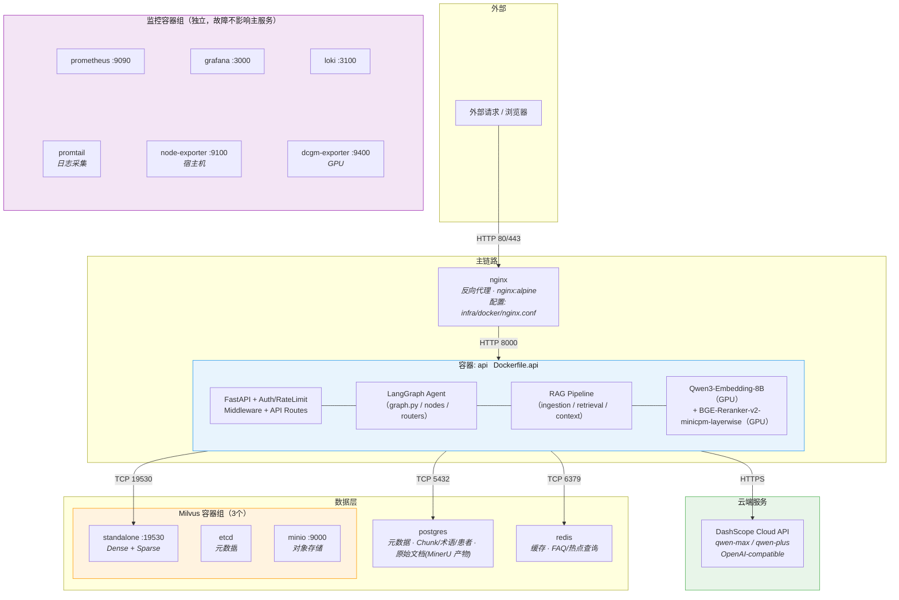
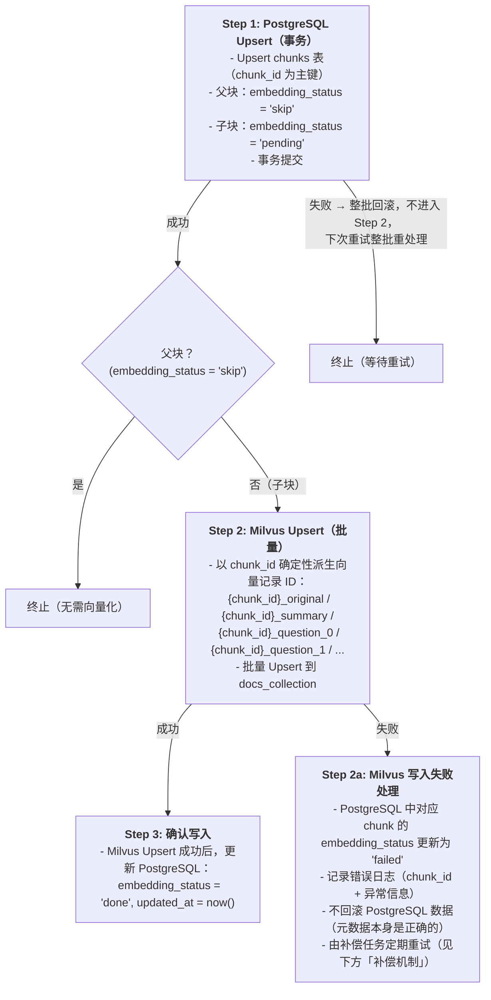
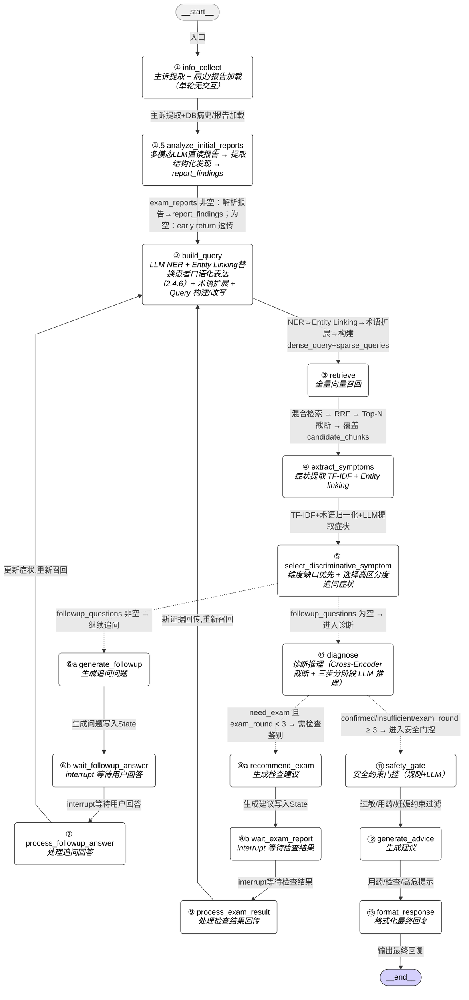
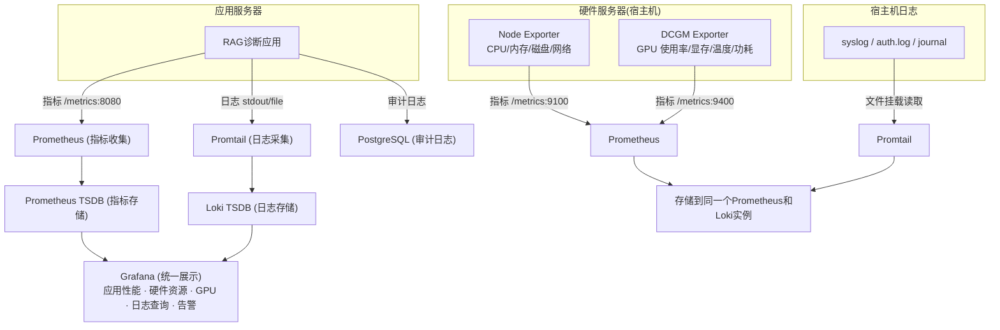
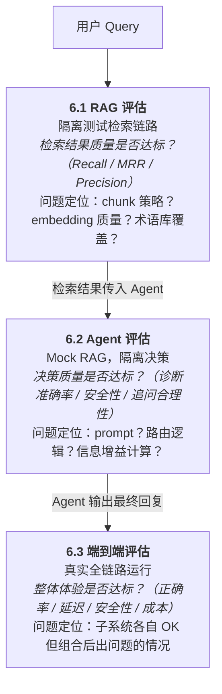

# 1. 项目总览

> 作者本地开发环境：CPU 9800X3D，GPU RTX 5070 Ti（16GB），RAM 48GB。文档中涉及"GPU 显存"的部署/选型决策均以此硬件为基准。

## 1.1 项目亮点：

开发过程使用了 Claude Code SKILL 进行自动开发、测试：在 `.claude/skills/` 中维护 `auto-coder` 与 `skill-creator` 等开发辅助技能，帮助规范驱动开发、自动化测试与打包。


深入实际业务场景，根据业务场景进行优化，听取了经验丰富主任医师的意见进行多次商讨


可观测、可视化管理、集成评估

## 1.2 目录
```
1. 项目总览
   1.1 项目亮点
   1.2 目录
   1.3 总体架构

2. 技术选型
   2.1 Embedding 模型选型
   2.2 Agent 及 RAG 系统模型选型
      2.2.1 理论选型
      2.2.2 选型测评结果
   2.3 Reranker 模型选型
   2.4 数据存储选型及具体设计
      2.4.1 Milvus 医学文献向量库
      2.4.2 PostgreSQL 元数据存储
      2.4.3 PostgreSQL 会话与对话记录
      2.4.4 原始文档存储：PostgreSQL raw_documents 表
      2.4.5 PostgreSQL 病人信息
      2.4.6 Milvus 术语向量库

3. RAG 系统 Pipeline
   3.1 数据摄取
      3.1.1 数据加载及处理（MinerU）
      3.1.2 Chunking
      3.1.3 Transform & Enrichment
      3.1.4 幂等性设计
      3.1.5 Embedding
      3.1.6 索引存储
   3.2 召回策略
      3.2.1 查询预处理（Query Processing）
      3.2.2 召回（Dense + Sparse + RRF 融合）
      3.2.3 精确过滤与重排

4. Agent 设计
   4.1 工作流（LangGraph StateGraph，16 节点 + 2 条件路由）
   4.2 上下文管理（Select + Compress 两层架构）

5. 基础设施
   5.1 性能优化层（Redis 缓存、连接池）
   5.2 监控层（Prometheus + Grafana + Loki + 审计系统）
   5.3 管理层（动态配置、权限系统）

6. 评估
   6.1 RAG 检索评估
   6.2 Agent 决策评估
   6.3 端到端系统评估
   6.4 三层评估的关系

7. Prompt 模板

8. 项目排期
   8.1 排期原则
   8.2 阶段总览
   8.3 详细排期
   8.4 进度跟踪表

9. 全局实现契约（跨章节，auto-coder 必读）
   9.1 统一机制（with_structured_output + 重试 + 分级失败处理）
   9.2 Schema 演进兼容性
   9.3 全量结构化输出清单
   9.4 不需要结构化输出的 LLM 调用
   9.5 全量 Pydantic Schema 定义
   9.6 审计埋点契约（rag_trace 写入规则）
   9.7 运行时常量集中（agent_limits）
   9.8 跨章节数据契约快速参考（terms_collection 等）
```

## 1.3 总体架构
### 1.3.1 项目文件目录结构
```
Agentic-RAG-Medical-care-Assistant/
│
├── docker-compose.yml                  # 容器编排（共 13 个）：nginx, api, Milvus（standalone+etcd+minio）, PostgreSQL, Redis, Prometheus, Grafana, Loki, Promtail, Node Exporter, DCGM Exporter（LLM 推理通过云端 API 调用）
├── .env.example                        # 环境变量模板（不提交 .env）
├── .gitignore
├── pyproject.toml                      # 项目依赖与构建配置
├── README.md
├── DEV_SPEC.md                         # 技术文档
│
├── config/                             # 静态配置文件
│   ├── settings.py                     # 全局配置（含模型配置 EmbeddingSettings/RerankerSettings/LLMSettings,从 .env 加载）
│   ├── milvus_schema.py                # Milvus Collection Schema 定义（docs_collection + terms_collection）
│   └── logging_config.py               # 日志格式与 Promtail 适配
│
├── src/
│   ├── __init__.py
│   │
│   ├── api/                            # API 网关 / 入口服务
│   │   ├── __init__.py
│   │   ├── app.py                      # FastAPI 应用入口
│   │   ├── routes/
│   │   │   ├── __init__.py
│   │   │   ├── diagnosis.py            # 问诊接口（POST /diagnose, 追问交互）
│   │   │   ├── auth.py                 # 登录注册（JWT）
│   │   │   ├── patient.py              # 患者信息 CRUD
│   │   │   ├── admin.py                # 管理员：知识库上传、配置修改
│   │   │   └── health.py               # 健康检查 & Prometheus /metrics
│   │   ├── middleware/
│   │   │   ├── __init__.py
│   │   │   ├── auth_middleware.py       # JWT 验证 + 角色判断（admin/patient）
│   │   │   └── rate_limiter.py         # 限流（防止 API 超配额）
│   │   └── schemas/                    # Pydantic 请求/响应模型
│   │       ├── __init__.py
│   │       ├── diagnosis_schema.py
│   │       └── patient_schema.py
│   │
│   ├── agent/                          # Agent 编排层（LangGraph StateGraph）
│   │   ├── __init__.py
│   │   ├── graph.py                    # StateGraph 定义：节点注册、边与条件边连接
│   │   ├── state.py                    # MedicalState Schema（Pydantic BaseModel）+ 嵌套 BaseModel + create_initial_state 工厂
│   │   ├── nodes/                      # 各节点实现
│   │   │   ├── __init__.py
│   │   │   ├── info_collect.py         # 节点 ①：主诉提取 + 病史/报告加载（单轮无交互）
│   │   │   ├── analyze_initial_reports.py  # 节点 ①.5：初始报告解析（多模态 LLM 直读，提取结构化发现）
│   │   │   ├── build_query.py          # 节点 ②：NER + Entity Linking + 术语扩展 + Query 构建/改写
│   │   │   ├── retrieve.py             # 节点 ③：全量向量召回
│   │   │   ├── extract_symptoms.py     # 节点 ④：症状提取（TF-IDF + 分层术语归一化，零 LLM）
│   │   │   ├── select_symptom.py       # 节点 ⑤：维度缺口优先 + 选择高区分度追问症状（信息增益）
│   │   │   ├── generate_followup.py    # 节点 ⑥a：生成追问问题
│   │   │   ├── wait_followup_answer.py # 节点 ⑥b：interrupt 等待用户回答
│   │   │   ├── process_followup.py     # 节点 ⑦：处理追问回答
│   │   │   ├── recommend_exam.py       # 节点 ⑧a：生成检查建议
│   │   │   ├── wait_exam_report.py     # 节点 ⑧b：interrupt 等待检查结果回传
│   │   │   ├── process_exam_result.py  # 节点 ⑨：处理检查结果回传
│   │   │   ├── diagnose.py             # 节点 ⑩：诊断推理（Cross-Encoder 截断 + 三步分阶段 LLM 推理）
│   │   │   ├── safety_gate.py           # 节点 ⑪：安全约束门控（规则+LLM）
│   │   │   ├── generate_advice.py      # 节点 ⑫：生成建议（用药/检查/高危提示）
│   │   │   └── format_response.py      # 节点 ⑬：格式化最终回复
│   │   ├── schemas/                    # LLM 结构化输出 Pydantic Schema（详见 §9.5）
│   │   │   ├── __init__.py
│   │   │   ├── info_collect.py         # InfoCollectOutput
│   │   │   ├── report_parser.py        # ReportFinding, ReportFindings
│   │   │   ├── ner.py                  # NEREntity, NERResult
│   │   │   ├── entity_linking.py       # EntityLinkingMatch, EntityLinkingResult
│   │   │   ├── query_construction.py   # QueryConstructionOutput
│   │   │   ├── symptom_selection.py    # DimensionSelection, AskabilityJudgment
│   │   │   ├── followup.py             # FollowupParseResult
│   │   │   ├── diagnosis.py            # HistoryFactor, SlotRelevance, ReportEvidence, CandidateEvidence, EvidenceSheet, RankedDisease, DiagnosisRanking, DiagnosisOutput
│   │   │   ├── safety_gate.py          # SafetyGateOutput
│   │   │   ├── advice.py               # AdviceOutput
│   │   │   ├── ingestion.py            # ChunkEnrichmentOutput
│   │   │   └── evaluation.py           # LLM Judge 评分 Schema
│   │   ├── utils/                      # Agent 层共享工具
│   │   │   └── report_parser.py        # 报告解析共享逻辑（多模态 LLM 直读 + 结构化发现提取，①.5 和 ⑨ 共用）
│   │   └── routers/                    # 条件边路由逻辑
│   │       ├── __init__.py
│   │       ├── should_continue.py      # 追问/诊断 两路路由
│   │       └── diagnose_router.py      # 诊断后路由（need_exam / safety_gate）
│   │
│   ├── rag/                            # RAG 系统 Pipeline
│   │   ├── __init__.py
│   │   ├── ingestion/                  # 3.1 数据摄取
│   │   │   ├── __init__.py
│   │   │   ├── mineru_loader.py        # 3.1.1 MinerU 产物加载（读取 markdown + content_list）
│   │   │   ├── chunking.py             # 3.1.2 父子分块：目录权威清单 + 节内三遍切【】+(一)+1. + size 驱动子块切
│   │   │   ├── enrichment.py           # 3.1.3 LLM 增强（title/summary/questions；tags 已废弃 2026-05）
│   │   │   ├── idempotency.py          # 3.1.4 幂等性：source_id / heading_path_id / chunk_id（含父块 "parent" 约定）/ content_hash
│   │   │   ├── embedding.py            # 3.1.5 多向量 Embedding（Dense: Qwen3-Embedding-8B, Sparse: Milvus BM25）
│   │   │   ├── storage.py              # 3.1.6 写入 PostgreSQL + Milvus（含僵尸清理）
│   │   │   └── pipeline.py             # 完整摄取 Pipeline 编排（串联以上步骤）
│   │   │
│   │   ├── retrieval/                  # 3.2 召回策略
│   │   │   ├── __init__.py
│   │   │   ├── query_processing.py     # 3.2.1 查询预处理（指代消歧、关键词提取、术语扩展、多角度改写）
│   │   │   ├── sparse_retriever.py     # 3.2.2 Sparse Route（Milvus BM25 全文检索）
│   │   │   ├── dense_retriever.py      # 3.2.2 Dense Route（单次 ANN）
│   │   │   ├── fusion.py               # 3.2.2 单阶段多路 RRF 融合 + 多向量聚合
│   │   │   └── reranker.py             # 3.2.3 Cross-Encoder 精排（diagnose ⑩ 前置截断，非检索阶段调用 / 回退策略）
│   │   │
│   │   └── context/                    # Agent 上下文管理（4.2）
│   │       └── __init__.py             # 当前固定流程下无需独立 compact/select 节点（见 4.2.4 / 4.2.5），上下文管理逻辑内嵌于各业务节点；compressor.py / selector.py 为未来开放式交互场景预留，阶段一不实现
│   │
│   ├── models/                         # 模型推理层
│   │   ├── __init__.py
│   │   ├── llm_client.py              # LLM 推理客户端（DashScope OpenAI-compatible API）
│   │   ├── embedding_model.py         # Qwen3-Embedding-8B（GPU 推理，INT8）
│   │   └── reranker_model.py          # BGE-Reranker-v2-minicpm-layerwise（GPU 推理，与 Embedding 共享显卡）
│   │
│   ├── db/                            # 数据与缓存层
│   │   ├── __init__.py
│   │   ├── postgres/
│   │   │   ├── __init__.py
│   │   │   ├── connection.py           # PostgreSQL 连接池
│   │   │   ├── models.py               # ORM 模型（sources, raw_documents, chunks, users, patients, conversations 等）
│   │   │   ├── metrics.py              # SQLAlchemy 事件订阅 → Prometheus Histogram（依赖层指标，§5.2.1 ③）
│   │   │   └── migrations/             # 数据库迁移脚本（Alembic）
│   │   │       └── ...
│   │   ├── milvus/
│   │   │   ├── __init__.py
│   │   │   ├── connection.py           # Milvus 连接管理
│   │   │   ├── client.py               # 统一调用封装 + Prometheus Histogram（依赖层指标，§5.2.1 ③）
│   │   │   ├── docs_collection.py      # 医学文献向量库操作（2.4.1）
│   │   │   └── terms_collection.py     # 术语向量库操作（2.4.6）
│   │   └── redis/
│   │       ├── __init__.py
│   │       └── cache.py                # Redis 缓存（仅配置缓存，MVP 阶段不做 RAG 响应缓存，见 §5.1）
│   │
│   ├── prompts/                       # LLM Prompt 模板
│   │   ├── __init__.py
│   │   ├── ingestion.py               # 数据摄取增强 Prompts（title/summary/hypothetical_questions；tags 已废弃 2026-05）
│   │   ├── agent.py                   # Agent 节点 Prompts（病史采集、Query 构建、追问、诊断、安全门控、建议生成）
│   │   └── evaluation.py              # LLM Judge 评估 Prompts
│   │
│   └── common/                        # 公共工具
│       ├── __init__.py
│       ├── normalize.py               # 文本规范化函数（全角转半角、NFC 等，见 3.1.4.2）
│       ├── hashing.py                 # SHA256 工具（chunk_id、content_hash、heading_path_id）
│       └── metrics.py                 # Prometheus 指标埋点
│
├── terms/                             # 术语库构建脚本(项目内代码;原始数据走数据卷,见目录树后说明)
│   └── build_icd10.py                 # ICD-10 灌库脚本(→ terms_collection)
│                                      # CMeSH 等其他术语来源 YAGNI,按需补
│
├── evaluation/                        # 6. 评估系统
│   ├── __init__.py
│   ├── datasets/                      # 测试集（JSON/JSONL）
│   │   ├── rag_eval.jsonl             # RAG 检索质量测试集
│   │   └── agent_eval.jsonl           # Agent 决策测试集（L1-L5 梯度）
│   ├── offline/
│   │   ├── rag_evaluator.py           # RAG 离线评估（召回率、准确率）
│   │   ├── agent_evaluator.py         # Agent 离线评估（轨迹、工具调用、容错）
│   │   └── llm_judge.py               # LLM Judge 评分
│   └── online/
│       └── tracing.py                 # 在线追踪（端到端延时、Token 统计）
│
├── infra/                             # 基础设施配置
│   ├── docker/
│   │   ├── Dockerfile.api             # API 服务镜像（FastAPI + Agent + RAG + Embedding + Reranker）
│   │   └── nginx.conf                 # Nginx 反向代理配置
│   ├── prometheus/
│   │   └── prometheus.yml             # Prometheus 采集配置
│   ├── grafana/
│   │   └── dashboards/               # Grafana 仪表盘 JSON
│   ├── loki/
│   │   └── loki-config.yml
│   └── promtail/
│       └── promtail-config.yml
│
├── scripts/                           # 运维脚本
│   ├── init_db.py                     # 初始化 PostgreSQL 表结构 + 索引
│   ├── init_milvus.py                 # 初始化 Milvus Collection + 索引
│   ├── ingest.py                      # 文档摄取入口（调用 rag.ingestion.pipeline）
│   └── batch_parse_pdfs.sh            # 批量 mineru 解析 raw-pdf/ 下所有 PDF(幂等,跳过已完成)
│
└── tests/
    ├── unit/
    │   ├── test_normalize.py
    │   ├── test_hashing.py
    │   ├── test_chunking.py
    │   └── test_fusion.py
    ├── integration/                    # Mock LLM + Mock DB 的模块集成测试
    │   ├── test_ingestion_pipeline.py
    │   ├── test_retrieval.py
    │   └── test_agent_workflow.py
    └── e2e/                            # 真实 DashScope + 真实 Milvus/PG 的端到端冒烟（阶段 J）
        ├── test_ingestion_e2e.py       # J1
        ├── test_retrieval_e2e.py       # J2
        ├── test_agent_workflow_e2e.py  # J3
        └── test_api_e2e.py             # J4
```

> 本节只描述项目目录(代码)。原始数据、模型权重、解析产物等本机路径全部由 `.env` 配置,见 `.env.example`,spec 不重复列出。

### 1.3.2 目录与文档章节对应关系

| DEV_SPEC 章节 | 对应目录 |
|---|---|
| 2.1 Qwen3-Embedding-8B 模型 | `src/models/embedding_model.py` |
| 2.2 云端 LLM API（DashScope） | `src/models/llm_client.py` |
| 2.3 BGE-Reranker-v2-minicpm-layerwise 精排模型 | `src/models/reranker_model.py` |
| 2.4.1 Milvus 医学文献向量库 | `src/db/milvus/docs_collection.py` |
| 2.4.2 PostgreSQL 元数据存储 | `src/db/postgres/` |
| 2.4.3 PostgreSQL 会话与对话记录 | `src/db/postgres/models.py` → sessions / conversations |
| 2.4.4 原始文档存储 raw_documents 表 | `src/db/postgres/models.py`（raw_documents ORM 类） |
| 2.4.5 PostgreSQL 病人信息 | `src/db/postgres/models.py` → patients 等 |
| 2.4.6 Milvus 术语向量库 | `src/db/milvus/terms_collection.py` + `terms/` |
| 3.1.1 MinerU 数据加载 | `src/rag/ingestion/mineru_loader.py` |
| 3.1.2 Chunking | `src/rag/ingestion/chunking.py` |
| 3.1.3 Transform & Enrichment | `src/rag/ingestion/enrichment.py` |
| 3.1.4 幂等性设计 | `src/rag/ingestion/idempotency.py` + `src/common/hashing.py` |
| 3.1.5 Embedding | `src/rag/ingestion/embedding.py` |
| 3.1.6 索引存储 | `src/rag/ingestion/storage.py` |
| 3.2.1 查询预处理 | `src/rag/retrieval/query_processing.py` |
| 3.2.2 召回（Dense + Sparse + RRF） | `src/rag/retrieval/` |
| 3.2.3 Cross-Encoder 精排（diagnose ⑩ 前置） | `src/rag/retrieval/reranker.py` |
| 4.1 Agent 工作流（16 节点 + 2 路由） | `src/agent/graph.py` + `nodes/`（①~⑬ 含 ①.5，⑥/⑧ 各拆 a/b）+ `routers/`（should_continue / diagnose_router） |
| 4.2 上下文管理 | `src/rag/context/` |
| 5.1 Redis 缓存 | `src/db/redis/cache.py` |
| 5.2 监控层 | `infra/prometheus/` + `infra/grafana/` + `infra/loki/` |
| 5.2.3 PostgreSQL 审计系统 | `src/db/postgres/models.py` → rag_trace / kb_change_log / config_change_log / diagnosis_feedback |
| 5.3 动态配置管理 | `src/db/postgres/models.py` → system_config |
| 5.3 权限与配置 | `src/api/middleware/` + `src/db/postgres/` |
| 6. 评估系统 | `evaluation/` |
| 7. Prompt 模板 | `src/prompts/` |
| 9. 全局实现契约（跨章节） | `src/agent/schemas/`（Pydantic Schema 权威定义）+ `src/common/metrics.py`（模块级 Prometheus 指标对象 + `RetryObserver` callback，**不含装饰器/helper 封装**）；规则贯穿 3/4/6/7 章所有 LLM 调用实现，各调用点按 §9.1 模板裸写 |

### 1.3.3 项目层级

#### 逻辑层级说明

**客户端层**

- Nginx 反向代理（`infra/docker/nginx.conf`），暴露 REST 接口
- 认证中间件（`src/api/middleware/auth_middleware.py`）与限流中间件（`src/api/middleware/rate_limiter.py`），防止 API 超配额，确保系统稳定

**API 服务层**（含 Agent 编排、RAG、Embedding/Reranker，同进程内调用）

- FastAPI 应用（`src/api/app.py`），提供诊断、患者管理、健康检查、管理等路由
- 请求/响应 Schema 校验（`src/api/schemas/`）
- 状态图驱动的多步诊断流程（`src/agent/graph.py`），基于信息增益收敛的迭代式工作流
- 节点（16 个）：病史采集、初始报告解析、Query 构建、向量召回、症状提取、区分度选择、追问生成（⑥a）、追问等待（⑥b）、追问处理、建议检查（⑧a）、检查结果等待（⑧b）、检查结果处理、诊断推理、安全约束门控、建议生成、格式化回复（`src/agent/nodes/`）
- 路由器（2 个）：should_continue（追问/诊断两路路由）、diagnose_router（诊断后路由：need_exam / safety_gate）（`src/agent/routers/`）
- 数据摄取 Pipeline：MinerU 文档解析 → Chunking → LLM 增强（摘要/问题生成/图片描述） → 幂等写入 → Embedding → 向量存储（`src/rag/ingestion/`）
- 检索 Pipeline：查询处理 → Dense/Sparse 双路检索 → RRF 融合（`src/rag/retrieval/`）
- 上下文管理：上下文筛选与压缩（`src/rag/context/`）
- Embedding 推理：Qwen3-Embedding-8B，GPU 推理（INT8），与 Reranker 共享显卡（`src/models/embedding_model.py`）
- Reranker 推理：BGE-Reranker-v2-minicpm-layerwise，GPU 推理，与 Embedding 共享显卡（`src/models/reranker_model.py`）

> **设计决策**：Agent/RAG 为 Python 函数调用，与 FastAPI 运行在同一进程内，无需跨容器网络通信。Embedding 和 Reranker 通过 Python 直接调用 GPU，合并进 `api` 容器可避免不必要的 HTTP 延迟，同时简化部署与调试。

**LLM 推理层（云端 API）**

- LLM 推理：通过 OpenAI-compatible API 调用（`src/models/llm_client.py`）
- 云端方案：DeepSeek-V3 / Qwen-Max 等，GPU 显存全部释放给 Embedding + Reranker

> **设计决策**：LLM 推理迁移至云端后，RTX 5070 Ti 16GB 显存全部分配给 Embedding（Qwen3-Embedding-8B，INT8 约 8.5-8.8GB）和 Reranker（BGE-Reranker-v2-minicpm-layerwise，INT8 约 2.6GB），大幅提升检索质量和推理速度。

**数据与缓存层**

- 向量存储：Milvus（Dense + Sparse 向量，容器化部署，由 `milvus-standalone` + `milvus-etcd` + `milvus-minio` 三个容器组成）（`src/db/milvus/`）
- 元数据存储：PostgreSQL（Chunk 元数据、来源文档、医学术语等）（`src/db/postgres/`）
- 原始文档存储：PostgreSQL `raw_documents` 表（MinerU 解析后的原始文档，与 `sources` 同库）（`src/db/postgres/`）
- 缓存：Redis（FAQ、热点查询等）（`src/db/redis/`）

**日志与监控层**

- 指标采集与告警：Prometheus（`infra/prometheus/`）
- 可视化面板：Grafana（`infra/grafana/`）
- 日志收集：Loki + Promtail（`infra/loki/`、`infra/promtail/`）
- 应用指标埋点（`src/common/metrics.py`）

**基础设施层（本地部署）**

- 容器编排：Docker Compose（`docker-compose.yml`）
- 容器镜像：API 服务使用自定义 Dockerfile（`infra/docker/Dockerfile.api`）构建；LLM 推理通过 DashScope 云端 API 调用，无需本地容器
- 存储：本地磁盘
- 密钥管理：环境变量配置（`.env.example`）

---

#### 容器划分总览



容器清单（共 14 个）：
- **主链路**：nginx → api（LLM 推理通过 DashScope 云端 API 调用，不占本地容器）
- **数据层**：milvus-standalone、milvus-etcd、milvus-minio、postgres、redis
- **监控层**：prometheus、grafana、loki、promtail、node-exporter、dcgm-exporter

# 2 技术选型：
本项目选型使用大模型的时间为2026/3/6
## 2.1 Embedding 模型选型

Embedding 模型负责将文本转换为向量，用于粗排召回。医学场景对 Embedding 精度的要求远高于通用场景：术语歧义多（"MI"可指心肌梗死或二尖瓣关闭不全）、近义表达丰富（患者口语 vs 临床术语）、细粒度语义区分关键（"左心衰"vs"右心衰"、"急性"vs"慢性"）。参数量不足的模型无法在有限维度的向量空间中编码这些细微差异，导致语义塌缩——即把临床上不同的概念压成接近的向量，直接损害召回质量。

### 选型结论：Qwen3-Embedding-8B（Qwen/Qwen3-Embedding-8B），部署于 GPU

#### 选型理由

1. **8B 参数量，医学语义容量充足**：8B 参数基于 Qwen LLM 架构（decoder-based），相比传统 encoder 模型（如 BGE-M3 的 568M），语义编码容量提升一个数量级。更大的参数量意味着模型能在向量空间中为医学术语的细粒度差异分配足够的表征空间，避免语义塌缩。C-MTEB 总分 73.84，远超 BGE-M3 的 ~66-67。

2. **Qwen 底座，中文医疗预训练充分**：Qwen 系列在中文语料（含医学文献、临床指南、药品说明书等）上的预训练规模远超 BAAI 的 encoder 系列模型。与本项目 LLM 选型（Qwen 系列）同源，tokenizer 一致，对中文医学术语的分词方式相同，粗排→精排之间语义对齐更好。

3. **超长上下文支持（32,768 tokens）**：医疗指南的 Chunk 可能较长，32K 上下文窗口能完整编码长段落语义，无需担心截断丢失关键信息。

4. **高维向量（4096 维）**：输出 4096 维 Dense 向量，向量空间容量大，为医学术语的精细区分提供更充裕的表征维度。本项目的 Collection Schema（见 2.4.1）中 `dense_vector` 字段需相应调整为 4096 维。

5. **Sparse 路由不受影响**：本项目的 Sparse 检索采用 Milvus 内置 BM25 全文检索（见 3.2.2），与 Embedding 模型无关，Qwen3-Embedding-8B 专注 Dense 编码，职责清晰。


虽然本项目已有多向量表示（original + summary + question）、混合检索（Dense + BM25）、Reranker 精排等多层机制提升召回质量，但这些机制**无法弥补粗排阶段的根本性召回缺失**——如果 Embedding 模型因语义容量不足而未能将正确文档召回到候选集中，后续的 Reranker 和融合策略再强也无从精排。在医学场景中，漏召一篇关键指南可能直接影响诊断建议的完整性和安全性，因此 Embedding 环节值得投入更大参数量的模型。

#### 部署策略：GPU 推理（RTX 5070 Ti 16GB）

LLM 推理通过云端 API 调用（见 2.2），GPU 显存全部分配给 Embedding 和 Reranker，部署策略如下：

- **INT8 量化部署**：8B 模型 INT8 量化后显存占用约 8.5-8.8GB，RTX 5070 Ti 16GB 可轻松容纳，剩余显存供 Reranker（INT8 约 2.6GB）使用。
- **离线 Embedding（文档入库）**：GPU 推理速度远快于 CPU，批量入库效率大幅提升，无需安排夜间错峰执行。
- **在线 Query Embedding（实时查询）**：GPU 推理延迟极低（单条 Query 通常 <10ms），用户体验优于 CPU 方案。
- **与 Reranker 共享 GPU**：Embedding 和 Reranker 负载天然错峰（Embedding 在入库时批量执行，Reranker 在查询时实时执行），可共享 GPU 资源，无需额外硬件。

#### 其他候选模型排除理由

| 候选模型 | 排除原因 |
|---------|---------|
| **BGE-M3（568M）** | 参数量不足，医学场景语义编码能力有限，C-MTEB 检索分数落后约 10 个点 |
| **Conan-embedding-v2（1.48B）** | 传统 encoder 架构，参数量虽大于 BGE-M3 但仍有限；腾讯生态，社区资源和文档不如 Qwen；C-MTEB 检索分 78.31 虽高但为 encoder 天花板 |
| **Qwen3-Embedding-4B** | C-MTEB 72.26，与 8B 差 1.5 分；显存节省有限（INT8 约 4-5GB vs 8-10GB），在 16GB 显卡上无需为省这点显存牺牲模型能力 |
| **Qwen3-Embedding-0.6B** | 参数量与 BGE-M3 相当（0.6B vs 0.568B），C-MTEB 66.33 无本质提升，不解决核心问题 |
| **Seed1.6-Embedding（字节）** | API only，无法本地部署；入库批量调用成本累积；API 模型升级后向量不兼容需全量重索引；医疗数据外传存在合规风险 |
| **云端 Embedding API（通用）** | 同上，且引入网络延迟和外部依赖；Embedding 需要与 Reranker 共享 GPU，本地部署更简洁高效 |

## 2.2 Agent 及 RAG 系统模型选型（云端 API）

### 2.2.1 选型结论：Qwen 系列云端 API（阿里云 DashScope）

**选型结论：`qwen-max`（首选）/ `qwen-plus`（备选）**，通过阿里云 DashScope OpenAI-compatible 接口调用。

#### 选型理由

**1. 与 Embedding 模型同族系，构成完整 Qwen 生态**

本项目 Embedding 选型为 Qwen3-Embedding-8B（见 2.1），与 Qwen 系列 LLM 共享以下底层一致性：

- **Tokenizer 完全相同**：Qwen 全系列使用同一套 tiktoken BPE 分词器。医学术语（如"氨氯地平片"、"急性心肌梗死"）在 Embedding 阶段和 LLM 推理阶段的分词结果完全一致，避免跨模型族系时 token 边界不对齐的问题。
- **预训练数据对齐**：Embedding 模型和 LLM 在相同的中文医疗语料（包括医学文献、临床指南、药典等）上预训练，二者对同一医学概念的"理解"处于同一语义空间。RAG 检索回来的 chunk 直接注入 LLM context，语义摩擦极小，LLM 能高效利用检索内容。
- **指令式 Embedding 对齐**：Qwen3-Embedding-8B 支持 task instruction（如 `"Represent this medical query for retrieval:"`），可让 Embedding 的向量表征方向与 Qwen LLM 的 query 理解方式进一步对齐，提升粗排召回的相关性。

**2. GPU 显存全部分配给 Embedding 和 Reranker**

本项目硬件为 RTX 5070 Ti（16GB 显存）。LLM 通过云端 API 调用，GPU 显存全部释放给 Qwen3-Embedding-8B（INT8 约 8.5-8.8GB）和 BGE-Reranker-v2-minicpm-layerwise（INT8 约 2.6GB），合计约 11.1-11.4GB，留有充足余量应对推理激活值与显存碎片，检索质量和精排速度大幅提升。

**3. 接口完全 OpenAI-compatible，代码简洁**

DashScope 提供 OpenAI-compatible 接口，通过环境变量配置即可切换模型，`src/models/llm_client.py` 业务代码无需改动。

#### 云端 Qwen 模型对比

| 模型 | 定位 | 适用场景 |
|---|---|---|
| **qwen-max**（首选） | 旗舰，推理能力最强 | 复杂诊断推理、多轮追问、用药安全判断；支持 thinking 模式 |
| **qwen-plus**（备选） | 均衡，成本低约 60% | 成本敏感场景，常见问诊、症状分析 |
| qwen-turbo | 极速低成本 | 不适合本场景，医疗推理质量不足 |

#### 接口配置

```env
LLM_BASE_URL=https://dashscope.aliyuncs.com/compatible-mode/v1
LLM_API_KEY=sk-xxx
LLM_MODEL_NAME=qwen-max
```

### 2.2.2 选型测评结果

具体的测评方式在第 6 部分有详细介绍，本节陈述最终结果。

云端 `qwen-max` 直接采用，无需本地测评流程。若后续成本压力较大，可在 `qwen-max` 与 `qwen-plus` 之间通过以下维度进行业务场景对比：诊断准确率、追问合理性、用药安全判断、结构化输出稳定性。

> 在本项目中，作者没有高质量的标注数据，微调暂不计划。厂商已做过 DPO/RLHF 对齐；若出现持续的有害输出或不期望行为，可考虑少量 DPO 对齐。


## 2.3 reranker模型选型
Rerank 模型则是对召回的候选文档做精排。通常是 cross-encoder 架构——将 query 和 document 拼接在一起输入模型，直接输出一个相关性分数。因为 query 和 document 之间有充分的交互注意力，所以精度更高，但计算成本也更大，不适合直接用于全量检索，只适合对少量候选（比如 top-20 到 top-100）重新排序。

### 选型结论：BGE-Reranker-v2-minicpm-layerwise（BAAI/bge-reranker-v2-minicpm-layerwise），部署于 GPU

#### 选型理由

1. **中文医疗场景精度最高**：基座为 MiniCPM-2B（清华 & 面壁智能），中文预训练语料充分，对 ICD-10、SNOMED CT 等医学术语的理解能力显著优于 XLM-RoBERTa 基座的 v2-m3。在 C-MTEB Reranking 中文子集上得分明显领先同系列其他型号。同时支持中英双语，可覆盖英文医学文献的精排需求。

2. **Cross-Encoder 架构，2.4B 参数量精排精度高**：作为 cross-encoder，将 query 和 document 拼接后做全注意力交互，精度远高于 Embedding 的 bi-encoder 相似度。2.4B 参数量相比 v2-m3 的 568M 提升一个量级，语义判别能力更强。即使粗排（Embedding）和精排（Reranker）来自不同模型族系（Qwen vs BAAI），cross-encoder 的全交互机制天然弥补了这一差异——Reranker 独立判断 query-doc 相关性，不依赖粗排阶段的向量表征。

3. **Layerwise 推理，精度与速度连续可调**：模型在每一层都训练了分类头，可通过 `cutoff_layers` 参数选择从第 N 层提前提取分数，而非必须跑完全部 28 层。全层推理获得最高精度；截断至前 20 层可在精度损失极小的情况下提速约 30%。这为生产环境提供了灵活的精度-延迟调节旋钮。

4. **长上下文支持（8192 tokens）**：医疗指南的 Chunk 可能较长，8192 token 窗口确保 query-document 对的完整交互，不会因截断丢失精排信息。

#### 部署策略：GPU 推理，与 Embedding 模型共享显卡

本项目 LLM 迁移至云端 API 后（见 2.2），RTX 5070 Ti 16GB 显存由 Embedding 模型（Qwen3-Embedding-8B，INT8 约 8.5-8.8GB）和 Reranker 共享：

- **二者不会同时高负载**：Embedding 在文档入库时批量执行，Reranker 在用户查询时实时执行，负载天然错峰。
- **INT8 量化部署，显存安全**：2.4B 参数 INT8 量化后约 2.6GB，与 Embedding 模型合计约 11.1-11.4GB，16GB 显卡余量约 4.6-4.9GB，充分覆盖推理激活值（~0.5-1GB）、CUDA 固定开销（~0.5-0.8GB）和显存碎片。采用 FP16（~4.8GB）会导致合计 13.3-13.6GB，在双模型同时推理时存在 OOM 风险，因此不采用。
- **INT8 对精排精度影响极小**：Reranker 输出的是用于排序的相对分数而非生成文本，对量化精度损失不敏感。
- **GPU 推理速度优秀**：20 个 query-doc pair 精排延迟约 40-80ms（全层），使用 layerwise 截断可进一步降至 30-60ms，用户体验良好。
- **候选量有限**：精排仅处理 RRF 融合后的 Top-20 候选（见 3.2.3），不涉及大批量计算。

#### 备选方案与排除理由

| 备选模型 | 排除原因 |
|---------|---------|
| **Cohere Rerank** | 闭源云端 API，医疗数据外传存在合规风险；引入外部依赖影响系统稳定性 |
| **LLM Rerank（Qwen 自身做精排）** | 会抢占推理模型的 GPU 资源和推理队列，增加端到端延迟；结构化输出不如 cross-encoder 稳定；成本高于专用 Reranker |
| **BGE-Reranker-v2-m3** | 568M 参数量，精排精度低于 v2-minicpm-layerwise；项目显存充足（剩余 5-6GB），无需为节省显存牺牲精度 |
| **BGE-Reranker-v2-gemma** | 基于 Gemma 2B，英文预训练为主，中文医疗术语理解不如 MiniCPM 基座；无 layerwise 灵活性 |
| **BGE-Reranker-large（v1）** | 旧版本，中文能力和长上下文支持不如 v2 系列，最大输入仅 512 tokens，无法覆盖本项目的长 Chunk 场景 |

#### 与系统架构的衔接

- **输入**：RRF 融合 + 多向量聚合后的 Top-M 候选（见 3.2.2），每条候选为 [query, original_content] 对
- **输出**：相关性分数排序后的 Top-K 结果，传给 LLM 生成诊断
- **回退机制**：Reranker 超时或不可用时，直接返回 RRF Top-K，确保系统可用性（见 3.2.3 回退策略）
- **Layerwise 配置**：生产环境默认使用全层推理（28 层）以获得最高精度；可通过配置 `cutoff_layers` 参数在延迟敏感场景下切换至截断模式

## 2.4 数据存储选型及具体设计：
### 2.4.1. 原始文档向量化的向量库：Milvus

每个 Chunk 在 Milvus 中对应 4~5 条向量记录（1 original + 1 summary + 2~3 question）：

| vector_type | id 规则 | Dense (Qwen3-Embedding-8B) | BM25 全文检索 | 说明 |
|-------------|---------|:-----:|:------:|------|
| `original` | `{chunk_id}` | ✅ | ✅ | 原文向量 + 全文索引，支持语义检索与关键词检索 |
| `summary` | `{chunk_id}_summary` | ✅ | ❌ | 摘要向量，提升对模糊 query 的匹配能力 |
| `question` | `{chunk_id}_q{n}` | ✅ | ❌ | 问题向量，弥合患者口语与临床文本的语义鸿沟 |

summary / question 记录不参与 BM25 全文检索——关键词匹配应基于原文，而非 LLM 改写文本，避免语义漂移。BM25 由 Milvus 2.4+ 内置全文检索引擎承担，基于 `original_content` 字段建立倒排索引，无需 Embedding 模型输出 Sparse 向量。

**Milvus Collection Schema**：

```
{
    "id":               str,             # 本条记录唯一 ID（见上表）
    "source_chunk_id":  str,             # 所属原始 chunk_id（original 记录与 id 相同）
    "vector_type":      str,             # "original" | "summary" | "question"
    "dense_vector":     List[float],     # Qwen3-Embedding-8B 语义向量，4096 维（所有记录均有）
    "text_for_bm25":    str,             # BM25 全文检索字段（仅 original 有值，summary/question 存空串；Milvus 2.4+ 自动建立倒排索引）
    "original_content": str,             # 原始 chunk 文本，冗余存储，命中后无需回查 PostgreSQL
    "source_id":        str,             # Pre-filter 字段：按来源文档过滤（见 2.4.2 sources 表）
    "tags":             List[str]        # Pre-filter 字段：按主题过滤
}
```

`title`、`heading_path` 等展示字段不在 Milvus 冗余，检索命中后以 `source_chunk_id` 回查 PostgreSQL `chunks` 表获取。


 ### 2.4.2. 元数据存储：PostgreSQL

PostgreSQL 负责存储所有 Chunk 的结构性元数据与增强元数据，支撑幂等写入、僵尸清理、增量 Embedding 判断及检索结果的上下文还原。向量数据本身存储于 Milvus，PostgreSQL 不存储向量。

**sources 表**（来源文档注册表，source_id 的权威来源）

```sql
sources (
  source_id    TEXT PRIMARY KEY,          -- 文档唯一 ID（见 3.1.4.1）
  file_name    TEXT NOT NULL,             -- 原始文件名
  file_path    TEXT,                      -- 文件存储路径
  doc_type     VARCHAR(50),               -- 文档类型，如 guideline / textbook / protocol
  created_at   TIMESTAMPTZ NOT NULL DEFAULT now(),
  updated_at   TIMESTAMPTZ NOT NULL DEFAULT now()
)
```

**chunks 表**（Chunk 元数据核心表）

```sql
chunks (
  -- 幂等性字段（见 3.1.4）
  chunk_id              TEXT PRIMARY KEY,   -- SHA256(source_id:heading_path_id:relative_chunk_index)
  source_id             TEXT NOT NULL REFERENCES sources(source_id),
  heading_path_id       TEXT NOT NULL,      -- SHA256(H1_id:H2_id:...) 标题路径哈希
  heading_path          TEXT NOT NULL,      -- 人类可读标题路径，如 "第2章 > 2.1 > 3.1.4"，用于检索结果展示
  relative_chunk_index  TEXT NOT NULL,      -- 同标题路径下的块序号；子块用 "0/1/2..."，父块用 "parent"，图表 chunk 用 "{chunk_type}:p{page_idx}_b{block_idx}" / "{chunk_type}_summary:p{page_idx}_b{block_idx}"（见 §3.1.4.2 步骤 3 图表 chunk 约定）
  parent_chunk_id       TEXT REFERENCES chunks(chunk_id),
                                            -- 父块 ID（Small-to-Big 父子索引，见 3.1.2）；NULL 表示本块即为顶层父块
  chunk_type            VARCHAR(20) NOT NULL DEFAULT 'child',
                                            -- parent / child / table / table_summary / chart / chart_summary / figure / figure_summary
                                            -- 详见 3.1.2 图表/影像处理章节
  linked_chunk_id       TEXT REFERENCES chunks(chunk_id),
                                            -- summary chunk 反指源 chunk(table_summary→table 等)；NULL 表示非 summary chunk
                                            -- 注:与 Milvus payload 的 source_chunk_id (2.4.1) 是不同字段,后者是 Milvus 向量回 PG 的指针,本字段是 PG 内 chunk-to-chunk 的关联
  image_path            TEXT,               -- 图表截图相对路径(table/chart/figure chunk 用)；NULL 表示非图表 chunk
  sub_type              VARCHAR(20),        -- mineru sub_type(figure chunk 用，如 'flowchart')；NULL 表示非 image 来源 chunk
  chunk_raw_text        TEXT NOT NULL,      -- Chunk 原始文本(figure 类是 mermaid 全文；figure_summary 类是 LLM 生成的医学陈述)
  content_hash          TEXT NOT NULL,      -- SHA256(chunk_raw_text)，变动检测信号（见 3.1.4.3）

  -- LLM 增强字段（见 3.1.3）
  title                 TEXT,              -- LLM 生成的精准小标题
  summary               TEXT,             -- LLM 生成的内容摘要，同时作为摘要向量文本来源（见 3.1.5）
  tags                  TEXT[],           -- LLM 生成的主题标签数组
  hypothetical_questions TEXT[],          -- LLM 生成的假设性问题数组（2~3 条，见 3.1.5）

  -- 运维状态字段
  embedding_status      VARCHAR(20) NOT NULL DEFAULT 'pending',
                                          -- pending / done / failed / skip / bm25_only
                                          -- pending：待 Embedding；done：向量已写入 Milvus；failed：Milvus 写入失败待补偿
                                          -- skip：父块专用，永不向量化(见 3.1.2 父子索引)
                                          -- bm25_only：源 chunk(table/chart/figure)只挂 BM25 sparse 不进 dense Milvus(见 3.1.2 图表处理)
  created_at            TIMESTAMPTZ NOT NULL DEFAULT now(),
  updated_at            TIMESTAMPTZ NOT NULL DEFAULT now()
)
```

**索引**

```sql
CREATE INDEX idx_chunks_source_id        ON chunks (source_id);           -- 僵尸清理差集查询
CREATE INDEX idx_chunks_heading_path_id  ON chunks (heading_path_id);     -- 按标题路径聚合查询
CREATE INDEX idx_chunks_content_hash     ON chunks (content_hash);        -- 跨文档内容去重
CREATE INDEX idx_chunks_embedding_status ON chunks (embedding_status)     -- 增量 Embedding 任务扫描
  WHERE embedding_status NOT IN ('done', 'skip', 'bm25_only');
CREATE INDEX idx_chunks_parent_chunk_id  ON chunks (parent_chunk_id)      -- 僵尸清理按父块分拣子块（见 3.1.4.3）
  WHERE parent_chunk_id IS NOT NULL;
CREATE INDEX idx_chunks_linked_chunk_id  ON chunks (linked_chunk_id)      -- summary chunk 命中后反查源 chunk
  WHERE linked_chunk_id IS NOT NULL;
CREATE INDEX idx_chunks_chunk_type       ON chunks (chunk_type);          -- 按 chunk 类型聚合查询(图表/正文等)
```

> `heading_path`（明文）与 `heading_path_id`（哈希）同时存储：后者用于 chunk_id 推导，前者用于检索结果展示来源标题，职责不同，不可合并。

### 2.4.3. 对话与会话记录：PostgreSQL

**sessions 表**（会话管理，串联同一患者的一次完整问诊过程）

```sql
sessions (
  id            UUID PRIMARY KEY DEFAULT gen_random_uuid(),
  user_id       UUID NOT NULL REFERENCES users(id),
  title         TEXT,                    -- 会话标题（可由 LLM 自动生成摘要）
  status        VARCHAR(20) NOT NULL DEFAULT 'active',  -- active / closed / archived
  created_at    TIMESTAMPTZ NOT NULL DEFAULT now(),
  updated_at    TIMESTAMPTZ NOT NULL DEFAULT now()
)
```

**索引**

```sql
CREATE INDEX idx_sessions_user      ON sessions (user_id, created_at DESC);   -- 按用户查历史会话
CREATE INDEX idx_sessions_status    ON sessions (status) WHERE status = 'active';  -- 查活跃会话
```

**conversations 表**（对话记录，每条代表一次用户-系统交互）

```sql
conversations (
  id            UUID PRIMARY KEY DEFAULT gen_random_uuid(),
  session_id    UUID NOT NULL REFERENCES sessions(id),   -- 所属会话
  user_id       UUID NOT NULL REFERENCES users(id),      -- 冗余存储，避免跨表 JOIN
  user_input    TEXT NOT NULL,            -- 用户原始输入
  llm_output    TEXT NOT NULL,            -- LLM 回复
  rag_context   JSONB,                   -- 本轮检索上下文快照（chunk_id 列表 + 分数）
  created_at    TIMESTAMPTZ NOT NULL DEFAULT now()
)
```

**索引**

```sql
CREATE INDEX idx_conversations_session ON conversations (session_id, created_at);  -- 按会话查对话流
CREATE INDEX idx_conversations_user    ON conversations (user_id, created_at DESC); -- 按用户查历史
```
### 2.4.4. 原始指南/教材文档存储：PostgreSQL `raw_documents` 表

PostgreSQL `raw_documents` 表负责存储 MinerU 解析后的所有原始产物，以 `source_id` 为主键，与 `sources` 表（2.4.2）一一对应。

**存储动机**：MinerU 产物既有深度嵌套 JSON（`content_list`、`middle`），又有长文本 Markdown，结构异构且以"写一次、按需读"为主要访问模式。将其与 `sources`、`chunks` 合并到同一 PostgreSQL 库中：(1) `jsonb` 字段（GIN 索引可用）满足 schema 异构容纳需求，等价于文档数据库的灵活性；(2) 长文本走 `text` 字段，PostgreSQL 自动 TOAST 行外存储，性能与文档数据库无差；(3) 与 `sources` 同库后获得跨表 ACID 事务，避免"sources 写成功、原始产物写失败"的双写补偿问题；(4) 减少一项独立服务的运维与连接池负担。

**PostgreSQL 表：`raw_documents`**

```sql
raw_documents (
  source_id        TEXT PRIMARY KEY REFERENCES sources(source_id) ON DELETE CASCADE,
                                          -- 主键 + 外键双重身份：与 sources 表 1:1，删源文档时级联清理
  file_name        TEXT NOT NULL,         -- 原始文件名，如 "2024心力衰竭指南.pdf"
  stored_at        TIMESTAMPTZ NOT NULL DEFAULT now(),  -- 本条记录写入时间

  -- ── MinerU 文本产物 ──────────────────────────────────────────────
  markdown_content TEXT NOT NULL,         -- target_document.md 全文，供 chunking pipeline 直接读取

  -- ── MinerU JSON 产物（jsonb 原样存入，不做二次解析）─────────────
  content_list     JSONB NOT NULL,        -- target_document_content_list_v2.json(mineru 2.x 推荐格式)
                                          -- 顶层 list[页数],每页 list[block],block = {type, content, bbox};
                                          -- 真实嵌套结构与 10 种 block.type 见 §2.4.4.1
                                          -- 主要消费者:chunking 阶段(§3.1.2)按白名单抽正文、识别表格做双粒度处理
                                          -- 注:mineru 也输出 v1 格式 content_list.json(扁平 list,带 page_idx),向后兼容用,本项目不消费
  middle_data      JSONB NOT NULL,        -- target_document_middle.json
                                          -- 含 token 级版面分析结构,体积大(典型 16-84MB,极端 300MB+,PG TOAST 自动行外存储)
                                          -- 主要用途:排查解析异常(如 OCR 漏字、表格识别错位时翻 token bbox 定位)
  model_data       JSONB NOT NULL,        -- target_document_model.json
                                          -- 模型推理细节(typical 2-19MB),想看 mineru 模型对某块的 layout 分类置信度时翻它

  -- ── 原始文件引用 ─────────────────────────────────────────────────
  pdf_path         TEXT NOT NULL          -- 原始 PDF 在本地磁盘的绝对路径，文件本身不入库
)
```

**索引**

```sql
-- 主键索引由 PRIMARY KEY 自动建立，无需重复声明
-- GIN 索引：支持 content_list 内 type 字段聚合查询（如按"表格块/图像块"过滤）
CREATE INDEX idx_raw_documents_content_list_gin ON raw_documents USING GIN (content_list);
```

**字段说明**

| 字段 | 来源 | 主要用途 |
|------|------|---------|
| `markdown_content` | `target_document.md` | 渲染产物(同信息以 markdown 文本形式呈现),保留作为 raw 备份与版面追溯辅助。**chunking 不消费此字段**,所有切分逻辑直接读 `content_list`(§3.1.2 切分主流程基于 mineru block 结构,不基于 markdown 字符流) |
| `content_list` | `content_list_v2.json` | 页级嵌套结构(详见 §2.4.4.1);chunking 阶段是**唯一输入**,用作:① 目录页提取本书目录权威清单(§3.1.2 Step 1)、② 正文 title block 匹配字典找节边界(§3.1.2 Step 2)、③ 节内 paragraph/title/list 等 block 累积切父块/子块、④ 识别表格/chart 块做双粒度处理、⑤ 噪音 type 过滤(黑名单);GIN 索引支持按 type 聚合查询。**注**:`title.level` 字段全是 1,无意义,不读 |
| `middle_data` | `middle.json` | 体积最大(典型 16-84MB,极端 300MB+),含 token 级 bbox,排查解析异常时使用 |
| `model_data` | `model.json` | 模型推理细节(典型 2-19MB),想看 mineru 模型对某块的 layout 分类置信度时翻它 |
| `pdf_path` | 文件系统 | 原始 PDF 路径引用,PDF 本体存本地磁盘 |

**不存入 `raw_documents` 表的内容**

- 原始 PDF 文件本体：体积大，存本地磁盘，表中只记路径
- `target_document_span.pdf` / `target_document_layout.pdf`：MinerU 调试用中间产物，不纳入系统存储

#### 2.4.4.1. `content_list_v2` 真实嵌套结构与 block.type 一览

mineru 2.x `content_list_v2.json` 的实测结构比早期 v1(扁平 list)复杂得多——**每个 block 的 `content` 不是字符串而是嵌套 dict,且不同 type 的内层 schema 各异**。下游(C1 mineru_loader / C2 chunking)在写代码消费此字段前必须按本表对照,否则会按 v1 的简化心智模型踩坑(典型错误:把 `block["content"]` 当 str 读、按 spec 早期描述的 `caption/body/footnote` 找表格字段)。

**顶层结构**:`list[页数] → list[block] → block = {"type": str, "content": dict, "bbox": [x0,y0,x1,y1]}`

**实测 block.type 分布**(以诊断学 第10版 626 页为参考样本):

| type | 数量 | 占比 | 是否进 chunks 表(§3.1.2) |
|---|---|---|---|
| `paragraph` | 4610 | 35% | ✓ 主体正文 |
| `title` | 2191 | 17% | ✓ 标题(level 重建见 §3.1.1 末) |
| `page_footer` | 1142 | 9% | ✗ 噪音 |
| `list` | 868 | 7% | ✓ 列表项 |
| `page_number` | 606 | 5% | ✗ 噪音 |
| `page_header` | 579 | 4% | ✗ 噪音 |
| `image` | 532 | 4% | **按 sub_type 分流**:`flowchart` 进 chunks 表(`figure` + `figure_summary`,见 §3.1.2);`chemical / text_image / natural_image / None` 全丢(§3.1.1 末规则) |
| `table` | 177 | 1% | ✓ 进 chunks 表(`table` 源 chunk + `table_summary`,见 §3.1.2) |
| `chart` | 74 | <1% | ✓ 进 chunks 表(`chart` 源 chunk + `chart_summary`,同上) |
| `equation_interline` | 54 | <1% | ✗ 丢(数量小且公式通常已在所属段落文字描述里带过,§3.1.1 末规则) |

噪音 type(`page_header / page_footer / page_number / image content`)合计 ~22%,**chunking 阶段必须显式过滤,否则会把页眉页脚页码当正文切进 chunks** ——具体白名单与 extractor 规则见 §3.1.2。

**各 type 的 `content` 内层 schema**:

```python
# title
{"type": "title", "content": {"title_content": [{"type": "text", "content": "诊断学"}], "level": 1}, "bbox": [...]}
# paragraph
{"type": "paragraph", "content": {"paragraph_content": [{"type": "text", "content": "..."}]}, "bbox": [...]}
# list (深 4 层嵌套,可能含 ordered/unordered)
{"type": "list", "content": {"list_type": "text_list",
                              "list_items": [{"item_type": "text", "item_content": [{"type": "text", "content": "..."}]}]}, "bbox": [...]}
# table (caption/footnote 字段名带 table_ 前缀,正文是 HTML 字符串)
{"type": "table", "content": {"image_source": {"path": "images/xxx.jpg"},
                               "table_caption":  [{"type": "text", "content": "表1-1 ..."}],
                               "table_footnote": [],
                               "html": "<table><tr><td>...</td></tr></table>"}, "bbox": [...]}
# chart (含曲线图被 OCR 成的 markdown 数据表,字段名带 chart_ 前缀)
{"type": "chart", "content": {"image_source": {"path": "images/xxx.jpg"},
                               "chart_caption":  [{"type": "text", "content": "..."}],
                               "content": "| 列1 | 列2 |\n| --- | --- |\n| ... |"}, "bbox": [...]}
# image (content 字段 50% 含 VLM 幻觉,loader 必丢,见 §3.1.1 末)
{"type": "image", "content": {"image_source": {"path": "images/xxx.jpg"},
                               "image_caption":  [{"type": "text", "content": "图1-1 ..."}],
                               "image_footnote": [],
                               "content": "..."  # ← 必丢
                               }, "bbox": [...]}
# equation_interline (行间公式;mineru 也有 equation_inline 行内公式但本样本未出现)
{"type": "equation_interline", "content": {"math_content": "\\frac{a}{b}", "math_type": "latex",
                                            "image_source": {"path": "images/xxx.jpg"}}, "bbox": [...]}
# page_header / page_footer / page_number (噪音,直接丢)
{"type": "page_header",  "content": {"page_header_content":  [{"type": "text", "content": "+ "}]}, "bbox": [...]}
{"type": "page_footer",  "content": {"page_footer_content":  []}, "bbox": [...]}
{"type": "page_number",  "content": {"page_number_content":  []}, "bbox": [...]}
```

**与早期 spec 描述的勘误**(以下旧描述均已作废,以本表为准):
- ❌ "block.content 是字符串" → ✓ 是嵌套 dict,不同 type 内层 key 不同
- ❌ "table 字段名为 caption/body/footnote" → ✓ 实际为 `table_caption / html / table_footnote`,且 body 为 HTML 字符串(下游想要 row-level 数据需自行 parse HTML)
- ❌ "block.type 只有 title/paragraph/table/image/equation 5 种" → ✓ 实际 10 种(多 page_header/page_footer/page_number/list/chart)


### 2.4.5. 病人信息：PostgreSQL

> 表结构对齐八大采集规范（主诉→现病史→既往史→过敏史→用药史→个人史→婚育史→家族史），确保问诊采集到的每一项都有持久化落点。其中主诉和现病史由 `info_collect` ① 从 `patient_input` 实时提取（存 State RAM），其余六项作为患者历史档案从本库加载。

```
users (账号系统)
  └── patients (1:1，基本信息 + 个人史)
        ├── medical_history         (1:N，基础疾病 + 传染病 ⚠️必问)
        ├── surgical_trauma_history (1:N，手术与外伤 ⚠️必问)
        ├── transfusion_history     (1:N，输血史)
        ├── allergies               (1:N，过敏史 ⚠️安全底线)
        ├── medications              (1:N，用药史 ⚠️必问)
        ├── family_history          (1:N，家族史)
        ├── menstrual_reproductive  (1:1，女性婚育/月经史)
        └── exam_reports            (1:N，检查报告上传)
```

具体设计如下

```sql
-- 用户认证表
users (
  id UUID PRIMARY KEY,
  email TEXT UNIQUE NOT NULL,
  password TEXT NOT NULL,         -- 存储哈希后的密码
  role VARCHAR(20) NOT NULL,      -- patient / doctor / admin 等
  created_at TIMESTAMP DEFAULT NOW(),
  updated_at TIMESTAMP DEFAULT NOW()
)
```
```sql
-- 患者基本信息 + 个人史（关联 users 表）
-- 对应采集规范：基本信息 + （六）个人史
patients (
  id UUID PRIMARY KEY REFERENCES users(id),
  name TEXT,
  gender VARCHAR(10),             -- male / female / other
  birth_date DATE,
  blood_type VARCHAR(20),         -- 血型，如"AB-Rh(D)阴性"，急诊相关
  height_cm INT,
  weight_kg DECIMAL(5,1),
  phone TEXT,
  emergency_contact TEXT,         -- 紧急联系人姓名+电话
  -- 个人史字段（低基数，直接内嵌）
  smoking_status VARCHAR(20),     -- never / former / current
  smoking_pack_years DECIMAL(5,1),-- 包年数（每日包数×年数）
  alcohol_status VARCHAR(20),     -- never / occasional / regular / heavy
  alcohol_detail TEXT,            -- 频率、每日酒精摄入量
  occupation TEXT,                -- 职业
  occupational_exposure TEXT,     -- 粉尘、化学毒物、放射线、噪声等职业暴露
  travel_history TEXT,            -- 近期旅居史（疫区/特殊地区）
  infectious_contact TEXT,        -- 传染病接触史
  created_at TIMESTAMP DEFAULT NOW(),
  updated_at TIMESTAMP DEFAULT NOW()
)
```
```sql
-- 既往病史：基础疾病 + 传染病（一对多） ⚠️必问
-- 对应采集规范：（三）既往史 - 基础疾病史⚠️必问 + 传染病史
medical_history (
  id UUID PRIMARY KEY,
  patient_id UUID REFERENCES patients(id),
  category VARCHAR(20) NOT NULL,  -- chronic（基础病）/ infectious（传染病）
  condition TEXT NOT NULL,        -- 疾病名称，如"2型糖尿病"、"乙型肝炎"
  icd10_code VARCHAR(10),        -- ICD-10 编码（可选，便于结构化检索）
  diagnosed_at DATE,
  resolved_at DATE,               -- NULL 表示持续中
  control_status VARCHAR(20),     -- well_controlled / poorly_controlled / unknown
  notes TEXT,                     -- 目前控制情况等补充说明
  created_at TIMESTAMP DEFAULT NOW(),
  updated_at TIMESTAMP DEFAULT NOW()
)

-- 手术与外伤史（一对多） ⚠️必问
-- 对应采集规范：（三）既往史 - 手术与外伤史⚠️必问
surgical_trauma_history (
  id UUID PRIMARY KEY,
  patient_id UUID REFERENCES patients(id),
  type VARCHAR(10) NOT NULL,      -- surgery / trauma
  name TEXT NOT NULL,             -- 手术名称 或 外伤描述
  occurred_at DATE,
  hospital TEXT,                  -- 手术医院（可选）
  has_complications BOOLEAN DEFAULT FALSE,
  complications TEXT,             -- 并发症描述
  sequelae TEXT,                  -- 后遗症描述
  created_at TIMESTAMP DEFAULT NOW(),
  updated_at TIMESTAMP DEFAULT NOW()
)

-- 输血史（一对多）
-- 对应采集规范：（三）既往史 - 输血史（传染病筛查及免疫反应风险评估）
transfusion_history (
  id UUID PRIMARY KEY,
  patient_id UUID REFERENCES patients(id),
  transfusion_date DATE,
  blood_product VARCHAR(30),      -- whole_blood / rbc / plasma / platelet 等
  reason TEXT,                    -- 输血原因
  adverse_reaction BOOLEAN DEFAULT FALSE,
  reaction_detail TEXT,           -- 不良反应描述
  created_at TIMESTAMP DEFAULT NOW(),
  updated_at TIMESTAMP DEFAULT NOW()
)

-- 过敏史 ⚠️ 安全底线，必问
-- 对应采集规范：（四）过敏史
allergies (
  id UUID PRIMARY KEY,
  patient_id UUID REFERENCES patients(id),
  allergen TEXT NOT NULL,         -- 过敏原，如"青霉素"、"海鲜"、"花粉"
  allergen_type VARCHAR(20),      -- drug / food / environmental / material / other
  reaction TEXT,                  -- 过敏反应描述
  reaction_type VARCHAR(30),      -- rash / anaphylaxis / gi_reaction / angioedema 等
  severity VARCHAR(10),           -- mild / moderate / severe / life_threatening
  status VARCHAR(20) DEFAULT 'suspected', -- confirmed / suspected / resolved
  created_at TIMESTAMP DEFAULT NOW(),
  updated_at TIMESTAMP DEFAULT NOW()
)

-- 用药史 ⚠️ 必问（含当前用药与历史用药）
-- 对应采集规范：（五）用药史
medications (
  id UUID PRIMARY KEY,
  patient_id UUID REFERENCES patients(id),
  drug_name TEXT NOT NULL,
  drug_category VARCHAR(30),      -- anticoagulant / hypoglycemic / hormone / immunosuppressant / otc / herbal / supplement 等
  dosage TEXT,                    -- "500mg"
  frequency TEXT,                 -- "每日两次"
  route VARCHAR(20),              -- oral / injection / topical 等
  started_at DATE,
  ended_at DATE,                  -- NULL 表示仍在服用
  prescribed_by TEXT,             -- 开药来源备注
  is_self_medication BOOLEAN DEFAULT FALSE, -- 自行购药 vs 处方
  created_at TIMESTAMP DEFAULT NOW(),
  updated_at TIMESTAMP DEFAULT NOW()
)

-- 家族史（一对多）
-- 对应采集规范：（八）家族史
family_history (
  id UUID PRIMARY KEY,
  patient_id UUID REFERENCES patients(id),
  relation VARCHAR(20) NOT NULL,  -- father / mother / sibling / grandparent 等
  condition TEXT NOT NULL,        -- 疾病名称：遗传病、肿瘤、心脑血管、糖尿病、高血压、精神疾病等
  condition_category VARCHAR(30), -- genetic / cancer / cardiovascular / metabolic / psychiatric / other
  onset_age INT,                  -- 发病年龄（可选）
  notes TEXT,
  created_at TIMESTAMP DEFAULT NOW(),
  updated_at TIMESTAMP DEFAULT NOW()
)

-- 女性婚育/月经史（一对一）
-- 对应采集规范：（七）婚育史（女性必问）
menstrual_reproductive (
  id UUID PRIMARY KEY,
  patient_id UUID REFERENCES patients(id) UNIQUE,
  menarche_age INT,               -- 初潮年龄
  cycle_days INT,                 -- 月经周期（天）
  period_days INT,                -- 经期天数
  last_menstrual_period DATE,     -- 末次月经（LMP）⚠️ 关键
  is_pregnant BOOLEAN,            -- 是否在孕
  gravidity INT,                  -- 孕次
  parity INT,                     -- 产次
  is_lactating BOOLEAN,           -- 是否在哺乳期（影响用药选择）
  menopause_age INT,              -- 绝经年龄（NULL 表示未绝经）
  notes TEXT,
  created_at TIMESTAMP DEFAULT NOW(),
  updated_at TIMESTAMP DEFAULT NOW()
)

-- 检查报告上传（一对多）
-- 对应 info_collect ① Step 3：加载患者已上传的检查报告
exam_reports (
  id UUID PRIMARY KEY,
  patient_id UUID REFERENCES patients(id),
  report_type VARCHAR(30) NOT NULL, -- blood_routine / urine_routine / biochemistry / imaging / ecg / physical_exam / pathology / other
  report_name TEXT,               -- 报告名称，如"2024年度体检报告"
  file_path TEXT,                 -- 上传文件存储路径（图片/PDF）
  file_mime VARCHAR(50),          -- image/jpeg / application/pdf 等
  report_date DATE,               -- 报告日期
  llm_summary TEXT,               -- LLM 阅读理解后的结构化摘要
  uploaded_at TIMESTAMP DEFAULT NOW(),
  updated_at TIMESTAMP DEFAULT NOW()
)
```

### 2.4.6. 术语向量库：Milvus（terms_collection）

`terms_collection` 是独立于医学文献向量库（2.4.1）的专用术语检索库，服务于节点 ② build_query 的 Entity Linking 和 3.2.1 的术语扩展，两者均直接复用本库，不重复调用 LLM。

**数据来源（三层叠加，优先级从高到低）**：

| 层级 | 来源 | 内容 | 获取方式 |
|------|------|------|---------|
| Layer 1 PROJECT | 项目自建口语词典 | 患者口语、俗称 → 标准术语映射（如"肚子疼"→腹痛） | 医师意见整理 + 上线后查询日志回流持续补充 |
| Layer 2 ICD-10-CN | 国家医保局临床版 | 中国医院实际使用的疾病编码，含中文标准名称和部分别名 | 国家医保局官网免费下载 |
| Layer 3 CMeSH | 中国医学主题词表 | 症状/解剖术语的中文规范名称与同义词，由中国医学科学院维护 | 官网免费申请 |

**核心设计原则**：一条记录对应一个别名（alias），多别名同属一个 concept_id，向量化 alias 文本而非 preferred_term，使口语/缩写/英文专业术语均可通过向量检索命中标准术语。

**Milvus Collection Schema（terms_collection）**：

```
{
    "id":             str,          # 记录唯一 ID：{concept_id}_{alias_index}
    "concept_id":     str,          # 概念唯一 ID：优先用 ICD-10-CN 编码（如 "R10.4"）；
                                    # 无 ICD-10-CN 编码时用 CMeSH ID；
                                    # 两者均无时用项目自赋 ID（PROJECT_{hash}）
    "preferred_term": str,          # 该概念的标准首选术语，如"腹痛"
    "alias":          str,          # 本条记录的别名文本，如"肚子疼"/"腹部疼痛"/"abdominal pain"
    "source_vocab":   str,          # 别名来源：PROJECT / ICD10CN / CMESH
    "icd10":          str,          # ICD-10-CN 编码，如 "R10.4"（无映射时为空）
    "category":       str,          # 概念类型：symptom / disease / anatomy / drug
    "dense_vector":   List[float]   # alias 文本的 Qwen3-Embedding-8B 向量，4096 维（仅 Dense，不需要 Sparse）
}
```

**与 2.4.1 的区别**：

| | 医学文献向量库（2.4.1） | 术语向量库（terms_collection） |
|---|---|---|
| 内容 | 医学指南/教材 Chunk | 术语别名条目 |
| 向量文本 | 原文/摘要/假设问题 | alias 字符串 |
| 检索目的 | 召回诊疗依据 | 实体归一化编码 |
| BM25 全文检索 | ✅ original 有（Milvus 内置 BM25） | ❌ 不需要 |
| 更新频率 | 随文档导入更新 | 随 ICD-10-CN/CMeSH 版本更新，PROJECT 层持续补充 |

**索引**：

```
# 向量索引（Dense 检索用）
collection.create_index(
    field_name="dense_vector",
    index_type="HNSW",           # 适合中等数据量、高召回场景
    metric_type="COSINE",
    params={"M": 16, "efConstruction": 256}
)

# 标量索引（过滤 & 查询用）
collection.create_index(field_name="concept_id", index_type="INVERTED")   # 按 concept_id 查所有别名（用于术语扩展）
collection.create_index(field_name="category", index_type="INVERTED")     # 按类型过滤（仅查 symptom 等）
```

# 3. RAG系统设计：
## 3.1 数据摄取

### 3.1.1 数据加载及处理

#### 文档解析器选型：MinerU

医疗场景的文档具有高度复杂性与专业性，对解析精度要求极高。选用 MinerU 作为文档解析器，核心优势如下：

| 能力 | 说明 |
|------|------|
| 扫描件与影像报告支持 | 医院文档大量以扫描 PDF 形式存在（如检验报告、病历归档），MinerU 内置高精度 OCR 引擎 |
| 复杂表格高精度还原 | 基于深度学习的表格识别模型，可准确还原行列结构，确保表格数据进入向量库后语义完整 |
| 医学公式与专业符号识别 | 支持 LaTeX 格式的公式输出，准确提取计量单位、化学式及统计公式 |
| 图文混排文档处理 | 具备多模态解析能力，可对图表进行结构化处理，而非直接丢弃 |

#### MinerU 输出结构

通过命令行运行 MinerU 解析后，输出目录结构如下(子目录名随 backend 而变,hybrid-auto-engine → `hybrid_auto/`,vlm-auto-engine → `vlm_auto/`,pipeline → `pipeline_auto/`):

```
/project_folder/mineru_output/target_document/{backend}_auto/
├── images/                                   # 提取的图片资源(SHA 命名)
├── target_document.md                        # 最终 Markdown 输出(给人预览,不直接灌库)
├── target_document_content_list_v2.json      # ⭐ 下游 chunking 实际消费(页级嵌套,块带完整语义)
├── target_document_content_list.json         # v1 扁平结构(向后兼容,本项目不消费)
├── target_document_middle.json               # 中间解析结果(含 spans/score/lines,体积大,默认仅留磁盘不入库)
├── target_document_model.json                # 模型原始推理(归一化 bbox,默认仅留磁盘不入库)
├── target_document_origin.pdf                # 原始 PDF 拷贝
└── target_document_layout.pdf                # 版面分析框图(肉眼检查用)
```

#### 多类型内容处理策略

项目数据源含大量多类型内容(表格、流程图、统计图、影像图、化学结构、公式)。**2026-05-03 重新拍板**:只保留 **table / chart / image-flowchart** 三类做 chunk,其他全部在 chunking 阶段内存过滤丢弃(详细决策依据见 `非项目本体/图表等处理方式.md`)。

**保留三类的处理:对称 source chunk + summary chunk 架构**

每类保留的 block 都生成两条 chunk:
- **源 chunk**(`table` / `chart` / `figure`):`embedding_status='bm25_only'`,只挂 BM25 sparse 不进 Milvus dense;PG 存完整 payload(html / markdown / mermaid + caption + image_path + bbox + footnote)
- **summary chunk**(`table_summary` / `chart_summary` / `figure_summary`):LLM 看源数据后生成 100-300 字"医学陈述体"描述,作为独立 chunk 走标准 §3.1.3 enrichment(再生成 summary + 2-3 question 向量),**dense 召回主力**

| 类型 | 源 chunk content | summary 生成 LLM 输入 |
|---|---|---|
| `table` | caption + html + footnote | **text LLM** 看 html → 医学陈述 |
| `chart` | caption + markdown 数据表 + 截图 | **vision LLM** 看截图(markdown 作辅助提示)→ 医学陈述 |
| `image-flowchart` | caption + mermaid 代码 + 截图 | **vision LLM** 看截图(mermaid 作辅助提示)→ 医学陈述 |

source chunk 与 summary chunk 通过 PG `chunks.linked_chunk_id`(summary 反指 source)关联,共享同一 `heading_path_id`。Milvus 命中 summary 后回 PG 拉源 chunk 作为 LLM 消费 payload。**消费侧 LLM 选型对齐 ingest 侧**:命中 `figure` / `chart` 时给消费 LLM(node ⑩ diagnose 等)直接喂截图(payload 里的 image_path);命中 `table` 时只喂 html(text LLM 已足够)。

**丢弃五类的理由**:
- `image - chemical / natural_image / None`:CT/MRI/化学截图喂多模态 LLM 也用不好(教科书 200KB 截图非诊断级 DICOM,缺乏 SMILES/InChI 等结构化标准)
- `image - text_image`:实测 90% 是出版社推广页(扫码激活/在线服务),少量解剖标注图无法可靠从噪音中分离
- `equation_interline`:量太小(典型一本书 8-50 个),公式通常已在所属段落文字描述里带过,单独入库 ROI 极低

**为什么不扩展到被丢类型中的"医学示意图"**(2026-05-08 实测后再确认):全 12 本扫被丢的 7475 条 image,caption 关键词命中"分诊潜在高价值"约 ~917 条(解剖位置 505 / 体表病变 228 / 体征查体 136 / 皮肤外观 48,主要被 mineru 错判到 `text_image` / `natural_image` / `None`)。**坚持不扩**,理由三层叠加:
1. **vision LLM 能力分级**:保留的 3 类(table/chart/figure)是**模式化视觉**(html 表、数据图、流程图都有标准视觉范式),vision LLM 可靠性可控;扩进来的 natural_image / text_image 是**自由形态视觉**(CT/MRI 影像、皮疹照片、解剖摄影),vision LLM 看自由形态医学图像可靠性低一个量级,易引入幻觉污染
2. **正文已覆盖**:解剖位置 / 体表分区 / 皮疹外观等医学事实在所属节正文里都有等价文字描述(如"胸骨柄位于...第 2 肋对应胸骨角");summary 跟正文 cosine 去重(§3.1.2 阈值 0.85)会大量丢这些 summary,召回增益小但已付出 vision 幻觉风险
3. **前端 UI 与 RAG 召回是两件事**:真正"非看图不可"的类型(典型皮肤病例图)价值在前端给患者视觉对比,这是产品 UI 功能,不归 RAG chunk 库承担

**关键约束(为什么必须独立成 chunk,不能 inline 进父子文本块)**:
1. mineru block 在 `content_list_v2.json` 里按版面位置排,**不严格按引用关系**(实测一页里 table 在页头,讨论它的段落在页中段)
2. 实测 18% table、7% flowchart 单 block 字符数 > 1200 字父块目标(max 7080),**强行 inline 会撑爆父块大小**
3. 因此通过 `heading_path_id` + PG `linked_chunk_id` 做关联召回,而不是 inline 合并

**LLM 选型(2026-05-08 实测后修订)**:**按 mineru 转录可靠性分流**——

- **table → text LLM 看 html**:mineru 表格 OCR 质量稳定(html 行列完整、caption/footnote 单独成字段),text LLM 看 html 是 text→text 任务,成本低质量稳
- **chart → vision LLM 看截图**:实测 mineru 把曲线图 OCR 成 markdown 时**信息丢失严重**(心电图 36 条 markdown 仅标各导联峰值高低,完全不含 P 波/QRS/ST 段细节;部分 forest plot / heatmap 视觉对比信息也丢)。markdown 同时作为辅助 prompt 提示给 vision LLM(让它有数据点参考,但以截图为真值)
- **figure → vision LLM 看截图**:实测 mineru 转 mermaid 在复杂分子机制图 / 蛋白结构图被错判为 flowchart 时会**链式爆炸**(单 label 重复 50+ 次)等系统性缺陷,~14% mermaid 不可用;此外 mermaid 看不出"逻辑顺序错"等隐蔽错误。mermaid 同样作为辅助 prompt 提示

成本(全 12 本一次性 ingest):table 2980 × $0.005 + (chart 320 + figure 726) × $0.05 ≈ **$67**(¥480)。比"统一 text LLM"贵 3 倍但消除 mineru 转录质量风险,生产消费侧也对齐这套(命中 figure/chart 直接喂截图)。

---

> **关于图像内容理解的设计原则(2026-05-08 修订)**:
> 1. **教科书图配文约定**:图表达的核心信息一般在周围正文里重复,正文召回往往可以兜底,但**对纯数据图(检验值表、诊断流程图)正文无法替代** —— 这是引入 summary chunk 的根本理由
> 2. **按 mineru 转录可靠性分流 LLM**:table 用 text LLM 看 html(mineru OCR 稳)、chart/figure 用 vision LLM 看截图(mineru markdown/mermaid 转录有系统性缺陷,实测 ~14% figure mermaid 链式爆炸,心电图 markdown 完全失效)。原"统一 text LLM"的设计已废弃 —— 实证表明垃圾结构化文本喂 text LLM 比让 vision LLM 看真截图更易引入幻觉
> 3. **medical compliance**:诊断依据可追溯到权威文本(源 chunk 仍存 mineru 结构化转录与截图路径,可校验);summary chunk 是召回辅助层,不作为权威依据出现在最终诊断引用中
>
> 患者实时上传的检查报告走独立路径(见 Agent ①.5 / ⑨),Vision LLM 直读并结构化为 `report_findings`,与本节知识库摄取不共用机制。

#### MinerU 解析的已知限制与下游补救

实测 hybrid-auto-engine 在医学教科书上整体质量优秀(表格 HTML 行列完整、caption/footnote 单独成字段、chart 把曲线图 OCR 成 markdown 数据表、page_header/footer/number 单独识别可干净过滤),但有两处**系统性限制**需要在加载/切分阶段主动处理。这两点不是某本书的特例,换 backend 或重跑无法解决,**必须在代码层补救**。

**限制 1:image 块的 `content` 字段质量随 sub_type 差异巨大(loader + chunking 两阶段处理)**

MinerU 对 `type=image` 不同 sub_type 的 `content` 字段质量差别很大,实测:

| sub_type | content 字段质量 | 处理 |
|---|---|---|
| `flowchart` | **mermaid graph 代码**,节点+连线还原,质量高 | **保留**(在 chunking 阶段进入 `figure` 源 chunk + `figure_summary` 生成) |
| `text_image` | OCR 文本,但 90% 是出版社推广页噪音(如"扫码激活/在线服务") | 丢弃 image content + 整块在 chunking 过滤 |
| `chemical` | 自然语言描述非 SMILES,质量参差 | 丢弃 image content + 整块在 chunking 过滤 |
| `natural_image / None` | VLM 泛泛描述("Abstract red background"等),无医学价值 | 丢弃 image content + 整块在 chunking 过滤 |

**Loader 阶段(mineru_loader.py)**:为兼容历史方案 + 保 raw_documents 完整,**当前继续对所有 `type=image` 块统一删除 `content.content` 字段**(包括 flowchart 的 mermaid)。flowchart 的 mermaid 在下游 chunking 阶段重新从 raw 取(因为 raw_documents 保留的是删 image VLM 文本前的原始 content_list,但本字段已删)。

**修正方案(待实现)**:loader 改为按 sub_type 选择性删除,只删 `text_image / chemical / natural_image / None` 的 content,**保留 flowchart 的 mermaid**。这一改动可以同步进行也可以延后(chunking 阶段从 mineru 输出文件直接读 mermaid 也行,raw_documents 内容可不严格同步)。

注意:`type=table` 和 `type=chart` 块的 `content` 字段必须**保留**(分别是 HTML 表格和 markdown 数据表,质量高且为信息核心载体)。

**Chunking 阶段(chunking.py)**:按上文"多类型内容处理策略"做内存过滤 — table / chart / image-flowchart 三类各生成"源 chunk + summary chunk"两条;image 其他 sub_type + equation_interline 直接 continue 不进 chunks 表。mineru 产物文件永久不变,丢弃只发生在内存过滤,决策可逆。

**限制 2:`title.level` 全部退化为 1(已弃案:正则重建 → 改用目录权威清单)**

MinerU 输出的 `content_list_v2.json` 中所有 title 块的 `level` 字段统一是 1,丢失原始多级标题结构。同时实测还发现:**同一格式的 anchor 在同一书内被 mineru 标 type=title 还是 type=paragraph 完全不一致**(POC §1.3 bug 5),导致即使"按文本正则重建 level"也补救不全。

**已弃案**:早期方案是按文本正则匹配重建 level(篇/章/节/数字编号 → L1/L2/L3/L4),但 POC 验证发现:
- 不同书的章节命名约定差异极大(《临床用药指南》99.9% fallback 因每药品名独成 title),正则归级跨书不可复用
- 即使本书命中率 80%,production code 维护代价过高
- 节内子节(【】/(一)/1.) mineru type 标记完全不可信,正则重建解决不了节内切分问题

**新方案**(2026-05-03 用户拍板):**完全放弃 mineru `title.level`,改用"目录权威清单"思路** —— 从 mineru 目录页(`page_header` 含"目录")抽出本书完整目录结构作为唯一层级真值,正文匹配时 fuzzy match 到目录条目得到权威 level/heading_path。详见 §3.1.2 切分主流程。

**给消费者的结论**:任何 chunking / 父子索引代码都不应该读 `title.level` 字段(永远是 1,无意义)。父块层级与边界由"目录字典 + 正文匹配"决定。


## 3.1.2 chunking(目录权威清单 + 三遍切 + size 驱动子块)

**核心方法论**(2026-05-03 经《内分泌代谢病学第4版上册》POC 验证):

- **完全不依赖 mineru `title.level`**(永远是 1,无意义,见 §3.1.1 限制 2)
- **不用 `RecursiveCharacterTextSplitter`**(已弃案)
- 父块由"书的目录结构"切(节 + 节内三遍切【】+(一)+1.),子块由"父块大小"切(size 累积驱动)
- 父子结构**仅对真正大的父块有意义**:小父块直接当 child(避免 degenerate "父=子")
- POC 实现与详细方法论见 [`scripts/poc_chunking_内分泌代谢病学_第4版上册/METHODOLOGY.md`](scripts/poc_chunking_内分泌代谢病学_第4版上册/METHODOLOGY.md);production 实现位 `src/rag/ingestion/chunking.py`(待 port)

### Block 白名单与文本抽取规则(消费 `content_list_v2` 前必读)

`raw_documents.content_list` 的真实结构与 10 种 `block.type` 见 §2.4.4.1。chunking 阶段**必须**按下表分类处理。

**进入文本父子分块的 3 种 type(累积进 parent/child 文本)**:

| type | 抽取规则(从 `block.content` 取正文) | 用途 |
|---|---|---|
| `title` | 拼 `title_content[].content`(`type=text` 子项)。**忽略 `level` 字段**(永远 1,见 §3.1.1 限制 2),改用目录权威清单匹配确定 level | 父块边界候选(节级匹配)+ 节内子标题边界候选(【】/(一)/1. 正则) |
| `paragraph` | 拼 `paragraph_content[].content`(`type=text` 子项) | 父块/子块的正文输入 |
| `list` | 递归遍历 `list_items[].item_content[].content`(深 4 层),按 `list_type` 决定是否加 `1./- ` 前缀。**整体作为不可分语义单元**,首项 `1.` 不当子标题切点 | 父块/子块累积输入 |

**进入图表独立 chunk 路径的 3 种 type(每个 block 生成"源 chunk + summary chunk"两条)**:

| type / sub_type | 源 chunk(`chunk_type`)payload | summary chunk(`chunk_type`)生成 |
|---|---|---|
| `table` | `table` — caption + html + footnote + image_path + bbox | `table_summary` — text LLM 看 html → 100-300 字医学陈述 |
| `chart` | `chart` — caption + markdown 数据表 + image_path | `chart_summary` — text LLM 看 markdown |
| `image` + `sub_type=flowchart` | `figure` — caption + mermaid + image_path + sub_type | `figure_summary` — text LLM 看 mermaid |

源 chunk `embedding_status='bm25_only'`(不进 dense Milvus,只挂 BM25 sparse);summary chunk 走标准 §3.1.3 enrichment(再生成 summary + 2-3 question 向量)。两者通过 PG `chunks.linked_chunk_id`(summary 反指 source)关联,共享同一 `heading_path_id`。理由与详细架构见 §3.1.1 "多类型内容处理策略"。

**全部丢弃的 type / sub_type(直接 continue,不进 chunks 表)**:

| type / sub_type | 丢弃理由 |
|---|---|
| `page_header` / `page_footer` / `page_number` | 页眉/脚/页码,与正文无关 |
| `image` + `sub_type ∈ {chemical, text_image, natural_image, None}` | mineru 转录质量低且喂多模态 LLM 也用不好,详见 §3.1.1 |
| `equation_interline` | 数量小(典型一本书 8-50 个),公式通常已在所属段落文字描述里带过 |

**实现位置**:`src/rag/ingestion/chunking.py` 的 block 主循环按上表三类路由(进入文本父子 / 进入图表独立 / 丢弃)。

**关键提醒**:文本父子分块的 chunk(parent / child)不会 inline 包含 table / chart / mermaid 内容(这些走独立 chunk 路径)。在召回链路上,通过 `heading_path_id` 命中节内文本 chunk → 同节内 summary chunk 通过 `linked_chunk_id` 反查源 chunk → 拉源 chunk payload 给 LLM 消费。

### 切分主流程(4 步)

#### Step 1:目录权威清单提取

扫 `content_list_v2` 的目录页(`page_header` 含"目录"的页),对所有 paragraph/title/list block 抽行,按本书的 anchor pattern 分级(L1 篇 / L2 章 / L3 节 / L4 数字编号):

- 跨条目粘连拆分(mineru 会把"第2节...56第3节..."焊一行)
- 黑名单剔除("上册/下册/全书概览/目录")
- normalize:删 `\n` 残留,折叠空白,剥页码尾,合并节号
- strict_key:进一步去掉所有空白(应对 mineru 中文/ASCII 间空格风格不一致)

输出:`{normalized_title: (level, parent_path)}` 字典,作为后续匹配的权威真值。

**注意**:不同书的 anchor pattern 差异大(《用药指南》是药典结构,99.9% 命中失败),每本书需单独适配 pattern。

#### Step 2:正文节边界匹配(REAL_START 选取)

正文范围 `page_idx > max(toc_pages)`,对每个 type=title block 做 strict_key 匹配字典,加 3 类预处理:

- **A1 章合并**:mineru 把"第N章"和"章名"拆成两个 title block,合并
- **A2 篇前缀重建**:篇标题丢失"第N篇"前缀,从字典 L1 反查 alias 补回
- **A3 mini-TOC paragraph**:扩展资源等被标 paragraph,严格双条件采纳(末尾带页码 + 命中字典)

每个字典 title 在正文里可能出现多次(章/篇页 mini-TOC + 真章节起始),按以下规则选 REAL_START:
1. 优先级 1:按文档顺序最后一个满足"强信号"的 match(`PART_REBUILT/CHAP_MERGED` 或 `AS_IS gap_chars≥50`)
2. 优先级 2:都没强信号 → 取最后一次出现位置

输出:159 个节起点位置(节级原父块边界)。

#### Step 3:全书层面截断 + 节内参考文献丢弃

**书末截断**:扫 flat block 序列,第一个命中 `BODY_END_MARKERS = ('中文名词索引', '英文缩略语索引', '彩色插图')` 的 title 即截断,后续全丢。

**参考文献丢弃**:节内扫到 `^参考文献\s*$` 标题即截断,该位置及之后的所有 block 全部丢弃(包括 ref 条目 + 紧随其后的扩展资源占位列表)。理由:英文学术 ref 与中文医学查询语义不匹配,扩展资源是外部链接占位,均无 RAG 召回价值。

#### Step 4:父块构建(节内三遍切 + 严格层级合并)

每个节本身就是默认父块。如果节字符 > **`PARENT_SPLIT_THRESHOLD = 4000`**,启动三遍逐级细化:

| Pass | 触发 | 加边界 pattern | level |
|---|---|---|---|
| 1 | 段 > 4000 字 | `^【.+?】` | 1 (BRACE) |
| 2 | Pass 1 后段仍 > 4000 字 | `^[（(][一二三四五六七八九十百]+[)）]` | 2 (PAREN) |
| 3 | Pass 2 后段仍 > 4999 字 | `^\d+\s*[.、]\s` | 3 (NUM) |

排除:`type=list` block(整体语义单元)、`^表/图\s*[\d-]+`、长度 < 4 字符的残片。

**小父块合并**(< **`PARENT_MERGE_TINY_THRESHOLD = 500`** 字):

严格按层级关系。**吸收方 level ≤ 被吸收方 level**:
- Forward: `cur_level ≤ next_level`(允许同级兄弟、上级吸子主题、节首段;禁止下级跨上级)
- Backward: `prev_level ≤ cur_level`

例:1./2. 不能跨 (一)、(一) 不能跨【】合并;但同节下【】兄弟可以合并(同节都算相关主题)。

#### Step 5:子块构建(size 驱动)

每个父块独立判断:

- **父块 ≤ `CHILD_SPLIT_THRESHOLD = 1200` 字**:**不切**,1 child = parent 整段(避免 degenerate)
- **父块 > 1200 字**:按 mineru block 累积切多 child,目标 `CHILD_TARGET_SIZE = 600` 字
  - 算法:每加一个 block 看"加 vs 不加"哪个 acc_len 更接近 target,选更近的
  - 强制最小 `CHILD_MIN_SIZE = 200` 字:当前累积 < 200 时无视距离判断,force-add 防止孤儿
  - 末段 < target/2 时 backward 并入上一 child
  - 单 mineru block 即使 > target 也独立成 child(block 是不可分的最小语义单元)

子块切分**完全不用标题 pattern**,只看大小 + mineru block 边界。这样父块切法和子块切法解耦,避免 degenerate。

### 关键阈值(目标 ~3000 token 父块,~600 字子块)

实测 Qwen tokenizer 1 token ≈ 1.39 字符。

| 常量 | 值 | 用途 |
|---|---|---|
| `PARENT_SPLIT_THRESHOLD` | 4000 字(~2877 token) | 父块切【】+(一)阈值 |
| `PARENT_PASS3_THRESHOLD` | 5000 字(~3597 token) | 父块切 1./2. 阈值(稍宽,避免过切) |
| `PARENT_MERGE_TINY_THRESHOLD` | 500 字 | 小父块合并阈值 |
| `CHILD_SPLIT_THRESHOLD` | 1200 字(~864 token) | 父块 ≤ 此值不切子块 |
| `CHILD_TARGET_SIZE` | 600 字(~432 token) | 大父块切子块的目标 size |
| `CHILD_MIN_SIZE` | 200 字 | 子块强制最小,< 此值 force-add 防孤儿 |

### 父子索引(Small-to-Big 检索模式)

**设计动机**:医疗知识天然分层(疾病 → 亚型 → 治疗方案 → 剂量/禁忌)。小块精确命中"剂量"时,禁忌证可能在同节另一小块,导致危险遗漏。父块作为完整上下文的兜底锚点,确保临床信息的完整性。

**实现策略**:
1. **父块**:按上述 Step 4 切分,写入 `chunks` 表,`parent_chunk_id = NULL`,**不做向量化**(`embedding_status='skip'`,仅作内容存储)
2. **子块**:按 Step 5 size 驱动切,记录 `parent_chunk_id` 指向所属父块。子块正常进行多向量 Embedding(见 3.1.5)
3. **顶层兜底**:文档开头无标题的散文片段(罕见),`parent_chunk_id = NULL`,精排后直接使用该小块原文
4. **父块 ID 生成**:父块使用与子块相同的 `heading_path_id` 方案 + 后缀("parent")生成稳定 `chunk_id`,幂等逻辑见 §3.1.4
5. **Milvus 不变**:父块不写入 Milvus,向量检索仅针对子块
6. **不变量**:total_parent_len == total_child_len(父子内容完整守恒,任何切分逻辑改动后必须验证 mismatch=0)

### 数据快照(本书 POC 结果,2026-05-03)

| 指标 | 值 |
|---|---|
| 节数(节级原父块) | 159 |
| 父块数(三遍切+合并后) | 1204 |
| 父块 size median / max | 1346 / 5218 字 |
| 子块数 | 3012 |
| 子块 size median / max | 616 / 1528 字 |
| 书末截断丢弃 | 1676 blocks / 20721 字 |
| 参考文献丢弃 | 607 blocks / 16257 字 |
| 父子覆盖完整性 | mismatch=0 (1932461 字) |


## 3.1.3 Transform & Enrichment（结构转换与深度增强）

### 3.1.3.1 结构转换

§3.1.2 chunking 主流程的输出是两类 dict 列表:
- `parents: list[ParentChunk]` — 父块,每条含 `parent_idx / section_title / level / title / head / pg_start / len`
- `children: list[ChildChunk]` — 子块,每条含 `parent_idx / section_title / head / pg_start / len / blocks`

本步骤将 chunk 文本与各阶段元数据整合,写入 `chunks` 表(字段定义详见 §2.4 → chunks 表)。父块 `embedding_status='skip'`,子块进入下游 enrichment / embedding pipeline。

### 3.1.3.2 增强策略

**语义元数据注入 (Semantic Metadata Enrichment)**：

策略：在基础元数据之上，利用 LLM 提取高维语义特征。
产出：为每个 Chunk 通过**单次 LLM 调用**统一生成以下字段，注入到 Metadata 中：
- **Title**（精准小标题）
- **Summary**（内容摘要）：同时作为摘要向量的文本来源（见 3.1.5）
- **Hypothetical Questions**（假设性问题）：针对本 Chunk 内容生成 2~3 个用户可能提出的问题（临床表述与患者口语混合，见 3.1.5）。医疗场景中患者 query 多样（含口语症状描述与临床化表述），该字段用于为 chunk 提供多个语义入口，弥合 query/chunk 的表述差异，提升召回率。

> **Tags 字段已废弃**(2026-05 决策):spec 钦定 Tags 用于 §3.2.3 Pre-filter,但 Pre-filter 实际由 LLM 生成的 `tags`(chunk 端)与 LLM 生成的 query 端 tags 做交集过滤,LLM 命名漂移(如 "LDL-C" vs "低密度脂蛋白")让对齐失败概率大,实施后效用低于 source_id pre-filter。`ChunkEnrichmentOutput.tags` 仍保留为可选字段(default 空列表)以兼容历史 schema,但 enrichment 阶段不再生成,chunks 表 `tags` 列保留以备未来 backfill。

**工程特性**：Transform 步骤为原子化操作，每个 Chunk 独立处理，失败时仅需重试该 Chunk，不影响其他已完成的 Chunk。

**chunk_type 区分的 enrichment 路径**:

| chunk_type | enrichment 路径 |
|---|---|
| `parent`(父块) | 不参与本步骤(`embedding_status='skip'`,见 §3.1.2 父子索引) |
| `child`(子块) | 走完整 enrichment(title + summary + hypothetical_questions;tags 字段保留兼容,2026-05 起 enrichment 不再生成) |
| `table` / `chart` / `figure`(源 chunk) | 不参与本步骤(`embedding_status='bm25_only'`,只挂 BM25 sparse,见 §3.1.2) |
| `table_summary` / `chart_summary` / `figure_summary` | **两步**:① **生成阶段**(C5 任务):text LLM 看源 chunk 的 html / markdown / mermaid + caption + heading 上下文,生成 100-300 字"医学陈述体"描述,作为本 chunk 的 `chunk_raw_text`;② **enrichment 阶段**:走完整 enrichment(同 child),输入是已生成的医学陈述文本 |

**summary chunk 生成阶段的 prompt 约束**:
- 用医学教科书段落口吻陈述源数据中的医学事实,不要描述源对象本身("图中可见"、"本表列出" 等图说/表说语)
- 长度 100-300 字(超大表可放宽到 500 字或分段成多条 summary chunk)
- 生成后跟所属节正文段落算 cosine 去重:> 0.85 丢弃(信息已被正文覆盖,避免冗余 chunk)


## 3.1.4 幂等性设计(Idempotency)

**核心机制**：

三层存储均通过 Upsert 保证幂等写入，同一文档无论被处理多少次，均不产生重复数据：

| 存储层 | Upsert 主键 | 说明 |
|--------|------------|------|
| PostgreSQL `sources` 表 | `source_id` | 同一文档重复导入时直接覆盖，不新增记录（详见 3.1.4.1） |
| PostgreSQL `chunks` 表 | `chunk_id` | 配合 `content_hash` 实现增量更新，内容未变则跳过 Embedding（详见 3.1.4.2、3.1.4.3） |
| Milvus 向量记录 | 派生 ID | 由 `chunk_id` 确定性派生，如 `{chunk_id}_summary`（详见 3.1.6） |

**原子性保证**：Upsert 以 Batch 为单位进行事务性写入。若批次内某条写入失败，整批回滚，不产生部分写入的脏数据，下次重试时整批重新处理即可。


### 3.1.4.1 source_id

`source_id` 是来源文档的唯一标识符，代表文档的 **逻辑身份** 而非特定版本。同一份指南/教材重新上传（内容可能有修订）应命中同一个 `source_id`，触发 Upsert 更新而非新增记录。

**生成规则**：基于文件名的确定性哈希。

**构建步骤**（顺序执行）：

1. **去除扩展名**：取文件名的 stem 部分（如 `2024心力衰竭指南.pdf` → `2024心力衰竭指南`）
2. **normalize**：复用 3.1.4.2 中定义的 `normalize` 函数（Unicode NFC 规范化 → 全角转半角 → 转小写 → 去除首尾空白 → 合并内部连续空白）
3. **SHA-256 哈希并截断**：对 normalize 后的字符串取 UTF-8 编码的 SHA-256，截取前 16 位十六进制字符（64 bit）

```python
import hashlib
from pathlib import Path

def generate_source_id(file_name: str) -> str:
    stem = Path(file_name).stem                          # 去扩展名
    norm = normalize(stem)                               # 复用 3.1.4.2 的 normalize
    return hashlib.sha256(norm.encode("utf-8")).hexdigest()[:16]
```

**示例**：

| 输入文件名 | normalize 后 | source_id |
|-----------|-------------|-----------|
| `2024心力衰竭指南.pdf` | `2024心力衰竭指南` | `a3b1c9...`（16 位 hex） |
| `2024心力衰竭指南.md` | `2024心力衰竭指南` | 同上（扩展名不影响） |
| `　２０２４心力衰竭指南.pdf`（含全角） | `2024心力衰竭指南` | 同上（全角归一化） |

**设计决策与边界情况**：

- **为什么不用文件内容哈希**：内容一改 `source_id` 就变，无法 Upsert 更新旧记录，导致旧 chunks 变僵尸、新记录重复插入，与幂等设计矛盾。
- **为什么不用随机 UUID**：不可复现，同一文件重复上传会产生两条 source 记录，破坏幂等性。
- **同名不同文档**：会被视为"同一文档的更新"——这是 Upsert 语义下的期望行为。若确实是不同文档，管理员应修改文件名以区分。
- **文件改名**：同一份指南改了文件名会产生新 `source_id`，旧记录不会自动清理。可通过管理后台的知识库变更记录（见 5.2.3.2 `kb_change_log`）提供"合并/替换 source"的操作。
- **碰撞概率**：16 位 hex = 64 bit，在医疗文档量级（千～万级）下碰撞概率可忽略（生日攻击阈值约 2^32 ≈ 40 亿）。

**幂等写入**：每次文档摄取时，以 `source_id` 为主键对 `sources` 表执行 Upsert，更新 `updated_at` 等可变字段，不重复插入记录。


### 3.1.4.2 heading_path_id 的构建


**设计动机**：避免使用绝对位置编码——若使用绝对位置，文档中任意一处修改都会导致其后所有 Chunk 的位置编码全部失效。改用标题路径作为定位锚点，则只有标题本身变更才会影响对应的 `chunk_id`。

**构建步骤**：

**`normalize` 函数定义**

对标题文本执行以下操作（顺序执行）：

1. **Unicode 规范化**：转换为 NFC 形式，统一字符的组合方式
2. **全角转半角**：将全角字母、数字、空格转为对应半角字符（如 `Ａ→A`、`１→1`、`　→ `）
3. **大小写统一**：所有拉丁字母转为小写
4. **去除首尾空白**：trim 前后的空格、制表符
5. **合并内部空白**：将连续的空白字符（空格、制表符）压缩为单个空格

```python
import unicodedata
import re

def normalize(title: str) -> str:
    # 1. Unicode NFC 规范化
    s = unicodedata.normalize("NFC", title)
    # 2. 全角转半角
    s = s.translate(str.maketrans(
        "　！＂＃＄％＆＇（）＊＋，－．／０１２３４５６７８９：；＜＝＞？"
        "＠ＡＢＣＤＥＦＧＨＩＪＫＬＭＮＯＰＱＲＳＴＵＶＷＸＹＺ［＼］＾＿"
        "｀ａｂｃｄｅｆｇｈｉｊｋｌｍｎｏｐｑｒｓｔｕｖｗｘｙｚ｛｜｝～",
        " !\"#$%&'()*+,-./0123456789:;<=>?"
        "@ABCDEFGHIJKLMNOPQRSTUVWXYZ[\\]^_"
        "`abcdefghijklmnopqrstuvwxyz{|}~"
    ))
    # 3. 转小写
    s = s.lower()
    # 4. 去除首尾空白
    s = s.strip()
    # 5. 合并内部连续空白
    s = re.sub(r'\s+', ' ', s)
    return s
```

**设计说明**：
- 中文字符不做额外处理，NFC 已保证其规范性
- 不去除标点符号——标题中的标点（如冒号、括号）可能是有意义的区分因素
- 不做 stemming 或同义词处理，保持哈希的确定性和可复现性

---

**步骤 1：标准化各级标题，生成层级哈希**

将每个层级标题映射成一个稳定标识符（对标题文本规范化后取哈希）：

```
H1_id = hash(normalize(title_level1))
H2_id = hash(normalize(title_level2))
H3_id = hash(normalize(title_level3))
...
更深层的标题以此类推
```

结果为一个层级哈希序列，如 `[H1_id, H2_id, H3_id]`。

**步骤 2：拼接层级哈希，生成 heading_path_id**

将层级哈希按顺序拼接（冒号分隔），再整体哈希一次，得到固定长度的十六进制字符串。**只拼接实际存在的层级**，不补空位：

```
# 两级标题
heading_path_id = SHA256( H1_id + ":" + H2_id )

# 三级标题
heading_path_id = SHA256( H1_id + ":" + H2_id + ":" + H3_id )

# 通用形式
heading_path_id = SHA256( join(":", [H1_id, H2_id, ..., Hn_id]) )
```

**步骤 3：结合相对块索引，生成 chunk_id**

`relative_chunk_index` 为同一标题路径下的 Chunk 顺序编号（从 0 开始），确保同标题下多个 Chunk 各有唯一 ID，代入最终公式即得 `chunk_id`。

**最终公式**：

```
chunk_id = SHA256( source_id + ":" + heading_path_id + ":" + relative_chunk_index )
```

> **父块约定**：父块代表整个 heading 节，不属于任何子块序列，固定使用字符串 `"parent"` 作为 `relative_chunk_index` 参与哈希：
> ```
> parent_chunk_id = SHA256( source_id + ":" + heading_path_id + ":" + "parent" )
> ```
> 这确保同一 heading 节下只会产生一个父块 ID，且与所有子块 ID 不冲突。

> **图表 chunk 约定**(C5 enrichment 落 PG 阶段使用):mineru 抽出的 `figure` / `chart` / `table` 块及其 LLM `*_summary` 不参与文本子块的 `0/1/2…` 序列,而是用 mineru manifest 中的 `(page_idx, block_idx)` 作为后缀,形成位置稳定的 `relative_chunk_index`:
>
> ```python
> # 源块(承载 caption + html / image_path + footnote 等原始数据)
> source_rel_idx  = f"{chunk_type}:p{page_idx}_b{block_idx}"
> # LLM 单步产出的 4 字段 summary chunk
> summary_rel_idx = f"{chunk_type}_summary:p{page_idx}_b{block_idx}"
> ```
>
> 真实例子:心血管内科学第3版 p343#2 NSTE-ACS 诊断流程图 → 源块 `"figure:p343_b2"`,summary `"figure_summary:p343_b2"`。
>
> **碰撞安全**:这类字符串含 `:` `p` `b` 字符,与子块的纯整数 string(`"0"`、`"1"`…)和父块的 `"parent"` 字面互斥,SHA256 输入空间不重叠。同一节里若有多张图/表,每张的 `(page_idx, block_idx)` 由 mineru layout 全书唯一,亦不会互相冲突。
>
> **位置稳定**:`(page_idx, block_idx)` 来自 mineru 原始 layout,POC chunking 参数变化或 enrichment 重跑(prompt 升级、retry-failed)都不会改变 `chunk_id`,保证 ON CONFLICT 覆盖语义。chunk_id 锁定结构位置 vs `content_hash` 锁定文本内容,职责正交,见 §3.1.4.3。
>
> **跨页/多面板合并**:合并组只入库 anchor,sibling 不入库。anchor 的 `(page_idx, block_idx)` 取自 anchor 块自身;sibling 在 manifest 中标 `merge_role="sibling"`,不再独立产生 chunk。anchor 入库时灌 2 行(源块 + summary),summary 通过 `linked_chunk_id` 反指源块。


### 3.1.4.3 content_hash

**作用**：`content_hash` 是变动检测信号字段，与 `chunk_id` 分离，单独存储。

**生成方式**：

```
content_hash = SHA256( chunk_raw_text )
```

**职责边界**：

| 字段 | 职责 | 是否作为主键 |
|---|---|---|
| `chunk_id` | 结构定位（标题路径 + 块序号），稳定不变 | 是 |
| `content_hash` | 内容变动信号，触发更新 | 否 |

**更新逻辑**：

- Upsert 时，以 `chunk_id` 为主键进行匹配。
- 若 `content_hash` 与数据库中已有值相同 → 跳过 Embedding 计算，复用已有向量（注意：此"跳过"仅针对 Embedding 步骤，chunk_id 的遍历生成始终在全文档范围内完整执行）。
- 若 `content_hash` 不同 → 内容已变更，覆盖写入并重新触发 Embedding 计算。

这样即使文档局部修改，`chunk_id` 保持稳定（结构未变），仅通过 `content_hash` 的差异驱动增量更新，避免全量重建。

**注意：**修改标题时，`chunk_id` 会跟随变化，原标题下的旧 chunk 记录不会被自动覆盖，形成僵尸数据。需在每次文档处理流程中执行以下三步清理：

**文档处理的三步分层逻辑：**

1. **完整遍历（轻量）**：对整篇文档执行完整解析，生成当前版本所有 chunk 的 `chunk_id` 和 `content_hash`，此步骤仅涉及哈希计算，开销极低。
2. **僵尸清理**：以 `source_id` 为范围，从数据库中查出该文档所有已有 `chunk_id`（旧集合），与本次遍历生成的全量 `chunk_id`（新集合）做差集：
   ```
   待删除 = 旧集合 - 新集合   # 在旧集合中存在、但新集合中不存在的记录
   ```
   由于 `parent_chunk_id` 是自引用外键，**必须严格按以下顺序删除**，否则触发 foreign key violation：
   1. 从待删除集合中取出子块（`parent_chunk_id IS NOT NULL`），先删 Milvus 向量，再删 PostgreSQL 记录（走 `idx_chunks_parent_chunk_id` 索引分拣）
   2. 再取出父块（`embedding_status = 'skip'`），无 Milvus 向量，直接删 PostgreSQL 记录
3. **按需重算 Embedding**：对新集合中 `content_hash` 发生变化（或为全新）的**子块**，触发 Embedding 计算；父块（`embedding_status = 'skip'`）始终跳过此步骤；`content_hash` 未变的子块直接复用已有向量。


## 3.1.5 Embedding (多向量化)
在执行的 Embedding 计算之前，计算 Chunk 的内容哈希（Content Hash）。仅针对数据库中不存在的新内容哈希执行向量化计算，对于文件名变更但内容未变的片段，直接复用已有向量，显著降低计算开销。**父块（`embedding_status = 'skip'`）不参与本步骤，直接跳过。**

**混合检索双路架构（Dense + BM25）：**
为了支持高精度的混合检索（Hybrid Search），系统采用两套独立机制：
- Dense Embeddings（语义向量）：调用 Qwen3-Embedding-8B 生成 4096 维浮点向量，捕捉文本的深层语义关联，解决”词不同意同”的检索难题。8B 参数量确保对医学术语的细粒度语义差异有充足的编码能力。
- BM25 全文检索（关键词匹配）：利用 Milvus 2.4+ 内置 BM25 引擎对 `original_content` 建立倒排索引，基于词频/逆文档频率实现精确关键词匹配，解决医学专有名词查找问题。相比 learned sparse（如 SPLADE），传统 BM25 对长尾专业术语更稳定，且可配合医学分词器定制分词。

**多向量表示（文本多向量，Multi-Vector Representation）：**
为进一步提升召回率，系统对每个 Chunk 生成多条向量记录，均指向同一份原始 Chunk 内容。各向量记录携带 `vector_type` 字段加以区分：

| vector_type | 文本来源 | 作用 |
|---|---|---|
| `original` | Chunk 原文 | 主向量，捕捉原始语义 |
| `summary` | 3.1.3 生成的 Summary | 摘要向量，提升对模糊 query 的匹配能力 |
| `question` | 3.1.3 生成的 Hypothetical Questions | 问题向量，弥合患者口语描述与临床文本之间的语义鸿沟 |

每个 Chunk 产出 1 条 `original` + 1 条 `summary` + 2~3 条 `question` 向量记录，各条记录均通过 `source_chunk_id` 指向原始 Chunk，检索命中补充向量后统一回溯取原始内容（见 3.1.6、3.2.2）。

批处理优化：所有计算均采用 batch_size 驱动的批处理模式，最大化 CPU 利用率并减少网络 RTT。


## 3.1.6 Storage（索引存储）

### 3.1.6.1写入顺序：PostgreSQL 先写，Milvus 后写（串行，不并行）

**设计决策**：采用 **PostgreSQL-first** 串行写入策略，不支持并行写入。

**原因**：
1. **PostgreSQL 是元数据权威源**：Milvus 向量记录通过 `source_chunk_id` 回查 PostgreSQL `chunks` 表获取标题、正文等展示字段（见 2.4.1）。若 Milvus 先写成功但 PostgreSQL 未写入，检索命中的向量将无法关联到元数据，产生**悬挂引用**。
2. **`embedding_status` 天然充当两阶段状态机**：`chunks` 表已有 `embedding_status` 字段（`pending → done → failed`，父块固定为 `skip`），可精确标记 Milvus 写入是否完成，无需额外引入分布式事务。
3. **不并行写入**：两层存储无共享事务协调器，并行写入时任一方失败会产生难以自动修复的不一致状态（一层有数据、另一层没有），排查和补偿逻辑远比串行复杂，收益（节省几十毫秒网络 IO）不值得。

### 3.1.6.2 写入流程（以 Batch 为单位）



### 3.1.6.3 失败场景分析

| 失败点 | PostgreSQL 状态 | Milvus 状态 | 系统行为 |
|--------|----------------|-------------|---------|
| Step 1 失败（PG 写入异常） | 无数据（事务已回滚） | 无数据 | 干净状态，直接重试整批 |
| Step 2 失败（Milvus 写入异常） | 有数据，`embedding_status = 'failed'` | 无数据或部分数据 | 元数据正确但无法被检索命中；补偿任务会重试 |
| Step 3 失败（状态回写异常） | 有数据，`embedding_status = 'pending'` | 有数据 | 向量已可检索；补偿任务发现 pending 时会校验 Milvus 侧是否已存在，存在则直接标记 done |

### 3.1.6.4 补偿机制

利用已有的 `embedding_status` 索引（`WHERE embedding_status != 'done'`）定期扫描需要补偿的 chunk：

```python
# 补偿任务伪代码（可作为定时任务或 ingestion 结束后的收尾步骤）
pending_or_failed = db.query(chunks).filter(
    chunks.embedding_status.in_(['pending', 'failed']),  # 显式排除 'skip'（父块），避免死循环
    chunks.updated_at < now() - interval('5 minutes')  # 避免与正在进行的写入冲突
)
for batch in batched(pending_or_failed, size=BATCH_SIZE):
    # 检查 Milvus 侧是否已有对应向量
    existing_ids = milvus.query(ids=[derive_vector_ids(c) for c in batch])

    need_write = [c for c in batch if derive_vector_ids(c) not in existing_ids]
    already_done = [c for c in batch if derive_vector_ids(c) in existing_ids]

    # 补写缺失的向量
    if need_write:
        milvus.upsert(build_vectors(need_write))

    # 统一更新状态为 done
    db.update(already_done + need_write, embedding_status='done')
```

### 3.1.6.5 不回滚 PostgreSQL 的理由

Milvus 写入失败时，**不回滚** PostgreSQL 中已写入的 chunk 元数据：

1. **元数据本身是正确的**：chunk 的文本、标题、摘要等信息与向量化无关，回滚会丢弃有效工作。
2. **回滚后重试成本更高**：若回滚 PG，下次重试需要重新执行 LLM 增强（摘要/问题生成），浪费计算资源。
3. **`embedding_status` 已提供精确的恢复点**：`failed` / `pending` 状态让补偿任务只需处理 Milvus 侧写入，无需重做整条 pipeline。
4. **对用户无感知影响**：`embedding_status != 'done'` 的 chunk 不会出现在检索结果中（Milvus 中无对应向量），不会产生错误的检索体验。

## 3.2 召回策略
采用双路混合检索策略，并行执行稀疏与稠密两条召回路径：
### 3.2.1 内容查询预处理 (Query Processing)

各步骤均在 `build_query` ② 节点内完成，产出 `dense_query`（str）和 `sparse_queries`（list[str]）两个 State 字段，分别作为稠密/稀疏两路的检索输入：

**Sparse Route 专用处理**
1. 关键词识别 (Keyword Extraction)：利用 NLP 工具从清洁 Query 中提取关键实体（去停用词），生成症状维度列表。
2. 术语扩展 (Synonym Expansion)：直接复用节点 ② build_query Step 2 产出的 Entity Linking 结果——以已规范化术语的 `concept_id` 为主键，从 `terms_collection`（见 2.4.6）查出该概念下的全部别名（含口语、缩写、英文）。**每个症状维度**的别名拼成一个词袋字符串，生成 `sparse_queries` 列表（一个维度一项）；过滤长度 ≤ 1 的过短别名防止泛化匹配。每项作为一次独立 BM25 查询，N 个维度 = N 次查询。

**Dense Route 专用处理**
3. Query 整合改写 (Dense Query Construction)：LLM 将所有确认症状（`preferred_term`）、病史关键项、`report_findings` 的 `positive_findings`/`impressions`，以及 `present_illness_slots` 中已填充的维度信息（诱因、加重/缓解因素、症状性质等）整合，改写为语义连贯的自然语言查询句（如"进食后加重的上腹胀痛伴反酸，白细胞升高，既往糖尿病史"），生成单一的 `dense_query`，用于 1 次向量检索。维度信息的纳入使 query 从泛化症状描述细化为具有鉴别特征的临床描述，显著提升召回精度。

### 3.2.2 召回
注意，召回前可以使用元数据提前过滤，缩小候选集、降低成本。

**并行召回 (Parallel Execution)：**
检索范围：两条路径均在 Milvus **全量记录**上执行，不区分 `vector_type`，`original` / `summary` / `question` 三类向量记录均参与召回。

1. **Sparse Route (Milvus BM25)**：以 3.2.1 Step 2 产出的 `sparse_queries` 为输入，对每个症状维度词袋分别做 Milvus BM25 检索（N 个维度 = N 次查询），每次返回关键词匹配候选。
2. **Dense Route (Embedding)**：以 3.2.1 Step 3 产出的 `dense_query` 为输入，做 Qwen3-Embedding-8B 编码 -> Milvus ANN 向量检索（Cosine Similarity）-> 返回语义相似候选（1 次检索）。

**结果融合 (Fusion)：**
将 Dense 结果（1 路）+ 每个 Sparse 维度结果（各 1 路）做**单阶段多路 RRF**：

```
Final_Score(d) = Σ  1 / (k + rank_i(d)),    k = 60
                i ∈ {Dense} ∪ {Sparse 各维度}
```

每路贡献 1 票，等权融合，不依赖分数绝对值，仅基于排名倒数加权，消除跨模态的分数量纲差异。

**自调节权重特性：** 某 chunk 只命中 1 个 Sparse 维度时，Sparse 有效贡献 ≈ Dense（自动 ≈1:1）；命中 m 个维度时，Sparse 有效贡献 ≈ m × Dense（自动 ≈m:1）——命中维度越多关键词证据越强，权重自动越大，无需手动设定 Dense/Sparse 权重比。

按 RRF 融合分数降序取 Top-N（`settings.agent_limits.RETRIEVE_TOP_N`，初始值 200，**权威定义见 §9.7**；阈值调优改 `.env` 不改代码）截断，丢弃低分长尾候选。

**多向量聚合 (Multi-Vector Aggregation):**
由于 3.1.5 为每个 Chunk 生成了多条向量记录（original / summary / question），同一 Chunk 的不同向量可能同时出现在召回结果中。**Top-N 截断后按 `source_chunk_id` 聚合**:同一 source_chunk_id 下所有命中记录的 `1/(k + rank)` **求和**得到该 chunk 的最终 RRF 分数,**多路命中天然得分更高**(标准 RRF 跨 ranker 求和的同构扩展)。聚合产出的每条候选记录形态:

```python
{
  "source_chunk_id": str,                # PG chunks.chunk_id
  "rrf_score":       float,              # 各 vector 命中分数之和
  "vector_hits": [                       # 命中清单(每命中一种 vector_type 加一条)
    {
      "vector_type":  str,               # original / summary / question
      "rank":         int,               # 在原召回路中的排名
      "matched_text": str,               # 该向量对应的源文本(取值规则见下)
    },
    # ...
  ],
}
```

**matched_text 取值规则**:
- `vector_type='original'`:取 `chunks.chunk_raw_text`(等价 Milvus payload `original_content`)
- `vector_type='summary'`:取 `chunks.summary`
- `vector_type='question'`:从 Milvus vector ID(`{chunk_id}_question_N`,见 §3.1.6.2)解出 N,取 `chunks.hypothetical_questions[N]`

聚合后按 `rrf_score` 降序取 Top-K,**Top-K 仍为 K 个唯一 source_chunk_id**(结构去重不变),但 `vector_hits` 副载荷保留多路命中证据,供 §3.2.3 Context 扩展按命中向量类型决定附加上下文(命中文本回带 + 反查链)。

设计动机见 §3.2.3 规则 4(命中向量文本回带)。

### 3.2.3 精确过滤与重排

**Metadata Filtering Strategy（元数据过滤策略）**
核心原则：**能前置则前置，无法前置则后置兜底**。

- **解析**：Query Processing 阶段将结构化约束解析为通用 filters（如 collection / doc_type / language / time_range / access_level 等）。
- **Pre-filter（硬约束）**：若底层索引支持，在 Dense/Sparse 检索阶段提前过滤，缩小候选集、降低成本。
- **Post-filter（兜底）**：索引不支持或字段质量不稳的过滤，在 Rerank 前统一执行；字段缺失时默认"宽松包含"（missing → include），避免误杀召回。
- **软偏好（Soft Preference）**：如"更近期更好"，不做硬过滤，作为排序信号在融合/重排阶段加权处理。
---
**Rerank Backend（可插拔精排后端 — diagnose ⑩ 前置，非检索阶段）**

Cross-Encoder 精排**不在 `retrieve` ③ 中调用**。检索阶段（`retrieve` ③）首轮召回量大（~500 chunks），不适合 Cross-Encoder 逐对打分。Reranker 在 `diagnose` ⑩ 前置调用——经过多轮追问/检查后候选集已收敛至可控规模，此时对 `candidate_chunks` 做 Cross-Encoder 精排截断至 Top-K，再交由 LLM 做临床决策排序。

该模块**必须可关闭**，并提供稳定回退策略。

| 模式 | 说明 | 适用场景 |
|------|------|----------|
| **None（关闭）** | 跳过 Cross-Encoder，直接将 `candidate_chunks` 原序传入 LLM 诊断 | 低延迟/资源受限 |
| **Cross-Encoder** | 输入 [Query, Chunk] 对，输出相关性分数排序，截断至 Top-K | 稳定、结构化输出；提供超时回退 |

**默认策略**：优先保证"可用与可控"。Cross-Encoder 不可用、超时或失败时，**必须回退至 `candidate_chunks` 原序**，确保 `diagnose` ⑩ 可正常执行。

---
**Context 扩展(Context Expansion — diagnose ⑩ 内置,非独立检索步骤)**

Cross-Encoder 精排截断出 Top-K chunk 后,在构建 LLM prompt 前对每个 Top-K chunk 按其 `chunk_type` 应用对应扩展规则,把"召回锚点"展开为"完整上下文":

**规则 1:子块 → 父块**(Small-to-Big,见 §3.1.2):
- 命中 `chunk_type='child'` 的小块,按 `parent_chunk_id` 批量回查 PostgreSQL,取父块全文(`chunk_raw_text`)
- 若 `parent_chunk_id IS NULL`,保留小块原文兜底

**规则 2:summary chunk → 源 chunk → 父块**(图表 payload 跟随 + 章节上下文,见 §3.1.2):
- 命中 `chunk_type ∈ {table_summary, chart_summary, figure_summary}` 的 summary chunk,按 `linked_chunk_id` 回查关联的源 chunk(`table` / `chart` / `figure`)
- 把源 chunk 的完整 payload(html / markdown / mermaid + image_path)合并进 LLM context
- **再按源 chunk 的 `parent_chunk_id` 回查所在节父块,把父块全文也合并进 context**——保证图表命中后 LLM 能看到所属章节的临床上下文(否则只看图本身可能不知道是哪个病的什么阶段)
- 多模态 LLM 可按 image_path 加载截图作为视觉输入(可选,看运行时模型选型)

**规则 3:父块 → 同节图表**(图表跟随父块,见 §3.1.2):
- 规则 1 展开出的父块或 Top-K 直接命中的父块,按 `heading_path_id` 批量查同节内的源 chunk(`chunk_type ∈ {table, chart, figure}`)
- 全部合并进 LLM context,**封顶 `settings.agent_limits.RETRIEVE_PARENT_FIGURE_CAP`**(默认 5,见 §9.7)
- 超过封顶按 `relative_chunk_index` 升序保留前 K 个(确定性顺序,无优先级判断)
- 同时对每个图表执行规则 2(若该节有对应 summary chunk,也合并进来)

**规则 4:命中向量文本回带**(连接 §3.2.2 vector_hits 副载荷):
- §3.2.2 多向量聚合产出的每条候选 chunk 携带 `vector_hits` 清单(命中的 vector_type / rank / matched_text)
- Context 扩展时,**除规则 1~3 展开的父块/源 chunk/同节图表外,把 vector_hits 中所有 matched_text 也作为 prompt hint 附加**(去重:matched_text 已被父块原文覆盖的整体跳过)
- 设计动机:summary / question 文本在 enrichment(§3.1.3)时由 LLM 看着完整 `heading_path` 生成,**天然带有标题路径上下文**(如"肺炎的临床表现")。父块原文可能 standalone 看不出病名(只是"三、临床表现"几段),把命中的 summary/question 文本送进 prompt 让 LLM 能看到"为什么这条 chunk 被召回"的语义线索
- **Schema 影响**:`candidate_chunks: list[dict]` 子结构按 §3.2.2 形态,Pydantic 不强约束 list 元素 schema,新增 vector_hits 字段属 §9.2 第三类(给字段加默认值即可,反序列化老 state 时缺 vector_hits 视为 [],兼容)

**去重**:四条规则展开后按 chunk_id 去重(常见 case:summary 命中触发规则 2,父块展开触发规则 3,同一图表被两条路径都拉出来;规则 4 的 matched_text 仅在不与已展开正文重叠时附加)。

**作用域**:扩展产物**仅用于当次 LLM prompt 构建**,不写回 `candidate_chunks` State 字段。`candidate_chunks` 全程存储 Top-K 原 chunk,其余节点(`select_discriminative_symptom ⑤`、`extract_symptoms ④`)对扩展逻辑完全无感知。

**为什么 summary 跟源 chunk 强绑定**:summary chunk 自身的 `chunk_raw_text` 只是 100-300 字医学陈述,缺了源 chunk(html/mermaid/截图)就是空命中。规则 2 保证 summary 命中即源 chunk 必到位,LLM 看到完整结构化内容。

**为什么父块要带同节图表**:summary chunk 在 Top-M 抢位上可能输给正文 chunk(Reranker 偏好自然语言 chunk)。但只要同节任一正文 child 命中 → 规则 1 拉父块 → 规则 3 拉同节图表,**图表跟随正文召回的兜底路径**因此打通,不依赖 summary 进 Top-K。

**父块大小**(2026-05-03 POC 验证):新切分方案下父块 median 1346 字 / p95 3563 字 / max 5218 字(~720~3700 token),约 56% 父块 > 1200 字会切多 child(其余 44% 父块 ≤ 1200 字,1 child = parent 整段)。父块全文 + 5 个图表的 payload 塞入 LLM prompt 完全可控,**不需要做任何"展开整节为多 chunk"的额外扩展逻辑** — 直接用父块文本 + 图表 payload 即可。


# 4. Agent设计

## 4.1 Agent工作流
```
医疗诊断 Agentic RAG
编排框架：LangGraph
症状采集阶段支持人机交互追问（不限轮次，纯基于信息增益收敛）
诊断推理阶段全自动运行
```

###  LangGraph StateGraph 工作流设计

#### 4.1.1 State 定义

> **实现形态**:`MedicalState` 实际是 **Pydantic `BaseModel`**(`pydantic.BaseModel`),不是 TypedDict。原因:§9.2 兼容性规则全是 Pydantic Field 语法(checkpointer 反序列化老 state 时缺字段自动填默认值,避免 KeyError);§9.5 inner schema 也是 Pydantic;嵌套结构(token_usage / latency / present_illness_slots)用嵌套 BaseModel 强类型化,把"注释式 schema"升级为 runtime 强制约束。
>
> 下方代码块的 `TypedDict` 写法仅作**字段清单与初始值的快速参考**;实际类声明、Field 默认值、嵌套 BaseModel(`PresentIllnessSlots` / `SessionTokenUsage` / `SessionLatencyMs`)见 `src/agent/state.py`。

```python
class MedicalState(TypedDict):  # 实际为 pydantic.BaseModel,见 src/agent/state.py
    # === 消息历史 ===
    messages: Annotated[list[BaseMessage], add_messages]  # 完整消息历史（各节点追加，LangGraph 自动合并）；⚠️ 仅用于 Checkpointer 持久化与审计追溯，任何节点不得从 messages 组装 prompt
    # 保留在 State 而非异步写入外部日志的理由：
    # 1. LangGraph 原生 get_state_history() 依赖 messages 字段做会话回放与调试，移除后丧失内置审计能力
    # 2. 4.2.4 预留的 Compaction 机制以 messages 为压缩输入源，异步外置后该扩展路径断裂
    # 3. 当前固定流程下消息总量有界（追问受信息增益收敛控制 + MAX_FOLLOWUP_ROUNDS=8 硬性兜底，检查循环上限 MAX_EXAM_ROUNDS=3），存储开销可控

    # === 患者信息 ===
    patient_id: str                       # 患者 ID（关联 PostgreSQL 2.4.5 各表）
    patient_input: str                    # 用户原始输入
    chief_complaint: str                  # 主诉（主要症状+持续时间）
    present_illness: str                  # 现病史（本次发病的详细展开：诱因、症状特点、伴随症状、加重/缓解因素、诊疗经过）
    present_illness_slots: dict           # 现病史结构化要素槽位（由 info_collect ① 首次填充，process_followup_answer ⑦ 回填）
    # {
    #   "onset_time":          str|None,  # 起病时间（如"3天前"）
    #   "onset_mode":          str|None,  # 起病方式（急性/缓慢/隐匿）
    #   "trigger":             str|None,  # 诱因（劳累/受凉/进食/无明显诱因）
    #   "location":            str|None,  # 部位
    #   "nature":              str|None,  # 性质（刺痛/胀痛/绞痛/烧灼感）
    #   "severity":            str|None,  # 程度（轻/中/重/VAS评分）
    #   "duration_pattern":    str|None,  # 时间规律（持续性/间歇性/阵发性）
    #   "aggravating":         list[str], # 加重因素（什么条件下加重，如吃完饭后更疼）
    #   "relieving":           list[str], # 缓解因素（什么条件下减轻）
    #   "associated_symptoms": list[str], # 伴随症状（患者自述，非 chunk 提取）
    #   "progression":         str|None,  # 病程演变（随时间加重/减轻/稳定/波动，如"三天来越来越重"）
    #   "treatment_tried":     str|None,  # 诊疗经过（看过没、用过什么药）
    #   "treatment_response":  str|None,  # 治疗反应（有效/无效/加重）
    # }
    medical_history: dict                 # 结构化病史信息（从 DB 加载的历史档案，不含主诉和现病史）
    # - past_history: dict               # 既往史（基础病/手术/外伤/输血/传染病）
    # - allergy_history: list            # 过敏史 ⚠️安全底线
    # - medication_history: list         # 用药史
    # - personal_history: dict           # 个人史（烟酒/职业/旅居）
    # - obstetric_history: dict|None     # 婚育史（女性）
    # - family_history: list             # 家族史
    exam_reports: list[dict]             # 患者上传的检查报告文件引用列表（轻量引用，不存图片/PDF原文）
    # 每项结构：{"file_ref": str}
    # - file_ref: 文件路径或对象存储 URL（初始报告来自 DB file_path，检查回传由 ⑨ 落盘后生成）
    # 需要多模态 LLM 读取时，由 ①.5 / ⑨ 调用 load_report(file_ref) 按需加载（图片转 base64 / PDF 直传），加载结果不写回 State
    # 注：历史 vs 本次会话新增的区分由 report_findings[i].report_date 与当前日期比较得出；审计追溯走 PostgreSQL diagnosis_records 日志，无需在 State 冗余存储
    report_findings: list[dict]          # ①.5 和 ⑨ 从报告中提取的结构化关键发现（供 ② build_query 和 ⑤ select_symptom 直接使用）
    # 每项结构：
    # {
    #   "report_type":        str,       # 报告类型：blood_routine / urine_routine / biochemistry / imaging / ecg / physical_exam / pathology / other
    #   "report_date":        str|None,  # 报告日期（LLM 从报告中提取，格式 YYYY-MM-DD；无法识别则为 None）
    #   "report_index":       int,       # 对应 exam_reports[i] 的下标
    #   "abnormal_values":    list[str], # 异常检验值（如"WBC 12.3 × 10⁹/L ↑"）
    #   "impressions":        list[str], # 报告诊断印象（如"右肺上叶磨玻璃结节"）
    #   "positive_findings":  list[str], # 阳性发现（preferred_term）
    #   "negative_findings":  list[str], # 阴性发现，已排除项（报告原文标准术语，直接可用）
    # }
    # 注：报告内容已是标准医学术语，无需 Entity Linking，LLM 直读提取即可

    # === 术语标准化（build_query 内产出，复用 2.4.6 terms_collection）===
    standardized_entities: list[dict]    # 累计的标准化实体列表（每轮 build_query 追加新实体）
    # 每项结构：
    # {
    #   "raw_text":        str,          # 患者原始表述，如"肚子疼"
    #   "entity_type":     str,          # 实体类型：symptom / disease / drug / anatomy
    #   "negation":        bool,         # 是否被否定（如"没有发烧" → True）
    #   "temporality":     str,          # 时态：current / past / family
    #   "numeric_value":   str|None,     # 数值（如"38.5°C"、"3天"）
    #   "concept_id":      str|None,     # Entity Linking 命中的标准概念 ID（如 ICD-10 "R10.4"）
    #   "preferred_term":  str|None,     # 标准首选术语（如"腹痛"）
    #   "confidence":      float,        # Entity Linking 置信度
    # }

    # === 召回与候选 ===
    dense_query: str                     # Dense 路检索 query：LLM 将确认症状+病史改写成语义连贯的自然语言句子（1 次向量检索）
    sparse_queries: list[str]            # Sparse 路检索 queries：每个症状维度的别名词袋，每项一次 BM25（len = 症状维度数）
                                         # 例：["腹痛 肚子疼 胃痛 腹部疼痛", "发热 发烧 体温升高", "恶心 想吐"]
                                         # N 次 BM25 各产出候选列表 → RRF 融合（每个症状维度等权 1 票）
    candidate_chunks: list[dict]         # 候选 chunk 池;每项形态 {source_chunk_id, rrf_score, vector_hits},vector_hits 见 §3.2.2 多向量聚合
    extracted_symptoms: list[dict]       # 从候选 chunk 提取的结构化症状列表；每项 {"text": str, "preferred_term": str|None, "linked": bool}（Tier 1/2 归一化后 linked=True，Tier 3 保留原文 linked=False）
    confirmed_symptoms: list[str]        # 用户确认有的症状（preferred_term）
    denied_symptoms: list[str]           # 用户确认没有的症状（preferred_term）
    uncertain_symptoms: list[str]        # 用户明确表示不知道/不确定的症状（preferred_term）；已问过不再重问

    # === 追问控制 ===
    followup_round: int                  # 当前追问轮次（硬性上限 MAX_FOLLOWUP_ROUNDS=8；正常由信息增益自动收敛，上限仅作兜底）；Node ⑩ Step -1 在入口直接判断 `followup_round >= MAX_FOLLOWUP_ROUNDS` 以短路出 insufficient，不再引入冗余的 capped 旗标字段
    last_nlu_round: int                  # build_query 已完成 NER 的最近轮次（初始 0）；仅当 followup_round > last_nlu_round 时对 followup_answer 做 NER，防止检查路径（N9→N2）重复抽取旧回答
    followup_question: str               # 当前追问问题
    followup_answer: str                 # 用户对追问的回答
    followup_questions: list[dict]        # 本轮待追问列表（最多 MAX_FOLLOWUP_QUESTIONS=5 项），支持两种类型：
    # - 症状级：{"term": str, "type": "symptom"}（preferred_term，已通过可问性评估）
    # - 维度级：{"slot": str, "type": "dimension"}（present_illness_slots 中的空槽名，如 "trigger"/"aggravating"）
    # 为空表示维度槽位已满且症状候选池耗尽/全不可问/可问增益 < ASKABLE_GAIN_THRESHOLD
    unaskable_symptoms: list[dict]       # 高增益但不可问的鉴别症状（需体格检查/辅助检查才能确认）
    # 每项结构：{"preferred_term": str, "info_gain": float}
    # 由 select_discriminative_symptom ⑤ 产出，供 diagnose ⑩ 判断 differentiation_type、recommend_exam ⑧ 精准推荐检查项
    info_gain: float                     # 当前最高信息增益值（followup_questions 中症状级候选的最高者，维度级不参与；症状级为空时显式置 0.0）
    exam_round: int                      # 已建议检查的轮次（每经过 recommend_exam ⑧a +1，上限 MAX_EXAM_ROUNDS=3）
    pending_exam_results: list           # wait_exam_report ⑧b 写入（interrupt 返回的用户回传检查结果）；process_exam_result ⑨ 消费

    # === 诊断结果 ===
    diagnosis_result: list[dict]         # 诊断结果列表 [{disease, probability, evidence_chain, differentiation_type, unaskable_impact, failure_reason}]
    # - differentiation_type: "confirmed"(高置信度) | "need_exam"(需检查鉴别) | "insufficient"(信息不足)
    # - failure_reason: str|None         # 系统级失败原因，None=LLM 正常推理结果；非 None 取值：
    #   "followup_round_capped"（追问触顶兜底）
    #   "step_{1|2|3}_structured_output_failed: <ExcType>: <msg>"（诊断 LLM 失败兜底）
    #   供 ⑫ risk_warnings 附加系统级提示、⑬ 免责声明差异化、rag_trace.error_info 审计追溯

    # === 安全约束（safety_gate ⑪ 产出）===
    safety_constraints: dict             # 安全门控输出
    # - banned_drugs: list[str]          # 禁用药物列表（过敏+同类药排除）
    # - interaction_warnings: list[dict] # 药物相互作用警告
    # - contraindication_flags: dict     # 禁忌标记（妊娠分级、哺乳禁忌等）

    # === 建议输出 ===
    recommended_tests: list[str]         # 建议检查项目
    medication_advice: list[dict]        # 用药建议（已通过 safety_constraints 过滤）
    risk_warnings: list[str]            # 高危提示
    final_response: str                  # 最终输出给用户的回复

    # === 审计埋点承接字段（rag_trace 写入所需数据，见 §9.6）===
    last_reranked_chunks: list[dict]     # ⑩ Step 0 Cross-Encoder 精排后的 chunks 截断结果；API 层 G4 写入 `rag_trace.reranked_chunks`
    session_token_usage: dict            # LLM token 使用量累计 {prompt_tokens, completion_tokens, total_tokens}；由 `RetryObserver.on_llm_end` 累加（见 §9.1）
    session_latency_ms: dict             # 各环节累计耗时（毫秒）{intent, retrieval, rerank, llm_call, post_process}；各节点计时后累加，最终 `total` 由 API 层求和
    last_diagnose_prompt: str | None     # 仅在 ⑩ `diagnose` 失败兜底路径填写当前失败 Step 的完整 prompt；正常诊断保持 None
    last_diagnose_raw_output: str | None # 仅在 ⑩ `diagnose` 失败兜底路径填写 LLM 最后一次原始输出（如有）；正常诊断保持 None
```

#### 4.1.1a State 初始值规范

`MedicalState` 实际是 **Pydantic `BaseModel`**(见 §4.1.1 实现形态注),Field 默认值机制接管字段填充。`create_initial_state(patient_id, patient_input)` 工厂仅显式传两个必填字段,其余 35 字段由 `Field(default_factory=...)` / 字段默认值自动填充。**checkpointer 反序列化老 state 时缺字段自动填默认值,不会触发 KeyError**(§9.2 第一类长生命周期路径的天然支持)。下表保留为字段清单与初始值的权威对照,仍是新增字段时必查的参考。

**字段分类与初始值表**：

| 分类 | 字段 | 类型 | 初始值 | 说明 |
|------|------|------|--------|------|
| **LangGraph 管理** | `messages` | `Annotated[list[BaseMessage], add_messages]` | `[]` | 各节点追加，LangGraph 通过 `add_messages` reducer 自动合并，无需手动初始化 |
| **调用方必填** | `patient_id` | `str` | *(患者ID)* | 关联 PostgreSQL 2.4.5 各表，不可缺省 |
| | `patient_input` | `str` | *(用户输入)* | 用户原始输入，不可缺省 |
| **首节点产出** | `chief_complaint` | `str` | `""` | 由 `info_collect` ① LLM 从 `patient_input` 提取 |
| | `present_illness` | `str` | `""` | 由 `info_collect` ① LLM 从 `patient_input` 提取 |
| | `present_illness_slots` | `dict` | `{各字段: None/[]}` | 由 `info_collect` ① LLM 从 `patient_input` 结构化提取；`process_followup_answer` ⑦ 回填维度追问结果；空槽驱动 ⑤ 维度缺口追问 |
| | `medical_history` | `dict` | `{}` | 由 `info_collect` ① 从 DB 加载（历史档案，不含主诉和现病史） |
| | `exam_reports` | `list[dict]` | `[]` | 由 `info_collect` ① 从 DB 加载文件引用（不存 base64）；`process_exam_result` ⑨ 追加检查回传的文件引用；患者未上传报告时保持空 |
| | `report_findings` | `list[dict]` | `[]` | 由 `analyze_initial_reports` ①.5 填充；无报告时保持空 |
| **系统默认值** | `standardized_entities` | `list[dict]` | `[]` | 首轮 `build_query` ② 追加 |
| | `dense_query` | `str` | `""` | 首轮 `build_query` ② 生成 |
| | `sparse_queries` | `list[str]` | `[]` | 首轮 `build_query` ② 生成 |
| | `candidate_chunks` | `list[dict]` | `[]` | `retrieve` ③ 每轮覆盖写入 |
| | `extracted_symptoms` | `list[dict]` | `[]` | `extract_symptoms` ④ 填充；每项 `{"text": str, "preferred_term": str\|None, "linked": bool}` |
| | `confirmed_symptoms` | `list[str]` | `[]` | 首轮 `build_query` ② 从主诉 NER 初始化 |
| | `denied_symptoms` | `list[str]` | `[]` | 首轮 `build_query` ② 从主诉 NER 否定项初始化 |
| | `uncertain_symptoms` | `list[str]` | `[]` | `process_followup_answer` ⑦ 填充 |
| | `followup_round` | `int` | `0` | `process_followup_answer` ⑦ 每轮 +1；Node ⑩ 入口直接读取判断上限 |
| | `last_nlu_round` | `int` | `0` | NER 游标；首轮 `build_query` ② 完成后置为 `followup_round` |
| | `followup_question` | `str` | `""` | `generate_followup` ⑥ 生成 |
| | `followup_answer` | `str` | `""` | `wait_followup_answer` ⑥b（interrupt 恢复写入） |
| | `followup_questions` | `list[dict]` | `[]` | `select_discriminative_symptom` ⑤ 填充；每项含 `type: "symptom"/"dimension"` 标记 |
| | `unaskable_symptoms` | `list[dict]` | `[]` | `select_discriminative_symptom` ⑤ 填充 |
| | `info_gain` | `float` | `0.0` | 当前最高症状级信息增益值；`followup_questions` 中症状级为空时由 ⑤ 显式置 `0.0`（维度级不影响此值）。首轮防误判由 ⑤ 内部 `followup_round == 0` 守卫处理，不依赖初始值 |
| | `exam_round` | `int` | `0` | `recommend_exam` ⑧a 每轮 +1 |
| | `pending_exam_results` | `list` | `[]` | `wait_exam_report` ⑧b 写入（interrupt 返回的用户回传检查结果）；`process_exam_result` ⑨ 消费后解析入 `exam_reports` / `report_findings` |
| | `diagnosis_result` | `list[dict]` | `[]` | `diagnose` ⑩ 填充 |
| | `safety_constraints` | `dict` | `{}` | `safety_gate` ⑪ 填充 |
| | `recommended_tests` | `list[str]` | `[]` | `recommend_exam` ⑧a / `generate_advice` ⑫ 填充 |
| | `medication_advice` | `list[dict]` | `[]` | `generate_advice` ⑫ 填充 |
| | `risk_warnings` | `list[str]` | `[]` | `generate_advice` ⑫ 填充 |
| | `final_response` | `str` | `""` | `format_response` ⑬ 填充 |
| **审计埋点承接（§9.6）** | `last_reranked_chunks` | `list[dict]` | `[]` | `diagnose` ⑩ Step 0 覆盖写入；API 层 G4 写入 `rag_trace.reranked_chunks` |
| | `session_token_usage` | `dict` | `{"prompt_tokens": 0, "completion_tokens": 0, "total_tokens": 0}` | 各 LLM 调用点通过 `RetryObserver.on_llm_end` 累加（见 §9.1） |
| | `session_latency_ms` | `dict` | `{"intent": 0, "retrieval": 0, "rerank": 0, "llm_call": 0, "post_process": 0}` | 各节点计时后累加；`total` 由 API 层在写 `rag_trace` 前求和 |
| | `last_diagnose_prompt` | `str \| None` | `None` | 仅 ⑩ `diagnose` 失败兜底路径填写；正常路径保持 `None` |
| | `last_diagnose_raw_output` | `str \| None` | `None` | 仅 ⑩ `diagnose` 失败兜底路径填写；正常路径保持 `None` |

**工厂函数**（实现放置于 `src/agent/state.py`）：

```python
def create_initial_state(patient_id: str, patient_input: str) -> MedicalState:
    """构造完整的初始 State，确保所有字段均有合法缺省值。"""
    return MedicalState(
        # 消息历史（LangGraph add_messages reducer 自动管理）
        messages=[],
        # 调用方必填
        patient_id=patient_id,
        patient_input=patient_input,
        # 首节点产出（info_collect 填充，此处给安全缺省）
        chief_complaint="",
        present_illness="",
        present_illness_slots={
            "onset_time": None,
            "onset_mode": None,
            "trigger": None,
            "location": None,
            "nature": None,
            "severity": None,
            "duration_pattern": None,
            "aggravating": [],
            "relieving": [],
            "associated_symptoms": [],
            "progression": None,
            "treatment_tried": None,
            "treatment_response": None,
        },
        medical_history={},
        exam_reports=[],
        report_findings=[],
        # 术语标准化
        standardized_entities=[],
        # 召回与候选
        dense_query="",
        sparse_queries=[],
        candidate_chunks=[],
        extracted_symptoms=[],
        confirmed_symptoms=[],
        denied_symptoms=[],
        uncertain_symptoms=[],
        # 追问控制
        followup_round=0,
        last_nlu_round=0,
        followup_question="",
        followup_answer="",
        followup_questions=[],
        unaskable_symptoms=[],
        info_gain=0.0,
        exam_round=0,
        pending_exam_results=[],
        # 诊断结果
        diagnosis_result=[],
        # 安全约束
        safety_constraints={},
        # 建议输出
        recommended_tests=[],
        medication_advice=[],
        risk_warnings=[],
        final_response="",
        # 审计埋点承接字段（见 §9.6）
        last_reranked_chunks=[],
        session_token_usage={"prompt_tokens": 0, "completion_tokens": 0, "total_tokens": 0},
        session_latency_ms={"intent": 0, "retrieval": 0, "rerank": 0, "llm_call": 0, "post_process": 0},
        last_diagnose_prompt=None,
        last_diagnose_raw_output=None,
    )
```

**调用方式**：

```python
config = {"configurable": {"thread_id": f"session_{session_id}"}}
initial_state = create_initial_state(patient_id=patient_id, patient_input="我最近老是头疼，已经持续一周了")
result = graph.invoke(initial_state, config=config)
```

> **设计说明**：`info_gain` 初始值为 `0.0`。首轮防误判不依赖初始值——`select_discriminative_symptom` ⑤ 内部通过 `followup_round == 0` 守卫跳过早退检查，确保首轮执行完整的信息增益计算流程。当 `followup_questions` 中症状级候选为空时，⑤ 将 `info_gain` 显式置为 `0.0`（维度级不影响 `info_gain`，维度追问的收敛由槽位是否填满自然控制）。

#### 4.1.2 Node 节点设计

##### ① `info_collect` — 主诉提取 + 病史加载（单轮，无交互）

- **输入**: `patient_input`, `patient_id`
- **输出**: 更新 `chief_complaint`, `present_illness`, `present_illness_slots`, `medical_history`, `exam_reports`
- **职责（三步顺序执行，单轮完成，无 interrupt）**:

  **Step 1. 主诉 + 现病史提取（LLM）**
  - LLM 解析 `patient_input`，提取：
    - `chief_complaint`：主诉（主要症状 + 持续时间），如"腹痛3天"
    - `present_illness`：现病史（本次发病的详细展开）——起病时间与诱因、症状特点（部位/性质/程度/持续或间歇）、伴随症状、加重/缓解因素、诊疗经过
    - `present_illness_slots`：现病史结构化槽位——LLM **同时**将提取到的现病史信息填入对应槽位（onset_time / onset_mode / trigger / location / nature / severity / duration_pattern / aggravating / relieving / associated_symptoms / progression / treatment_tried / treatment_response），患者未提及的维度保持 None/空列表
  - `present_illness`（自由文本）供 `build_query` ② 和 `diagnose` ⑩ 使用；`present_illness_slots`（结构化视图）供 `select_discriminative_symptom` ⑤ 做缺口检测
  - 患者表述不完整的项保持空，后续追问循环（⑤→⑥→⑦）通过维度缺口追问机制定向补充

  **Step 2. 历史病史加载（DB 查询，零 LLM）**
  - 以 `patient_id` 为主键，从 PostgreSQL（2.4.5）各表加载患者已有的结构化病史档案：
    | DB 表 | 写入 `medical_history` 字段 |
    |-------|--------------------------|
    | `medical_history` (DB) | `past_history`（基础病/传染病）|
    | `surgical_trauma_history` | `past_history`（手术/外伤）|
    | `transfusion_history` | `past_history`（输血史）|
    | `allergies` ⚠️ | `allergy_history` |
    | `medications` ⚠️ | `medication_history` |
    | `patients`（个人史字段） | `personal_history` |
    | `menstrual_reproductive` | `obstetric_history`（仅女性）|
    | `family_history` | `family_history` |

  **Step 3. 已有检查报告加载（DB 查询，零 LLM）**
  - 从 `exam_reports` 表（2.4.5）加载患者已上传的检查报告
  - 仅将 `file_path` 作为文件引用写入 State 的 `exam_reports`（`{"file_ref": file_path}`），**不读取文件内容**，避免 MB 级 base64 膨胀 State 和 Checkpointer 存储

- **设计理由**:
  - 采集规范八大项中，既往史、过敏史、用药史、个人史、婚育史、家族史属于**相对稳定的患者档案**，在患者注册/建档时已录入 PostgreSQL（2.4.5），无需每次问诊重复采集
  - 仅主诉和现病史是**本次就诊特有**的实时信息，需从 `patient_input` 提取
  - 单轮无交互，消除多轮采集的机制歧义，避免冗长问诊对话
  - `medical_history` 存储历史档案，不含主诉和现病史；`present_illness` 作为独立顶层字段存在于 State（RAM），与 `chief_complaint` 共同描述本次就诊

> **采集规范说明**：八大采集项的详细规范（主诉/现病史的提取要素、既往史/过敏史/用药史/个人史/婚育史/家族史的必询内容）见 2.4.5 节各表结构注释。这些规范既是患者建档时的数据录入标准，也是 `safety_gate` ⑪ 完整性校验的依据。


##### ①.5 `analyze_initial_reports` — 初始报告解析与关键发现提取

- **触发条件**: 始终被调用（无条件顺序边）；`exam_reports` 为空时 early return 直接透传（零 LLM 开销）
- **输入**: `exam_reports`（文件引用列表，来自 Node ①）
- **输出**: 新增 `report_findings`
- **职责**:
  1. 对 `exam_reports` 中每份报告，通过 `load_report(file_ref)` **按需加载**（图片转 base64 / PDF 直传），送入**多模态 LLM** 提取结构化关键发现（加载结果仅作为函数局部变量，不写回 State）：
     - 异常检验值（`abnormal_values`）：保留原始数值，如"WBC 12.3×10⁹/L↑"、"Hb 85g/L↓"，供诊断推理时精确参考
     - 诊断印象（`impressions`）：如"右肺上叶磨玻璃结节"
     - 阳性发现（`positive_findings`）：阳性体征 + **异常值的临床解读**（如 WBC↑→"白细胞升高"、Hb↓→"贫血"），使用医学文献语言，直接可用于 query 召回
     - 阴性发现（`negative_findings`）：如"未见肝内胆管扩张"、"肝功能正常"
  2. 将结构化发现写入 `report_findings`
  > 报告内容本身已是标准医学术语，无需 Entity Linking，LLM 直读提取即可；`positive_findings` 中需同时包含异常值的临床概念解读，不能只记录原始数值
- **共享逻辑**: 结构化提取逻辑封装在 `src/agent/utils/report_parser.py`，Node ⑨ `process_exam_result` 复用同一函数

- **设计目的**:
  - 让报告中的客观证据在第一次 `build_query` 时就被纳入，提高初始召回精度
  - 使 Node ⑤ 能感知"报告已有答案"从而跳过冗余追问
  - 使 Node ⑧ 去重逻辑更精准（基于结构化 `report_findings` 而非原文字符串匹配）


- **病史信息在诊疗流水线中的分层接入机制**:

  总体原则：**越涉及安全的越靠规则，越涉及推理的越靠 LLM，但都要给 LLM 加结构化约束。**

  病史各项目按其临床角色，分别绑定到流水线中最合适的节点，避免在单一节点中混杂所有职责。

  **（一）鉴别诊断层 —— LLM 显式归因推理（`diagnose` ⑩）**

  | 病史项目 | 诊断角色 | 作用方式 |
  |---------|---------|---------|
  | 既往史（基础病、复发史） | 先验概率调节器 | ↑ 相关疾病复发/并发概率 |
  | 家族史 | 先验概率调节器 | ↑ 遗传/家族聚集性疾病概率 |
  | 个人史（烟酒、职业暴露） | 先验概率调节器 | ↑ 对应危险因素相关疾病概率 |
  | 现病史细节 | 直接证据 | 症状特征直接指向或排除候选诊断 |
  | 既往检查结果 | 直接证据 | 客观数据权重高于主观症状 |
  | 既往治疗反应 | 直接证据（诊断性治疗线索） | 如"口服奥美拉唑后上腹痛缓解"→ ↑ 消化性溃疡概率 |

  - **执行机制**：不将完整 `medical_history` 原样传入 LLM。进入 `diagnose` 节点前，先将病史预处理为**诊断相关摘要**（仅保留与当前候选诊断可能相关的项目），然后在 prompt 中要求 LLM **逐项显式归因**：

    ```
    已知病史关键项：
    - 既往史：2型糖尿病 10年，冠心病支架术后
    - 家族史：父亲脑卒中
    - 个人史：吸烟30包年
    - 既往治疗反应：口服奥美拉唑后上腹痛缓解

    请对每个候选诊断，逐条说明上述病史对其概率的影响（升高/降低/无关），
    再给出综合判断。
    ```

  - **设计目的**：LLM 负责推理，但 prompt 强制逐项归因，输出可审计，幻觉更容易被发现。

  **（二）安全门控层 —— 规则优先 + LLM 兜底（`safety_gate` ⑪）**

  此层独立于诊断推理，作为诊断结果到治疗建议之间的**硬约束过滤器**。

  | 病史项目 | 约束类型 | 处理方式 |
  |---------|---------|---------|
  | 过敏史 ⚠️ | 药物/成分禁忌 | 规则层：同类药排除（如过敏青霉素 → 阿莫西林禁用） |
  | 用药史 ⚠️ | 药物相互作用 | 规则层：已知配伍禁忌匹配；LLM 兜底：复杂交互判断 |
  | 妊娠/哺乳状态 ⚠️ | 用药禁忌 | 规则层：FDA 妊娠分级过滤（D/X 类禁用） |

  - **执行机制（两步）**：
    1. **规则过滤**：从结构化 `medical_history` 中提取过敏药物列表、当前用药列表、妊娠/哺乳状态，执行确定性匹配（已知药物-过敏对、配伍禁忌表、妊娠禁忌药清单）
    2. **LLM 兜底**：在规则过滤后的安全范围内，LLM 处理规则覆盖不到的情况（如交叉过敏风险、罕见药物相互作用、基于肝肾功能的剂量调整）
  - **设计目的**：安全相关决策不完全依赖 LLM 概率推理，规则层提供确定性保障。

  **（三）检查复用提示层 —— LLM 判断（`recommend_exam` ⑧）**

  | 病史项目 | 作用 | 处理方式 |
  |---------|------|---------|
  | 已有检查报告（`report_findings`） | 复用性评估 | LLM 判断已有报告能否满足当前诊断需求，输出复用建议而非静默过滤 |

  - **执行机制**：LLM 推荐所有诊断所需检查，**不因已有报告而静默排除**。对于患者已有相关报告的检查项，LLM 额外输出复用说明，由患者/医生自行判断，例如：
    - "您有一份3天前的血常规。血常规建议早上空腹采集，若当时满足条件可复用；否则建议重做。"
    - "您有一份上月的腹部B超，建议携带至医生处评估是否仍有参考价值，或根据症状变化决定是否重做。"
  - **设计原则**：宁可多推荐、附说明，不贸然排除。检查的复用判断涉及时效、采集条件、病情变化等复杂因素，交由 LLM 结合具体情境给出建议，而不是由规则静默删除。

  **（四）各层协作关系**

  ```
  info_collect ①
        │
        ▼
  analyze_initial_reports ①.5（exam_reports → report_findings）
        │
        ▼
   medical_history（结构化）+ report_findings（结构化）
        │
        ├──→ diagnose ⑩ ：诊断相关摘要 → LLM 逐项归因推理 → diagnosis_result
        │
        ├──→ 安全门控（规则 + LLM）：过敏/用药/妊娠硬约束过滤
        │         │
        │         ▼
        │    safety_gate ⑪ ：规则+LLM 安全约束过滤
        │         │
        │         ▼
        │    generate_advice ⑫ ：在安全约束内生成治疗建议
        │
        └──→ recommend_exam ⑧ ：推荐检查 + 已有报告复用性说明（LLM 判断）
  ```


##### ② `build_query` — 术语标准化 + Query 构建/改写
- **输入**: `chief_complaint`, `present_illness`, `present_illness_slots`, `medical_history`, `report_findings`, `confirmed_symptoms`, `denied_symptoms`, `followup_answer`（后续轮）, `standardized_entities`（已有）
- **职责**（每轮循环均完整执行以下四步）:

  **Step 1. NER 实体抽取（LLM）**
  - 首轮（`followup_round == 0`）：对主诉 + 现病史做 LLM NER（检查报告已由 ①.5 结构化为标准术语，无需 NER）
  - 后续轮：仅当 `followup_round > last_nlu_round` 时，对 `followup_answer` 做 NER，处理完后置 `last_nlu_round = followup_round`；否则跳过（说明当前从检查路径 N9→N2 进入，`followup_answer` 为已处理的旧值）
  - 提取结构化实体：实体文本、类型（symptom/disease/drug/anatomy）、否定标记、时态（current/past/family）、数值
  - 检查路径进入时（`followup_round == last_nlu_round`）直接跳到 Step 4，基于已有 `standardized_entities` 和新 `report_findings` 重建 query

  **Step 2. Entity Linking（查 terms_collection，见 2.4.6）**
  - 对 Step 1 抽取的每个实体，将其原始文本做 Qwen3-Embedding-8B Dense 编码，在 `terms_collection` 中向量检索 Top-5 候选术语
  - LLM 从 Top-5 中选择最匹配的标准术语（或判定"无匹配"），输出 `concept_id` + `preferred_term` + 置信度
  - 将新实体追加到 `standardized_entities`，**按 `preferred_term` 去重**（chief_complaint 与 present_illness 内容必然重叠——chief 是 present 的 LLM 概括版——NER 会在两处各抽出同一实体，此处统一由 preferred_term 去重；这是有意的冗余保底：当 present_illness 因患者输入简短而稀薄时，chief 兜底保证关键症状不漏召）
  - **首轮主诉症状初始化**（`followup_round == 0`，NER 输入仅含 `chief_complaint` + `present_illness`，因此当前所有实体均来自初始问诊）：Entity Linking 完成后，从 `standardized_entities` 中筛选 `entity_type == 'symptom'` 且 `temporality == 'current'` 且 `preferred_term is not None`（Entity Linking 命中）的实体，按 `negation` 分流：
    - `negation == False` → 将 `preferred_term` 写入 `confirmed_symptoms`（如"头痛"→"头痛"）
    - `negation == True` → 将 `preferred_term` 写入 `denied_symptoms`（如"没有发烧"→"发热"）
    - Entity Linking 未命中（`preferred_term is None`）的实体不写入，因为 `confirmed_symptoms`/`denied_symptoms` 存储的是 `preferred_term`，下游 Node ⑤ Tier 1/2 依赖精确匹配；未命中属极少数 case，接受追问冗余
  - 此步确保 Node ⑤ 选追问目标时不会向患者重复询问其主诉中已明确陈述或否认的症状

  **Step 3. 术语扩展（Synonym Expansion，Sparse 路专用）**
  - 以 Step 2 产出的 `concept_id` 为主键，从 `terms_collection` 查出该概念下的**全部别名**（含口语、缩写、英文）
  - 合并为 OR 查询表达式，原始关键词赋予更高权重以抑制语义漂移
  - 此步骤直接服务于 Sparse Route (Milvus BM25) 的检索输入（见 3.2.1 Step 3）

  **Step 4. Query 构建/改写（Dense 与 Sparse 分路构建）**
  - 首轮：基于标准化后的实体（`preferred_term`）+ 病史 + `report_findings` 中的 **`positive_findings` / `impressions`** 构建初始检索 query
    - `positive_findings` 含对异常值的临床解读（如"WBC 12.3↑"→"白细胞升高"，由 report_parser 提取时同步写入），文献语言，可直接用于召回
    - `abnormal_values` 原始数值**不进 query**（数字无向量语义，且文献不以数值描述疾病）；`negative_findings` 同样不进 query
    - `abnormal_values` 保留用于 Node ⑩ 诊断推理上下文（LLM 需要精确数值做临床判断，如 WBC 25×10⁹/L vs 12×10⁹/L 指向不同严重程度）
  - 后续轮：融合所有**已确认症状**（`confirmed_symptoms`，均为 `preferred_term`）+ 新增实体改写 query，确保新方向被覆盖；`denied_symptoms` **不进 query**（BM25 无法处理否定，embedding 也会被否认词拉偏方向），仅在 Node ⑩ `diagnose` 作为排除证据使用
  - **Dense Route**：LLM 将所有确认症状、病史关键项、`report_findings` 的 `positive_findings`/`impressions`、以及 `present_illness_slots` 中已填充的维度信息（如诱因、加重/缓解因素、症状性质等）整合，改写为语义连贯的自然语言查询句（如"进食后加重的上腹胀痛伴反酸，白细胞升高，既往糖尿病史"），生成 `dense_query`；维度信息的纳入使 query 从泛化症状描述细化为具有鉴别特征的临床描述，显著提升召回精度
  - **Sparse Route**：以 Step 2 产出的 `concept_id` 为单位，每个症状维度取其在 `terms_collection` 中的全部别名拼成一个词袋字符串，生成 `sparse_queries` 列表（一个维度一项）；过滤掉长度 ≤ 1 的过短别名防止泛化匹配；每项作为一次独立 BM25 查询，N 个维度 = N 次查询，RRF 融合时每个维度贡献 1 票（等权），避免别名数量多的症状虚高得分

- **输出**: 更新 `standardized_entities`（追加新实体）、`dense_query`、`sparse_queries`、`last_nlu_round`（后续轮 NER 执行后更新）；首轮额外初始化 `confirmed_symptoms`（主诉中当前、未否定的已链接症状）和 `denied_symptoms`（主诉中当前、被否定的已链接症状）
- **设计理由**: 将 NER + Entity Linking 置于 `build_query` 而非独立前置节点，因为每轮循环（追问回答、检查结果回传）都带来新信息，需在 query 构建前统一做术语标准化；且标准化结果直接用于 query 改写和术语扩展，放在同一节点内数据流更紧凑

##### ③ `retrieve` — 混合检索（Dense + Sparse）
- **输入**: `dense_query`, `sparse_queries`
- **职责**:
  - **Dense 路**：对 `dense_query` 做 Qwen3-Embedding-8B 编码 → Milvus ANN 向量检索，返回语义相似候选
  - **Sparse 路**：对 `sparse_queries` 中每个症状维度词袋分别做 Milvus BM25 检索（N 个维度 = N 次查询），每次返回关键词匹配候选
  - **RRF 融合**：将 Dense 结果（1 路）+ 每个 Sparse 维度结果（各 1 路）做标准 Reciprocal Rank Fusion（`score(d) = Σ 1/(k + rank_i(d))`，`k = 60`），不额外加权。单阶段 RRF 天然具备**逐 chunk 自调节权重**：某 chunk 只命中 1 个 Sparse 维度时，Sparse 有效贡献 ≈ Dense（自动 ≈1:1）；命中 m 个维度时，Sparse 有效贡献 ≈ m × Dense（自动 ≈m:1）——命中维度越多关键词证据越强，权重自动越大，无需手动设定 Dense/Sparse 权重比
  - **Top-N 截断**：按 RRF 融合分数降序，取 Top-N（`settings.agent_limits.RETRIEVE_TOP_N`，初始值 200，见 §9.7；阈值调优改 `.env` 不改代码）截断，丢弃低分长尾候选
  - **多向量聚合**:同一 source_chunk_id 下所有命中记录(original / summary / question)的 `1/(k + rank)` **求和**得到 chunk 最终 RRF 分数,多路命中得分自然更高;每条候选附 `vector_hits` 副载荷(命中向量类型 + rank + matched_text 清单),供下游 §3.2.3 Context 扩展使用。详见 §3.2.2
- **输出**: 聚合后的候选 chunk 列表(每条形态 `{source_chunk_id, rrf_score, vector_hits}`),**覆盖写入** `candidate_chunks`(每轮检索结果直接替换上一轮,不做跨轮合并)
- **设计理由**: `build_query` ② 每轮已融合全部累积证据（确认/否认症状、检查报告、已填维度）重写 query，新 query 的检索结果天然反映最新信息状态，无需保留历史候选；若候选仍然相关，新 query 会重新召回它

##### ④ `extract_symptoms` — 症状提取（两阶段，零 LLM）
- **输入**: `candidate_chunks`
- **职责**:
  - **阶段一（关键词提取）**: TF-IDF / KeyBERT 从候选 chunk 提取表面症状关键词
  - **阶段二（分层术语归一化）**: 对提取的关键词，按以下三层依次尝试归一化，**不调用 LLM**（chunk 来自医学文献，术语与 `terms_collection` 距离近，无需重量级 Entity Linking）:
    - **Tier 1（精确/别名匹配）**：关键词直接查 `terms_collection`（2.4.6）别名表做精确匹配，命中即返回 `concept_id` + `preferred_term`
    - **Tier 2（向量检索 + 阈值截断）**：未命中的做 Qwen3-Embedding-8B 编码，在 `terms_collection` 向量检索 Top-1，相似度 ≥ `settings.agent_limits.ENTITY_LINKING_TIER2_THRESHOLD`（初始值 0.92，见 §9.7）直接采信，返回 `concept_id` + `preferred_term`；可能存在特异性损失（如"右上腹压痛"→"腹痛"），但高特异性体征类术语在 Node ⑥ 可问性评估中本就会被标记为不可问（患者无法自行判断），因此该损失可接受
    - **Tier 3（保留原文）**：低于阈值的保留原始文本，标记 `linked=False`，不丢弃，送 Node ⑥ 软比对处理
  - 输出去重后的症状列表，每项包含 `text`（原始关键词）、`preferred_term`（Tier 1/2 有值，Tier 3 为 null）、`linked`（bool）标记
  - **已知局限**：TF-IDF 只能提取词级关键词，复杂描述性鉴别线索（如"右上腹持续性钝痛向右肩背部放射"）会被拆成碎片关键词，组合语义丢失。这类鉴别线索依赖 `diagnose` ⑩ Step 1 证据归集时 LLM 直接阅读 chunk 原文来捕获
- **输出**: 更新 `extracted_symptoms`
- **设计理由**: 与 `build_query` Step 2 不同，此处输入来自医学文献而非患者口语，术语已接近标准形式，Tier 1+2 可覆盖绝大多数情况；少量未归一化的由 Node ⑥ 软比对兜底，避免为边缘 case 引入 LLM 调用

##### ⑤ `select_discriminative_symptom` — 维度缺口优先 + 选择高区分度追问症状
- **输入**: `extracted_symptoms`, `confirmed_symptoms`, `denied_symptoms`, `uncertain_symptoms`, `candidate_chunks`, `report_findings`, `present_illness_slots`, `chief_complaint`
- **职责**:
  - **维度缺口优先（配额制，在信息增益计算前执行）**：
    1. 读取 `present_illness_slots`，收集值为 None 或空列表的槽位作为**维度候选**
    2. 若维度候选非空：LLM 从空槽中选出对当前候选疾病鉴别**最有价值**的 1~2 个维度（输入：`chief_complaint` + 空槽列表 + `candidate_chunks` 摘要），选出的维度问题直接加入 `followup_questions`，标记 `type: "dimension"`
    3. 剩余名额（MAX_FOLLOWUP_QUESTIONS - 已选维度数）留给下方症状级候选的信息增益排序逻辑
    4. 所有维度槽位已填满后，此步骤无产出，完全退化为现有纯症状逻辑
    - **不影响收敛判断**：`ASKABLE_GAIN_THRESHOLD` 仅作用于症状级候选；`info_gain` 字段仍由症状级候选决定（维度问题天然可问，不参与可问性评估，不影响信息增益收敛）
  - **已问症状过滤（两步，在信息增益计算前执行）**：
    - Tier 1/2（`linked=True`）：按 `preferred_term` 做集合差，排除 `confirmed_symptoms` ∪ `denied_symptoms` ∪ `uncertain_symptoms` 中已有的项
    - Tier 3（`linked=False`）：用 embedding 相似度与 `confirmed_symptoms`/`denied_symptoms`/`uncertain_symptoms` 做软比对，距离小于阈值视为已问过，标记跳过；未匹配的项正常参与后续计算
  - **报告证据优先消费**：若某症状在 `report_findings` 的 `positive_findings` 或 `negative_findings` 中已有客观答案，直接将其加入 `confirmed_symptoms` 或 `denied_symptoms`，跳过追问（避免"您白细胞高吗"这类可以从报告直接读到的问题）
  - 在过滤后的剩余症状中，计算每个症状的**信息增益**：统计该症状在 `candidate_chunks` 中的出现频率 `p`，信息增益定义为 `-p·log₂(p) - (1-p)·log₂(1-p)`（即二元熵，`p` 越接近 0.5，值越大），出现频率最接近 50% 的症状信息增益最高，最能将候选疾病池一分为二
  - **贪心选择循环（可问性评估集成在循环内，K=MAX_FOLLOWUP_QUESTIONS）**：按信息增益降序遍历完整候选池，对每个症状做**可问性评估**（LLM 判断）——该症状能否转化为普通患者可理解、可回答的问题？
    - 可问（如"反酸""胸闷"→ 患者能感知并回答）→ 加入 `followup_questions`
    - 不可问（如"Murphy 征阳性""肝浊音界缩小"→ 需要体格检查/辅助检查才能确认）→ 加入 `unaskable_symptoms`，**不丢弃**，保留信息增益值供下游使用
    - `len(followup_questions) == MAX_FOLLOWUP_QUESTIONS` → 停止遍历
  - **设计要点**：可问性评估在循环内而非循环后执行，确保不可问症状不会占用 Top-5 名额，排名靠后但可问的中等增益症状仍有机会入选；不做语义去重——近义症状（如"反酸"与"烧心"）若均有高增益则均值得确认，Node ⑥ 生成追问时 LLM 会自然合并为一个流畅问题
  - **可问症状信息增益阈值**（`settings.agent_limits.ASKABLE_GAIN_THRESHOLD`，初始值 0.15，见 §9.7）：遍历结束后，**首轮守卫**——若 `followup_round == 0` 则跳过以下早退检查（首轮尚无历史信息增益基线，必须执行完整计算流程）；否则，若症状级 `followup_questions` 非空但其中最高信息增益 < 该阈值，说明剩余可问症状区分度过低、追问价值不大，清空症状级条目（维度级条目不受此阈值影响，其收敛由槽位是否填满自然控制）；若清空后 `followup_questions` 整体为空（维度也无），则路由直接进入诊断
- **输出**: 更新 `followup_questions`（list[dict]，最多 MAX_FOLLOWUP_QUESTIONS 项，含维度级 `{"slot": str, "type": "dimension"}` 和症状级 `{"term": str, "type": "symptom"}`；维度级通过配额制占 1~2 席，症状级均已通过可问性评估）、`unaskable_symptoms`（list，高增益但不可问的鉴别症状，附信息增益值，供 `diagnose` ⑩ 和 `recommend_exam` ⑧ 使用）、`info_gain`（症状级 `followup_questions` 中最高信息增益值，维度级不影响此值；若症状级为空则显式置为 `0.0`）

##### ⑥ `generate_followup` + `wait_followup_answer` — 生成追问问题 + 等待回答

> **拆分设计**：LLM 生成与 `interrupt` 等待分属两个节点。LangGraph `interrupt` 恢复时会重新执行整个节点，若 LLM 调用与 `interrupt` 在同一节点，恢复时会重复调用 LLM（浪费 token 且可能生成不同问题）。拆分后恢复时只重执行轻量的 `wait_followup_answer` 节点。

**⑥a `generate_followup`**：
- **输入**: `followup_questions`（list，可包含两种类型）、`confirmed_symptoms`、`denied_symptoms`、`chief_complaint`
- **职责**:
  - `followup_questions` 现在可能同时包含两种类型的追问项：
    - 症状级：`{"term": "反酸", "type": "symptom"}` — 问患者是否有某症状
    - 维度级：`{"slot": "trigger", "type": "dimension"}` — 问已知症状的某个未知维度
  - LLM 将两类问题自然合并为一段流畅追问，**不用列举式**，以患者口语组织，控制在 2-3 句内
  - 例（混合类型）: `[{"slot": "trigger", "type": "dimension"}, {"term": "反酸", "type": "symptom"}]` → "请问您这次腹痛是在什么情况下开始的，比如劳累、受凉还是吃了什么东西之后？另外，您有没有反酸的感觉？"
  - 例（纯症状）: `[{"term": "反酸", "type": "symptom"}, {"term": "胸骨后烧灼感", "type": "symptom"}, {"term": "胸闷", "type": "symptom"}]` → "您有没有反酸或烧心的感觉？另外想请问，您是否有胸口中间烧灼感或胸闷的情况？"
- **输出**: 更新 `followup_question`

**⑥b `wait_followup_answer`**：
- **输入**: `followup_question`（由 ⑥a 写入 State）
- **职责**: 调用 `interrupt(state["followup_question"])` 暂停执行，等待用户回答
- **输出**: 更新 `followup_answer`

##### ⑦ `process_followup_answer` — 处理追问回答
- **输入**: `followup_answer`, `followup_questions`（list），`present_illness_slots`
- **职责**:
  - LLM 解析用户回答，根据追问项的类型分别处理：
  - **症状级追问**（`type: "symptom"`）：将答案逐一映射到对应症状：
    - 明确确认 → 加入 `confirmed_symptoms`
    - 明确否认 → 加入 `denied_symptoms`
    - 明确表示不知道 / 不确定 → 加入 `uncertain_symptoms`（标记"已问过，无结论"，后续不再重复追问）
    - 未提及（患者回答中完全没有涉及该症状）→ 保持未答状态，不强行判断，后续轮次若信息增益仍高可再问
  - **维度级追问**（`type: "dimension"`）：将答案回填到 `present_illness_slots` 对应槽位，同时将新信息追加到 `present_illness` 自由文本中（确保 `build_query` ② 下轮构建 query 时能利用更丰富的维度信息提升检索精度）
    - 例：追问 `{"slot": "aggravating", "type": "dimension"}`，用户回答"吃完饭后会疼得更厉害" → `present_illness_slots["aggravating"] = ["进食后"]`，同时 `present_illness` 追加"进食后加重"
  - 同时解析回答中是否包含未被问到的新症状信息，若有则作为补充输入传给下轮 `build_query`
- **输出**: 更新 `confirmed_symptoms`, `denied_symptoms`, `uncertain_symptoms`, `present_illness_slots`, `present_illness`, `followup_round += 1`

##### ⑧ `recommend_exam` + `wait_exam_report` — 生成检查建议 + 等待结果

> **拆分设计**：与追问节点同理，LLM 生成检查建议与 `interrupt` 等待结果分属两个节点，避免恢复时重复调用 LLM。

**⑧a `recommend_exam`**：
- **输入**: `candidate_chunks`, `confirmed_symptoms`, `denied_symptoms`, `extracted_symptoms`, `exam_reports`, `report_findings`, `exam_round`, `diagnosis_result`, `unaskable_symptoms`
- **职责**:
  - `exam_round += 1`
  - 检查推荐基于三层信息：
    1. `diagnosis_result` → 候选疾病及概率分布、鉴别类型（`need_exam`），明确"要区分什么"
    2. `unaskable_symptoms` → 高增益但需体格检查/辅助检查确认的鉴别体征，精确定位"区分点在哪"
    3. `candidate_chunks`（未经 Cross-Encoder 精排的原始候选）→ 原始医学文献上下文，作为补充参考
  - 根据以上三层信息，LLM 推断需要哪些检查来进一步区分，检查类型包括：
    - **体格检查**（需医生执行）：如触诊（Murphy征）、叩诊（肝浊音界）、听诊（心脏杂音）、神经系统检查（Babinski征）等
    - **辅助检查**（需设备/实验室）：如血常规、生化全套、影像（X光/CT/MRI/B超）、心电图、内镜、病理等
  - **一次可建议多项检查，按优先级排序**，说明每项的鉴别目的，让患者根据自身情况选择做哪些（如"① 腹部超声（优先，可区分胆囊炎）② 胃镜（可确认溃疡）③ 幽门螺杆菌检测（辅助）"）
  - **不静默排除已有报告**：对推荐列表中与 `report_findings` 存在交集的检查项，LLM 额外输出复用评估说明（综合报告日期、采集条件如是否空腹/早晨、病情变化等），由患者和医生决定是否需要重做；宁可多推荐附说明，不贸然删除
  - 以患者可理解的语言输出检查建议及理由
- **输出**: 更新 `recommended_tests`, `exam_round`

**⑧b `wait_exam_report`**：
- **输入**: `recommended_tests`（由 ⑧a 写入 State）
- **职责**: 调用 `interrupt(state["recommended_tests"])` 暂停执行，等待患者线下就医检查后回传结果（医生体格检查结论/检查报告，图片/PDF/文字描述均可；患者可只做部分检查）
- **输出**: 更新 `pending_exam_results`（用户回传的检查结果原始数据，供 ⑨ 处理）

##### ⑨ `process_exam_result` — 处理检查结果回传
- **输入**: `pending_exam_results`（由 ⑧b 写入 State，用户上传的检查结果——体格检查结论 或 辅助检查报告，可能是多项）
- **职责**:
  1. **落盘**：将 `pending_exam_results` 中的原始文件（图片/PDF）保存到对象存储或文件系统，获取文件路径
  2. **文件引用追加**：将 `{"file_ref": 落盘路径}` 追加到 `exam_reports`
  3. **结构化提取**：通过 `load_report(file_ref)` 按需加载（图片转 base64 / PDF 直传），调用 `src/agent/utils/report_parser.py` 中的共享解析函数（与 Node ①.5 复用相同逻辑），多模态 LLM 直读 → 提取结构化发现，追加到 `report_findings`
  4. 流程回到 `build_query`，带着新的客观证据重新召回和推理
- **输出**: 追加更新 `exam_reports`（文件引用）和 `report_findings`（结构化发现）

##### ⑩ `diagnose` — 诊断推理（Cross-Encoder 截断 + 三步分阶段 LLM 推理）
- **输入**: `candidate_chunks`, `confirmed_symptoms`, `denied_symptoms`, `present_illness_slots`, `medical_history`, `report_findings`, `unaskable_symptoms`, `followup_round`
- **职责**:

  **Step -1: 追问上限兜底短路**（非 LLM，优先级最高）
  - 若 `state["followup_round"] >= MAX_FOLLOWUP_ROUNDS`，说明收敛机制未能按预期收敛，追问轮次已触顶（路由函数 `should_continue` 已把流程送进本节点，此处做最终判断）
  - 跳过 Step 0~3 全部 LLM 调用，直接产出：
    ```python
    diagnosis_result = [{
        "disease": "信息不足以支持可靠诊断",
        "probability": 0.0,
        "evidence_chain": ["追问轮次达上限 MAX_FOLLOWUP_ROUNDS"],
        "differentiation_type": "insufficient",
        "unaskable_impact": None,
        "failure_reason": "followup_round_capped",  # 供⑫⑬ / 审计系统区分"系统触顶"与"自然 insufficient"
    }]
    ```
  - 目的：保证确定性 + 节省成本；后续由 `diagnose_router` 路由到 `safety_gate` → `generate_advice` ⑫ 的 `insufficient` 分支（"建议线下全面检查"）输出
  - **设计说明**：不再单列 `followup_capped` 旗标字段——其语义完全由 `followup_round >= MAX_FOLLOWUP_ROUNDS` 推导，在 Node ⑩ 入口直读即可，避免路由函数写 State 的副作用

  **Step 0: Cross-Encoder 精排截断**（非 LLM，可插拔，3.2.3）
  - 调用 `src/rag/retrieval/reranker.py` 对 `candidate_chunks` 做 Cross-Encoder 精排，截断至 Top-K 后送入后续 LLM 步骤
  - 不可用或超时时回退至 `candidate_chunks` 原序
  - **State 写入**：精排并截断后的 chunks 列表赋值给 `state["last_reranked_chunks"]`（供 API 层 G4 写入 `rag_trace.reranked_chunks`，详见 §9.6）

  **Step 0.5: 父块扩展（Parent Chunk Expansion）**（非 LLM，Small-to-Big，3.2.3）
  - 按 Top-K 小块的 `parent_chunk_id` 批量查询 PostgreSQL，取父块全文
  - `parent_chunk_id IS NULL` 时保留小块原文兜底
  - 父块全文仅替换当次 prompt 中的小块文本，**不写回 State**；`candidate_chunks` 始终存储小块

  **Step 1: 证据归集（Evidence Assembly）** — LLM #1，轻量级结构化输出
  - 从 reranked_chunks 提取候选疾病列表
  - 对每个候选疾病，整理支持/反对证据清单（不做概率判断，只做事实级别的证据归集）：
    - 匹配的 `confirmed_symptoms`（正向证据）
    - 匹配的 `denied_symptoms`（反对证据）
    - `present_illness_slots` 中的相关维度及其对候选的影响（如 `onset_mode=急性` 支持急性胆囊炎；`aggravating=["进食后"]` 指向消化性溃疡；`treatment_response="奥美拉唑有效"` 支持酸相关疾病）
    - `medical_history` 中的相关项及影响方向（预处理为诊断相关摘要后逐项归因，详见「病史信息在诊疗流水线中的分层接入机制 — 鉴别诊断层」）
    - `report_findings` 三类分开归集：
      - `abnormal_values` → 精确数值作为**定量支持证据**（如"WBC 25×10⁹/L vs 12×10⁹/L 指向不同严重程度"）
      - `impressions` / `positive_findings` → **定性支持证据**
      - `negative_findings` → **排除证据**（如"肝功能正常 → 降低急性肝炎概率"）
  - **输出**: `EvidenceSheet`（完整 Schema 定义见 §9.5）

  **Step 2: 鉴别诊断排序（Differential Ranking）** — LLM #2，核心临床推理
  - 输入 `EvidenceSheet`（Step 1 输出）+ `unaskable_symptoms`
  - 基于证据表做临床决策排序：
    - 客观检查证据权重 > 主观症状描述
    - `present_illness_slots` 维度信息作为特异性证据参与排序（已在 EvidenceSheet 中归集为 `slot_relevance`）
    - 病史作为先验概率调节器逐项归因
  - 对 `unaskable_symptoms` 做条件推理：
    1. 推理这些体征若为阳性/阴性分别如何改变候选概率排序
    2. 若候选间鉴别关键取决于这些检查体征，输出 `differentiation_type: "need_exam"`
  - 输出置信度与鉴别依据类型：
    - **高置信度**（top1 概率显著领先）：症状+已有检查已足够支撑诊断
    - **中置信度**（多个候选概率接近）：标记剩余候选之间的鉴别点是"症状可区分"还是"需检查才能区分"
      - 例：上腹痛候选为胃溃疡 vs 胆囊炎 → 鉴别点为腹部超声，标记为"需检查鉴别"
    - **低置信度**（候选分散、信息不足）：标记为信息不足，建议线下全面检查
  - **输出**: `DiagnosisRanking`（完整 Schema 定义见 §9.5）

  **Step 3: 置信度校准（Confidence Calibration）** — LLM #3，轻量级自检纠偏
  - 输入 `DiagnosisRanking`（Step 2 输出）+ `confirmed_symptoms` + `denied_symptoms` + `report_findings`（原始事实，用于交叉验证）
  - 职责：
    1. **事实核查**：Step 2 引用的证据是否与原始输入一致（防止 LLM 幻觉编造症状或检查结果）
    2. **概率校准**：top1 与 top2 概率差是否合理（防止过度自信或过度保守）
    3. **标签校准**：`differentiation_type` 是否与概率分布匹配（如 top1=0.35 不应标 `confirmed`）
    4. 若发现问题，直接修正
  - **输出**: `DiagnosisOutput`（最终结果，完整 Schema 定义见 §9.5）

- **输出**: 更新 `diagnosis_result`（每项包含 disease, probability, evidence, `differentiation_type`: "confirmed" | "need_exam" | "insufficient"）
- **结构化输出保障（整链路兜底 + 错误原因记录）**：三步均通过 `llm.with_structured_output()` 约束输出，每步最多尝试 3 次（首次 + 2 次重试，`stop_after_attempt=3`）。**任一步尝试次数耗尽仍失败 → 立即停止本次诊断流水线，兜底产出**：
  ```python
  diagnosis_result = [{
      "disease": "信息不足以支持可靠诊断",
      "probability": 0.0,
      "evidence_chain": [f"Step {n} 结构化输出失败"],
      "differentiation_type": "insufficient",
      "unaskable_impact": None,
      "failure_reason": f"step_{n}_structured_output_failed: {type(exc).__name__}: {exc}",
  }]
  ```
  具体含义：
  - **不向下一步喂空/不完整中间结果**。三步存在强依赖（Step 2 消费 Step 1 的 `EvidenceSheet`，Step 3 消费 Step 2 的 `DiagnosisRanking`），上游失败时构造空证据/空排序继续往下喂会诱发 LLM 在无依据条件下编造诊断，违反 ⑩"结果偏保守"的安全原则。
  - **`failure_reason` 字段承载具体错误**：记录失败的 step 编号、异常类型、异常消息。用户侧不直接暴露（避免泄露实现细节），但供三条下游路径消费：
    1. `generate_advice` ⑫ 读到非 None 时在 `risk_warnings` 追加系统级提示（"系统分析过程出现问题，建议线下就诊以获得准确诊断"）
    2. `format_response` ⑬ 在免责声明中补充说明本次诊断存在系统性限制
    3. 审计：`rag_trace.error_info`（见 5.2.3.1）直接持久化该字段，运维可按 `failure_reason LIKE 'step_%_structured_output_failed%'` 聚合统计 LLM 失败率
  - **实现**：用 try/except 包裹 Step 1 ~ Step 3 的 LLM 调用，捕获 `StructuredOutputError` / `OutputParserException` / `ValidationError` / 其他 LLM 异常（含超时、网络），记录 `logger.error()` 完整堆栈后按上述结构返回。Step 0（Cross-Encoder 非 LLM）有独立回退策略（见 3.2.3），不走此兜底。
  - **失败兜底 State 写入**（见 §9.6）：except 块内除了构造 `diagnosis_result` 兜底结构外，**同时**将当前失败 Step 组装好的完整 prompt 写入 `state["last_diagnose_prompt"]`、把 LLM 最后一次原始文本输出（若 `with_structured_output` 抛错前已产生，可从 exc 或调用栈取到；否则 `str(exc)`）写入 `state["last_diagnose_raw_output"]`。正常路径两字段保持 `None`（初始值），API 层据此判断是否写入 `rag_trace.final_prompt` / `rag_trace.llm_raw_output`。
  - **下游行为**：兜底结果的 `differentiation_type="insufficient"` 由 `diagnose_router` 送入 `safety_gate` → `generate_advice` ⑫ 的"信息不足→建议线下全面检查"分支，流水线完整走到 ⑬ 输出用户回复，保证用户侧始终有可执行落点。
  - **与 Step -1 的关系**：两者共用兜底结构，通过 `failure_reason` 区分来源（`"followup_round_capped"` vs `"step_N_structured_output_failed: ..."`），便于审计聚合与差异化提示。"正常 LLM 推理判为 insufficient"时 `failure_reason=None`，这是语义分界：None = 业务信息真的不足；非 None = 系统出现问题，诊断不可靠。
- **路由**（条件分支 `diagnose_router`）:
  - `need_exam` → 进入 `recommend_exam`（⑧），走检查循环拿到结果后重新诊断
  - `confirmed` / `insufficient` → 进入 `safety_gate`（⑪），执行安全约束过滤后生成建议

##### ⑪ `safety_gate` — 安全约束门控

> **⚠️ TODO（待重构，已识别确定性缺陷）**：当前设计声称"规则过滤（确定性）"但规则层实际通过 RAG 检索 chunk 做匹配判断，这是根本性矛盾——RAG 概率性检索可能漏召回关键禁忌 chunk，导致已知禁忌药物漏检（fail-silent）。计划重构方向：摄取期从《临床用药指南》结构化抽取规则进 PostgreSQL 表（drug_allergy_rules / drug_interaction_rules / drug_pregnancy_categories），查询期用 SQL 直查；药物名统一通过同一抽取管线产出的 concept_id 匹配（指南同时作为 terms_collection 中 drug 词条的权威来源）；未命中规则库的药物走 fail-safe 悲观标记而非静默放行。详细讨论见 pending tasks 缺陷 3，落地前 MVP 阶段暂按现设计实现，但需在集成测试中显式覆盖"禁忌药漏召回"用例，出现一次即触发重构。

- **输入**: `diagnosis_result`, `medical_history`（过敏史、用药史、妊娠/哺乳状态）
- **职责**:
  - 详见「病史信息在诊疗流水线中的分层接入机制 — 安全门控层」
  - **规则过滤（确定性）**：
    - **规则知识来源**：《中国医师药师临床用药指南》，经 MinerU 摄取管线解析入库，规则层通过 RAG 检索对应 chunk 进行匹配判断
    - 从结构化 `medical_history` 提取过敏药物列表、当前用药列表、妊娠/哺乳状态
    - 匹配药物-过敏对（含同类药排除，如过敏青霉素 → 阿莫西林禁用）
    - 匹配配伍禁忌
    - 妊娠/哺乳用药分级过滤
  - **LLM 兜底（不确定性）**：
    - 交叉过敏风险判断
    - 罕见药物相互作用
    - 基于肝肾功能的剂量调整建议
  - 输出安全约束清单，供 `generate_advice` 在受限范围内生成治疗建议
- **输出**: 更新 `safety_constraints`（包含 `banned_drugs`, `interaction_warnings`, `contraindication_flags`）

##### ⑫ `generate_advice` — 生成建议
- **输入**: `diagnosis_result`（含 `failure_reason` 字段）, `safety_constraints`, `exam_reports`, `exam_round`
- **职责**:
  - **confirmed（高置信度）**: 在 `safety_constraints` 约束内给出用药建议、注意事项、复查建议
  - **insufficient（信息不足）**: 建议线下全面检查，列出优先级最高的检查项目
  - **need_exam 但已达检查上限**：诚实告知患者当前诊断的局限——陈述已排除的疾病、仍存疑的候选及各自可能性，建议患者携带已有的检查报告到线下医生处做进一步诊断
  - **系统级失败提示**（读 `diagnosis_result[0].failure_reason`）：
    - `None` → 正常推理结果，按上述分支处理
    - `"followup_round_capped"` → 在 `risk_warnings` 追加 "本次问诊轮次较多仍未收敛，建议线下就诊以获得更全面的评估"
    - `"step_N_structured_output_failed: ..."` → 在 `risk_warnings` 追加 "系统分析过程出现技术问题，本次诊断结果不可作为依据，请尽快线下就诊"（**不向患者暴露具体异常类型/堆栈**，只给可执行引导）
  - 高危情况提示（如疑似心梗、脑卒中等 → 强烈建议立即就医），高危提示优先级高于以上所有分支
- **输出**: 更新 `medication_advice`, `recommended_tests`, `risk_warnings`

##### ⑬ `format_response` — 格式化最终回复
- **输入**: 所有诊断与建议字段（含 `diagnosis_result[0].failure_reason`）
- **职责**:
  - LLM 组织自然语言回复，包含免责声明
  - `failure_reason` 非 None 时，在免责声明中补充一句"本次诊断因系统原因未能完整推理，结果仅供参考，请务必线下就诊"——不暴露具体异常细节，保持用户侧信息简洁
- **输出**: 更新 `final_response`

#### 4.1.3 Edge 路由与条件分支



##### 4.1.3.1 条件路由函数 `should_continue`

```python
from config.settings import settings  # 常量权威定义见 §9.7 agent_limits

def should_continue(state: MedicalState) -> str:
    """纯函数路由：仅返回下一节点名，不修改 State。
    上限命中后的 insufficient 兜底在 Node ⑩ `diagnose` 入口的 Step -1 完成（直读 followup_round）。"""
    # 硬性兜底：追问轮次达上限 → 强制进入诊断
    # 正常情况下 Node ⑤ 的三重过滤（可问性/增益阈值/候选池耗尽）会在此之前收敛，
    # 此处仅作为收敛机制异常时的止损保障
    if state["followup_round"] >= settings.agent_limits.MAX_FOLLOWUP_ROUNDS:
        return "diagnose"
    # followup_questions 由 Node ⑤ 产出，包含两类追问项：
    #   - 维度级（type: "dimension"）：present_illness_slots 空槽驱动，槽位填满后自动消失
    #   - 症状级（type: "symptom"）：已集成三重过滤：
    #     1. 可问性评估（不可问的分流到 unaskable_symptoms）
    #     2. ASKABLE_GAIN_THRESHOLD（可问但增益过低时清空）
    #     3. 候选池耗尽时为空
    # 因此此处只需检查是否非空
    if state["followup_questions"]:
        return "followup"           # 有待追问项（维度级或症状级）→ 继续追问
    return "diagnose"               # 其他所有情况 → 进入诊断推理
```

##### 4.1.3.2 条件路由函数 `diagnose_router`

```python
from config.settings import settings  # 常量权威定义见 §9.7 agent_limits

def diagnose_router(state: MedicalState) -> str:
    top_result = state["diagnosis_result"][0]

    if top_result["differentiation_type"] == "need_exam":
        if state["exam_round"] >= settings.agent_limits.MAX_EXAM_ROUNDS:
            return "safety_gate"      # 已达检查上限 → 强制出结论，先过安全门控
        return "recommend_exam"       # 需检查鉴别 → 走检查循环
    return "safety_gate"              # confirmed 或 insufficient → 先过安全门控，再给建议
```

> **常量来源**：`MAX_FOLLOWUP_ROUNDS` / `MAX_EXAM_ROUNDS` / `MAX_FOLLOWUP_QUESTIONS` 统一定义在 `config/settings.py` 的 `agent_limits` 段（**权威位置见 §9.7**），路由器与节点必须通过 `settings.agent_limits.XXX` 引用。**禁止**在模块级重新 `MAX_X = 8` hardcode，以免阈值调优时需要多处同步修改。

#### 4.1.4 LangGraph 构建伪代码

```python
from langgraph.graph import StateGraph, END

workflow = StateGraph(MedicalState)

# 添加节点
workflow.add_node("info_collect", info_collect)
workflow.add_node("analyze_initial_reports", analyze_initial_reports)
workflow.add_node("build_query", build_query)
workflow.add_node("retrieve", retrieve)
workflow.add_node("extract_symptoms", extract_symptoms)
workflow.add_node("select_discriminative_symptom", select_discriminative_symptom)
workflow.add_node("generate_followup", generate_followup)
workflow.add_node("wait_followup_answer", wait_followup_answer)
workflow.add_node("process_followup_answer", process_followup_answer)
workflow.add_node("recommend_exam", recommend_exam)
workflow.add_node("wait_exam_report", wait_exam_report)
workflow.add_node("process_exam_result", process_exam_result)
workflow.add_node("diagnose", diagnose)
workflow.add_node("safety_gate", safety_gate)
workflow.add_node("generate_advice", generate_advice)
workflow.add_node("format_response", format_response)

# 设置入口
workflow.set_entry_point("info_collect")

# 顺序边
workflow.add_edge("info_collect", "analyze_initial_reports")
workflow.add_edge("analyze_initial_reports", "build_query")
workflow.add_edge("build_query", "retrieve")
workflow.add_edge("retrieve", "extract_symptoms")
workflow.add_edge("extract_symptoms", "select_discriminative_symptom")

# 条件分支：追问 / 诊断（两路，recommend_exam 不再是 should_continue 的出口）
workflow.add_conditional_edges(
    "select_discriminative_symptom",
    should_continue,
    {
        "followup": "generate_followup",
        "diagnose": "diagnose",
    }
)

# 追问循环（症状）—— generate_followup → wait_followup_answer(interrupt) → process_followup_answer
workflow.add_edge("generate_followup", "wait_followup_answer")     # 生成问题 → 等待回答
workflow.add_edge("wait_followup_answer", "process_followup_answer")  # interrupt 恢复后处理回答
workflow.add_edge("process_followup_answer", "build_query")        # 回到循环顶部

# 检查循环（检查结果回传）—— recommend_exam → wait_exam_report(interrupt) → process_exam_result
workflow.add_edge("recommend_exam", "wait_exam_report")            # 生成建议 → 等待结果
workflow.add_edge("wait_exam_report", "process_exam_result")       # interrupt 恢复后处理结果
workflow.add_edge("process_exam_result", "build_query")            # 带着新证据回到循环顶部

# 诊断条件分支：需检查鉴别 or 出结论
workflow.add_conditional_edges(
    "diagnose",
    diagnose_router,
    {
        "recommend_exam": "recommend_exam",   # need_exam → 走检查循环
        "safety_gate": "safety_gate",         # confirmed/insufficient → 安全门控
    }
)

# 安全门控 → 建议 → 输出
workflow.add_edge("safety_gate", "generate_advice")
workflow.add_edge("generate_advice", "format_response")
workflow.add_edge("format_response", END)

# 编译
app = workflow.compile()
```

#### 4.1.5 人机交互机制

两个节点使用 LangGraph 的 **interrupt** 机制暂停图执行，等待用户输入：

**`generate_followup` — 生成追问问题**：

```python
def generate_followup(state: MedicalState) -> dict:
    question = llm_generate_question(state["followup_questions"])
    return {"followup_question": question}
```

**`wait_followup_answer` — 暂停等待患者回答**：

> 拆分原因：LangGraph `interrupt` 恢复时会重新执行整个节点。若 LLM 调用与
> `interrupt` 在同一节点，恢复时会重复调用 LLM（浪费 token 且可能生成不同问题）。
> 因此将"生成"与"等待"拆分为两个节点，确保恢复时只重执行轻量的等待节点。

```python
from langgraph.types import interrupt

def wait_followup_answer(state: MedicalState) -> dict:
    # 暂停执行，等待用户回答；恢复时仅重执行此节点，不会重复调用 LLM
    user_answer = interrupt(state["followup_question"])
    return {"followup_answer": user_answer}
```

**`recommend_exam` — 生成检查建议**：

```python
def recommend_exam(state: MedicalState) -> dict:
    recommendations = llm_recommend_tests(
        diagnosis_result=state["diagnosis_result"],
        unaskable_symptoms=state["unaskable_symptoms"],
        candidate_chunks=state["candidate_chunks"],
        exam_reports=state["exam_reports"],
        report_findings=state["report_findings"],
    )
    return {"recommended_tests": recommendations["tests"], "exam_round": state["exam_round"] + 1}
```

**`wait_exam_report` — 暂停等待患者回传检查报告**：

```python
from langgraph.types import interrupt

def wait_exam_report(state: MedicalState) -> dict:
    # 暂停执行，等待患者线下就医检查后回传结果（图片 jpg/png 或 PDF）；恢复时仅重执行此节点
    pending_exam_results = interrupt(state["recommended_tests"])
    return {"pending_exam_results": pending_exam_results}
```

#### 4.1.6 关键算法说明

##### 4.1.6.1 信息增益计算
对每个未问症状 s，计算其在候选池中的出现比例 p(s)：
- 信息增益 = -p·log₂(p) - (1-p)·log₂(1-p)（即二元熵）
- p 越接近 0.5，信息增益越大（最能将候选一分为二）

**可问症状信息增益阈值**（`settings.agent_limits.ASKABLE_GAIN_THRESHOLD`，初始值 0.15，见 §9.7）：Node ⑤ 贪心选择循环结束后，若 `followup_questions`（可问症状）中最高增益 < 该阈值，说明剩余可问症状对候选池的区分能力不足，继续追问的边际收益低于直接进入诊断推理。此时清空 `followup_questions`，让 `should_continue` 路由到 `diagnose`，由诊断节点基于已有信息（含 `unaskable_symptoms`）判断是否需要检查鉴别。该阈值仅作用于 Node ⑤ 内部的症状级候选，不与路由层共享，`should_continue` 只读取 `followup_questions` 是否为空作为收敛信号。

##### 4.1.6.2 Entity Linking 流程（build_query Step 2，复用 2.4.6 terms_collection）
```
输入：NER 抽取的实体原始文本（如"肚子疼"）
  ↓
Step 1: Qwen3-Embedding-8B Dense 编码 → 在 terms_collection 向量检索 Top-5 候选
  ↓
Step 2: LLM 从 Top-5 中选择最匹配项（或判定"无匹配"）
  - 输出：concept_id, preferred_term, confidence
  ↓
Step 3: 结果写入 standardized_entities
  - 后续 build_query Step 3 以 concept_id 查 terms_collection 获取全部别名，做术语扩展
  - 后续 extract_symptoms 阶段二复用相同流程，对候选 chunk 中的症状做归一化
```

**三层术语源优先级**：PROJECT（口语/俗称）> ICD-10-CN（国家标准编码）> CMeSH（医学主题词），优先匹配 PROJECT 层确保患者口语能被识别，concept_id 优先采用 ICD-10-CN 编码保证与临床标准对齐。

##### 4.1.6.3 收敛后两种终态
1. **候选收敛至 1~2 个** → `generate_advice` 给出诊断 + 用药建议
2. **症状层面无法区分** → `generate_advice` 列出可能疾病概率 + 建议检查项目 + 导向线下就诊


## 4.2 Agent 上下文管理

### 4.2.1 设计目标

医疗问诊对话可能经历多轮症状澄清、病史采集、科室检索等步骤，消息历史会快速增长。上下文管理的目标是：在不超出 LLM 上下文窗口的前提下，尽可能保留对诊断决策有价值的信息，避免因截断丢失关键症状或决策上下文。

### 4.2.2 四层上下文策略与 LangGraph 映射

| 策略 | 含义 | LangGraph 支持度 | 本项目实现方式 |
|------|------|-------------------|----------------|
| Write（写入） | 将对话与中间状态写入存储 | 内置（State + Checkpointer + BaseStore） | 使用 LangGraph State 管理图内数据流转；使用 PostgreSQL-backed Checkpointer 持久化跨轮状态 |
| Select（筛选） | 选择哪些历史传给 LLM | 不内置，需自定义 | 各节点从 State 结构化字段直接读取所需数据组装 prompt，不透传完整 messages（见 4.2.3） |
| Compress（压缩） | 将旧消息压缩为摘要 | 不内置，需自定义 | 当前固定流程下 token 有界，无需压缩；预留 Compaction 机制供未来开放式交互场景启用（见 4.2.4） |
| Isolate（隔离） | 不同会话/用户的上下文隔离 | 内置（thread_id） | 使用 `thread_id` 隔离会话；同一 thread 内各 Agent 节点共享 State |

### 4.2.3 Select — 各节点从 State 读取所需字段

Agent 工作流中不同节点对上下文的需求不同。每个节点在调用 LLM 前，**直接从 State 结构化字段中读取所需数据组装 prompt**，而非从 `messages` 列表中过滤消息。`messages` 仅用于 Checkpointer 持久化（审计追溯），不参与 prompt 组装。

| 节点（对应 4.1 节） | 读取的 State 字段 | 是否调用 LLM | 示例（prompt 中实际拼入的内容） |
|------|----------------|-------------|------|
| `info_collect` ① | `patient_id`、`patient_input` | 是（Step 1 LLM 提取主诉+现病史+结构化槽位）；Step 2-3 纯 DB 查询 | Step 1: LLM 从 `patient_input` 提取 `chief_complaint` + `present_illness` + `present_illness_slots`（13 维度同步填充）；Step 2: 以 `patient_id` 查 PostgreSQL 加载 `medical_history`；Step 3: 加载 `exam_reports` |
| `build_query` ② | `chief_complaint`、`present_illness`（首轮）/ `followup_answer`（追问轮）/ 新检查结果文本、`standardized_entities`、`confirmed_symptoms`、`denied_symptoms`、`medical_history`、`report_findings`（仅 `positive_findings` / `impressions` 进 query；`abnormal_values` 原始数值、`negative_findings`、`denied_symptoms` 均不进 query）、`present_illness_slots`（已填充的维度信息纳入 Dense query） | 是 | 首轮对主诉+现病史做 NER；`confirmed_symptoms` + `present_illness_slots` 已填维度构建 `dense_query` 和 `sparse_queries`；`denied_symptoms` 仅用于 NER 去重上下文，不参与 query 构建 |
| `retrieve` ③ | `dense_query`、`sparse_queries` | 否（纯检索） | `dense_query: "患者头痛伴恶心呕吐，偏头痛可能"` + `sparse_queries: ["头痛 头部疼痛 cephalalgia", "恶心 想吐 nausea", "呕吐 vomiting"]` → Dense ANN + N×BM25 → RRF 融合 |
| `extract_symptoms` ④ | `candidate_chunks` | 否（TF-IDF + terms_collection 向量检索，零 LLM） | 从 chunk 文本中 TF-IDF/KeyBERT 提取关键词 → 三层归一化（Tier 1 别名精确匹配 → Tier 2 向量检索阈值截断 → Tier 3 保留原文 linked=False） |
| `select_discriminative_symptom` ⑤ | `extracted_symptoms`、`confirmed_symptoms`、`denied_symptoms`、`uncertain_symptoms`、`candidate_chunks`、`report_findings`、`present_illness_slots`（检测空槽驱动维度追问）、`chief_complaint` | 是（维度选择 + 可问性评估） | **维度优先**：空槽非空时 LLM 选 1~2 个最有鉴别价值的维度占用 Top-5 名额；**症状级**：剩余名额按信息增益降序遍历，LLM 逐个判断可问性：`"反酸"` → 可问 → `followup_questions`；`"Murphy征阳性"` → 不可问 → `unaskable_symptoms` |
| `generate_followup` ⑥ | `followup_questions`（含 `type: "dimension"/"symptom"` 标记）、`confirmed_symptoms`、`denied_symptoms`、`chief_complaint` | 是 | 混合类型输入 → 生成流畅追问；如维度 `{"slot": "trigger"}` + 症状 `{"term": "反酸"}` → `"您这次腹痛是什么情况下开始的？另外有没有反酸？"` |
| `process_followup_answer` ⑦ | `followup_question`、`followup_answer`、`followup_questions`（含类型标记）、`confirmed_symptoms`、`denied_symptoms`、`present_illness_slots`（维度回填目标）、`present_illness`（维度回答追加目标） | 是 | 症状级：`followup_answer: "有的"` → 确认症状；维度级：`followup_answer: "吃完饭后疼得厉害"` → 回填 `present_illness_slots["aggravating"]` + 追加 `present_illness` |
| `recommend_exam` ⑧a | `candidate_chunks`、`confirmed_symptoms`、`denied_symptoms`、`extracted_symptoms`、`exam_reports`、`exam_round`、`diagnosis_result`、`unaskable_symptoms`、`report_findings` | 是 | 三层信息驱动：`diagnosis_result` → 候选疾病及鉴别类型；`unaskable_symptoms` → 高增益不可问体征定位区分点；`candidate_chunks` → 文献参考；已有 `exam_reports` + `report_findings` 用于去重和复用评估 |
| `process_exam_result` ⑨ | 用户上传的检查结果文本 | 是 | 多模态 LLM 直读报告，提取结构化发现追加到 `exam_reports` 和 `report_findings` |
| `diagnose` ⑩ | `candidate_chunks`、`confirmed_symptoms`、`denied_symptoms`、`present_illness_slots`（结构化现病史维度）、`medical_history`（预处理为诊断相关摘要）、`report_findings`（`abnormal_values` 精确数值 + `impressions`/`positive_findings` 定性支持证据 + `negative_findings` 排除证据）、`unaskable_symptoms` | 是（三步 LLM 调用：Step 1 证据归集 → Step 2 鉴别排序 → Step 3 置信度校准） | Step 1: 从 reranked_chunks 提取候选疾病，对每个候选归集症状/槽位/病史/报告证据为 `EvidenceSheet`；Step 2: 基于证据表做临床决策排序 + unaskable 条件推理，输出 `DiagnosisRanking`；Step 3: 用原始事实交叉验证 Step 2 输出，校准概率与标签一致性 |
| `safety_gate` ⑪ | `diagnosis_result`、`medical_history`（过敏史/用药史/妊娠状态） | 是（LLM 兜底） | 规则层匹配 `allergy_history: ["青霉素"]` → 禁用阿莫西林；LLM 判断交叉过敏风险 |
| `generate_advice` ⑫ | `diagnosis_result`、`safety_constraints`、`medical_history`、`exam_reports`、`exam_round` | 是 | 在 `safety_constraints.banned_drugs` 约束内生成用药建议 |
| `format_response` ⑬ | `chief_complaint`、`diagnosis_result`、`recommended_tests`、`medication_advice`、`risk_warnings` | 是 | 组织面向患者的自然语言回复，引用主诉原文使回复更人性化 |

**实现方式**：每个节点内部直接从 `state["字段名"]` 读取所需数据，组装为 prompt 的对应区域。不使用 `messages` 过滤机制，不依赖消息元数据标记。

下面以 ⑩ `diagnose` 节点为例，**仅演示 Select 模式（从 State 读哪些字段、如何组装 prompt）**。为了保持可读性，此处**省略 Step -1 追问触顶短路、Step 1/2/3 整链路 try/except 兜底、Prometheus 指标埋点、`failure_reason` 填充等生产实现细节**。完整实现见 4.1.2 ⑩"结构化输出保障（整链路兜底 + 错误原因记录）"段和 §9.1 伪代码模板。

```python
def diagnose(state: MedicalState) -> dict:
    """诊断推理节点 — Select 模式示例（简化版，忽略 Step -1 / try-except / 指标埋点）"""
    # 直接从 State 读取所需字段
    chunks = state["candidate_chunks"]
    confirmed = state["confirmed_symptoms"]
    denied = state["denied_symptoms"]
    slots = state["present_illness_slots"]
    history = state["medical_history"]
    findings = state["report_findings"]
    unaskable = state["unaskable_symptoms"]

    # Step 0: Cross-Encoder 精排截断（可插拔，失败则回退原序）
    reranked = rerank_chunks(chunks)  # src/rag/retrieval/reranker.py

    # 预处理：将病史筛选为与当前候选诊断相关的摘要（见 4.1 病史分层接入机制）
    history_summary = preprocess_history_for_diagnosis(history, reranked)

    # Step 1: 证据归集 — 从文献+多维证据中提取候选疾病及其支持/反对证据
    evidence_prompt = build_evidence_assembly_prompt(
        reranked_chunks=reranked,
        confirmed_symptoms=confirmed,
        denied_symptoms=denied,
        present_illness_slots=slots,
        history_summary=history_summary,
        report_findings=findings,
    )
    evidence_chain = llm.with_structured_output(EvidenceSheet).with_retry(stop_after_attempt=3)
    evidence_sheet = evidence_chain.invoke(evidence_prompt)  # 生产实现需套 try/except + 指标埋点

    # Step 2: 鉴别诊断排序 — 基于证据表做临床决策排序 + unaskable 条件推理
    ranking_prompt = build_differential_ranking_prompt(
        evidence_sheet=evidence_sheet,
        unaskable_symptoms=unaskable,
    )
    ranking_chain = llm.with_structured_output(DiagnosisRanking).with_retry(stop_after_attempt=3)
    ranking = ranking_chain.invoke(ranking_prompt)  # 生产实现同上

    # Step 3: 置信度校准 — 用原始事实交叉验证，防幻觉+校准概率
    calibration_prompt = build_confidence_calibration_prompt(
        ranking=ranking,
        confirmed_symptoms=confirmed,
        denied_symptoms=denied,
        report_findings=findings,
    )
    calibration_chain = llm.with_structured_output(DiagnosisOutput).with_retry(stop_after_attempt=3)
    result = calibration_chain.invoke(calibration_prompt)  # 生产实现同上

    return {
        "diagnosis_result": [r.model_dump() for r in result.results],
    }
```

> ⚠️ 生产实现必须按 §9.1 伪代码套上：① Step -1 `followup_round >= settings.agent_limits.MAX_FOLLOWUP_ROUNDS` 入口短路（常量来源见 §9.7）；② 三步 LLM 用外层 `try/except` + `current_step` 追踪实现整链路兜底；③ 每步 `_attempts` / `_failures` / `_latency` 埋点；④ 异常路径上报 `_fallbacks` + `_diagnose_reason`；⑤ 兜底产出 `RankedDisease` 含 `failure_reason` 字段。

#### RAG 精排 chunk 的上下文策略

RAG Pipeline（Dense/Sparse 双路检索 → RRF 融合）产出候选 chunk，存入 State 的 `candidate_chunks` 字段（Cross-Encoder 精排在 `diagnose` ⑩ 前置执行，不在检索阶段），体积大且用后即弃。处理策略：

- **存储方式**：精排 chunk 存入 `candidate_chunks` 结构化字段，而非拼入 `messages`
- **读取节点**：仅 `extract_symptoms` ④、`recommend_exam` ⑧、`diagnose` ⑩ 等明确需要原始医学文本的节点从该字段读取
- **结论提取**：节点使用 chunk 完成推理后，将被采纳的关键结论写入对应结构化字段（如 `diagnosis_result`），下游节点读取结论而非原始 chunk
- **生命周期**：`candidate_chunks` 在每轮 `retrieve` ③ 中覆盖写入（不做跨轮合并），随 State 持久化到 Checkpointer，但不传入不需要它的节点的 prompt 中

> **设计决策**：LangGraph 路由器（conditional edges）的跳转决策不产生消息，不进入 `messages`，因此无需纳入上下文管理范围。

### 4.2.4 Compress — 预留 Compaction

#### 设计理念

当前系统流程是固定的（①→...→⑫），循环有明确上限（追问受 `info_gain < ASKABLE_GAIN_THRESHOLD` 收敛控制 + `MAX_FOLLOWUP_ROUNDS=8` 硬性兜底，检查循环 `MAX_EXAM_ROUNDS=3`），且每个节点只从 State 取所需的结构化字段组装 prompt（见 4.2.3），不会透传完整 `messages`。因此传给 LLM 的 token 量是**有界且可预估的**，不会逼近模型上下文窗口。

基于此判断，当前阶段不需要 Compaction。紧急 Compaction 作为预留扩展，待未来引入自由对话等开放式交互时再启用。

#### 预留扩展：紧急 Compaction

> **当前状态：不实现。** 当前系统流程固定、循环有上限，上下文不会爆掉。以下设计预留给未来引入自由对话、多轮开放式交互等场景时启用。

<details>
<summary>点击展开 Compaction 预留设计</summary>

**适用场景**：自由对话模式、多科室会诊等无固定流程终点的场景，`messages` 可能无限增长。

**触发条件**：

```
当前消息总 token 数 >= MODEL_CONTEXT_WINDOW * COMPACTION_THRESHOLD (默认 0.75)
```

**压缩流程（三步）**：

1. **读取结构化字段**：从 State 直接读取，零开销（已由节点级实时提取维护）
2. **LLM 分块摘要**：旧消息区按约 4000 tokens 分组，生成结构化摘要，重点保留对话语境和推理过程
3. **摘要校验**：基于 `standardized_entities`（已经过 NER + Entity Linking 标准化）与摘要做集合对比，遗漏实体自动补回

**压缩后上下文结构**：

```
[
  {"role": "system", "content": "<系统 prompt>"},
  {"role": "system", "content": "[结构化字段]\n<已确认症状、病史、候选疾病等>"},
  {"role": "system", "content": "[上下文摘要]\n<推理过程、对话语境、补充信息>"},
  // --- 最近 ≈ RECENT_TOKENS_KEEP 的原始消息 ---
  {"role": "user", "content": "..."},
  {"role": "assistant", "content": "..."},
]
```

**降级原则**：宁可丢失对话语境，不可丢失结构化医疗数据。LLM 摘要失败时回退到结构化字段 + 简单截断。

</details>

### 4.2.5 LangGraph 集成

上下文管理在 LangGraph 中的集成方式：

- **读取（Select）**：每个节点在调用 LLM 前，从 State 中只取自己需要的结构化字段组装 prompt（见 4.2.3）
- **写入**：每个节点执行完毕后，通过 return dict 更新 State 结构化字段（见 4.1 节各节点的输出定义）
- 当前固定流程下无需独立的 compact/select 中间节点，上下文管理逻辑内嵌于各业务节点中

```python
from langgraph.graph import StateGraph

# 各业务节点内部已包含：
# 1. 从 State 结构化字段读取所需上下文组装 prompt（见 4.2.3）
# 2. 将产出写入 State 结构化字段供下游节点读取（见 4.1 节各节点输出）
# 当前固定流程下无需独立的 compact/select 节点

graph = StateGraph(MedicalState)
# ... 业务节点注册（见 4.1 节图拓扑）
```

**State 设计要点**（字段对齐 4.1 节 MedicalState 定义；各字段初始值详见 4.1.1a 节初始值表与 `create_initial_state` 工厂函数）：

| 字段 | 类型 | 更新节点 | 说明 |
|------|------|---------|------|
| `messages` | `Annotated[list[BaseMessage], add_messages]` | LangGraph `add_messages` reducer 自动合并；任何节点不得从 `messages` 组装 prompt（见 4.1.1） | 完整消息历史，仅供 Checkpointer 持久化与审计追溯 |
| `chief_complaint` | `str` | `info_collect` ① | 主诉（主要症状+持续时间），LLM 从 `patient_input` 提取 |
| `present_illness` | `str` | `info_collect` ①、`process_followup_answer` ⑦（维度追问回答追加） | 现病史（本次发病详细展开），LLM 从 `patient_input` 提取，维度追问回答后追加更新 |
| `present_illness_slots` | `dict` | `info_collect` ①（首次填充）、`process_followup_answer` ⑦（维度回填） | 现病史结构化要素槽位（13 个维度：onset_time/onset_mode/trigger/location/nature/severity/duration_pattern/aggravating/relieving/associated_symptoms/progression/treatment_tried/treatment_response）；空槽驱动 ⑤ 维度缺口追问 |
| `medical_history` | `dict` | `info_collect` ① | 历史病史档案（从 DB 加载，不含主诉和现病史） |
| `exam_reports` | `list[dict]` | `info_collect` ①、`process_exam_result` ⑨ | 检查报告文件引用列表（`{"file_ref": str}`），不存 base64；需要时由 ①.5 / ⑨ 按需加载 |
| `report_findings` | `list[dict]` | `analyze_initial_reports` ①.5、`process_exam_result` ⑨ | 从报告中提取的结构化关键发现（异常值/印象/阳性/阴性，报告本身已是标准术语） |
| `standardized_entities` | `list[dict]` | `build_query` ② | 累计的标准化实体列表（每轮追加新实体，来自患者口语的 NER+Entity Linking） |
| `dense_query` | `str` | `build_query` ② | Dense 路检索 query：LLM 将确认症状+病史改写成的语义连贯自然语言句子 |
| `sparse_queries` | `list[str]` | `build_query` ② | Sparse 路检索 queries：每个症状维度的别名词袋列表，每项一次 BM25，RRF 等权融合 |
| `candidate_chunks` | `list[dict]` | `retrieve` ③ | 候选 chunk 池（每轮覆盖写入，保留 RRF 融合分数） |
| `extracted_symptoms` | `list[dict]` | `extract_symptoms` ④ | 从候选 chunk 提取的结构化症状列表；每项 `{"text": str, "preferred_term": str\|None, "linked": bool}` |
| `confirmed_symptoms` | `list[str]` | `build_query` ②（首轮主诉初始化）、`select_discriminative_symptom` ⑤（报告证据优先消费）、`process_followup_answer` ⑦ | 已确认有的症状（来源：主诉 NER、报告阳性发现、追问确认） |
| `denied_symptoms` | `list[str]` | `build_query` ②（首轮主诉初始化）、`select_discriminative_symptom` ⑤（报告证据优先消费）、`process_followup_answer` ⑦ | 已确认没有的症状（来源：主诉 NER 否定项、报告阴性发现、追问否认） |
| `uncertain_symptoms` | `list[str]` | `process_followup_answer` ⑦ | 用户明确表示不知道/不确定的症状；已问过不再重问 |
| `followup_questions` | `list[dict]` | `select_discriminative_symptom` ⑤ | 本轮待追问列表（最多 MAX_FOLLOWUP_QUESTIONS=5 项），支持两种类型：症状级 `{"term": str, "type": "symptom"}` + 维度级 `{"slot": str, "type": "dimension"}`；维度通过配额制占 1~2 席（空槽填满后退化为纯症状）；为空则路由到诊断 |
| `unaskable_symptoms` | `list[dict]` | `select_discriminative_symptom` ⑤ | 高增益但不可问的鉴别症状（`{"preferred_term": str, "info_gain": float}`），供 `diagnose` ⑩ 和 `recommend_exam` ⑧ 使用 |
| `info_gain` | `float` | `select_discriminative_symptom` ⑤ | `followup_questions` 中症状级候选的最高信息增益值（维度级不参与）；症状级为空时显式置 0.0 |
| `followup_round` | `int` | `process_followup_answer` ⑦ | 已完成的追问轮次，每轮 +1；`should_continue` 路由在 ≥ MAX_FOLLOWUP_ROUNDS 时送往 diagnose；Node ⑩ Step -1 直读该字段判断是否走 insufficient 兜底（无需额外 capped 旗标字段） |
| `followup_question` | `str` | `generate_followup` ⑥ | 当前生成的追问问题文本 |
| `followup_answer` | `str` | `wait_followup_answer` ⑥b（interrupt 恢复写入） | 用户对追问的回答 |
| `exam_round` | `int` | `recommend_exam` ⑧a | 已建议检查的轮次，每轮 +1；≥ MAX_EXAM_ROUNDS 时强制进入诊断 |
| `pending_exam_results` | `list` | `wait_exam_report` ⑧b | interrupt 返回的用户回传检查结果；`process_exam_result` ⑨ 消费后解析入 `exam_reports` / `report_findings` |
| `last_nlu_round` | `int` | `build_query` ② | NER 游标，初始 0；每次 NER 完成后置为 `followup_round`；检查路径（N9→N2）进入时两值相等，跳过重复 NER |
| `diagnosis_result` | `list[dict]` | `diagnose` ⑩ | 诊断结果（disease / probability / evidence_chain / differentiation_type / unaskable_impact / `failure_reason`）；由 `with_structured_output` + Pydantic `min_length=1` 保证非空；`failure_reason` 承载系统级失败原因（触顶 or Step 1/2/3 失败），`None` 表示 LLM 正常推理结果，供 ⑫⑬ 差异化提示与审计消费 |
| `safety_constraints` | `dict` | `safety_gate` ⑪ | 安全门控输出（banned_drugs/interaction_warnings/contraindication_flags） |
| `recommended_tests` | `list[str]` | `recommend_exam` ⑧a（检查循环中间结果）、`generate_advice` ⑫（最终建议输出） | 建议检查项目 |
| `medication_advice` | `list[dict]` | `generate_advice` ⑫ | 用药建议（已通过 safety_constraints 过滤） |
| `risk_warnings` | `list[str]` | `generate_advice` ⑫ | 高危提示（疑似心梗/脑卒中等立即就医场景） |
| `final_response` | `str` | `format_response` ⑬ | 最终输出给用户的自然语言回复（含免责声明） |
| `last_reranked_chunks` | `list[dict]` | `diagnose` ⑩ Step 0（Cross-Encoder 精排后覆盖写入） | API 层 G4 写入 `rag_trace.reranked_chunks`（见 §9.6） |
| `session_token_usage` | `dict` | 各 LLM 调用点（`RetryObserver.on_llm_end` 累加，见 §9.1） | API 层 G4 写入 `rag_trace.token_usage` |
| `session_latency_ms` | `dict` | 各节点计时后累加（`intent`/`retrieval`/`rerank`/`llm_call`/`post_process`） | API 层 G4 求和 `total` 后写入 `rag_trace.latency_ms` |
| `last_diagnose_prompt` | `str \| None` | `diagnose` ⑩ 失败兜底路径 | 正常路径保持 `None`；失败时 API 层 G4 写入 `rag_trace.final_prompt`（见 §9.6） |
| `last_diagnose_raw_output` | `str \| None` | `diagnose` ⑩ 失败兜底路径 | 正常路径保持 `None`；失败时 API 层 G4 写入 `rag_trace.llm_raw_output`（见 §9.6） |

### 4.2.6 会话隔离

使用 LangGraph 原生 `thread_id` 实现会话级隔离：

```python
from src.agent.state import create_initial_state

config = {"configurable": {"thread_id": f"session_{session_id}"}}
initial_state = create_initial_state(patient_id=patient_id, patient_input=user_input)
result = graph.invoke(initial_state, config=config)
```

每个 `thread_id` 对应独立的 Checkpointer 存档，包括完整的 State 结构化字段与消息历史，互不干扰。调用方始终通过 `create_initial_state` 构造初始 State（详见 4.1.1a 节），确保所有字段具备合法缺省值。

### 4.2.7 监控指标

**上下文 / 会话级**

| 指标 | 说明 | 采集方式 |
|------|------|----------|
| `context_tokens_per_llm_call` | 每次 LLM 调用实际传入的 token 数 | Prometheus Histogram |
| `context_structured_fields_size` | 结构化字段总体积（字符数） | Prometheus Gauge |
| `context_messages_count` | 会话结束时 `messages` 列表长度 | Prometheus Histogram |
| `context_loop_iterations` | 追问/检查循环实际执行次数 | Prometheus Histogram |

**结构化输出健康度**（配合 §9 全局实现契约使用，调 prompt / Schema 时主要看这些）

| 指标 | 说明 | 采集方式 |
|------|------|----------|
| `structured_output_attempt_total` | 结构化输出调用次数，按 `node`（如 `diagnose_step1`）、`schema`（如 `EvidenceSheet`）分桶 | Prometheus Counter |
| `structured_output_retry_total` | 首次调用失败后触发重试的次数（不含首次），按 `node`、`schema` 分桶；可推导出一次通过率 = 1 - retry_total / attempt_total | Prometheus Counter |
| `structured_output_failure_total` | 达到最大尝试次数仍失败的次数，按 `node`、`schema`、`exception_type`（`ValidationError`/`OutputParserException`/`TimeoutError`/...）分桶 | Prometheus Counter |
| `structured_output_fallback_triggered_total` | 触发兜底降级的次数，按 `node`、`fallback_type`（`insufficient` / `safety_conservative` / `skip`）分桶 | Prometheus Counter |
| `diagnose_failure_reason_total` | Node ⑩ 产出非 None `failure_reason` 的次数，按 `reason_kind`（`followup_round_capped` / `step_1_failed` / `step_2_failed` / `step_3_failed`）分桶，用于定位三步中哪一步最脆弱 | Prometheus Counter |
| `structured_output_latency_seconds` | 结构化输出调用端到端延迟（含重试），按 `node`、`schema` 分桶 | Prometheus Histogram |

> 这些指标在 H2 任务（Prometheus 指标埋点）中落地。实现约定：**不使用装饰器或 helper 函数**——`src/common/metrics.py` 只做模块级指标对象声明 + 提供 `RetryObserver` callback handler，各 LLM 调用点在业务代码内裸写 `try/except/finally` 并按 §9.1 模板手动 `.inc()` / `.observe()`。详见 §9.1 "实现风格约定"与伪代码模板。

### 4.2.8 结构化输出统一策略 → 已迁移至第 9 章

> **迁移说明**：原 4.2.8 结构化输出统一策略（含统一机制、Schema 演进兼容性、全量调用清单、全量 Pydantic Schema 定义）已整体迁移至 **[第 9 章 全局实现契约](#9-全局实现契约跨章节)**。
>
> 原因：结构化输出是**跨章节的工程契约**（横跨第 3 章摄取、第 4 章 Agent、第 6 章评估），放在"4.2 Agent 上下文管理"下容易被误认为仅适用于 Agent 章节。auto-coder SKILL 按章节拆分规范时，仅读第 4 章的实现者会错失本标准，因此上升为顶级章节。
>
> **任何涉及 LLM 调用的任务（第 3 章 enrichment / 第 4 章所有 Agent 节点 / 第 6 章 LLM Judge / 第 7 章 Prompt 模板），在实现前必须读第 9 章**。

下面保留一份快速索引，完整内容以第 9 章为准：

- [§ 9.1 统一机制（with_structured_output + 重试 + 分级失败处理）](#91-统一机制)
- [§ 9.2 Schema 演进兼容性](#92-schema-演进兼容性)
- [§ 9.3 全量结构化输出清单](#93-全量结构化输出清单)
- [§ 9.4 不需要结构化输出的 LLM 调用](#94-不需要结构化输出的-llm-调用)
- [§ 9.5 全量 Pydantic Schema 定义](#95-全量-pydantic-schema-定义)

# 5. 基础设施
### 5.1 性能优化层：
#### 1. 缓存：Redis（开启 RDB 持久化）

Redis 作为加速层，开启 RDB 持久化（数据卷挂载 `/data/volumes/redis:/data`），重启后缓存可恢复，避免冷启动时全部请求穿透到后端存储。数据源始终以 PostgreSQL / Milvus 为准，缓存数据即使丢失也不影响正确性。

**初期缓存：仅动态配置**

| 缓存对象 | Key 设计 | TTL | 说明 |
|---|---|---|---|
| 动态配置（system_config） | `config:<key_name>` | 60s | 短 TTL 保证管理员改配置后最多 60s 生效，无需手动刷新 |

**读取路径（Cache-Aside 模式）：**
- 动态配置：应用先读 Redis `config:<key>`，命中则直接返回；未命中（TTL 过期或冷启动）则回源读 PostgreSQL system_config 表，写入 Redis 并设置 60s TTL。管理员修改配置写入 PG 后，最多 60s 全部节点自动生效。

**为何不做 RAG 响应级缓存（重要设计取舍）**：

Agentic 工作流下，同一 `patient_input` 在不同 State（`confirmed_symptoms` / `denied_symptoms` / `present_illness_slots` / `report_findings` / `followup_round`）下应产出不同诊断结果。若用 `rag:<hash(query_text)>` 作为 key 缓存完整响应，会在**跨患者**、**跨追问轮次**、**跨检查循环**命中同一条缓存，返回错误的历史结论——这是正确性 bug，不是性能权衡。

**若后续确需缓存以降低成本**，必须满足两个条件：
1. Key 为"State 检索上下文指纹"：`hash(patient_input + confirmed_symptoms + denied_symptoms + present_illness_slots + report_findings + followup_round)`
2. 缓存层改到**检索层**（缓存 `candidate_chunks`，不缓存 LLM 生成），TTL 缩到 10min

当前 MVP 阶段不做响应级或检索级缓存；基于 rag_trace 审计（见 §5.2.3.1）观察真实流量的重复率后再决定是否引入。

**冷启动行为：** 系统重启后 config 缓存为空，前几个配置读取回源 PostgreSQL 并写入 Redis，后续直接命中，系统自动从冷变热，无需人工干预。

**Redis 不可用时的降级行为：**
- 配置读取：直接回源 PostgreSQL，功能不受影响，仅增加少量延迟
- 应用启动时检测 Redis 连接状态，不可用时记录 Warning 日志并进入降级模式，Redis 恢复后自动切回正常模式

**Redis 内存策略：** 设置 `maxmemory-policy: allkeys-lru`，内存不足时自动淘汰最久未访问的 key，保证 Redis 不会因内存满而拒绝写入。

**后续扩展策略：** 上线后通过 Prometheus 观测 LLM 调用耗时分布和 query 频率，发现新热点后再针对性添加缓存，避免过早优化。

#### 2. 连接池

| 连接目标 | 方案 | 说明 |
|----------|------|------|
| PostgreSQL | SQLAlchemy 内置连接池（`pool_size=5, max_overflow=10`） | 避免每次请求新建连接，复用空闲连接 |
| Redis | redis-py 连接池（`max_connections=10`） | 同上 |
| Milvus | pymilvus 内置连接池 | 向量检索复用连接 |

连接池参数为初始值，上线后根据并发量调整。


### 5.2 监控层：
#### 5.2.1. 应用监控

应用监控分 4 组：**业务指标**（手动埋点，权威定义在 §4.2.7 / §9.1）、**HTTP 层**（中间件自动采集）、**依赖层**（SDK 原生指标）、**应用日志**（Promtail → Loki / PostgreSQL）。

**① 业务指标**（手动埋点，已在 §4.2.7 与 §9.1 定义，此处仅汇总指向）

| 指标组 | 指标名（示例） | 采集工具 | 权威定义位置 |
|--------|---------------|----------|-------------|
| 上下文/会话级（4 项） | `context_tokens_per_llm_call` / `context_structured_fields_size` / `context_messages_count` / `context_loop_iterations` | Prometheus Client | §4.2.7 "上下文/会话级" 表 |
| 结构化输出健康度（6 项） | `structured_output_attempt_total` / `_retry_total` / `_failure_total` / `_fallback_triggered_total` / `diagnose_failure_reason_total` / `_latency_seconds` | Prometheus Client | §4.2.7 "结构化输出健康度" 表 + §9.1 裸代码样板 |
| 业务延迟（汇总） | 向量检索耗时、LLM 调用耗时、Token 统计、诊断准确率 | Prometheus Client | §4.2.7 |

**② HTTP 层指标**（`prometheus-fastapi-instrumentator` 自动采集，无需业务代码埋点）

| 指标 | 标签 | 说明 |
|------|------|------|
| `http_request_duration_seconds` | `method` / `handler` / `status` | 端到端响应延迟 Histogram；可按 `/diagnose` / `/patient` / `/admin` 分桶 |
| `http_requests_total` | `method` / `handler` / `status` | 请求计数，供 QPS / 错误率（4xx/5xx 占比）派生 |
| `http_requests_in_progress` | `method` / `handler` | 并发请求数 Gauge |
| `http_request_size_bytes` / `http_response_size_bytes` | `method` / `handler` | 请求/响应体大小 Histogram |

**接入方式**：`src/api/main.py` 中 `from prometheus_fastapi_instrumentator import Instrumentator; Instrumentator().instrument(app).expose(app, endpoint="/metrics")`，一行完成。`/healthz` / `/readyz` / `/metrics` 本身**排除**出采集（避免自污染），通过 `should_group_status_codes=False, excluded_handlers=["/healthz", "/readyz", "/metrics"]` 配置。

**③ 依赖层指标**（SDK 原生或轻量 wrapper，不手动埋点）

| 依赖 | 指标 | 采集方式 |
|------|------|---------|
| PostgreSQL（SQLAlchemy） | `sqlalchemy_pool_size` / `sqlalchemy_pool_checkedout` / `sqlalchemy_pool_overflow` / `sqlalchemy_query_duration_seconds` | 订阅 SQLAlchemy `before_cursor_execute` / `after_cursor_execute` 事件，在 `src/db/postgres/metrics.py` 以 ≤ 30 行注册 Prometheus Histogram 和 Gauge；连接池 Gauge 直接读 `engine.pool.size()` / `engine.pool.checkedout()` |
| Redis（redis-py） | `redis_command_duration_seconds{command}` / `redis_connection_pool_size` | `redis.Redis` 构造时传 `connection_pool`，用 `redis-py` ≥ 4.2 的 `response_callbacks` + Histogram 封装（≤ 20 行），不影响现有调用点 |
| Milvus（pymilvus） | `milvus_rpc_latency_seconds{collection, operation}` / `milvus_rpc_errors_total{collection, operation, error_code}` | `src/db/milvus/client.py` 封装的调用入口处用 Histogram 记录（operation 取 `search` / `query` / `insert` / `upsert`）；集合维度区分 `docs_collection` / `terms_collection` |
| DashScope（LLM 上游） | 不单独埋点——`structured_output_latency_seconds` / `_failure_total`（§9.1）已覆盖 LLM 延迟与错误，额外的 DashScope 专属指标等需要时再加（见 §5.2.5 演进路径） | — |

**④ 应用日志**

| 应用日志日志类型 | 内容 | 收集工具 | 存储工具 | 说明 |
|----------|------|----------|----------|------|
| 诊断日志 | 结构化 JSON：`trace_id` + 摘要信息（query 前100字符、总耗时、是否命中 config 缓存），完整结构化数据由审计系统 rag_trace 表承载 | Promtail | Loki | 实时监控与 grep 排查，不存完整 prompt/chunk 文本 |
| 错误日志 | 结构化 JSON：异常堆栈、失败原因、`trace_id` | Promtail | Loki | 故障排查 |
| 审计日志 | 用户操作、诊断结果、RAG链路、知识库/配置变更、反馈标注 | 直接写PostgreSQL | PostgreSQL | 医疗合规要求，详见下方「3. 审计系统」 |
| 访问日志 | HTTP请求记录（由 HTTP 层中间件产出） | Promtail | Loki | 性能分析 |

##### 5.2.1.1 结构化日志字段约定（`trace_id` 全链路贯通）

**问题**：rag_trace 审计表以 `trace_id` 为主键，若 Loki 日志未强制携带同一 `trace_id`，排查问题时无法从 grep 日志快速关联到审计表详情，审计系统价值打对折。

**约定**：所有应用日志必须以 JSON 格式输出，强制包含以下字段：

| 字段 | 类型 | 说明 |
|------|------|------|
| `trace_id` | `str (UUID)` | 对应 `rag_trace.trace_id`；G4 endpoint 进入时生成或从 context 读取；Agent 节点内通过 LangGraph `config["metadata"]["trace_id"]` 传递 |
| `session_id` | `str (UUID)` | 对应 `sessions.session_id` |
| `patient_id` | `str (UUID)` | 对应 `users.user_id`（患者视角）；admin 接口填 operator 的 user_id |
| `node` | `str \| null` | Agent 节点名（如 `diagnose_step1`、`build_query_step1_ner`）；非 Agent 路径（admin API / ingestion）为 `null` |
| `level` | `str` | `DEBUG` / `INFO` / `WARNING` / `ERROR` |
| `message` | `str` | 日志正文 |
| `exc_info` | `str \| null` | 异常堆栈（ERROR 级别携带） |
| `timestamp` | `str (ISO 8601)` | 由 JsonFormatter 自动注入 |

**实现位置**：`config/logging_config.py`
- 用 `python-json-logger` 的 `JsonFormatter` 替换默认 `logging.Formatter`
- 用 `contextvars.ContextVar` 在请求入口（FastAPI middleware）注入 `trace_id / session_id / patient_id`
- 自定义 `logging.Filter` 从 ContextVar 读上下文写到 `LogRecord.__dict__`，JsonFormatter 统一序列化
- Agent 节点内调用 `logger.info(..., extra={"node": "diagnose_step1"})` 即可自动合并

**`trace_id` 的生成与透传路径**：
1. G4 `POST /diagnose` endpoint 入口处 `trace_id = uuid.uuid4()`，写入 ContextVar
2. 同时放入 LangGraph `config = {"configurable": {"thread_id": ...}, "metadata": {"trace_id": str(trace_id), ...}}`
3. Agent 节点内通过 `RunnableConfig` 回读（LangChain 原生），记 log 时自动带上
4. G4 endpoint 写 rag_trace 时用同一个 `trace_id`，与日志、审计表三路数据一一对应

**规则**：
- 未携带 `trace_id` 的日志视为实现违规（code review 须检查）
- `/healthz` / `/readyz` / `/metrics` 日志可豁免（无业务上下文）

#### 5.2.2. 硬件监控

| 硬件指标监控项 | 收集工具 | 存储工具 | 说明 |
|--------|----------|----------|------|
| CPU使用率，内存使用率<br>磁盘使用率，网络I/O<br>进程信息，磁盘I/O | Node Exporter | Prometheus | 宿主机基础指标（:9100） |
| GPU 使用率，GPU 显存使用率<br>GPU 温度，GPU 功耗<br>Tensor Core 活跃度 | NVIDIA DCGM Exporter | Prometheus | GPU 指标（:9400），监控 Embedding/Reranker 推理负载 |

| 硬件日志类型 | 内容 | 收集工具 | 存储工具 | 说明 |
|----------|------|----------|----------|------|
| 系统日志 | 内核、驱动、系统事件 | Promtail | Loki | 故障排查 |
| 服务日志 | systemd日志 | Promtail | Loki | 进程启动/停止记录 |
| 安全日志 | 登录、权限变更 | Promtail | Loki | 审计需求 |
| 应用容器日志 | Docker/Kubernetes日志 | Promtail | Loki | 容器运维 |


<!-- #监控层示意图 (点击左侧箭头折叠) -->

<!-- #endregion -->

**告警规则（Grafana Alerting）：**

| 告警项 | 触发条件 | 严重级别 | 说明 |
|--------|----------|---------|------|
| LLM 调用延迟 | P95 > 10s（5min 窗口） | Warning | 阈值为初始值，上线后根据基线调整 |
| LLM 调用失败率 | > 5% / 5min | Critical | 可能是 DashScope API 异常、网络故障或配额耗尽 |
| 向量检索延迟 | P95 > 500ms（5min 窗口） | Warning | Milvus 性能异常 |
| 请求错误率 | HTTP 5xx > 5% / 5min | Critical | 应用层异常 |
| 磁盘使用率 | > 85% | Warning | PG/Milvus/Loki 数据增长 |
| Redis 连接失败 | 连续 3 次健康检查失败 | Warning | 触发降级模式（详见 5.1） |

告警通知渠道初期使用邮件，后续按需接入企业微信/钉钉 Webhook。所有阈值为初始估计值，上线后根据实际基线数据校准。

#### 5.2.3. 审计系统：PostgreSQL

审计系统是上方应用日志表中"审计日志 → PostgreSQL"这一行的具体展开。应用日志表定义了数据流向（直接写 PostgreSQL），本节定义数据内容——记什么字段、表怎么设计、怎么查询和利用。

审计系统由四个子模块组成，各自解决不同问题：

| 子模块 | 核心作用 | 主要受益场景 |
|--------|----------|-------------|
| RAG 链路追踪 | 记录每次问诊的完整处理链路 | RAG 调优、问题定位、质量回溯 |
| 知识库变更记录 | 追踪知识库内容的每次变动 | 检索质量下降时快速定位变更源 |
| 配置变更记录 | 记录动态配置参数的修改历史 | 参数调优前后对比分析 |
| 反馈与标注 | 对问诊结果进行质量标注 | 构建评测数据集、回归测试 |

##### 5.2.3.1 RAG 链路追踪记录

**作用：** 每次问诊交互记录一条完整链路，覆盖从用户输入到最终回复的每个中间环节。这是调优帮助最大的部分——上方应用日志表只记了"RAG检索结果、LLM输出"，粒度不足以定位问题出在哪个环节（是检索不准？rerank 排序错误？还是 prompt 拼装有问题？）。

**表结构：`rag_trace`**

| 字段 | 类型 | 说明 |
|------|------|------|
| `trace_id` | UUID, PK | 链路唯一标识，同时作为其他审计表的关联键 |
| `session_id` | UUID, FK → sessions | 所属会话，用于串联同一患者的多轮对话 |
| `user_id` | UUID, FK → users | 发起问诊的患者 |
| `raw_query` | TEXT | 用户原始输入，原文保留不做处理 |
| `intent_result` | JSONB | 意图识别结果（意图类型、置信度、识别出的实体等） |
| `retrieved_chunks` | JSONB | 向量检索返回的文档片段列表，每项含：chunk_id、source_id、文本片段、相似度分数 |
| `reranked_chunks` | JSONB | rerank 之后的排序结果，每项含：chunk_id、rerank 分数、最终排名 |
| `final_prompt` | TEXT | 最终送给 LLM 的完整 prompt（含 system prompt + 检索上下文 + 用户问题）。**正常诊断场景为 NULL**；仅在 ⑩ `diagnose` 失败兜底路径填充（来源：State 的 `last_diagnose_prompt`，见 §9.6） |
| `llm_raw_output` | TEXT | LLM 的原始输出，未经后处理。**正常诊断场景为 NULL**；仅在 ⑩ `diagnose` 失败兜底路径填充（来源：State 的 `last_diagnose_raw_output`，见 §9.6） |
| `final_response` | TEXT | 后处理后返回给用户的最终回复 |
| `model_name` | VARCHAR(64) | 使用的 LLM 模型标识 |
| `token_usage` | JSONB | Token 统计：`{prompt_tokens, completion_tokens, total_tokens}` |
| `latency_ms` | JSONB | 各环节耗时（毫秒）：`{intent, retrieval, rerank, llm_call, post_process, total}` |
| `error_info` | JSONB | 若任一环节出错，记录错误类型和信息；正常时为 NULL。Node ⑩ `diagnose` 的失败场景（追问触顶 / Step 1-3 LLM 结构化输出失败）会通过 `diagnosis_result[0].failure_reason` 持久化，写入本字段形式：`{"source": "diagnose", "failure_reason": "<原始字符串>", "step": <1\|2\|3\|null>}`，便于运维按失败来源/步骤聚合统计 |
| `created_at` | TIMESTAMPTZ | 记录创建时间 |

**索引设计：**
- `idx_rag_trace_session` ON `(session_id, created_at DESC)` — 按会话查链路
- `idx_rag_trace_user` ON `(user_id, created_at DESC)` — 按患者查历史
- `idx_rag_trace_created` ON `(created_at)` — 按时间范围筛选

**典型查询场景：**
- 调优时：按时间范围查出链路，对比 `retrieved_chunks` 和 `reranked_chunks` 的分数分布，判断检索 vs rerank 哪个环节需要优化
- 定位问题：某个回复不准确 → 通过 `trace_id` 查出完整链路，逐环节检查
- 性能分析：聚合 `latency_ms` 中各环节耗时，找出瓶颈环节

##### 5.2.3.2 知识库变更记录

**作用：** admin 上传或更新知识库时，记录谁在什么时间改了什么内容、改之前是什么版本。调优过程中经常会改知识库内容或 chunk 策略，如果某天发现检索质量突然下降，翻变更记录就能快速定位是哪次改动导致的。

**表结构：`kb_change_log`**

| 字段 | 类型 | 说明 |
|------|------|------|
| `change_id` | UUID, PK | 变更记录唯一标识 |
| `operator_id` | UUID, FK → users | 执行操作的管理员 |
| `operation` | VARCHAR(32) | 操作类型：`UPLOAD` / `UPDATE` / `DELETE` / `RECHUNK` |
| `source_id` | VARCHAR(255) | 受影响的知识源标识（关联 Ingestion Pipeline 中的 source_id） |
| `source_name` | VARCHAR(255) | 文件名或知识源名称，便于人类阅读 |
| `prev_version` | VARCHAR(64) | 变更前的版本标识（文件 hash 或版本号），首次上传为 NULL |
| `new_version` | VARCHAR(64) | 变更后的版本标识 |
| `chunk_strategy` | JSONB | 本次使用的分块策略：`{method, chunk_size, overlap, ...}` |
| `affected_chunks` | INTEGER | 受影响的 chunk 数量（新增/修改/删除的总数） |
| `change_summary` | TEXT | 变更摘要（可选，管理员手动填写或系统自动生成） |
| `created_at` | TIMESTAMPTZ | 变更时间 |

**索引设计：**
- `idx_kb_change_source` ON `(source_id, created_at DESC)` — 按知识源查变更历史
- `idx_kb_change_operator` ON `(operator_id, created_at DESC)` — 按操作人查记录
- `idx_kb_change_created` ON `(created_at)` — 按时间范围筛选

**典型查询场景：**
- 质量回溯：检索质量在某日下降 → 查该日前后的知识库变更，定位疑似改动
- 版本对比：对比同一 source_id 的前后两个版本，判断内容变更是否合理
- chunk 策略审计：查某段时间内所有 `RECHUNK` 操作，分析策略调整的效果

##### 5.2.3.3 配置变更记录

**作用：** 补充 system_config 表缺少的变更历史。每次修改 Top-K、温度、阈值等参数时记一条日志，配合 RAG 链路记录做前后对比——"把温度从 0.7 调到 0.3 之后，回复质量是变好了还是变差了"。

**表结构：`config_change_log`**

| 字段 | 类型 | 说明 |
|------|------|------|
| `change_id` | UUID, PK | 变更记录唯一标识 |
| `operator_id` | UUID, FK → users | 执行修改的管理员 |
| `config_key` | VARCHAR(255) | 配置项名称（对应 system_config 表的 key） |
| `old_value` | JSONB | 修改前的值 |
| `new_value` | JSONB | 修改后的值 |
| `change_reason` | TEXT | 修改原因（管理员填写，例如"降低温度以减少幻觉"） |
| `created_at` | TIMESTAMPTZ | 变更时间 |

**索引设计：**
- `idx_config_change_key` ON `(config_key, created_at DESC)` — 按配置项查变更历史
- `idx_config_change_created` ON `(created_at)` — 按时间范围筛选

**典型查询场景：**
- 参数调优：查出 `llm_temperature` 的全部变更记录，结合同时间段的 RAG 链路数据，对比每次调整前后的回复质量
- 回滚决策：某次参数修改后效果不佳 → 查 `old_value` 快速回滚到上一个值
- 变更审计：查某管理员在某时间段内的所有配置修改，用于团队协作时的变更追溯

##### 5.2.3.4 反馈与标注

**作用：** 对每次问诊结果进行质量标注（准确/不准确/有幻觉/分诊错误等）。标注关联到 RAG 链路记录上，积累下来就是评测数据集，后续做回归测试直接用，无需额外构造测试数据。

**表结构：`diagnosis_feedback`**

| 字段 | 类型 | 说明 |
|------|------|------|
| `feedback_id` | UUID, PK | 反馈记录唯一标识 |
| `trace_id` | UUID, FK → rag_trace | 关联的 RAG 链路，通过此字段可回溯完整问诊过程 |
| `reviewer_id` | UUID, FK → users | 标注人（admin 或模拟患者角色） |
| `rating` | VARCHAR(32) | 质量评级：`ACCURATE` / `INACCURATE` / `HALLUCINATION` / `TRIAGE_ERROR` / `PARTIAL` |
| `rating_details` | JSONB | 细粒度标注（可选）：`{retrieval_quality, response_relevance, medical_accuracy}` 各项 1-5 分 |
| `comment` | TEXT | 标注人的文字说明（例如"检索到了正确文档但 LLM 理解错误"） |
| `expected_response` | TEXT | 期望的正确回复（可选），用于后续构建 golden dataset |
| `created_at` | TIMESTAMPTZ | 标注时间 |

**索引设计：**
- `idx_feedback_trace` ON `(trace_id)` — 按链路查关联反馈
- `idx_feedback_rating` ON `(rating, created_at DESC)` — 按评级筛选（例如查出所有标为 HALLUCINATION 的记录）
- `idx_feedback_created` ON `(created_at)` — 按时间范围筛选

**典型查询场景：**
- 构建评测集：导出所有带 `expected_response` 的记录，作为回归测试的 golden dataset
- 质量分析：按 `rating` 聚合统计，了解系统整体准确率和各类错误的占比
- 问题定位：筛选所有 `HALLUCINATION` 标注 → 通过 `trace_id` 关联查出完整链路 → 分析幻觉是检索不足还是 LLM 生成问题

##### 5.2.3.5 审计表整体关联关系

四张审计表通过 `trace_id` 和时间维度形成关联，支持跨模块的联合分析：

```
rag_trace（链路追踪）
  ├── diagnosis_feedback（反馈标注）  ← 通过 trace_id 1:N 关联
  │
  ├── kb_change_log（知识库变更）     ← 通过时间范围关联：
  │     "检索质量下降的链路" 与 "同期知识库变更" 对照
  │
  └── config_change_log（配置变更）   ← 通过时间范围关联：
        "参数修改前后的链路" 对比回复质量变化
```

**联合分析示例：**
1. 发现近3天 `HALLUCINATION` 标注增多 → 查同期 `config_change_log` 发现温度被调高 → 回滚温度参数
2. 某知识源更新后检索质量下降 → 通过 `kb_change_log` 找到变更版本 → 对比新旧 chunk 策略 → 通过 `rag_trace` 中 `retrieved_chunks` 的分数分布确认问题
3. 积累足够 `diagnosis_feedback` 后 → 导出 `trace_id + raw_query + expected_response` 作为自动化回归测试集

**数据保留策略：**
- `rag_trace`：保留 90 天（数据量最大，定期归档到冷存储）
- `kb_change_log` / `config_change_log`：永久保留（数据量小，审计价值高）
- `diagnosis_feedback`：永久保留（评测数据集核心资产）

#### 5.2.4. 健康检查端点

FastAPI 暴露两个端点，供 Docker / K8s 存活与就绪探针使用，以及 Nginx 反向代理的上游健康判断。两个端点职责严格分离。

| 端点 | 语义 | 返回 | 实现 |
|------|------|------|------|
| `GET /healthz` | **Liveness**：进程本身是否存活 | 200 `{"status": "ok"}` | 纯进程健康，**零依赖**——哪怕 DB 挂了也返 200，避免 K8s 错误重启进程反而加剧故障 |
| `GET /readyz` | **Readiness**：是否可接入流量 | 200 `{"status": "ready", "deps": {...}}` / 503 `{"status": "not_ready", "failing": [...]}` | 逐个探测关键依赖：PostgreSQL（`SELECT 1`）、Milvus（`connections.has_connection("default")` + 轻量 ping）；Redis 不可用时仍算 ready（§5.1 降级模式，Redis 不影响功能正确性） |

**实现要点**：
- 两个端点**不经过** JWT 鉴权、不经过限流中间件、**不产生**审计日志（否则健康检查会污染 rag_trace 和 HTTP 指标）
- `/readyz` 的依赖探测超时设为 2s，超时视为失败；并发探测（`asyncio.gather`），不串行累加延迟
- 冷启动阶段 `/readyz` 未通过时 Nginx 不会转发流量，避免半就绪的应用接到请求
- 不单独为健康检查建新指标；若运维需要，可在 Prometheus 抓 `/readyz` 结果作为 Blackbox Exporter 的外部探测（可选，MVP 不做）

**代码位置**：`src/api/routes/health.py`，≤ 40 行，不依赖鉴权中间件。

#### 5.2.5. 监控指标演进路径

MVP 阶段不一次性把所有指标埋齐，遵循"**先上线跑基线，出问题再补指标**"原则。以下指标组**暂不实现**，但在规范中登记清单和触发条件，便于后续补位时对齐命名。

| 指标组 | 触发条件（满足其一则实现） | 待增补指标 |
|--------|---------------------------|-----------|
| 检索分层延迟 | Grafana 看到 `retrieval` 环节 P95 > 500ms 但无法定位子阶段；或 rerank 出现明显长尾 | `retrieval_dense_latency_seconds{collection}` / `retrieval_sparse_latency_seconds` / `retrieval_rrf_fusion_latency_seconds` / `rerank_latency_seconds` / `parent_chunk_expansion_latency_seconds` / `retrieval_candidate_count{stage}` |
| Agent 节点级聚合 | 某节点被反馈"卡慢"但 rag_trace `latency_ms` 5 个粗桶无法区分；或需要分析节点间耗时占比趋势 | `agent_node_duration_seconds{node}` / `agent_node_invocation_total{node}` / `agent_conditional_route_total{router, decision}` / `agent_interrupt_total{type}` / `agent_graph_invocation_duration_seconds` |
| Ingestion 流水线 | admin 批量上传失败率 > 1% 或单批处理 > 10min 仍无可观测抓手 | `ingestion_batch_duration_seconds{stage}` / `ingestion_chunks_by_status{status}`（PG Gauge）/ `ingestion_compensation_triggered_total` / `embedding_batch_latency_seconds` |
| 业务域聚合指标 | 日活数据量 > 1 万，rag_trace SQL 聚合延迟 > 10s 无法实时展示 | `diagnose_differentiation_type_total{type}` / `followup_rounds_per_session`（Histogram）/ `exam_rounds_per_session` / `safety_gate_banned_drugs_total` / `session_abandonment_total{reason}` |
| DashScope LLM 上游专属 | DashScope API 异常频繁但 `structured_output_failure_total` 无法细分是网络/配额/模型问题 | `dashscope_api_latency_seconds{model, api}` / `dashscope_api_error_total{model, error_type}` / `dashscope_quota_remaining` |
| 告警规则扩充 | 系统跑出稳定基线（上线后 1-2 周）后逐条添加；**MVP 期不配告警**避免噪音 | LLM 兜底率飙升、diagnose Step N 失败率、rag_trace 写入失败、PG 连接池耗尽、GPU 温度/显存/功耗过高、Token 消耗日环比异常、Redis 命中率骤降 |
| 分布式追踪（OpenTelemetry） | 出现需要函数级火焰图才能定位的延迟问题；或排查跨节点上下文丢失 | OTel SDK + OTLP exporter → Jaeger / Tempo；**MVP 阶段只预留接入位**——`config/settings.py` 加 `otel_endpoint: str \| None = Field(None, ...)` 配置项，默认不启用 |

**规则（对齐 §9 实现风格）**：
1. 本表中任何指标**在未满足触发条件前禁止预先埋点**——过早埋点没人看且会在重构时被动同步改
2. 触发条件满足后：先在本表行打钩 + 改对应章节（§3 / §4 / §5.2.1）定义指标，**再**实现业务代码埋点，保证规范先行
3. 新增指标命名遵循 Prometheus best practice：Counter 以 `_total` 结尾、Histogram 以 `_seconds` / `_bytes` 等单位结尾、标签名用 snake_case
4. 所有指标统一通过 `/metrics` 端点（§5.2.1 已暴露）采集，不另开端口

### 5.3 管理层：
#### 1. 动态配置管理：PostgreSQL（system_config 表）
使用已有 PostgreSQL 实例作为配置的持久化存储，应用通过 Redis 缓存读取（Cache-Aside，详见 5.1），管理员修改后最多 60s 生效。无需引入额外组件。

**适用配置项**：面向**运营端运行时调优**、需要 admin 界面在线修改的参数，例如 LLM 温度、Reranker 开关等。

**不走 system_config 的配置（重要分界）**：
- **§9.7 `agent_limits` 段的 7 个常量**（`MAX_FOLLOWUP_ROUNDS` / `MAX_EXAM_ROUNDS` / `MAX_FOLLOWUP_QUESTIONS` / `RETRIEVE_TOP_N` / `ASKABLE_GAIN_THRESHOLD` / `ENTITY_LINKING_TIER2_THRESHOLD` / `RERANKER_CUTOFF_LAYERS`）走 `config/settings.py` + `.env` 环境变量，**不存 DB**。理由：这些值属于"一次调优即稳定"的工程常量，不需要 admin 在线修改；进 DB 反而引入缓存同步复杂度与误操作风险
- **基础设施连接串**（PG / Milvus / Redis / DashScope endpoint / JWT secret）走 `.env`，不存 DB
- **Prompt 模板**走 `src/prompts/` 代码文件 + 版本管理，不存 DB

简言之：**system_config = 运行时运营可调的软参；`.env` / settings.py = 部署期固定的硬参**。

**表结构：`system_config`**

| 字段 | 类型 | 说明 |
|------|------|------|
| `key_name` | VARCHAR(255), PK | 配置项名称，如 `rag_top_k`、`llm_temperature` |
| `value` | JSONB | 配置值，JSONB 类型可存储数值、字符串、对象等 |
| `value_type` | VARCHAR(32) | 值的语义类型：`INT` / `FLOAT` / `STRING` / `BOOL` / `JSON`，供前端校验 |
| `description` | TEXT | 配置项说明，供管理界面展示 |
| `updated_by` | UUID, FK → users | 最后修改人 |
| `updated_at` | TIMESTAMPTZ | 最后修改时间 |
| `created_at` | TIMESTAMPTZ | 创建时间 |

管理员修改配置时，应用层在同一事务中更新 system_config 表并向 config_change_log 写入变更记录（详见 5.2.3.3）。

#### 2. 权限系统：PostgreSQL + 代码层角色判断
角色设计（共两类真实用户）：
- admin（管理员）：上传/更新知识库、修改系统配置、查看审计日志、管理用户
- patient（患者）：发起问诊、查看自己的历史记录
- AI后端服务使用固定 service token，不参与用户角色体系

实现方式：users 表包含 role 字段，JWT token 携带角色，API层直接判断


# 6. 评估

系统评估分为三层：**RAG 检索评估**、**Agent 决策评估**、**端到端系统评估**。三层各自隔离测试，定位问题时可快速判断瓶颈在哪一层。

本章聚焦**离线评估**：构建 JSON/JSONL 测试集，批量运行后输出评测报告，用于版本迭代前后的质量对比。在线运行时的实时监控、告警规则、审计追踪等已在 5.2 节完整定义，此处不再重复。

离线评估中，响应质量和轨迹状态采用 **LLM Judge** 方式：将采集到的实际输出与测试集中的期望输出进行比较，由 Judge 模型输出结构化评测报告。

---

## 6.1 RAG 检索评估

**目标**：隔离评估检索链路质量（build_query ② → retrieve ③），不涉及 Agent 决策逻辑。

### 6.1.1 测试集构建

从真实医疗问诊场景出发，人工标注每条 query 对应的 ground-truth chunk ID（即"这个问题应该检索到哪些文档片段"）。

测试集格式：
```jsonl
{
  "query": "二甲双胍有什么副作用？能和格列美脲一起吃吗？",
  "ground_truth_chunk_ids": ["chunk_0a3f", "chunk_1b7e", "chunk_2c9d"],
  "query_type": "药物交互",
  "difficulty": "medium"
}
```

query 类型应覆盖：症状咨询、药物查询、检查解读、疾病科普、药物交互、禁忌症查询。

### 6.1.2 评估指标

| 指标 | 计算方式 | 说明 |
|------|---------|------|
| **Recall@K**（≈ RAGAS Context Recall） | ground-truth chunks 中出现在 Top-K 结果里的比例 | 核心指标，衡量"该找到的有没有找到" |
| **MRR（Mean Reciprocal Rank）** | 第一个正确结果排名的倒数的平均值 | 衡量正确结果是否排在前面 |
| **Precision@K**（≈ RAGAS Context Precision） | Top-K 中属于 ground-truth 的比例 | 衡量结果中噪声的多少 |
| **Faithfulness**（RAGAS内容） | LLM Judge 判断最终回答中每个陈述是否能在检索到的 chunk 中找到依据 | 衡量生成内容对检索上下文的忠实度，防止幻觉 |
| **Answer Relevancy**（RAGAS内容） | LLM Judge 评估最终回答与原始 query 的相关程度 | 衡量回答是否切题，避免答非所问 |
| **Reranker 增益** | Rerank 前后 Recall@K 和 MRR 的差值 | 验证 Reranker 是否真正提升了排序质量 |
| **术语扩展命中率** | 口语化 query 经 Entity Linking（2.4.6 节）扩展后，Recall@K 的提升幅度 | 验证术语库（terms_collection）的实际价值 |
| **检索延迟** | retrieve 节点 P50 / P95 / P99 延迟 | 工程性能指标 |


> 注：Faithfulness 和 Answer Relevancy 两项指标对齐 RAGAS 框架的同名指标定义。实现上不依赖 ragas 库，而是复用本项目已有的 LLM Judge 机制（基于 DashScope 云端 API），在 Judge prompt 中加入对应评分维度即可。

### 6.1.3 分层测试

| 层级 | Query 特征 | 测试重点 |
|------|-----------|---------|
| 简单 | 标准医学术语，单一意图 | 基础召回能力 |
| 中等 | 口语化表述，需术语扩展 | Entity Linking + 术语库是否生效 |
| 困难 | 多意图混合、罕见病、长尾 query | 检索鲁棒性，回退策略是否触发 |

---

## 6.2 Agent 决策评估

**目标**：隔离评估 Agent 的决策质量。Mock 掉 RAG 检索结果，给 Agent 提供固定的、已知的、质量层次不齐的上下文，只观察 Agent 的决策行为。

### 6.2.1 测试方法

- **构建 Agent 专属测试集**：在数据集中预置好"检索结果"（mock `candidate_chunks`），不走真实 RAG，让 Agent 直接基于固定上下文做决策
- **评估 Agent 的节点调用链**：对比实际执行路径 vs 预期路径（如 ①→①.5→②→③→④→⑤→⑥→⑦→④→⑤→⑩→⑪→⑫→⑬）
- **注入异常场景**：故意给 Agent 返回错误/空的工具结果，测试其容错和重规划能力
- **LLM Judge 聚焦决策质量**：Judge 专门评估"Agent 的推理过程是否合理"，而不只是最终答案对不对

### 6.2.2 评估维度

| 评估维度 | 计算方式 | 说明 |
|---|---|---|
| **症状提取准确率** | 以人工标注的 ground-truth 症状列表为基准，计算 Precision / Recall / F1 | extract_symptoms ④ 是否从上下文中正确识别症状，TF-IDF + 分层术语归一化（Tier 1/2/3）是否有效 |
| **追问决策合理性** | LLM Judge 从区分度、必要性、优先级三个子维度打分（各 1-5 分），取加权均分 | select_symptom ⑤ 选择的追问症状是否具有高区分度（信息增益） |
| **收敛判断能力** | 对比实际追问轮数与标注的最优轮数，计算偏差率；同时统计过早收敛率和过晚收敛率 | should_continue 路由是否在合适的时机停止追问、进入诊断 |
| **诊断推理质量** | Top-1 / Top-3 命中率（诊断结果是否包含标注疾病）；LLM Judge 对证据链完整性打分（1-5 分） | diagnose ⑩ 输出的疾病排名、概率、证据链是否合理 |
| **安全约束遵从度** | 二分类指标：对含禁忌场景的 case 统计拦截成功率（Recall）和误拦率（FPR） | safety_gate ⑪ 是否正确拦截禁忌药物、标记高风险交互 |
| **引用溯源准确率** | 回答中每条引用与实际使用 chunk 的匹配率（精确匹配 chunk_id） | 回答中引用的文档来源是否与实际使用的 chunk 匹配 |
| **拒答/转诊能力** | 二分类指标：应拒答 case 的拒答率（Recall）+ 不应拒答 case 的误拒率（FPR） | 超出系统能力范围时（如急症、精神科），Agent 是否明确建议就医而非硬生成建议 |
| **幻觉决策** | LLM Judge 逐条检查 Agent 结论是否有上下文证据支撑，输出无依据结论占比 | Agent 是否在证据不足时仍给出确定性结论 |
| **自我纠错能力** | 注入异常后，统计成功重规划率（恢复正常路径的比例）和平均恢复步数 | 工具返回异常时，Agent 是否能重新规划而不是卡死 |

### 6.2.3 上下文梯度测试

核心思路：通过控制 Mock 检索结果的质量梯度，测试 Agent 在不同信息条件下的决策表现。

| 梯度 | 上下文质量 | 测试目标 | 测试集比例 | Mock 场景示例 | 期望行为 |
|---|---|---|---|---|---|
| **L1** | 完全相关、信息完整 | 基础能力：正常诊断路径能否跑通 | 30% | 返回完整的糖尿病用药指南 chunk，药物名称/剂量/禁忌症/副作用齐全 | 正确提取信息，生成完整用药建议 |
| **L2** | 部分相关、信息不完整 | 追问能力：缺信息时能否补充检索或追问患者 | 25% | 返回的降压药 chunk 缺少肾功能不全患者的禁忌信息 | Agent 识别信息缺口，追问患者肾功能状况或追加检索 |
| **L3** | 相关但有噪声干扰 | 抗噪能力：能否过滤无关 chunk，不被带偏 | 20% | 返回 5 个 chunk，其中 3 个是无关的骨科内容，2 个是相关的心内科内容 | Agent 正确筛选出心内科 chunk，忽略噪声 |
| **L4** | 完全不相关 / 空结果 | 边界能力：知不知道自己"不知道" | 15% | 检索返回空结果（罕见病场景） | Agent 明确告知无法提供建议，建议前往专科就诊 |
| **L5** | 包含错误/矛盾信息 | 鲁棒能力：面对矛盾信息的判断力 | 10% | 两个 chunk 给出矛盾的华法林剂量建议（一个说 2.5mg，一个说 5mg） | Agent 识别冲突，不直接采信任一方，建议患者遵医嘱 |

---

## 6.3 端到端系统评估

**目标**：不拆分子系统，从用户输入到最终回复，评估整个系统的综合表现。这一层能发现子系统各自通过但组合后出问题的情况。

### 6.3.1 测试集构建

构建端到端测试用例，系统真实运行全链路（检索 → 追问 → 诊断 → 安全校验）。多轮追问环节采用 **LLM 模拟患者**：测试集中定义患者画像，由云端 Qwen 扮演该患者，根据画像实时回答 Agent 的追问。

**测试集格式**：
```jsonl
{
  "case_id": "e2e_001",
  "patient_input": "我最近总是口渴，尿也多，体重还降了不少",
  "patient_profile": {
    "age": 52,
    "gender": "男",
    "known_conditions": ["高血压"],
    "family_history": ["母亲2型糖尿病"],
    "recent_tests": {"空腹血糖": "7.8 mmol/L"},
    "medications": ["氨氯地平 5mg/日"],
    "allergies": []
  },
  "expected_diagnosis_contains": ["2型糖尿病"],
  "expected_safety_flags": [],
  "expected_refuse": false,
  "max_followup_rounds": 3
}
```

**模拟患者机制**：
- 模拟患者 LLM 接收 `patient_profile` 作为系统 prompt，指令为"你是一个患者，根据以下画像如实回答医生的提问"
- Agent 每轮追问时，将追问内容发送给模拟患者 LLM，获取自然语言回答后继续流程
- 画像中未涉及的信息，模拟患者回复"不清楚"或"没查过"，避免凭空编造
- `max_followup_rounds` 作为安全上限，超出则强制进入诊断环节

**自动化回归测试集**：

除人工构建的测试用例外，同时利用 4.2 节 `diagnosis_feedback` 中积累的真实反馈数据，导出 `trace_id + raw_query + expected_response` 作为回归测试集。回归测试的核心目的是**防止系统修改引入退化**——每次变更（调整 prompt、修改 chunk 策略、更换模型、更新知识库等）后，自动重跑这批已有标准答案的用例，对比输出与期望结果。如果以前答对的 case 现在答错了，说明本次修改引入了回归问题，需要在合并前修复。

回归测试集随系统运行持续增长：线上每新增一条经人工标注且带有 `expected_response` 的反馈记录，自动纳入回归测试集。测试集本身需版本管理——当测试集内容发生变更（新增用例、修正标注错误、淘汰过时用例）时，需重新运行全量评估以建立新基线，确保前后对比的基准一致。

### 6.3.2 评估指标

| 指标 | 说明 |
|------|------|
| **端到端诊断正确率** | 最终诊断结果是否包含正确疾病（Top-1 / Top-3） |
| **建议完整性** | 用药建议、检查建议、高风险警告是否齐全（LLM Judge 评分） |
| **安全性通过率** | 存在禁忌症/药物交互时，safety_gate ⑪ 是否成功拦截 |
| **拒答准确率** | 应拒答的 case（超范围、信息严重不足）是否正确拒答；不应拒答的是否正常回复 |
| **追问效率** | 达到诊断所需信息量的平均追问轮数（越少越好，但不能以遗漏关键信息为代价） |
| **端到端延迟** | 从用户输入到最终回复的 P50 / P95 / P99 延迟 |
| **Token 消耗** | 每次完整问诊的平均 token 用量（直接关联推理成本） |
| **回归稳定性** | 版本迭代后，回归测试集上各指标的波动幅度 |

### 6.3.3 评估流程

1. **基线建立**：首次全量运行测试集，记录各指标作为基线
2. **迭代对比**：每次修改 RAG 参数（Top-K、chunk 策略）、Agent prompt、模型配置后，重新运行测试集，与基线对比
3. **回归守护**：CI 中集成回归测试，核心指标低于阈值时阻断合并
4. **问题归因**：端到端指标下降时，分别检查 6.1（RAG）和 6.2（Agent）的指标，快速定位瓶颈层

---

## 6.4 三层评估的关系



当端到端指标异常时，排查路径：先查 6.1 确认检索质量 → 再查 6.2 确认 Agent 决策 → 最后查组合问题（如检索延迟导致超时、上下文过长导致 Agent 截断等）。


# 7. Prompt 模板

所有 LLM 调用的 Prompt 集中维护于 `src/prompts/`，按调用场景拆分为四个模块。

## 7.1 模块总览

| 文件 | 覆盖场景 | Prompt 数量 |
|------|---------|------------|
| `ingestion.py` | 数据摄取增强 | 1 |
| `agent.py` | Agent 节点（节点①–⑬ + compact_context 预留） | 17 |
| `evaluation.py` | LLM Judge | 7 |

> 注：查询预处理（3.2.1）的所有步骤均在 Agent ② `build_query` 节点内完成，对应 prompt 是 `src/prompts/agent.py` 的 `build_query_construction_prompt`，不再单独维护 `src/prompts/retrieval.py`。

## 7.2 各模块详细说明

### `ingestion.py` — 数据摄取增强

| 函数 | 说明 |
|------|------|
| `build_chunk_enrichment_prompt` | 对单个 chunk 一次性生成 title / summary / hypothetical_questions（合并为单次 LLM 调用，降低成本；tags 字段已废弃 2026-05） |

> 注：知识库摄取管道不对图像类内容做 Vision LLM 理解（见 3.1.1 末"关于图像内容理解的设计原则"），因此不设 `build_image_caption_prompt`。患者检查报告的多模态解析 prompt 由 `build_exam_report_reading_prompt`（agent.py）承担。

### `agent.py` — Agent 节点

| 函数 | 对应节点 | 说明 |
|------|---------|------|
| `build_info_collect_prompt` | ① | 从 patient_input 提取主诉 + 现病史自由文本 + 现病史结构化槽位（`present_illness_slots`，13 个维度同步填充） |
| `build_exam_report_reading_prompt` | ①⑨ | 多模态理解检验单/影像报告（文字+图像+PDF），返回结构化摘要 |
| `build_ner_prompt` | ② | 从新增文本中抽取医疗实体（症状/疾病/药物/解剖），含否定标记与时序 |
| `build_entity_linking_prompt` | ② | Entity Linking 核心调用：LLM 从 Embedding 检索到的 Top-5 候选术语中选出最匹配项（或判定"无匹配"），输出 concept_id / preferred_term / confidence（仅 ② 使用；④ 的归一化走确定性 Tier 1/2 + Tier 3 保留原文，零 LLM） |
| `build_query_construction_prompt` | ② | 基于标准化实体构造 Dense / Sparse 双路查询 |
| `build_dimension_selection_prompt` | ⑤ | 从 `present_illness_slots` 空槽中选出 1~2 个对当前候选疾病鉴别最有价值的维度（输入：chief_complaint + 空槽列表 + candidate_chunks 摘要） |
| `build_askability_prompt` | ⑤ | 判断高信息增益症状是否"患者可自述"（可询问）或"需要体格检查"（不可询问） |
| `build_followup_prompt` | ⑥ | 将混合类型追问项（维度级 `type: "dimension"` + 症状级 `type: "symptom"`）转化为患者可理解的流畅追问句式 |
| `build_process_followup_answer_prompt` | ⑦ | 解析患者追问回答：症状级 → 确认/否认/不确定三类分流；维度级 → 回填 `present_illness_slots` 对应槽位 + 追加 `present_illness`；同时提取新增症状信息 |
| `build_exam_recommendation_prompt` | ⑧ | 根据待鉴别症状推断所需检查（体格检查+辅助检查），输出优先级与鉴别理由 |
| `build_evidence_assembly_prompt` | ⑩ Step 1 | 证据归集：从 reranked_chunks 提取候选疾病，对每个候选归集 confirmed/denied symptoms、present_illness_slots 维度信息、病史摘要、report_findings 三类证据，输出 `EvidenceSheet`（不做概率判断，只做事实级归集） |
| `build_differential_ranking_prompt` | ⑩ Step 2 | 鉴别诊断排序：基于 `EvidenceSheet` 做临床决策排序（客观检查 > 主观症状），对 `unaskable_symptoms` 做阳性/阴性条件推理，输出 `DiagnosisRanking`（含概率、推理链、differentiation_type） |
| `build_confidence_calibration_prompt` | ⑩ Step 3 | 置信度校准：用 confirmed_symptoms + denied_symptoms + report_findings 原始事实交叉验证 Step 2 输出，核查幻觉、校准 top1/top2 概率差合理性、校准 differentiation_type 与概率分布一致性，修正后输出最终 `DiagnosisOutput` |
| `build_safety_gate_prompt` | ⑪ | 规则层无法覆盖时的 LLM 兜底：交叉过敏风险、罕见药物相互作用、肝肾功能剂量调整 |
| `build_advice_prompt` | ⑫ | 在安全约束范围内生成用药建议 / 检查建议 / 风险提示，高风险路径（疑似心梗/卒中）优先输出急诊提示 |
| `build_format_response_prompt` | ⑬ | 将结构化诊断与建议整理为自然语言，附加免责声明 |
| `build_context_compression_prompt` | compact_context | 紧急 Compaction 第二步：将旧消息区压缩为结构化摘要，保留对话语境和推理过程（4.2.4 节，token 达 75% 阈值时触发） |

### `evaluation.py` — LLM Judge

| 函数 | 评估层 | 说明 |
|------|-------|------|
| `build_rag_faithfulness_prompt` | RAG 层 | 检索忠实度：最终回答中每个陈述是否能在召回 chunk 中找到依据（对齐 RAGAS Faithfulness） |
| `build_rag_relevance_prompt` | RAG 层 | 检索相关性：最终回答与原始查询的切题程度（对齐 RAGAS Answer Relevancy） |
| `build_hallucination_check_prompt` | Agent 层 | 幻觉检测：逐条核查 Agent 结论是否有上下文证据支撑，输出无依据结论占比（6.2.2 节） |
| `build_decision_trace_prompt` | Agent 层 | 追问决策合理性：从区分度、必要性、优先级三个子维度评分（各 1-5 分），并对证据链完整性打分（6.2.2 节） |
| `build_response_quality_prompt` | E2E 层 | 端到端响应质量综合评分（准确性、完整性、安全性）（6.3 节） |
| `build_advice_completeness_prompt` | E2E 层 | 建议完整性：用药建议 / 检查建议 / 高风险警告是否齐全（6.3 节） |
| `build_patient_simulation_prompt` | E2E 层 | LLM 模拟患者：以 patient_profile 为系统 prompt，扮演患者实时回答 Agent 追问，用于自动化多轮 E2E 测试（6.3.1 节） |

## 7.3 设计原则

- **封装形式**：Prompt 以 Python 函数封装，接受结构化参数，返回 `(system: str, user: str)` 元组，不在业务代码中内联字符串
- **导入方式**：`from src.prompts.agent import build_evidence_assembly_prompt, build_differential_ranking_prompt, build_confidence_calibration_prompt`，各模块职责边界清晰
- **可测试性**：Prompt 函数可独立单元测试，验证模板渲染正确性与参数边界行为
- **Few-shot 管理**：安全门控、诊断推理等高风险 Prompt 的 few-shot examples 与函数定义放在同一文件中，不得散落在业务代码里
- **版本追踪**：每个文件通过模块级 `__prompt_version__` 常量标记版本号，确保评估报告可回溯到具体 Prompt 版本


# 8. 项目排期

## 8.1 排期原则

严格对齐本 DEV_SPEC 的架构分层与 1.3.1 节目录结构。

1. **只按本文档设计落地**：以 1.3.1 节目录树为"交付清单"，每一步都要在文件系统上产生可见变化。
2. **先打通主闭环，再逐层增强**：优先做"可跑通的端到端路径（Ingestion → Retrieval → Agent 最小诊断链路 ①→①.5→②→③→④→⑤→⑩→⑪→⑫→⑬）"，再接入追问循环（⑥⑦）和检查循环（⑧⑨）。
3. **外部依赖可替换/可 Mock**：LLM（Qwen）/ Embedding（Qwen3-Embedding-8B）/ Reranker / Milvus / PostgreSQL 的真实调用在单元测试中一律用 Fake/Mock，集成测试再开真实后端。
4. **每个小阶段给出验收标准**：明确"完成"的定义，避免模糊交付。
5. **基础设施按需引入**：Docker Compose 在阶段 A 搭建基座，监控/缓存等在主链路跑通后再逐步接入。

## 8.2 阶段总览

| 阶段 | 名称 | 目的 |
|------|------|------|
| **A** | 工程骨架与基础设施基座 | 建立可运行、可配置、可测试的工程骨架；Docker Compose 拉起全部存储依赖 |
| **B** | 数据层与模型客户端 | 打通 PostgreSQL / Milvus 连接；封装 Qwen3-Embedding-8B、Reranker、Qwen LLM 推理客户端 |
| **C** | Ingestion Pipeline（MinerU → Chunk → Embedding → 存储） | 离线摄取链路跑通，样例文档写入 Milvus + PostgreSQL（含 raw_documents 表存 MinerU 产物），支持幂等与增量 |
| **D** | 术语库与 Entity Linking | 构建 terms_collection，实现口语→标准术语映射，为 Retrieval 术语扩展和 Agent 症状预处理提供基础 |
| **E** | Retrieval（Dense + Sparse + RRF + Rerank） | 在线查询链路跑通，得到 Top-K chunks（含引用信息），具备稳定回退策略 |
| **F** | Agent 工作流（LangGraph StateGraph） | 按 4.1 节设计落地 16 节点 + 2 条件路由，实现基于信息增益收敛的迭代式诊断工作流 |
| **G** | API 层与权限系统 | FastAPI 入口服务、JWT 认证、角色权限、限流，暴露问诊接口 |
| **H** | 基础设施增强（监控、缓存、日志） | Prometheus + Grafana 指标监控，Loki 日志采集，Redis 缓存客户端与缓存层 |
| **I** | 评估体系 | 离线评估（RAG + Agent）、在线追踪、LLM Judge |
| **J** | 端到端验收与文档收口 | 真实环境（非 Mock）全链路 E2E 冒烟测试，README 完善，确保开箱即用 |

## 8.3 详细排期

---

### 阶段 A：工程骨架与基础设施基座

**目的**：建立可运行、可配置、可测试的工程骨架；Docker Compose 拉起全部存储依赖（PostgreSQL、Milvus、Redis），后续所有模块都能以 TDD 方式落地。

| 编号 | 任务 | 产出文件 | 验收标准 |
|------|------|---------|---------|
| A1 | 初始化目录树与最小可运行入口 | 1.3.1 节完整目录结构、`pyproject.toml`、`src/__init__.py` 等 | `python -m src` 不报错；目录结构与 1.3.1 节一致 |
| A2 | Docker Compose 搭建存储基座 | `docker-compose.yml`、`infra/docker/` | `docker compose up -d` 可拉起 PostgreSQL + Milvus + Redis，各服务健康检查通过 |
| A3 | 配置加载与校验 | `config/settings.py`、`.env.example` | 从 `.env` 加载配置，缺失必填项时抛明确错误；**必须包含 §9.7 定义的 `AgentLimitsSettings` 段**（7 个常量：`MAX_FOLLOWUP_ROUNDS` / `MAX_EXAM_ROUNDS` / `MAX_FOLLOWUP_QUESTIONS` / `RETRIEVE_TOP_N` / `ASKABLE_GAIN_THRESHOLD` / `ENTITY_LINKING_TIER2_THRESHOLD` / `RERANKER_CUTOFF_LAYERS`），以 `settings.agent_limits` 嵌套属性暴露；单元测试：默认值与 §9.7 初始值一致；`.env` 覆盖 `AGENT_MAX_FOLLOWUP_ROUNDS=10` 能生效；缺失 LLM API_KEY 等必填项报错 |
| A4 | pytest 测试基座 | `tests/`、`pyproject.toml [tool.pytest]` | `pytest` 可运行，冒烟测试通过 |
| A5 | 公共工具模块 | `src/common/normalize.py`、`hashing.py`、`metrics.py` | normalize + SHA256 哈希函数单元测试通过；与 3.1.4.2 定义一致 |
| A6 | Prompt 模板骨架 | `src/prompts/ingestion.py`、`agent.py`、`evaluation.py` | 三个模块均可 `from src.prompts.xxx import yyy` 导入；函数签名与第 7 节设计一致；具体 prompt 内容随对应业务阶段（C/F/I）落地时填充。查询处理 prompt 统一归入 `agent.py` 的 `build_query_construction_prompt`，不再单列 `retrieval.py` |

---

### 阶段 B：数据层与模型客户端

**目的**：打通两层存储连接（PostgreSQL / Milvus），封装三个模型推理客户端（Qwen3-Embedding-8B / Reranker / Qwen LLM），使上层业务代码可通过统一接口调用。Redis 缓存客户端延至阶段 H 与缓存业务对接一并落地。

| 编号 | 任务 | 产出文件 | 验收标准 |
|------|------|---------|---------|
| B1 | PostgreSQL 连接池 + ORM 模型 | `src/db/postgres/connection.py`、`models.py` | 连接池可用；sources / raw_documents / chunks / users / patients / conversations 等表 ORM 模型与 2.4 定义一致 |
| B2 | PostgreSQL 迁移脚本 | `src/db/postgres/migrations/` | Alembic `upgrade head` 可创建全部表结构与索引（与 2.4.2、2.4.3、2.4.5 一致） |
| B3 | Milvus 连接管理 + docs_collection | `src/db/milvus/connection.py`、`docs_collection.py`、`config/milvus_schema.py` | Collection Schema 与 2.4.1 定义一致；upsert + search 集成测试通过 |
| B4 | Milvus terms_collection | `src/db/milvus/terms_collection.py` | Schema 与 2.4.6 一致；upsert + 向量检索集成测试通过 |
| B5 | PostgreSQL raw_documents 表（MinerU 产物存储） | `src/db/postgres/models.py`（raw_documents ORM 类）、`src/db/postgres/migrations/0001_raw_documents.sql` | raw_documents 表结构与 2.4.4 一致（jsonb + text + GIN 索引）；上游与 sources 表 1:1 外键约束生效；upsert 集成测试通过 |
| B6 | Qwen3-Embedding-8B 客户端 | `src/models/embedding_model.py` | GPU 推理（INT8）；单条/批量编码接口；输出 4096 维 Dense 向量（Sparse 由 Milvus BM25 承担）；单元测试（Mock）+ 集成测试 |
| B7 | BGE-Reranker-v2-minicpm-layerwise 客户端 | `src/models/reranker_model.py` | GPU 推理（与 Embedding 共享显卡）；layerwise 推理与 cutoff_layers 配置；输入 [query, doc] 对，输出相关性分数；超时回退机制；单元测试 |
| B8 | LLM 推理客户端（DashScope） | `src/models/llm_client.py` | 对接 DashScope OpenAI-compatible API；支持流式/非流式输出；单元测试（Mock） |

---

### 阶段 C：Ingestion Pipeline（MinerU → Chunk → Embedding → 存储）

**目的**：离线摄取链路跑通，能把样例 PDF 文档经 MinerU 解析 → 切分 → 增强 → 向量化 → 写入 Milvus + PostgreSQL（含 raw_documents 表存 MinerU 原始产物），支持幂等写入与增量更新。

| 编号 | 任务 | 产出文件 | 验收标准 |
|------|------|---------|---------|
| C1 | MinerU 产物加载器 | `src/rag/ingestion/mineru_loader.py` | 读取 `mineru_output/{name}/{backend}_auto/` 下的 `.md` + `content_list_v2.json`(v2 页级嵌套,见 2.4.4)；写入 PostgreSQL `raw_documents` 表；单元测试 |
| C2 | Chunking(父子分块 + 表格双粒度) | `src/rag/ingestion/chunking.py` + 单本书 anchor 配置 | **非表格内容**:按 §3.1.2 4 步流程切分 — Step 1 目录权威清单提取、Step 2 正文节边界匹配 + REAL_START 选取、Step 3 全书层面截断 + 节内参考文献丢弃、Step 4 父块构建(节本身或节内三遍切【】+(一)+1.,严格层级合并)、Step 5 子块构建(size 驱动,目标 600 字,父块 ≤ 1200 字直接当 child)。父块 `embedding_status='skip'` 不向量化,子块多向量化。**表格内容**(识别 MinerU `content_list` 中的 table 类型块):产出两类 chunk —— ① 整表摘要 chunk(LLM 一句概括) ② 逐行 chunk(parse HTML 转自然语言);共享 `parent_chunk_id` 指向所在节父块。**非表格图像类**:只留图名/bbox 到 `raw_documents.content_list`,不进 chunks 表(见 §3.1.1 末)。**单元测试**:目录字典提取 / REAL_START 选取规则 / 三遍切阈值 / 严格层级合并 / 子块 size 累积算法(含 force-add 边界) / 父子覆盖完整性 mismatch=0。**12 本书验证**:每本按 §3.1.2 切分主流程跑 + 抽样人审 + 验 mismatch=0 |
| C3 | 幂等性工具 | `src/rag/ingestion/idempotency.py` | source_id / heading_path_id / chunk_id / content_hash 生成逻辑与 3.1.4 一致；父块 chunk_id 固定使用 `relative_chunk_index="parent"` 参与哈希（见 3.1.4.2）；单元测试覆盖 normalize + 多级哈希 + 父块 ID 与子块 ID 不冲突验证 |
| C4 | LLM 语义增强 | `src/rag/ingestion/enrichment.py`、`src/agent/schemas/ingestion.py`（`ChunkEnrichmentOutput`，定义与 §9.5 一致） | 单次 LLM 调用生成 title / summary / hypothetical_questions（`tags` 字段保留兼容但不再生成,见 §3.1.3.2 末尾决策）；Prompt 来自 `src/prompts/ingestion.py`；单元测试（Mock LLM） |
| C5 | 多向量 Embedding | `src/rag/ingestion/embedding.py` | 对每个 Chunk 生成 1 original + 1 summary + 2~3 question 向量记录；全部仅含 Dense 向量（Sparse 检索由 Milvus BM25 基于 original_content 文本字段实现）；批处理；content_hash 增量判断；单元测试 |
| C6 | 三层存储写入 + 僵尸清理 | `src/rag/ingestion/storage.py` | PostgreSQL chunks 表 upsert（父块 `embedding_status='skip'` 直写，跳过 Milvus）+ 子块 Milvus 向量 upsert + 僵尸 chunk 差集清理（先删子块含 Milvus，再删父块仅 PostgreSQL，见 3.1.4.3）；集成测试覆盖父块/子块删除顺序与 foreign key 约束 |
| C7 | Pipeline 编排 | `src/rag/ingestion/pipeline.py` | 串联 C1~C6；`python scripts/ingest.py <pdf_path>` 可完整摄取一份文档；集成测试 |
| C8 | 摄取入口脚本 | `scripts/ingest.py`、`scripts/init_db.py`、`scripts/init_milvus.py` | CLI 可用；支持单文件/批量摄取；初始化脚本可创建表结构和 Collection |

---

### 阶段 D：术语库与 Entity Linking

**目的**：构建 `terms_collection`（2.4.6），导入 ICD-10-CN + CMeSH 标准术语数据，Layer 1 PROJECT 层别名先以医师整理 + 上线后回流方式补充，实现口语→标准术语的向量检索映射，为阶段 E 查询预处理的术语扩展和阶段 F Agent 节点 ② build_query 的 Entity Linking 提供基础。

| 编号 | 任务 | 产出文件 | 验收标准 |
|------|------|---------|---------|
| D1 | 术语数据整理与清洗 | `terms/icd10_cn/`、`terms/cmesh/` | 数据源格式统一为 `{concept_id, preferred_term, alias, source_vocab, icd10, category}` |
| D2 | 术语库构建脚本 | `terms/build_icd10.py` | 对 alias 文本做 Qwen3-Embedding-8B Dense 编码 → upsert 到 terms_collection；幂等；集成测试 |
| D3 | 术语检索接口 | `src/db/milvus/terms_collection.py` 扩展 | 输入口语文本，返回 Top-5 候选术语（含 concept_id / preferred_term / icd10）；按 category 可过滤；集成测试 |

---

### 阶段 E：Retrieval（Dense + Sparse + RRF + Rerank）

**目的**：在线查询链路跑通，输入用户 query，经预处理 → 双路召回 → 单阶段多路 RRF 融合 → 多向量聚合(sum-aggregate + vector_hits 副载荷) → 精排，输出 Top-K chunks（含 original_content + heading_path 引用信息），具备稳定回退策略。

| 编号 | 任务 | 产出文件 | 验收标准 |
|------|------|---------|---------|
| E1 | 查询预处理（分路构建） | `src/rag/retrieval/query_processing.py` | 关键词提取 → 术语扩展（查 terms_collection）→ 生成 `sparse_queries`（每个症状维度一个词袋）；Dense Query 整合改写（LLM）→ 生成单一 `dense_query`；LLM 调用与 prompt 由 Agent ② `build_query` 节点直接持有（`src/prompts/agent.py` 的 `build_query_construction_prompt`），本模块只暴露确定性的关键词/术语扩展工具函数供 ② 调用；单元测试 |
| E2 | Sparse Retriever（Milvus BM25） | `src/rag/retrieval/sparse_retriever.py` | 对 `sparse_queries` 中每个维度词袋分别查询 Milvus 内置 BM25，N 个维度 = N 次查询；各自返回 Top-N；单元测试 |
| E3 | Dense Retriever（单次 ANN） | `src/rag/retrieval/dense_retriever.py` | 对 `dense_query` 做 Qwen3-Embedding-8B 编码 → Milvus ANN 向量检索，返回 Top-N；单元测试 |
| E4 | 单阶段多路 RRF 融合 + 多向量聚合 | `src/rag/retrieval/fusion.py` | Dense（1 路）+ Sparse 各维度（各 1 路）→ 单阶段多路 RRF → 按 source_chunk_id 聚合(各 vector_type 命中分数求和 + 携带 `vector_hits` 副载荷) → Top-M;单元测试覆盖 sum-aggregate 公式与 vector_hits 形态(matched_text 三类取值规则) |
| E5 | Reranker 精排 + 回退 | `src/rag/retrieval/reranker.py` | Cross-Encoder 在 `diagnose` ⑩ 前置调用，对收敛后候选精排截断 Top-K；超时/不可用时回退至 `candidate_chunks` 原序（3.2.3 策略）；单元测试 |
| E6 | 元数据过滤（Pre-filter + Post-filter） | `src/rag/retrieval/` 各文件内 | Pre-filter：source_id / tags 在 Milvus 检索时过滤；Post-filter：在 Rerank 前兜底过滤；missing → include 宽松策略 |

---

### 阶段 F：Agent 工作流（LangGraph StateGraph）

**目的**：按 4.1 节设计，使用 LangGraph StateGraph 实现完整诊断工作流（16 节点 + 2 条件路由）。先落地最小可用路径（① → ①.5 → ② → ③ → ④ → ⑤ → ⑩ → ⑪ → ⑫ → ⑬），再接入追问循环（⑥a→⑥b→⑦）和检查循环（⑧a→⑧b→⑨）。

| 编号 | 任务 | 产出文件 | 验收标准 |
|------|------|---------|---------|
| F1 | MedicalState 定义 + 初始化工厂 | `src/agent/state.py` | Pydantic `BaseModel`(见 §4.1.1 实现形态注)包含 messages / patient_id / patient_input / chief_complaint / present_illness / present_illness_slots / medical_history / exam_reports / report_findings / standardized_entities / dense_query / sparse_queries / candidate_chunks / extracted_symptoms / confirmed_symptoms / denied_symptoms / uncertain_symptoms / followup_round / last_nlu_round / followup_question / followup_answer / followup_questions / unaskable_symptoms / info_gain / exam_round / pending_exam_results / diagnosis_result / safety_constraints / recommended_tests / medication_advice / risk_warnings / final_response / last_reranked_chunks / session_token_usage / session_latency_ms / last_diagnose_prompt / last_diagnose_raw_output 全部字段（无 `followup_capped` 旗标，追问上限兜底由 Node ⑩ 直读 `followup_round` 判断）；`present_illness_slots` 包含 13 个维度槽位（onset_time/onset_mode/trigger/location/nature/severity/duration_pattern/aggravating/relieving/associated_symptoms/progression/treatment_tried/treatment_response），初始值为 None/空列表；实现 `create_initial_state(patient_id, patient_input) -> MedicalState` 工厂函数（初始值与 4.1.1a 节一致）；与 4.1 节定义一致；单元测试 |
| F2 | 节点 ①：info_collect | `src/agent/nodes/info_collect.py`、`src/agent/schemas/info_collect.py`（`InfoCollectOutput`，定义与 §9.5 一致） | Step 1: LLM 从 patient_input 提取 chief_complaint + present_illness + present_illness_slots（13 个维度槽位同步结构化填充，未提及维度保持 None/空）；Step 2: 以 patient_id 查 PostgreSQL 加载 medical_history；Step 3: 加载 exam_reports；Prompt 来自 `src/prompts/agent.py`；单元测试（Mock LLM + Mock DB）；验证：完整输入无空槽、简短输入多空槽 |
| F2.5 | 节点 ①.5：analyze_initial_reports | `src/agent/nodes/analyze_initial_reports.py`、`src/agent/utils/report_parser.py`、`src/agent/schemas/report_parser.py`（`ReportFinding` / `ReportFindings`，定义与 §9.5 一致） | exam_reports 非空时执行；多模态 LLM 直读报告（图片 jpg/png / PDF 直传）→ 提取 report_type / report_date / abnormal_values / impressions / positive_findings / negative_findings；输出 report_findings；exam_reports 为空时透传；报告本身已是标准术语，无需 Entity Linking；Prompt 来自 `src/prompts/agent.py`；单元测试（Mock 多模态 LLM） |
| F3 | 节点 ②：build_query | `src/agent/nodes/build_query.py`、`src/agent/schemas/ner.py`（`NEREntity` / `NERResult`）、`src/agent/schemas/entity_linking.py`（`EntityLinkingMatch` / `EntityLinkingResult`）、`src/agent/schemas/query_construction.py`（`QueryConstructionOutput`），三个 Schema 定义均与 §9.5 一致 | 四步流程：Step 1 LLM NER 实体抽取（首轮对 `chief_complaint` + `present_illness`；后续轮仅对本轮新增 `followup_answer`）→ Step 2 Entity Linking（查 terms_collection Top-5 → LLM 选择 Top-1，新实体按 `preferred_term` 去重追加到 `standardized_entities`）→ Step 3 术语扩展（concept_id 查全部别名 → OR 表达式）→ Step 4 Query 构建/改写（Dense query 整合 preferred_term + `present_illness_slots` 已填维度 + `report_findings` 的 positive_findings/impressions；Sparse 用术语扩展 OR 表达式；`abnormal_values` 原始数值、`negative_findings`、`denied_symptoms` 均不进 query）；单元测试（Mock LLM + Mock terms_collection） |
| F4 | 节点 ③：retrieve | `src/agent/nodes/retrieve.py` | 用改写后的 query 对 Milvus 做混合检索（Dense + Sparse 双路 → RRF 融合 → Top-N 截断），覆盖写入 `candidate_chunks`；单元测试 |
| F5 | 节点 ④：extract_symptoms | `src/agent/nodes/extract_symptoms.py` | 两阶段零 LLM：阶段一 TF-IDF/KeyBERT 提取表面症状关键词 → 阶段二 分层术语归一化（Tier 1 精确/别名匹配 → Tier 2 向量检索 + 阈值截断 → Tier 3 保留原文标记 linked=False，送 Node ⑤ 软比对兜底）；输出去重症状列表，每项含 `text`/`preferred_term`/`linked`；单元测试 |
| F6 | 节点 ⑤：select_discriminative_symptom | `src/agent/nodes/select_symptom.py`、`src/agent/schemas/symptom_selection.py`（`DimensionSelection` / `AskabilityJudgment`，定义与 §9.5 一致） | **维度缺口优先（配额制）**：读取 `present_illness_slots` 空槽，LLM 选 1~2 个最有鉴别价值的维度占用 `settings.agent_limits.MAX_FOLLOWUP_QUESTIONS` 名额（标记 `type: "dimension"`），空槽填满后跳过；**症状级（剩余名额）**：在未问症状中计算信息增益（二元熵），按增益降序遍历，循环内 LLM 做可问性评估：可问 → `followup_questions`（标记 `type: "symptom"`），不可问 → `unaskable_symptoms`（附增益值）；遍历结束后若可问症状最高增益 < `settings.agent_limits.ASKABLE_GAIN_THRESHOLD` 则清空症状级 `followup_questions`；`info_gain` 仅由症状级决定（维度不影响收敛）；**所有阈值/上限常量来源见 §9.7，禁止 hardcode**；单元测试：有空槽→混合输出、无空槽→纯症状输出 |
| F7 | 条件路由：should_continue | `src/agent/routers/should_continue.py` | **纯函数路由**（不修改 State）：优先级：`followup_round >= settings.agent_limits.MAX_FOLLOWUP_ROUNDS`（常量来源 §9.7）→ 返回 diagnose（硬性兜底，防收敛失效无限循环；兜底 insufficient 产出由 Node ⑩ Step -1 完成）；`followup_questions` 非空 → followup；否则 → diagnose；所有自然收敛过滤逻辑（可问性、增益阈值）已内聚在 Node ⑤；单元测试覆盖三分支 + 验证路由函数调用前后 State 字段未被修改 |
| F8 | 节点 ⑥⑦：追问循环 | `src/agent/nodes/generate_followup.py`、`wait_followup_answer.py`、`process_followup.py`、`src/agent/schemas/followup.py`（`FollowupParseResult`，定义与 §9.5 一致） | ⑥a LLM 将混合类型追问项（维度级 `type: "dimension"` + 症状级 `type: "symptom"`）转为患者可理解的流畅追问，写入 `followup_question`；⑥b `wait_followup_answer` 调用 interrupt() 等待用户回答（与 LLM 调用分离，避免恢复时重复生成）；⑦ LLM 解析回答：症状级 → 确认/否认/不确定三类分流更新 confirmed_symptoms / denied_symptoms / uncertain_symptoms；维度级 → 回填 `present_illness_slots` 对应槽位 + 追加 `present_illness` 自由文本；同时提取新增症状信息 → followup_round += 1 → 回到 build_query；Prompt 来自 `src/prompts/agent.py`；单元测试 |
| F9 | 节点 ⑧⑨：检查循环 | `src/agent/nodes/recommend_exam.py`、`wait_exam_report.py`、`process_exam_result.py` | ⑧a LLM 根据候选疾病推断所需检查（体格检查 + 辅助检查），按优先级排序；对与 report_findings 有交集的检查项，LLM 额外输出复用评估说明（含报告日期、采集条件判断），不静默删除，写入 `recommended_tests`；⑧b `wait_exam_report` 调用 interrupt() 等待结果回传（与 LLM 调用分离，避免恢复时重复生成）；⑨ 调用 report_parser.py 共享解析函数（与 ①.5 复用）→ 追加到 exam_reports 和 report_findings → 回到 build_query；`exam_round += 1`，上限 `settings.agent_limits.MAX_EXAM_ROUNDS`（常量来源 §9.7，禁止 hardcode）；单元测试 |
| F10 | 节点 ⑩：diagnose | `src/agent/nodes/diagnose.py`、`src/agent/schemas/diagnosis.py`（`HistoryFactor` / `SlotRelevance` / `ReportEvidence` / `CandidateEvidence` / `EvidenceSheet` / `RankedDisease` / `DiagnosisRanking` / `DiagnosisOutput`，8 个 Schema 定义均与 §9.5 一致） | **Step -1 兜底短路**：入口直读 `state["followup_round"] >= settings.agent_limits.MAX_FOLLOWUP_ROUNDS`（常量来源 §9.7）时跳过所有 LLM，直接产出 insufficient 结果且 `failure_reason="followup_round_capped"`；正常路径：三步分阶段 LLM 推理：Step 0 Cross-Encoder 前置截断（可插拔，3.2.3）→ Step 1 证据归集（LLM #1 从 reranked_chunks + confirmed/denied symptoms + present_illness_slots + 病史摘要 + report_findings 归集 `EvidenceSheet`）→ Step 2 鉴别诊断排序（LLM #2 基于证据表做临床决策排序 + unaskable 条件推理，输出 `DiagnosisRanking`）→ Step 3 置信度校准（LLM #3 用原始事实交叉验证，防幻觉 + 校准概率与标签一致性）；**整链路兜底 + 错误原因记录**：Step 1/2/3 任一步最多尝试 3 次仍失败 → try/except 捕获后立即停止并返回 insufficient 结果，`failure_reason="step_{n}_structured_output_failed: <ExcType>: <msg>"`，不向下一步喂空/不完整中间结果；同时 `logger.error(..., exc_info=True)` 记录完整堆栈；输出 diagnosis_result（含 disease / probability / evidence_chain / differentiation_type / unaskable_impact / failure_reason）；中间 Schema：`EvidenceSheet`、`DiagnosisRanking`；Prompt 来自 `src/prompts/agent.py`（三个独立 prompt 函数）；**单元测试覆盖 5 条路径**：① followup_round 触顶 → `failure_reason == "followup_round_capped"` ② 正常三步成功 → `failure_reason is None` ③ Step 1 失败 → `failure_reason.startswith("step_1_structured_output_failed")` ④ Step 2 失败 → `failure_reason.startswith("step_2_structured_output_failed")` ⑤ Step 3 失败 → `failure_reason.startswith("step_3_structured_output_failed")`；③④⑤ 断言 `differentiation_type == "insufficient"` 且 `probability == 0.0` 且 downstream 节点（⑪⑫⑬）仍能正常运行 |
| F11 | 条件路由：diagnose_router | `src/agent/routers/diagnose_router.py` | `need_exam` 且 `exam_round < settings.agent_limits.MAX_EXAM_ROUNDS` → recommend_exam；`confirmed` / `insufficient` / `exam_round >= settings.agent_limits.MAX_EXAM_ROUNDS` → safety_gate（常量来源 §9.7，禁止 hardcode）；单元测试 |
| F12 | 节点 ⑪：safety_gate | `src/agent/nodes/safety_gate.py`、`src/agent/schemas/safety_gate.py`（`SafetyGateOutput`，定义与 §9.5 一致） | 规则过滤：从 medical_history 提取过敏药物/当前用药/妊娠状态 → 匹配药物-过敏对（含同类药排除）+ 配伍禁忌表 + FDA 妊娠分级（D/X 禁用）；LLM 兜底：交叉过敏、罕见药物相互作用、肝肾功能剂量调整；输出 safety_constraints（banned_drugs / interaction_warnings / contraindication_flags）；单元测试 |
| F13 | 节点 ⑫⑬：建议与输出 | `src/agent/nodes/generate_advice.py`、`format_response.py`、`src/agent/schemas/advice.py`（`AdviceOutput`，定义与 §9.5 一致） | ⑫ 在 safety_constraints 约束内：confirmed → 用药建议 + 注意事项 + 复查建议；insufficient → 线下检查建议；need_exam 达上限 → 诚实告知局限；**读取 `diagnosis_result[0].failure_reason`**：`"followup_round_capped"` → risk_warnings 追加"问诊轮次较多仍未收敛"提示；`"step_N_structured_output_failed..."` → risk_warnings 追加"系统分析出现技术问题，结果不可作为依据"提示（不暴露异常细节）；高危提示优先级最高；⑬ LLM 组织自然语言回复 + 免责声明，failure_reason 非 None 时免责声明补一句"本次诊断因系统原因未能完整推理"；单元测试覆盖 failure_reason 的三种取值（None / followup_round_capped / step_N_... ）对 risk_warnings 和 final_response 的影响 |
| F14 | StateGraph 编排 | `src/agent/graph.py` | 注册 16 节点 + 2 条件边；顺序边 ①→①.5→②→③→④→⑤；条件边 ⑤→⑥a/⑩（两路：追问或诊断）；追问循环 ⑥a→⑥b→⑦→②；检查循环 ⑧a→⑧b→⑨→②；诊断后路由 ⑩→⑧a/⑪；安全门控 ⑪→⑫；输出链 ⑫→⑬→END；集成测试 |
| F15 | 全工作流集成测试 | `tests/integration/test_agent_workflow.py` | Mock 存储 + Mock LLM，验证：正常路径（信息充足直接诊断）/ 追问循环（多轮追问后收敛）/ 检查循环（建议检查→结果回传→重新诊断）/ 信息不足路径 四条典型路径；安全门控过滤验证（过敏药物排除、配伍禁忌拦截） |

---

### 阶段 G：API 层与权限系统

**目的**：搭建 FastAPI 入口服务，实现 JWT 认证与角色权限（admin / patient），暴露问诊、患者信息、知识库管理等 RESTful 接口，接入限流保护。

| 编号 | 任务 | 产出文件 | 验收标准 |
|------|------|---------|---------|
| G1 | FastAPI 应用骨架 | `src/api/app.py`、`src/api/routes/__init__.py` | 应用可启动并挂载路由集合；注册 `prometheus-fastapi-instrumentator` 并暴露 `/metrics` 端点（**此时端点存在但无业务指标，业务埋点在 H2 完成，HTTP 层指标由 instrumentator 自动采集**）；**健康检查端点 `/healthz` + `/readyz` 在 H8 实现**，本任务不实现，不占用 `/health` 命名；启动冒烟测试 |
| G2 | JWT 认证中间件 | `src/api/middleware/auth_middleware.py`、`src/api/routes/auth.py` | 注册 / 登录 → JWT 签发；token 校验 + 角色提取；过期 / 无效 token 返回 401；单元测试 |
| G3 | 限流中间件 | `src/api/middleware/rate_limiter.py` | 基于内存的滑动窗口限流；超限返回 429；单元测试（进程内有效，多实例部署时由 H6 切换为 Redis 后端以共享配额） |
| G4 | 问诊接口 | `src/api/routes/diagnosis.py`、`src/api/schemas/diagnosis_schema.py` | `POST /diagnose`：调用 Agent graph → 返回诊断结果；支持追问交互（session_id 关联）；**按 §9.6 规则在返回响应前写入一条 `rag_trace` 记录**（从 final State 组装 15 字段，含 `last_reranked_chunks` / `last_diagnose_prompt` / `last_diagnose_raw_output` / `session_token_usage` / `session_latency_ms`）；集成测试（含"`POST /diagnose` 完成后对应会话在 `rag_trace` 表有一条完整记录"断言） |
| G5 | 患者信息接口 | `src/api/routes/patient.py`、`src/api/schemas/patient_schema.py` | 患者 CRUD（仅 patient 角色可操作自己的数据）；集成测试 |
| G6 | 管理员接口 | `src/api/routes/admin.py` | 知识库上传（触发 Ingestion Pipeline）/ 系统配置修改 / 用户管理；仅 admin 角色；集成测试 |
| G7 | Nginx 反向代理 | `infra/docker/nginx.conf`、`docker-compose.yml` 更新 | Nginx 代理 FastAPI；HTTPS（可选）；健康检查 |

---

### 阶段 H：基础设施增强（监控、缓存、日志）

**目的**：接入 Prometheus + Grafana 指标监控，Promtail + Loki 日志采集，落地 Redis 缓存客户端并与业务层对接，完善 config/logging_config.py。

| 编号 | 任务 | 产出文件 | 验收标准 |
|------|------|---------|---------|
| H1 | Redis 缓存客户端 | `src/db/redis/cache.py` | **仅实现配置缓存**（`config:<key_name>`，TTL 60s）读写测试通过；**不实现 RAG 响应级缓存**（原因见 §5.1"为何不做 RAG 响应级缓存"——Agentic 工作流下同一 query 在不同 State 应产出不同结果，query 字符串做 key 会串话）；Redis 不可用时降级（回源 PG）测试通过 |
| H2 | Prometheus 指标埋点 | `src/common/metrics.py` 完善、`infra/prometheus/prometheus.yml` | **基础指标**：向量检索耗时 / LLM 调用耗时 / Token 统计 / QPS / 错误率；**上下文/会话级指标**（对应 4.2.7 上下文表）：`context_tokens_per_llm_call` / `context_structured_fields_size` / `context_messages_count` / `context_loop_iterations`；**结构化输出健康度**（对应 4.2.7 结构化输出表，**调 prompt/Schema 的核心可观测面**）：`structured_output_attempt_total` / `retry_total` / `failure_total` / `fallback_triggered_total` / `diagnose_failure_reason_total` / `latency_seconds`，按 `node` + `schema` 标签分桶（`failure_total` 额外按 `exception_type`、`fallback_triggered_total` 额外按 `fallback_type`、`diagnose_failure_reason_total` 按 `reason_kind`）；**实现方式（明确约束）**：① `src/common/metrics.py` 仅做**模块级指标对象声明**（6 个指标作为单例，import 使用）+ 定义 `RetryObserver(BaseCallbackHandler)` 用于捕获 `with_retry` 内部重试事件；② **禁止**封装装饰器 / helper 函数 / 上下文管理器；③ 各 LLM 调用点按 §9.1 伪代码模板**裸写** `try/except/finally` 手动 `.inc()` / `.observe()`，调用时通过 `config={"callbacks": [retry_observer], "metadata": {...}}` 传入 RetryObserver；Prometheus 可抓取；**本任务只负责 Prometheus 聚合时序指标，与 G4 的 `rag_trace` per-session DB 记录是两个独立系统（见 §9.6），数据不重复**；**MVP 基线（本任务内完成）**：④ 接入 `prometheus-fastapi-instrumentator` 暴露 HTTP 层指标（`http_request_duration_seconds` 等，§5.2.1 ②），一行代码注册；⑤ 依赖层指标（§5.2.1 ③）——SQLAlchemy 事件订阅（`src/db/postgres/metrics.py`）、Redis Histogram wrapper（≤ 20 行）、Milvus client wrapper（`src/db/milvus/client.py`）；⑥ `/metrics` 端点排除 `/healthz`/`/readyz`/`/metrics` 自身避免自污染；⑦ **演进路径指标不在本任务范围**（见 §5.2.5），严禁提前埋点；单元测试：对一个典型调用点断言成功/重试/失败/兜底四种路径下对应指标的增量正确；对 `RetryObserver` 单独断言 `on_retry` 触发时 `_retries` 正确累加；HTTP/依赖指标通过 `GET /metrics` 断言能看到对应 metric family |
| H3 | Grafana 仪表盘 | `infra/grafana/dashboards/` | 应用性能仪表盘 + 硬件资源仪表盘；导入即可用 |
| H4 | 日志采集（Promtail → Loki） | `config/logging_config.py`、`infra/promtail/promtail-config.yml`、`infra/loki/loki-config.yml` | 诊断日志 / 错误日志 / 访问日志 写入 Loki（**JSON 结构化格式**，强制字段见 §5.2.1.1：`trace_id` / `session_id` / `patient_id` / `node` / `level` / `message` / `exc_info` / `timestamp`）；`config/logging_config.py` 用 `python-json-logger` 的 `JsonFormatter` + `contextvars.ContextVar` 在 FastAPI middleware 入口注入 `trace_id`，与 G4 写 `rag_trace` 用同一个 UUID 打通审计↔日志；审计日志写入 PostgreSQL；Grafana 可通过 `trace_id` label 在 Loki 中检索并关联到 PG `rag_trace` 详情 |
| H5 | Node Exporter 硬件监控 | `docker-compose.yml` 更新 | CPU / 内存 / 磁盘 / 网络指标采集；Grafana 仪表盘可视化 |
| H5b | DCGM Exporter GPU 监控 | `docker-compose.yml` 更新 | GPU 使用率 / 显存 / 温度 / 功耗指标采集（NVIDIA DCGM Exporter :9400）；Grafana GPU 仪表盘 |
| H6 | Redis 缓存与业务层对接 | `src/db/redis/cache.py` 与业务层对接、`src/api/middleware/rate_limiter.py` 改造 | 动态配置缓存（60s TTL）生效；冷启动首次读取回源 PG 并写缓存；**将 G3 的内存滑动窗口限流替换为 Redis 后端**（多实例共享配额，SCRIPT `INCR` + `EXPIRE` 原子操作）；集成测试（**不含 RAG 响应缓存**，见 H1） |
| H7 | 动态配置管理 | `src/db/postgres/` 中 system_config 表 | system_config 表存储 Top-K / 温度 / 阈值等；服务定时读取（经 Redis 缓存）；admin 可通过 API 修改 |
| H8 | 健康检查端点 | `src/api/routes/health.py` | 实现 `GET /healthz`（liveness，零依赖，固定 200）+ `GET /readyz`（readiness，并发探测 PG `SELECT 1` + Milvus ping，2s 超时，任一失败返 503 且响应体列出 `failing`；Redis 不可用仍算 ready，对齐 §5.1 降级模式）；两个端点不经过 JWT/限流/审计；详见 §5.2.4；单元测试覆盖所有依赖正常 / PG 失败 / Milvus 失败 / 同时失败 4 条路径 |

---

### 阶段 I：评估体系

**目的**：实现离线评估（RAG 检索质量 + Agent 决策质量）、在线追踪（端到端延时 + Token 统计）、LLM Judge 评分，建立回归基线。

| 编号 | 任务 | 产出文件 | 验收标准 |
|------|------|---------|---------|
| I1 | RAG 离线评估 | `evaluation/offline/rag_evaluator.py`、`evaluation/datasets/rag_eval.jsonl`、`src/agent/schemas/evaluation.py`（首次创建，含 `FaithfulnessScore` / `ClaimJudgment` / `RelevanceScore` / `HallucinationReport`，定义与 §9.5 一致；I2/I3 继续追加 Schema 到本文件） | 召回率 / 准确率 / MRR 指标计算；Golden Test Set 构建；可复现执行 |
| I2 | Agent 离线评估（L1~L5 梯度） | `evaluation/offline/agent_evaluator.py`、`evaluation/datasets/agent_eval.jsonl`、追加到 `src/agent/schemas/evaluation.py`（`DecisionTraceScore`，定义与 §9.5 一致） | Mock 检索结果 → 评估 Agent 决策链；覆盖 L1（完整信息）~ L5（矛盾信息）五个梯度；工具选择准确率 / 自我纠错能力 / 幻觉决策 等维度 |
| I3 | LLM Judge | `evaluation/offline/llm_judge.py`、追加到 `src/agent/schemas/evaluation.py`（`ResponseQualityScore` / `AdviceCompletenessScore`，定义与 §9.5 一致） | Prompt 来自 `src/prompts/evaluation.py`；评估响应质量 + 轨迹合理性；输出评测报告 |
| I4 | 在线追踪 | `evaluation/online/tracing.py` | 端到端延时 / 每步 Token 统计 / 每次运行上报；阈值告警 |
| I5 | 评估脚本入口 | `scripts/` 或 `evaluation/` 中的 runner | `python -m evaluation.offline.rag_evaluator` / `agent_evaluator` 一键执行 |

---

### 阶段 J：端到端验收与文档收口

**目的**：在真实环境（非 Mock）下跑通全链路 E2E 冒烟测试——与前面各阶段使用 Mock 存储 / Mock LLM 的集成测试不同，本阶段使用真实运行的 PostgreSQL、Milvus、LLM 推理后端，验证数据真正在各层之间流转。完善 README，确保"开箱即用 + 可复现"。

| 编号 | 任务 | 产出文件 | 验收标准 |
|------|------|---------|---------|
| J1 | E2E：Ingestion 全链路 | `tests/e2e/test_ingestion_e2e.py`（与 C7 的 `tests/integration/test_ingestion_pipeline.py` 区分：C7 是 Mock 依赖的集成测试，J1 是真实 Milvus/PG 的端到端冒烟） | 样例 PDF → MinerU 产物 → 完整摄取 → Milvus + PostgreSQL（含 raw_documents 表）数据验证 |
| J2 | E2E：Retrieval 全链路 | `tests/e2e/test_retrieval_e2e.py`（走真实 Milvus + 真实 Embedding/Reranker） | 真实 query → 双路召回 → RRF → Rerank → Top-K 结果校验 |
| J3 | E2E：Agent 全链路 | `tests/e2e/test_agent_workflow_e2e.py`（**与 F15 的 `tests/integration/test_agent_workflow.py` 区分**：F15 走 Mock LLM + Mock DB 的集成测试，J3 走真实 DashScope + 真实 Milvus/PG 的端到端冒烟） | 模拟患者输入 → 完整工作流 → 诊断输出（覆盖正常/高危/追问/低置信度路径） |
| J4 | E2E：API 接口 | `tests/e2e/test_api_e2e.py`（真实 FastAPI + 真实后端） | 注册 → 登录 → 问诊 → 追问 → 获取结果 完整交互链路 |
| J5 | README 完善 | `README.md` | 项目介绍 / 快速开始 / 环境要求 / Docker 部署 / 配置说明 / API 文档 / 评估运行 |
| J6 | 清理与一致性检查 | 全项目 | 无未使用的 import / 无空实现桩 / 类型注解完整 / 全部测试通过 |

---

## 8.4 进度跟踪表

> 状态说明：`[ ]` 未开始 | `[~]` 进行中 | `[x]` 已完成
>
> 更新时间：每完成一个子任务后更新对应状态

### 阶段 A：工程骨架与基础设施基座

| 编号 | 任务名称 | 状态 | 完成日期 | 备注 |
|------|---------|------|---------|------|
| A1 | 初始化目录树与最小可运行入口 | [x] | 2026-05-01 | §1.3.1 目录树修订(删过时 `data/` + 简化 `terms/`);`src/__init__.py` + `src/__main__.py` 就绪,`python -m src` 通过 |
| A2 | Docker Compose 搭建存储基座 | [~] | | 已:compose 配齐(13 服务,Mongo 已删)、Milvus etcd/minio/standalone 三件套 healthy、端口绑 127.0.0.1 防外网;待:PG/Redis 实启验证 |
| A3 | 配置加载与校验 | [x] | 2026-05-01 | `config/settings.py` 实现(§9.7 + `LLM_API_KEY` 必填),5 测试 PASS;spec 同步删除冗余的 `config/model_config.py` |
| A4 | pytest 测试基座 | [~] | | 已:tests/ 双层(unit 5 + integration 5)、`test_settings.py` 4/4 PASS、`test_terms_retrieval_smoke.py` collect OK(等 mineru 跑完 GPU 释放再实跑)、CLAUDE.md 加测试位置规则;待:conftest 设计、`test_reranker_smoke` / `test_terms_retrieval_smoke` 真跑过 |
| A5 | 公共工具模块 | [ ] | | |
| A6 | Prompt 模板骨架 | [ ] | | |

### 阶段 B：数据层与模型客户端

| 编号 | 任务名称 | 状态 | 完成日期 | 备注 |
|------|---------|------|---------|------|
| B1 | PostgreSQL 连接池 + ORM 模型 | [~] | | 已:`connection.py`(engine + session_scope)+ `models.py` Source/RawDocument/Chunk + 配套 upsert/bulk_upsert 接口(7 unit + 5 integration PASS,含父子 FK + 部分索引验证 + TEXT[] roundtrip);待:users/patients/sessions/conversations/audit 等 G/F 阶段才用的表 ORM |
| B2 | PostgreSQL 迁移脚本 | [~] | | 已:`0001_raw_documents.sql`(sources + raw_documents + GIN)、`0002_chunks.sql`(chunks + 5 索引,含两个 partial index);待:其他表迁移、Alembic 接入(2 个迁移阶段手动 psql 即可,Alembic 推迟到表数 ≥ 5 才接) |
| B3 | Milvus 连接管理 + docs_collection | [x] | 2026-05-01 | `config/milvus_schema.py` 9 字段 schema(spec 8 + BM25 派生 sparse)+ HNSW dense / BM25 sparse(中文 analyzer)/ 3 scalar 索引;`src/db/milvus/docs_collection.py` ensure/upsert/search_dense/search_sparse_bm25/count/drop;9 unit + 5 integration PASS(中文 BM25 命中"胆囊炎"验证) |
| B4 | Milvus terms_collection | [x] | 2026-04-30 | schema(8 字段)+ HNSW + INVERTED 索引 + ensure/upsert/search/count/drop 接口齐;`config/milvus_schema.py` + `src/db/milvus/terms_collection.py` |
| B5 | PostgreSQL raw_documents 表（MinerU 产物存储） | [x] | 2026-05-02 | `connection.py`(engine + session_scope)+ `models.py`(Source/RawDocument ORM + `upsert_source`/`upsert_raw_document` 幂等接口,ON CONFLICT DO UPDATE);4 个 JSONB 字段全 NOT NULL(spec §2.4.4 修订版);11 测试 PASS(6 unit schema 锁 + 5 integration:upsert/幂等/级联删/GIN jsonpath 查 type/FK 违反) |
| B6 | Qwen3-Embedding-8B 客户端 | [~] | | 已:8bit 加载链路验证(BitsAndBytesConfig + device_map='auto'),scripts 内已实战调用,显存 9.3GB;待:封装到 `src/models/embedding_model.py` |
| B7 | BGE-Reranker-v2-minicpm-layerwise 客户端 | [~] | | 已:`src/rag/retrieval/reranker.py` 封装 LayerWiseFlagLLMReranker(lazy load + cutoff_layer=28)+ 冒烟测试 `tests/integration/test_reranker_smoke.py`;待:真跑过测试 |
| B8 | Qwen LLM 推理客户端 | [x] | 2026-05-01 | `src/models/llm_client.py::get_llm()` 工厂(lru_cache,薄层不封装 retry/metrics 按 §9.1);7 测试 PASS(5 unit + 2 integration smoke 真调 DashScope qwen3.5-122b-a10b 通,流式 + 非流式) |

### 阶段 C：Ingestion Pipeline

| 编号 | 任务名称 | 状态 | 完成日期 | 备注 |
|------|---------|------|---------|------|
| C1 | MinerU 产物加载器 | [x] | 2026-05-02 | `src/rag/ingestion/mineru_loader.py::load_mineru_output()`(177 行)读 4 文件 + **双清洗 image VLM 幻觉**(v2 `block.content.content` 删除 + 用同段文本作指纹精确 substring 删 markdown,短指纹 < 20 字符跳过防误删,清洗后 grep 自检 unclean 报 warning)+ source_id 走 C3 + upsert sources/raw_documents + 返回 stats dict(预留 H2/§5.2.3 埋点接口);保留 image_caption / image_footnote / bbox / `` 占位符 / table.html / chart.content / page_header 等(过滤归 C2);11 unit + 3 integration PASS;`scripts/load_mineru.py` 批量入口(单本/--all);**13 本教材全部灌入 PG**(13912 页 / 264948 block / 删 7426 image content / 0 指纹遗漏 / 22.6s,raw_documents 表占 273MB);顺手删 0 行僵尸文件 `image_caption.py` |
| C2 | Chunking(父子分块 + 表格双粒度) | [~] | | 已:**step1 title.level 重建**(已弃案,见 §3.1.1 限制 2 / §3.1.2,改用目录权威清单);**step2 block extractor**(`extract_chunkable_text` 已实现,15 unit PASS);**step5 12 本书逐本 POC 全部完成**(2026-05-03 至 2026-05-06,12 本累计 ~12000 父块 / ~25000 子块,**全部 mismatch=0**);通用 SOP 沉淀至 [scripts/METHODOLOGY.md](scripts/METHODOLOGY.md)(~1200 行 + §11 27 条决策来源)+ 12 本 specific BOOK_NOTES.md;**chunks 表 schema 升级到位**(§3.1.2:chunk_type / linked_chunk_id / image_path / sub_type 字段 + relative_chunk_index 改 TEXT + embedding_status 加 bm25_only,为 step4 table+chart 双粒度铺路);**step4 chart/figure manifest+heading+多面板合并**(2026-05-08):`scripts/extract_figures.py`(4026 条 manifest)+ `scripts/derive_figure_heading_paths.py`(figure 块按 (pg_start, head 前缀) 反查 POC parent → 关联 heading_path,3891 hit / 135 孤儿)+ `scripts/merge_multipanel_figures.py`(方案 A':同 page + 同 heading_path + 严格相邻 + caption 必含「图 N-Y」模式 → 27 anchor 组吸纳 33 sibling,chunk_kind / sub_type 不做硬约束);**step4 table 跨页冗余去重**(2026-05-10~11):`scripts/merge_crosspage_tables.py`(识别 mineru 跨页冗余转录 sibling:同 head + 紧邻页 + sibling 空 cap + 表头一致 → 89 anchor 组吸纳 91 duplicate;新增 `merged_html_extension` 字段,sibling 真有新行时(loose-norm 全位置匹配)anchor 拿合并 html → 1 个 anchor 触发,实测 mineru 97% sibling 是冗余;`resolve_anchor_for_dup` 加 cluster 排除 dup 修穿透 bug,per-sibling 解析最近 anchor)+ `scripts/reroute_figure_in_table.py`(把 caption 写「图 N-X」但 chunk_kind=table 的 16 条改回 figure 走 vision LLM,html `<img src=` ≥5 张兜底);待:**step3 把 POC port 到 production** `chunking.py` 主流程 / **table 双粒度** chunks 表落库 + 逐行 chunk |
| C2.5 | 用药指南专用处理(待定) | [ ] | | **背景**:《中国医师药师临床用药指南》是药典/reference book(每药品名独立 title,30289 条),通用"篇/章/节"chunking 策略不适用(C2-step1 验证 fallback 99.9%)。**候选方案**:A 药品级 chunker(每药品 → 1 条完整 chunk 含【适应症】【用法】【禁忌】) / B 改 PG `drug_reference` 表 + terms_collection alias linking(更贴药典 reference 本质,绕开 Milvus 模糊检索的 overkill)。**当前**:raw_documents 已灌(source_id `189905989d350dd2`),C2 主流程通过 exclude 列表跳过它,C5/C6 同样跳过,本 RAG 主线不阻塞。**决策时机**:C2 主流程 + 12 本 chunking 跑通后,根据实际检索召回率与产品场景独立 PR |
| C3 | 幂等性工具 | [x] | 2026-05-02 | `src/rag/ingestion/idempotency.py` 6 个纯函数(normalize / source_id / heading_path_id / chunk_id / parent_chunk_id / content_hash);全部按 §3.1.4 规则,无 IO 无状态;30 unit PASS(覆盖 normalize 6 个、source_id 5、heading_path 5、chunk_id 3、parent 3、content_hash 4 + 综合 4) |
| C4 | LLM 语义增强 | [~] | | 已:**child chunk enrichment 22287 条全跑完**(a44ca9cf,`scripts/enrichment.py` deepseek-v4-pro 16 并发,disk-first jsonl);**chart/figure summary 单步 4 字段 enrichment 1023/1023 完成**(2026-05-08~10,`scripts/figure_enrichment_generation.py` qwen3.5-plus 多模态 12 并发 + 16 条 reroute 走 vision,产出 medical_statement/title/summary/hypothetical_questions 一次到位 — 替代原 spec §3.1.3.2 的"两步"设计:vision LLM 看图直出 4 字段避免 Stage 2 enrichment 看不到图导致的视觉幻觉扩散),**0 fail** / 33 figure-multipanel sibling 合并到 anchor;**table summary 单步 4 字段 enrichment 2744/2744 完成**(2026-05-10~11,`scripts/table_enrichment_generation.py` deepseek-v4-pro 16 并发 ~2h,**0 fail**;91 跨页 duplicate skip;1 anchor 拿 49 char merged_html_extension 跑合并 html);新增 schema `FigureSummaryEnrichmentOutput`(§9.5)+ prompt 共享 `_SHARED_4FIELD_TAIL`(child 对齐:questions 临床/口语分布、英中文混排、空字段非空兜底、caption 杂质识别)+ **footnote 必传**(table/figure user template 都加,system prompt 强调"必须用 footnote 解读缩写/图例/单位定义,但不写参考文献条目入 ms");deepseek 用 `method="json_mode"` 避 BadRequest(json_schema 不支持);待:**child / figure / table enrichment 进 PG**(C5 多向量 + C6 三层存储) |
| C5 | 多向量 Embedding | [ ] | | |
| C6 | 三层存储写入 + 僵尸清理 | [ ] | | |
| C7 | Pipeline 编排 | [ ] | | |
| C8 | 摄取入口脚本 | [ ] | | |

### 阶段 D：术语库与 Entity Linking

| 编号 | 任务名称 | 状态 | 完成日期 | 备注 |
|------|---------|------|---------|------|
| D1 | 术语数据整理与清洗 | [~] | | 已:ICD-10 北京临床版 v601 下载就位(/data/medical-resources/ICD10/,40k 行)+ build_icd10.py 内嵌清洗(去重、空值过滤、类型推导);待:CMeSH 等其他来源(YAGNI 暂不做) |
| D2 | 术语库构建脚本 | [x] | 2026-04-30 | `terms/build_icd10.py` 灌入 40474 条 ICD-10 北京临床版;主键 `{icd_code}_{SHA256(alias)[:16]}` + Milvus upsert 保证幂等;categorize:R 段→symptom,其他→disease |
| D3 | 术语检索接口 | [x] | 2026-04-30 | `search_aliases` 候选池放大 + 按 `preferred_term` 去重(score 同则取 concept_id 更短/字母序更小);确定性 tie-break 保证幂等;冒烟测试 11 条 query Top-1 命中率 95%、Top-K 信息密度 5/5 |

### 阶段 E：Retrieval

| 编号 | 任务名称 | 状态 | 完成日期 | 备注 |
|------|---------|------|---------|------|
| E1 | 查询预处理（分路构建） | [ ] | | |
| E2 | Sparse Retriever（Milvus BM25） | [ ] | | |
| E3 | Dense Retriever（单次 ANN） | [ ] | | |
| E4 | 单阶段多路 RRF 融合 + 多向量聚合 | [ ] | | |
| E5 | Reranker 精排 + 回退（diagnose ⑩ 前置） | [ ] | | |
| E6 | 元数据过滤 | [ ] | | |

### 阶段 F：Agent 工作流

| 编号 | 任务名称 | 状态 | 完成日期 | 备注 |
|------|---------|------|---------|------|
| F1 | MedicalState 定义 + 初始化工厂 | [x] | 2026-05-01 | `src/agent/state.py` 实现(§4.1.1 37 字段 **Pydantic BaseModel** + 嵌套 `PresentIllnessSlots` / `SessionTokenUsage` / `SessionLatencyMs` + `create_initial_state`),8 测试 PASS(字段清单 + 类型校验 + 老数据反序列化默认值 + 多 session 不共享 + §9.2 演化规则) |
| F2 | 节点 ①：info_collect | [ ] | | |
| F2.5 | 节点 ①.5：analyze_initial_reports | [ ] | | |
| F3 | 节点 ②：build_query | [ ] | | |
| F4 | 节点 ③：retrieve | [ ] | | |
| F5 | 节点 ④：extract_symptoms | [ ] | | |
| F6 | 节点 ⑤：select_discriminative_symptom | [ ] | | |
| F7 | 条件路由：should_continue | [ ] | | |
| F8 | 节点 ⑥⑦：追问循环 | [ ] | | |
| F9 | 节点 ⑧⑨：检查循环 | [ ] | | |
| F10 | 节点 ⑩：diagnose | [ ] | | |
| F11 | 条件路由：diagnose_router | [ ] | | |
| F12 | 节点 ⑪：safety_gate | [ ] | | |
| F13 | 节点 ⑫⑬：建议与输出 | [ ] | | |
| F14 | StateGraph 编排 | [ ] | | |
| F15 | 全工作流集成测试 | [ ] | | |

### 阶段 G：API 层与权限系统

| 编号 | 任务名称 | 状态 | 完成日期 | 备注 |
|------|---------|------|---------|------|
| G1 | FastAPI 应用骨架 | [ ] | | |
| G2 | JWT 认证中间件 | [ ] | | |
| G3 | 限流中间件 | [ ] | | |
| G4 | 问诊接口 | [ ] | | |
| G5 | 患者信息接口 | [ ] | | |
| G6 | 管理员接口 | [ ] | | |
| G7 | Nginx 反向代理 | [ ] | | |

### 阶段 H：基础设施增强

| 编号 | 任务名称 | 状态 | 完成日期 | 备注 |
|------|---------|------|---------|------|
| H1 | Redis 缓存客户端 | [ ] | | |
| H2 | Prometheus 指标埋点 | [ ] | | |
| H3 | Grafana 仪表盘 | [ ] | | |
| H4 | 日志采集（Promtail → Loki） | [ ] | | |
| H5 | Node Exporter 硬件监控 | [ ] | | |
| H5b | DCGM Exporter GPU 监控 | [ ] | | |
| H6 | Redis 缓存与业务层对接 | [ ] | | |
| H7 | 动态配置管理 | [ ] | | |
| H8 | 健康检查端点 | [ ] | | |

### 阶段 I：评估体系

| 编号 | 任务名称 | 状态 | 完成日期 | 备注 |
|------|---------|------|---------|------|
| I1 | RAG 离线评估 | [ ] | | |
| I2 | Agent 离线评估（L1~L5 梯度） | [ ] | | |
| I3 | LLM Judge | [ ] | | |
| I4 | 在线追踪 | [ ] | | |
| I5 | 评估脚本入口 | [ ] | | |

### 阶段 J：端到端验收与文档收口

| 编号 | 任务名称 | 状态 | 完成日期 | 备注 |
|------|---------|------|---------|------|
| J1 | E2E：Ingestion 全链路 | [ ] | | |
| J2 | E2E：Retrieval 全链路 | [ ] | | |
| J3 | E2E：Agent 全链路 | [ ] | | |
| J4 | E2E：API 接口 | [ ] | | |
| J5 | README 完善 | [ ] | | |
| J6 | 清理与一致性检查 | [ ] | | |


# 9. 全局实现契约（跨章节）

本章定义**跨章节生效的工程契约**，区别于第 1～8 章聚焦各自业务职责（what）、第 9 章定义所有章节共同遵守的实现约束（how）。

**本章的特殊地位（auto-coder 必读）**：

- 本章约束**不绑定单一业务章节**，横跨数据摄取（第 3 章）、Agent 工作流（第 4 章）、评估系统（第 6 章）、Prompt 模板（第 7 章）等多个实现领域
- auto-coder SKILL 按章节拆分规范时，**任何涉及 LLM 调用、Schema 定义或 Pydantic 结构化输出的任务**，除了读本任务所在业务章节外，**必须同时读本章**
- 本章若与业务章节描述出现冲突，**以本章为准**（业务章节负责 what，本章负责 how）

---

## 9.1 统一机制

系统中有 20+ 个 LLM 调用点需要返回结构化数据（JSON / 固定字段），而非自由文本。本节统一定义保障机制，各业务章节的节点设计中不再重复说明。

**默认方案**：所有需要结构化输出的 LLM 调用均通过 LangChain 的 `llm.with_structured_output(PydanticModel)` 约束。底层走 DashScope OpenAI-compatible API 的 `response_format: {"type": "json_schema", "json_schema": ...}`，由模型原生 JSON Mode 保证输出合规，不依赖正则解析或后处理。

**Schema 定义位置**：Pydantic Schema 集中定义在 `src/agent/schemas/` 下，按职责分文件：

```
src/agent/schemas/
├── __init__.py
├── info_collect.py          # InfoCollectOutput
├── report_parser.py         # ReportFinding, ReportFindings
├── ner.py                   # NEREntity, NERResult
├── entity_linking.py        # EntityLinkingMatch, EntityLinkingResult
├── query_construction.py    # QueryConstructionOutput
├── symptom_selection.py     # DimensionSelection, AskabilityJudgment
├── followup.py              # FollowupParseResult
├── diagnosis.py             # HistoryFactor, SlotRelevance, ReportEvidence, CandidateEvidence, EvidenceSheet, RankedDisease, DiagnosisRanking, DiagnosisOutput（完整定义见 §9.5）
├── safety_gate.py           # SafetyGateOutput
├── advice.py                # AdviceOutput
├── ingestion.py             # ChunkEnrichmentOutput
└── evaluation.py            # 各 LLM Judge 评分 Schema
```

> 注：`src/api/schemas/` 存放 API 层的 HTTP 请求/响应模型（面向前端），与此处的 LLM 输出 Schema（面向模型）职责不同，不混用。

**校验失败分级处理**：

| 安全等级 | 最多尝试次数 | 失败后行为 | 适用场景 |
|---------|------------|-----------|---------|
| **高**（影响诊断安全） | 3（首次 + 2 次重试，对应 `stop_after_attempt=3`） | 产出兜底保守值，确保流水线不中断、结果偏保守而非偏激进 | ⑩ 诊断推理、⑪ 安全门控 |
| **中**（影响流水线流转） | 3（首次 + 2 次重试，对应 `stop_after_attempt=3`） | 抛 `StructuredOutputError`，由 StateGraph 错误处理捕获并终止当前会话，返回用户友好错误提示 | ①②⑤⑦⑧⑫ 等核心 Agent 节点 |
| **低**（不影响主流程） | 2（首次 + 1 次重试，对应 `stop_after_attempt=2`） | 跳过当前项 / 降级为无增强数据继续 | enrichment（跳过该 chunk 增强）、evaluation（标记该 case 评估失败） |

实现模式（伪代码）：

以下示例展示每个安全等级的完整实现模板（含裸代码指标上报）。`src/common/metrics.py` 模块级声明 6 个指标对象和 `retry_observer`，各调用点 import 使用。

```python
# src/common/metrics.py（模块级声明，所有调用点共享）
from prometheus_client import Counter, Histogram
from langchain_core.callbacks import BaseCallbackHandler

_attempts = Counter("structured_output_attempt_total", "...", ["node", "schema"])
_retries  = Counter("structured_output_retry_total",   "...", ["node", "schema"])
_failures = Counter("structured_output_failure_total", "...", ["node", "schema", "exception_type"])
_fallbacks = Counter("structured_output_fallback_triggered_total", "...", ["node", "fallback_type"])
_latency  = Histogram("structured_output_latency_seconds", "...", ["node", "schema"])
_diagnose_reason = Counter("diagnose_failure_reason_total", "...", ["reason_kind"])

class RetryObserver(BaseCallbackHandler):
    """捕获 with_retry 内部的重试事件（LangChain 框架原生扩展点，不是本项目封装层）。"""
    def on_retry(self, retry_state, *, metadata=None, **kwargs):
        md = metadata or {}
        _retries.labels(
            node=md.get("node", "unknown"),
            schema=md.get("schema", "unknown"),
        ).inc()

retry_observer = RetryObserver()
```

```python
# ── 中安全等级 — 各业务节点典型调用（以 ② build_query Step 1 NER 为例）──
from src.common.metrics import _attempts, _failures, _latency, retry_observer

node, schema_name = "build_query_step1_ner", "NERResult"
_attempts.labels(node=node, schema=schema_name).inc()
t0 = time.perf_counter()
try:
    chain = llm.with_structured_output(NERResult).with_retry(stop_after_attempt=3)
    ner_result = chain.invoke(
        ner_prompt,
        config={"callbacks": [retry_observer], "metadata": {"node": node, "schema": schema_name}},
    )
except Exception as e:
    _failures.labels(node=node, schema=schema_name, exception_type=type(e).__name__).inc()
    logger.error(f"[{node}] structured output failed: {e}", exc_info=True)
    raise  # "中"级：重试耗尽后向上抛异常，由 StateGraph 捕获终止会话
finally:
    _latency.labels(node=node, schema=schema_name).observe(time.perf_counter() - t0)

# ── 高安全等级（⑩ diagnose 多步强依赖链）——整链路兜底 + failure_reason 记录 ──
# 三步 LLM 串行且下游消费上游产出，任一步失败即停止并走 insufficient 兜底。
from src.common.metrics import _attempts, _failures, _latency, _fallbacks, _diagnose_reason, retry_observer

def diagnose_step(step_num, chain, prompt, schema_name):
    """单步 LLM 调用的裸代码埋点模板（仅本地辅助，不提升为全局 helper）。"""
    node = f"diagnose_step{step_num}"
    _attempts.labels(node=node, schema=schema_name).inc()
    t0 = time.perf_counter()
    try:
        return chain.invoke(
            prompt,
            config={"callbacks": [retry_observer], "metadata": {"node": node, "schema": schema_name}},
        )
    except Exception as e:
        _failures.labels(node=node, schema=schema_name, exception_type=type(e).__name__).inc()
        raise
    finally:
        _latency.labels(node=node, schema=schema_name).observe(time.perf_counter() - t0)

evidence_chain    = llm.with_structured_output(EvidenceSheet).with_retry(stop_after_attempt=3)
ranking_chain     = llm.with_structured_output(DiagnosisRanking).with_retry(stop_after_attempt=3)
calibration_chain = llm.with_structured_output(DiagnosisOutput).with_retry(stop_after_attempt=3)

current_step = None
try:
    current_step = 1
    evidence = diagnose_step(1, evidence_chain, evidence_prompt, "EvidenceSheet")
    current_step = 2
    ranking  = diagnose_step(2, ranking_chain, ranking_prompt(evidence), "DiagnosisRanking")
    current_step = 3
    result   = diagnose_step(3, calibration_chain, calibration_prompt(ranking), "DiagnosisOutput")
except Exception as e:
    logger.error(f"diagnose pipeline failed at step {current_step}: {type(e).__name__}: {e}", exc_info=True)
    # 业务层指标：fallback 触发 + failure_reason 分类
    _fallbacks.labels(node="diagnose", fallback_type="insufficient").inc()
    _diagnose_reason.labels(reason_kind=f"step_{current_step}_failed").inc()
    result = DiagnosisOutput(results=[RankedDisease(
        disease="信息不足以支持可靠诊断",
        probability=0.0,
        evidence_chain=[f"Step {current_step} 结构化输出失败"],
        differentiation_type="insufficient",
        unaskable_impact=None,
        failure_reason=f"step_{current_step}_structured_output_failed: {type(e).__name__}: {e}",
    )])

# ── 高安全等级（⑪ safety_gate LLM 兜底，单步无下游依赖）——保守提示 ──
node, schema_name = "safety_gate_llm", "SafetyGateOutput"
_attempts.labels(node=node, schema=schema_name).inc()
t0 = time.perf_counter()
try:
    chain = llm.with_structured_output(SafetyGateOutput).with_retry(stop_after_attempt=3)
    result = chain.invoke(
        prompt,
        config={"callbacks": [retry_observer], "metadata": {"node": node, "schema": schema_name}},
    )
except Exception as e:
    _failures.labels(node=node, schema=schema_name, exception_type=type(e).__name__).inc()
    _fallbacks.labels(node=node, fallback_type="safety_conservative").inc()
    # 保守路径：视为"无法排除风险"，在 safety_constraints 追加通用警告
    result = SafetyGateOutput(additional_risks=[FALLBACK_SAFETY_UNAVAILABLE])
finally:
    _latency.labels(node=node, schema=schema_name).observe(time.perf_counter() - t0)

# ── 低安全等级 — 跳过降级（以 3.1.3 enrichment 为例）──
node, schema_name = "enrichment", "ChunkEnrichmentOutput"
_attempts.labels(node=node, schema=schema_name).inc()
t0 = time.perf_counter()
try:
    chain = llm.with_structured_output(ChunkEnrichmentOutput).with_retry(stop_after_attempt=2)
    result = chain.invoke(
        prompt,
        config={"callbacks": [retry_observer], "metadata": {"node": node, "schema": schema_name}},
    )
except Exception as e:
    _failures.labels(node=node, schema=schema_name, exception_type=type(e).__name__).inc()
    _fallbacks.labels(node=node, fallback_type="skip").inc()
    logger.warning(f"Chunk {chunk_id} enrichment failed, skipping: {e}")
    result = None  # 该 chunk 无增强元数据，不影响其他 chunk
finally:
    _latency.labels(node=node, schema=schema_name).observe(time.perf_counter() - t0)
```

> 以上模板每个 LLM 调用点约 10-15 行样板，20+ 调用点合计约 300 行重复代码。这是"不做封装"的明确代价，换取**零抽象风险**（异常作用域清晰、重试可观察、无签名约束）。auto-coder 按 §9.3 清单为每个调用点选对 node 名和 schema 名，复制模板即可。

**实现风格约定（重要）**：

本项目**不使用装饰器或 helper 函数**封装结构化输出调用。每个 LLM 调用点独立裸写，理由：
- 装饰器/helper 会引入签名约束、异常作用域模糊、与 `with_retry` 内部行为不可见等问题
- 20+ 调用点的"重复样板"总量约 300 行，作为一致性代价可接受
- 一致性由**文档 + Schema 契约（§9.3）+ code review** 保障，而非代码抽象

**`src/common/metrics.py` 的职责仅限**：
1. 模块级声明 6 个 Prometheus 指标对象（单例，禁止在调用处重新创建）
2. 声明一个 LangChain `BaseCallbackHandler` 子类 `RetryObserver` 用于捕获 `with_retry` 内部重试事件
3. 除此之外**不提供任何 LLM 调用封装**

**可观测性要求（指标上报主体明确分工）**：

每个 LLM 调用点必须在业务代码内按下表主动上报以下 6 个指标（定义见 4.2.7 "结构化输出健康度"表）：

| 指标 | 上报主体 | 上报时机 |
|------|---------|--------|
| `structured_output_attempt_total` | 业务代码 | 进入 try 块前 `.labels(node, schema).inc()` |
| `structured_output_retry_total` | `RetryObserver` callback | 业务代码 invoke 时传入 `config={"callbacks": [retry_observer], "metadata": {"node": ..., "schema": ...}}`；callback 在 `on_retry` 内 `.inc()` |
| `structured_output_failure_total` | 业务代码 | `except` 分支内 `.labels(node, schema, exception_type=type(e).__name__).inc()` |
| `structured_output_fallback_triggered_total` | 业务代码 | 执行兜底路径前 `.labels(node, fallback_type).inc()` |
| `structured_output_latency_seconds` | 业务代码 | `try/except/finally` 内用 `time.perf_counter()` 差值 `.observe()` |
| `diagnose_failure_reason_total` | 业务代码（⑩ diagnose 专属） | 写入 `diagnosis_result[0].failure_reason` 时按 `reason_kind` 分桶 `.inc()`；取值：`followup_round_capped` / `step_1_failed` / `step_2_failed` / `step_3_failed` |

> **使用 LangChain Callback 不等于"引入抽象"**：`RetryObserver` 继承 `BaseCallbackHandler`，是 LangChain 框架原生扩展点（类比 logger），不是本项目自建的封装层。`with_retry` 内部重试发生在 LangChain Runnable 内部，调用边界看不到——这是用 callback 而非 try/except 捕获的唯一原因。

---

## 9.2 Schema 演进兼容性

Schema 字段一旦上线即进入两个长生命周期消费路径，**不允许做破坏性变更**：
1. **Checkpointer 持久化的 State**：中断会话恢复时，旧 State 里的 `list[dict]`（如 `diagnosis_result`、`report_findings`、`standardized_entities`）会用当前 Schema 反序列化。旧数据缺新字段 → Pydantic 抛 `ValidationError` → 会话无法恢复。
2. **审计表 `rag_trace.retrieved_chunks` / `diagnosis_feedback.expected_response` 等 JSONB 字段**：历史记录用旧 Schema 写入，读取做分析 / 回归测试时走当前 Schema 解析。

兼容性规则（新增字段时必须遵守）：

| 场景 | 必须 | 禁止 |
|------|------|------|
| 加新字段 | `Field(None, ...)` 或 `Field(default_factory=list/dict, ...)` 提供默认值 | `Field(..., description=...)` 将新字段设为必填 |
| 改字段类型 | 兼容类型放宽（`str` → `str \| None`、`int` → `int \| float`） | 收窄类型（`str \| None` → `str`）、改语义（`confidence: float` 从概率改为对数似然） |
| `Literal[...]` 枚举 | 只允许**新增**取值 | 删除已有取值、重命名取值 |
| 删字段 | 保留字段并标记 `deprecated=True`（Pydantic v2 支持），运行时忽略 | 直接物理删除 |

破坏性变更的正确做法：**新开一个 Schema 版本**（如 `DiagnosisOutputV2`），Node ⑩ 按版本号分发，保持 V1 至少存活一个迁移周期直到所有旧 checkpointer 自然过期（参考 5.2.3.5 `rag_trace` 保留 90 天）。

---

## 9.3 全量结构化输出清单

> 各 Schema 的完整 Pydantic 类定义（含子模型、字段约束）见 §9.5，下表仅列关键字段供快速查阅。
>
> **清单维护规则**：任何新增 LLM 调用点必须先补充到本清单（含 Schema 名 / 关键字段 / 安全等级 / 失败处理），再动手实现业务代码。清单中不存在的调用点视为违规实现。

**一、Agent 核心流水线（对应第 4 章）**

| 调用点 | Schema | 关键字段 | 安全等级 | 失败处理 |
|-------|--------|---------|---------|---------|
| ① `info_collect` Step 1 | `InfoCollectOutput` | `chief_complaint: str`, `present_illness: str`, `present_illness_slots: dict`（13 个维度槽位，未提及维度为 None/空列表） | 中 | 最多尝试 3 次；仍失败则抛异常终止会话（无主诉无法继续） |
| ①.5 `analyze_initial_reports` / ⑨ `process_exam_result` | `ReportFindings` | `findings: list[ReportFinding]`；每项含 `report_type: str`, `abnormal_values: list[str]`, `impressions: list[str]`, `positive_findings: list[str]`, `negative_findings: list[str]` | 中 | 最多尝试 3 次；仍失败则该份报告标记解析失败，`report_findings` 不追加该项，流水线继续（降级为无该报告证据） |
| ② `build_query` Step 1 NER | `NERResult` | `entities: list[NEREntity]`；每项含 `text: str`, `entity_type: Literal["symptom","disease","drug","anatomy"]`, `negation: bool`, `temporality: Literal["current","past","family"]`, `value: str｜None` | 中 | 最多尝试 3 次；仍失败则抛异常 |
| ② `build_query` Step 2 Entity Linking | `EntityLinkingResult` | `matches: list[EntityLinkingMatch]`；每项含 `original_text: str`, `concept_id: str｜None`, `preferred_term: str｜None`, `confidence: float` | 中 | 最多尝试 3 次；单个实体 linking 失败时该实体保留原文（`preferred_term=None`），不阻塞其他实体 |
| ② `build_query` Step 4 Query 构建 | `QueryConstructionOutput` | `dense_query: str`, `sparse_queries: list[str]` | 中 | 最多尝试 3 次；仍失败则抛异常 |
| ⑤ `select_symptom` 维度选择 | `DimensionSelection` | `selected_slots: list[str]`（从空槽中选出的 1~2 个槽位名） | 中 | 最多尝试 3 次；仍失败则跳过维度追问，完全退化为症状级追问 |
| ⑤ `select_symptom` 可问性评估 | `AskabilityJudgment` | `askable: bool`, `reason: str` | 中 | 最多尝试 3 次；仍失败则默认该症状为不可问（保守策略，宁可少问不误问） |
| ⑦ `process_followup_answer` | `FollowupParseResult` | `symptom_responses: list[dict]`（每项含 `term: str`, `status: Literal["confirmed","denied","uncertain","unanswered"]`）, `slot_fills: dict[str, str \| list[str]]`（维度级回填，单值槽 str / 多值槽 list[str]，与 `PresentIllnessSlots` 类型对齐）, `new_symptoms: list[str]` | 中 | 最多尝试 3 次；仍失败则抛异常（追问回答未解析将导致信息丢失） |
| ⑩ `diagnose` Step 1 | `EvidenceSheet` | 完整定义见 §9.5 | 高 | 最多尝试 3 次；失败即**停止整链路**（不向 Step 2 喂空证据），兜底产出 insufficient 结果并在 `failure_reason` 字段记录 `"step_1_structured_output_failed: <ExcType>: <msg>"`（详见 4.1.2 ⑩ 结构化输出保障） |
| ⑩ `diagnose` Step 2 | `DiagnosisRanking` | 完整定义见 §9.5 | 高 | 最多尝试 3 次；失败即**停止整链路**（不向 Step 3 喂空排序），兜底同上，`failure_reason` 记录 `"step_2_structured_output_failed: ..."` |
| ⑩ `diagnose` Step 3 | `DiagnosisOutput` | 完整定义见 §9.5 | 高 | 最多尝试 3 次；失败兜底同上，`failure_reason` 记录 `"step_3_structured_output_failed: ..."` |
| ⑪ `safety_gate` LLM 兜底 | `SafetyGateOutput` | `additional_risks: list[dict]`（每项含 `risk_type: Literal["cross_allergy","interaction","dosage_adjustment"]`, `description: str`, `severity: Literal["high","medium","low"]`, `recommendation: str`） | 高 | 最多尝试 3 次；仍失败则走保守路径——LLM 兜底层视为"无法排除风险"，在 `safety_constraints` 中追加通用警告："LLM 安全评估不可用，建议线下由药师复核" |
| ⑫ `generate_advice` | `AdviceOutput` | `medications: list[dict]`, `exam_suggestions: list[str]`, `risk_warnings: list[str]`, `urgent_flag: bool` | 中 | 最多尝试 3 次；仍失败则抛异常 |

**二、数据摄取层（对应第 3 章）**

| 调用点 | Schema | 关键字段 | 安全等级 | 失败处理 |
|-------|--------|---------|---------|---------|
| 3.1.3 `enrichment` | `ChunkEnrichmentOutput` | `title: str`, `summary: str`, `hypothetical_questions: list[str]`(`tags` 字段已废弃保留兼容) | 低 | 最多尝试 2 次；仍失败则跳过该 chunk 的增强，`title`/`summary`/`hypothetical_questions` 留空，chunk 仅以 `original_content` 参与检索（精度降低但不丢数据） |

> 说明：3.2.1 查询处理（关键词识别 / 术语扩展 / Dense Query 整合改写）所有 LLM 调用均在 Agent ② `build_query` 节点内完成，对应 Schema 见上方"一、Agent 核心流水线"中 ② 的 4 个 Step；不再单列"查询处理层"。

**三、离线评估层（对应第 6 章）**

| 调用点 | Schema | 关键字段 | 安全等级 | 失败处理 |
|-------|--------|---------|---------|---------|
| `build_rag_faithfulness_prompt` | `FaithfulnessScore` | `claims: list[dict]`（每条陈述的依据判定）, `score: float` | 低 | 最多尝试 2 次；仍失败则标记该 case 为 `eval_failed` |
| `build_rag_relevance_prompt` | `RelevanceScore` | `score: float`, `justification: str` | 低 | 同上 |
| `build_hallucination_check_prompt` | `HallucinationReport` | `unsupported_claims: list[str]`, `unsupported_ratio: float` | 低 | 同上 |
| `build_decision_trace_prompt` | `DecisionTraceScore` | `discrimination: int`（1-5）, `necessity: int`（1-5）, `priority: int`（1-5）, `evidence_completeness: int`（1-5） | 低 | 同上 |
| `build_response_quality_prompt` | `ResponseQualityScore` | `accuracy: int`（1-5）, `completeness: int`（1-5）, `safety: int`（1-5） | 低 | 同上 |
| `build_advice_completeness_prompt` | `AdviceCompletenessScore` | `medication_covered: bool`, `exam_covered: bool`, `risk_covered: bool`, `score: float` | 低 | 同上 |
| `build_patient_simulation_prompt` | 自由文本（无 Schema） | 模拟患者回答，自由文本输出 | — | 失败则该 E2E case 终止 |

---

## 9.4 不需要结构化输出的 LLM 调用

以下调用点输出为自然语言文本，直接作为面向患者/用户的回复内容，不施加 JSON Schema 约束。这些调用点**仍需按 §9.1 "实现风格约定"裸写 `try/except/finally` 埋点**——只是没有 `with_structured_output(Schema)` 这一步，`_attempts` / `_failures` / `_latency` 三个指标的 `schema` 标签固定填 `"free_text"`；`_retries` / `_fallbacks` / `_diagnose_reason` 按需上报：

| 调用点 | 输出形式 | 说明 |
|-------|---------|------|
| ⑥a `generate_followup` | 自然语言追问句 | 面向患者的口语化问题，不需要结构化 |
| ⑬ `format_response` | 自然语言最终回复 | 整合诊断与建议的患者可读回复 + 免责声明 |
| 4.2.4 `compact_context` | 压缩摘要文本 | 内部上下文压缩，仅供后续节点 prompt 拼装使用（当前未启用） |
| 评估层 `patient_simulation` | 模拟患者回答 | 自由文本角色扮演 |

---

## 9.5 全量 Pydantic Schema 定义

本节是所有 LLM 结构化输出 Schema 的**权威完整定义**，按 `src/agent/schemas/` 文件组织。§9.3 表格仅作快速查阅索引，字段细节以此处为准。

> **通用约定**：所有 Schema 均继承 `pydantic.BaseModel`，通过 `llm.with_structured_output(SchemaClass)` 约束 LLM 输出。以下代码块中省略 `from pydantic import BaseModel, Field` 等 import 语句。

---

##### 1. `info_collect.py` — 主诉提取输出

```python
# —— 子模型：被 InfoCollectOutput.present_illness_slots 引用 ——
class PresentIllnessSlots(BaseModel):
    """现病史结构化要素槽位（13 个维度），未提及的维度为 None/空列表"""
    onset_time:          str | None = Field(None, description="起病时间，如'3天前'")
    onset_mode:          str | None = Field(None, description="起病方式：急性/缓慢/隐匿")
    trigger:             str | None = Field(None, description="诱因：劳累/受凉/进食/无明显诱因")
    location:            str | None = Field(None, description="部位")
    nature:              str | None = Field(None, description="性质：刺痛/胀痛/绞痛/烧灼感")
    severity:            str | None = Field(None, description="程度：轻/中/重/VAS评分")
    duration_pattern:    str | None = Field(None, description="时间规律：持续性/间歇性/阵发性")
    aggravating:         list[str] = Field(default_factory=list, description="加重因素")
    relieving:           list[str] = Field(default_factory=list, description="缓解因素")
    associated_symptoms: list[str] = Field(default_factory=list, description="伴随症状（患者自述）")
    progression:         str | None = Field(None, description="病程演变：加重/减轻/稳定/波动")
    treatment_tried:     str | None = Field(None, description="诊疗经过：看过没、用过什么药")
    treatment_response:  str | None = Field(None, description="治疗反应：有效/无效/加重")

# —— 主模型：传给 llm.with_structured_output() ——
class InfoCollectOutput(BaseModel):
    """① info_collect Step 1 LLM 输出"""
    chief_complaint:      str = Field(..., description="主诉（主要症状+持续时间），如'腹痛3天'")
    present_illness:      str = Field(..., description="现病史自由文本（本次发病的详细展开）")
    present_illness_slots: PresentIllnessSlots = Field(..., description="现病史结构化槽位，与 present_illness 同步填充")
```

---

##### 2. `report_parser.py` — 检查报告解析输出

```python
# —— 子模型：被 ReportFindings.findings 引用 ——
class ReportFinding(BaseModel):
    """单份报告的结构化关键发现"""
    report_type:       str       = Field(..., description="报告类型：blood_routine / urine_routine / biochemistry / imaging / ecg / physical_exam / pathology / other")
    report_date:       str | None = Field(None, description="报告日期（YYYY-MM-DD），无法识别则为 None")
    abnormal_values:   list[str] = Field(default_factory=list, description="异常检验值，保留原始数值，如'WBC 12.3×10⁹/L↑'")
    impressions:       list[str] = Field(default_factory=list, description="诊断印象，如'右肺上叶磨玻璃结节'")
    positive_findings: list[str] = Field(default_factory=list, description="阳性发现（含异常值的临床解读，使用医学文献语言）")
    negative_findings: list[str] = Field(default_factory=list, description="阴性发现 / 已排除项，如'未见肝内胆管扩张'")

# —— 主模型：传给 llm.with_structured_output() ——
class ReportFindings(BaseModel):
    """①.5 / ⑨ 报告解析 LLM 输出"""
    findings: list[ReportFinding] = Field(default_factory=list, description="各份报告的结构化发现列表")
```

> **注**：`ReportFinding` 不含 `report_index` 字段——该字段由节点代码在写入 State `report_findings` 时根据 `exam_reports` 下标自动填充，不需要 LLM 输出。

---

##### 3. `ner.py` — 命名实体识别输出

```python
# —— 子模型：被 NERResult.entities 引用 ——
class NEREntity(BaseModel):
    """单个医学命名实体"""
    text:        str = Field(..., description="实体原文")
    entity_type: Literal["symptom", "disease", "drug", "anatomy"] = Field(..., description="实体类型")
    negation:    bool = Field(False, description="是否为否定表述，如'不头痛'")
    temporality: Literal["current", "past", "family"] = Field("current", description="时间属性：当前/既往/家族")
    value:       str | None = Field(None, description="量化值（如体温 38.5°C），无则 None")

# —— 主模型：传给 llm.with_structured_output() ——
class NERResult(BaseModel):
    """② build_query Step 1 NER LLM 输出"""
    entities: list[NEREntity] = Field(default_factory=list, description="识别到的医学实体列表")
```

---

##### 4. `entity_linking.py` — 实体链接输出

```python
# —— 子模型：被 EntityLinkingResult.matches 引用 ——
class EntityLinkingMatch(BaseModel):
    """单个实体的术语链接结果"""
    original_text:  str         = Field(..., description="NER 原文")
    concept_id:     str | None  = Field(None, description="标准术语库 concept ID（ICD-10 / 自建术语表），未匹配则 None")
    preferred_term: str | None  = Field(None, description="标准首选术语，未匹配则 None（保留原文参与后续流程）")
    confidence:     float       = Field(..., ge=0.0, le=1.0, description="匹配置信度")

# —— 主模型：传给 llm.with_structured_output() ——
class EntityLinkingResult(BaseModel):
    """② build_query Step 2 Entity Linking LLM 输出"""
    matches: list[EntityLinkingMatch] = Field(default_factory=list, description="各实体的链接结果")
```

---

##### 5. `query_construction.py` — Query 构建输出

```python
# —— 主模型：传给 llm.with_structured_output()，无子模型 ——
class QueryConstructionOutput(BaseModel):
    """② build_query Step 4 Query 构建 LLM 输出"""
    dense_query:    str       = Field(..., description="用于 Dense 检索的语义查询文本")
    sparse_queries: list[str] = Field(..., min_length=1, description="用于 Sparse 检索的关键词查询列表")
```

---

##### 6. `symptom_selection.py` — 追问症状选择输出

```python
# —— 主模型：传给 llm.with_structured_output()，无子模型 ——
class DimensionSelection(BaseModel):
    """⑤ select_symptom 维度选择 LLM 输出"""
    selected_slots: list[str] = Field(..., min_length=1, max_length=2,
                                      description="从空槽中选出的 1~2 个槽位名（如 'location', 'nature'）")

# —— 主模型：传给 llm.with_structured_output()，无子模型 ——
class AskabilityJudgment(BaseModel):
    """⑤ select_symptom 可问性评估 LLM 输出"""
    askable: bool = Field(..., description="该症状是否适合向患者追问（体征类不可问）")
    reason:  str  = Field(..., description="判断理由")
```

---

##### 7. `followup.py` — 追问回答解析输出

```python
# —— 子模型：被 FollowupParseResult.symptom_responses 引用 ——
class SymptomResponse(BaseModel):
    """单个症状的患者回答解析"""
    term:   str = Field(..., description="症状标准术语")
    status: Literal["confirmed", "denied", "uncertain", "unanswered"] = Field(..., description="患者对该症状的回答状态")

# —— 主模型：传给 llm.with_structured_output() ——
class FollowupParseResult(BaseModel):
    """⑦ process_followup_answer LLM 输出"""
    symptom_responses: list[SymptomResponse] = Field(default_factory=list, description="各症状的回答解析")
    slot_fills:        dict[str, str | list[str]] = Field(default_factory=dict, description="维度级回填，key=槽位名；value 类型与 PresentIllnessSlots 槽位一致：单值槽（onset_time/onset_mode/trigger/location/nature/severity/duration_pattern/progression/treatment_tried/treatment_response）为 str，多值槽（aggravating/relieving/associated_symptoms）为 list[str]")
    new_symptoms:      list[str]             = Field(default_factory=list, description="患者回答中新提及的症状")
```

---

##### 8. `diagnosis.py` — 诊断推理输出（三步）

> 注：以下 Schema 也在 4.1.2 ⑩ 中内联展示供上下文阅读，此处为权威版本。

```python
# === Step 1: 证据归集 ===

# —— 子模型：被 CandidateEvidence.history_factors 引用 ——
class HistoryFactor(BaseModel):
    """单项病史因素及其对候选疾病概率的影响方向"""
    item:      str                                          = Field(..., description="病史项目，如'高血压病史'")
    direction: Literal["increase", "decrease", "neutral"]  = Field(..., description="对候选疾病概率的影响：升高/降低/中性")

# —— 子模型：被 CandidateEvidence.slot_relevance 引用 ——
class SlotRelevance(BaseModel):
    """单个现病史维度槽位与候选疾病的相关性"""
    slot:   str = Field(..., description="槽位名，如'location'")
    value:  str = Field(..., description="槽位值，如'右下腹'")
    impact: str = Field(..., description="对候选疾病的诊断意义，如'右下腹痛支持阑尾炎'")

# —— 子模型：被 CandidateEvidence.report_evidence 引用 ——
class ReportEvidence(BaseModel):
    """单条报告发现作为诊断证据的角色"""
    finding: str                                                                        = Field(..., description="报告中的具体发现，如'WBC 12.3×10⁹/L↑'")
    role:    Literal["quantitative_support", "qualitative_support", "exclusion"]        = Field(..., description="证据角色：定量支持/定性支持/排除")

# —— 子模型：被 EvidenceSheet.candidates 引用 ——
class CandidateEvidence(BaseModel):
    """单个候选疾病的证据归集"""
    disease:         str                   = Field(..., description="候选疾病名")
    supporting:      list[str]             = Field(default_factory=list, description="支持证据（症状匹配）")
    opposing:        list[str]             = Field(default_factory=list, description="反对证据（否认症状/阴性发现）")
    history_factors: list[HistoryFactor]   = Field(default_factory=list, description="病史因素列表")
    slot_relevance:  list[SlotRelevance]   = Field(default_factory=list, description="现病史维度槽位相关性列表")
    report_evidence: list[ReportEvidence]  = Field(default_factory=list, description="报告证据列表")

# —— 主模型：传给 llm.with_structured_output() ——
class EvidenceSheet(BaseModel):
    """⑩ diagnose Step 1 输出 — 结构化证据表"""
    candidates: list[CandidateEvidence] = Field(..., min_length=1, description="候选疾病证据列表")

# === Step 2: 鉴别诊断排序 ===

# —— 子模型：被 DiagnosisRanking.ranked / DiagnosisOutput.results 引用 ——
class RankedDisease(BaseModel):
    """单个候选疾病的排序结果"""
    disease:              str         = Field(..., description="疾病名；兜底场景固定为 '信息不足以支持可靠诊断'")
    probability:          float       = Field(..., ge=0.0, le=1.0, description="概率；兜底场景为 0.0")
    evidence_chain:       list[str]   = Field(default_factory=list, description="关键推理链")
    differentiation_type: Literal["confirmed", "need_exam", "insufficient"] = Field(..., description="鉴别状态")
    unaskable_impact:     str | None  = Field(None, description="不可问体征的条件推理说明")
    failure_reason:       str | None  = Field(None, description="系统级失败原因（非自然 insufficient）。取值示例：'followup_round_capped'（追问触顶）、'step_1_structured_output_failed: ValidationError: ...'（某步 LLM 结构化输出失败）、'step_2_structured_output_failed: ...'、'step_3_structured_output_failed: ...'。`None` 表示 LLM 正常推理后判定 insufficient 或 confirmed/need_exam，非系统故障。该字段由节点代码在兜底路径中填充，不由 LLM 输出；供 ⑫ `generate_advice` 附加系统级提示、⑬ `format_response` 生成免责说明、`rag_trace.error_info` 审计追溯使用")

# —— 主模型：传给 llm.with_structured_output() ——
class DiagnosisRanking(BaseModel):
    """⑩ diagnose Step 2 输出 — 鉴别诊断排序"""
    ranked: list[RankedDisease] = Field(..., min_length=1, description="按概率降序排列的候选疾病")

# === Step 3: 置信度校准 ===

# —— 主模型：传给 llm.with_structured_output() ——
class DiagnosisOutput(BaseModel):
    """⑩ diagnose Step 3 最终输出 — 校准后的诊断结果"""
    results: list[RankedDisease] = Field(..., min_length=1,
                                         description="校准后的诊断结果列表；校验失败兜底为 [RankedDisease(disease='未能确定', probability=0.0, evidence_chain=[], differentiation_type='insufficient')]")
```

---

##### 9. `safety_gate.py` — 安全门控 LLM 兜底输出

```python
# —— 子模型：被 SafetyGateOutput.additional_risks 引用 ——
class SafetyRisk(BaseModel):
    """单项 LLM 识别的安全风险"""
    risk_type:      Literal["cross_allergy", "interaction", "dosage_adjustment"] = Field(..., description="风险类型")
    description:    str = Field(..., description="风险描述")
    severity:       Literal["high", "medium", "low"] = Field(..., description="严重程度")
    recommendation: str = Field(..., description="处置建议")

# —— 主模型：传给 llm.with_structured_output() ——
class SafetyGateOutput(BaseModel):
    """⑪ safety_gate LLM 兜底层输出"""
    additional_risks: list[SafetyRisk] = Field(default_factory=list,
                                                description="LLM 识别的规则层未覆盖的额外风险（交叉过敏、罕见相互作用等）")
```

---

##### 10. `advice.py` — 建议生成输出

```python
# —— 子模型：被 AdviceOutput.medications 引用 ——
class MedicationAdvice(BaseModel):
    """单项用药建议"""
    drug_name:  str        = Field(..., description="药品名称（通用名）")
    dosage:     str        = Field(..., description="剂量，如'0.1g'")
    frequency:  str        = Field(..., description="用药频次，如'每日3次'")
    duration:   str        = Field(..., description="疗程，如'7天'")
    notes:      str | None = Field(None, description="特殊注意事项（饭后服用、肝肾功能调整等）")

# —— 主模型：传给 llm.with_structured_output() ——
class AdviceOutput(BaseModel):
    """⑫ generate_advice LLM 输出"""
    medications:      list[MedicationAdvice] = Field(default_factory=list, description="用药建议列表（在 safety_constraints 约束内）")
    exam_suggestions: list[str]              = Field(default_factory=list, description="建议检查项目")
    risk_warnings:    list[str]              = Field(default_factory=list, description="风险提示与注意事项")
    urgent_flag:      bool                   = Field(False, description="是否高危情况（疑似心梗、脑卒中等），True 时强烈建议立即就医")
```

---

##### 11. `ingestion.py` — Chunk 增强输出

```python
# —— 主模型：传给 llm.with_structured_output()，无子模型 ——
class ChunkEnrichmentOutput(BaseModel):
    """3.1.3 enrichment LLM 输出 — 为原始 chunk 生成增强元数据"""
    title:                  str       = Field(..., description="chunk 标题（LLM 生成）")
    summary:                str       = Field(..., description="chunk 摘要（LLM 生成）")
    tags:                   list[str] = Field(default_factory=list, description="语义标签（已废弃 2026-05；保留字段兼容历史 schema，enrichment 不再生成，落库为空列表，未来若启用 §3.2.3 Pre-filter 可独立 backfill）")
    hypothetical_questions: list[str] = Field(default_factory=list, description="假设性问题（HyDE 反向生成，用于增强检索召回）")
```

---

##### 12. `evaluation.py` — 离线评估 LLM Judge 输出

```python
# --- RAG 忠实度评估 ---

# —— 子模型：被 FaithfulnessScore.claims 引用 ——
class ClaimJudgment(BaseModel):
    """单条陈述的依据判定"""
    claim:        str        = Field(..., description="从回复中提取的事实性陈述")
    supported:    bool       = Field(..., description="该陈述是否有 retrieved chunk 支撑")
    source_chunk: str | None = Field(None, description="支撑该陈述的 chunk 引用（无支撑则 None）")

# —— 主模型：传给 llm.with_structured_output() ——
class FaithfulnessScore(BaseModel):
    """RAG 忠实度评分"""
    claims: list[ClaimJudgment] = Field(default_factory=list, description="各陈述的依据判定")
    score:  float               = Field(..., ge=0.0, le=1.0, description="整体忠实度得分")

# --- RAG 相关性评估 ---

# —— 主模型：传给 llm.with_structured_output() ——
class RelevanceScore(BaseModel):
    """RAG 相关性评分"""
    score:         float = Field(..., ge=0.0, le=1.0, description="相关性得分")
    justification: str   = Field(..., description="评分理由")

# --- 幻觉检测 ---

# —— 主模型：传给 llm.with_structured_output() ——
class HallucinationReport(BaseModel):
    """幻觉检测报告"""
    unsupported_claims: list[str] = Field(default_factory=list, description="无依据的陈述列表")
    unsupported_ratio:  float     = Field(..., ge=0.0, le=1.0, description="无依据陈述占比")

# --- 诊断决策链评估 ---

# —— 主模型：传给 llm.with_structured_output() ——
class DecisionTraceScore(BaseModel):
    """诊断决策链质量评分"""
    discrimination:        int = Field(..., ge=1, le=5, description="鉴别诊断区分度（1-5）")
    necessity:             int = Field(..., ge=1, le=5, description="检查建议必要性（1-5）")
    priority:              int = Field(..., ge=1, le=5, description="优先级排序合理性（1-5）")
    evidence_completeness: int = Field(..., ge=1, le=5, description="证据完整性（1-5）")

# --- 回复质量评估 ---

# —— 主模型：传给 llm.with_structured_output() ——
class ResponseQualityScore(BaseModel):
    """最终回复质量评分"""
    accuracy:    int = Field(..., ge=1, le=5, description="准确性（1-5）")
    completeness: int = Field(..., ge=1, le=5, description="完整性（1-5）")
    safety:      int = Field(..., ge=1, le=5, description="安全性（1-5）")

# --- 建议完整性评估 ---

# —— 主模型：传给 llm.with_structured_output() ——
class AdviceCompletenessScore(BaseModel):
    """建议完整性评分"""
    medication_covered: bool  = Field(..., description="用药建议是否覆盖")
    exam_covered:       bool  = Field(..., description="检查建议是否覆盖")
    risk_covered:       bool  = Field(..., description="风险提示是否覆盖")
    score:              float = Field(..., ge=0.0, le=1.0, description="综合完整性得分")
```

## 9.6 审计埋点契约（`rag_trace` 写入规则）

**问题背景**：§5.2.3.1 定义了 `rag_trace` 表结构，但 Agent 节点（§4）和 G4 问诊接口（§8.3 阶段 G）都未明确"谁在何时往这张表写数据"。auto-coder 按章节读规范实现任务时会全盘跳过审计埋点，导致审计表建好但无数据写入，整个审计系统落空。本节统一定义 15 个字段的数据来源、写入主体、写入时机、错误字段生成规则，与 §9.1 "实现风格约定"保持一致（裸代码，不封装装饰器/helper）。

### 9.6.1 写入主体与时机

- **写入主体**：**API 层 G4 `POST /diagnose` endpoint**（`src/api/routes/diagnosis.py`）——Agent 内部节点**不直接写 rag_trace**，只负责把必要数据沉淀到 State（见 §9.6.2 数据来源对照表）。
- **写入时机**：每次 `graph.invoke(initial_state, config=config)` 返回后、`return response` 之前写一条。正常结束、兜底结束（`failure_reason` 非 None）、interrupt 恢复后自然结束，三种路径均需写入。
- **事务性**：`rag_trace` 写入独立于 Agent 主流程，写失败不阻塞响应，但必须 `logger.error()` 记录并触发 `structured_output_failure_total{node="rag_trace_write"}` 告警（复用 §9.1 指标体系的 Counter，或在 §H2 扩一个 `audit_write_failure_total`）。

### 9.6.2 15 字段数据来源对照表

| `rag_trace` 字段 | 类型 | 来源 | 具体表达式（Python 伪代码，`s = final_state`） |
|------------------|------|------|------------------------------------------------|
| `trace_id` | UUID, PK | 新生成 | `uuid.uuid4()` |
| `session_id` | UUID, FK → sessions | 请求上下文 | 从 FastAPI `Depends` / JWT 中拿 |
| `user_id` | UUID, FK → users | 请求上下文 | 从 FastAPI `Depends` / JWT 中拿 |
| `raw_query` | TEXT | State | `s["patient_input"]` |
| `intent_result` | JSONB | State 派生 | `{"chief_complaint": s["chief_complaint"], "confirmed_symptoms": s["confirmed_symptoms"], "denied_symptoms": s["denied_symptoms"], "standardized_entities": s["standardized_entities"]}`（意图识别并非独立节点，用 info_collect ① + build_query ② 的产物聚合） |
| `retrieved_chunks` | JSONB | State | `s["candidate_chunks"]`（③ retrieve 写入的原始 Top-N 列表，含 RRF 分数） |
| `reranked_chunks` | JSONB | **新 State 字段** | `s["last_reranked_chunks"]`（⑩ Step 0 Cross-Encoder 精排后写入；Step 0 fallback 原序时即等于 `s["candidate_chunks"]`；兜底短路 Step -1 时为 `[]`） |
| `final_prompt` | TEXT | **新 State 字段** | `s["last_diagnose_prompt"]`（正常诊断 NULL；仅 ⑩ 失败兜底路径填值） |
| `llm_raw_output` | TEXT | **新 State 字段** | `s["last_diagnose_raw_output"]`（正常诊断 NULL；仅 ⑩ 失败兜底路径填值） |
| `final_response` | TEXT | State | `s["final_response"]` |
| `model_name` | VARCHAR(64) | config | `settings.llm.MODEL_NAME`（诊断节点用的 LLM;MVP 全流程共用单一模型,后期需要按节点分流时再扩展 settings.llm 子字段） |
| `token_usage` | JSONB | **新 State 字段** | `s["session_token_usage"]`（`RetryObserver.on_llm_end` 累加；初始全 0） |
| `latency_ms` | JSONB | **新 State 字段（需求和 total）** | `{**s["session_latency_ms"], "total": sum(s["session_latency_ms"].values())}` |
| `error_info` | JSONB | State 派生 | `_build_error_info(s["diagnosis_result"])`（见 §9.6.3 规则） |
| `created_at` | TIMESTAMPTZ | 数据库 | `DEFAULT now()`（SQLAlchemy `server_default=func.now()`） |

**说明**：
- "新 State 字段"共 5 个，定义见 §4.1.1（`last_reranked_chunks` / `session_token_usage` / `session_latency_ms` / `last_diagnose_prompt` / `last_diagnose_raw_output`），初始值见 §4.1.1a。
- `latency_ms` 中的 `total` 由 API 层现场求和，不需要节点额外维护。
- `token_usage` 的累加机制复用 §9.1 `RetryObserver` callback 的 `on_llm_end` 钩子，不为埋点另造一套。

### 9.6.3 `error_info` 填充规则

```python
def _build_error_info(diagnosis_result: list[dict]) -> dict | None:
    """从 diagnosis_result[0].failure_reason 派生 error_info。
    正常 LLM 推理结果 → 返回 None（入库为 NULL）。
    系统级失败 → 返回结构化 dict，供运维聚合。
    """
    if not diagnosis_result:
        return {"source": "diagnose", "failure_reason": "empty_diagnosis_result", "step": None}
    reason = diagnosis_result[0].get("failure_reason")
    if reason is None:
        return None
    # reason 取值来自 ⑩ diagnose：
    #   "followup_round_capped"
    #   "step_{1|2|3}_structured_output_failed: <ExcType>: <msg>"
    step = None
    if reason.startswith("step_") and "_structured_output_failed" in reason:
        try:
            step = int(reason.split("_")[1])
        except (IndexError, ValueError):
            step = None
    return {"source": "diagnose", "failure_reason": reason, "step": step}
```

### 9.6.4 与 Prometheus 指标的关系（两个独立系统）

| 维度 | `rag_trace`（§5.2.3.1） | Prometheus 指标（§9.1 + H2） |
|------|------------------------|------------------------------|
| 存储 | PostgreSQL，per-session 一行 | 时序数据库，聚合计数/直方图 |
| 用途 | **深度回溯**单次会话的完整链路 | **趋势分析**失败率、延迟分位数、QPS |
| 保留期 | 90 天（见 §5.2.3.5） | Prometheus 默认 15 天 |
| 查询方式 | SQL（按 trace_id / session_id / user_id） | PromQL（按 node / schema / exception_type） |
| 数据是否重复 | **否**。两者承载不同粒度（单次 vs 聚合） | **否**。Prometheus 不存 prompt / chunk 文本 |

**规则**：G4 同时写 `rag_trace`（DB）和 §9.1 定义的 6 个 Prometheus 指标（内存计数，由 `/metrics` 端点暴露）；两者数据不互相依赖，一方失败不影响另一方。

### 9.6.5 裸代码写入模板（严禁封装装饰器 / helper 类）

> **实现风格约定**（对齐 §9.1）：直接在 `POST /diagnose` 的视图函数内组装 dict 并调用 SQLAlchemy session 写入。**禁止**封装成 `@audit_rag_trace` 装饰器、`AuditWriter` 类、上下文管理器——写入主体唯一（G4），裸代码不会有复用问题，反而把数据来源摊在代码里一目了然。

```python
# src/api/routes/diagnosis.py 视图函数（裸代码样板）
import uuid
from fastapi import APIRouter, Depends, HTTPException
from sqlalchemy.orm import Session
from src.agent.graph import compiled_graph          # LangGraph 编译产物
from src.agent.state import create_initial_state
from src.db.postgres.models import RagTrace
from src.db.postgres.session import get_session
from config.settings import settings

router = APIRouter()

@router.post("/diagnose")
async def diagnose(req: DiagnoseRequest,
                   current_user = Depends(get_current_user),
                   db: Session = Depends(get_session)):
    # 1. 构造初始 State 并调用 Agent graph
    initial_state = create_initial_state(
        patient_id=current_user.patient_id,
        patient_input=req.patient_input,
    )
    config = {
        "configurable": {"thread_id": f"session_{req.session_id}"},
        "callbacks": [retry_observer],               # §9.1，用于累加 token_usage
        "metadata": {"session_id": str(req.session_id)},
    }
    try:
        final_state = await compiled_graph.ainvoke(initial_state, config=config)
    except Exception as exc:
        logger.error("graph_invoke_failed", exc_info=True)
        raise HTTPException(500, "诊断服务暂不可用，请稍后再试")

    # 2. 组装 rag_trace 记录（15 字段按 §9.6.2 对照表）
    s = final_state
    trace_row = RagTrace(
        trace_id=uuid.uuid4(),
        session_id=req.session_id,
        user_id=current_user.user_id,
        raw_query=s["patient_input"],
        intent_result={
            "chief_complaint": s["chief_complaint"],
            "confirmed_symptoms": s["confirmed_symptoms"],
            "denied_symptoms": s["denied_symptoms"],
            "standardized_entities": s["standardized_entities"],
        },
        retrieved_chunks=s["candidate_chunks"],
        reranked_chunks=s["last_reranked_chunks"],
        final_prompt=s["last_diagnose_prompt"],      # 正常时 None → DB NULL
        llm_raw_output=s["last_diagnose_raw_output"],# 正常时 None → DB NULL
        final_response=s["final_response"],
        model_name=settings.llm.MODEL_NAME,
        token_usage=s["session_token_usage"],
        latency_ms={
            **s["session_latency_ms"],
            "total": sum(s["session_latency_ms"].values()),
        },
        error_info=_build_error_info(s["diagnosis_result"]),
    )

    # 3. 写入 DB（失败不阻塞响应，但要告警）
    try:
        db.add(trace_row)
        db.commit()
    except Exception:
        db.rollback()
        logger.error("rag_trace_write_failed", exc_info=True,
                     extra={"session_id": str(req.session_id)})
        # 不 raise：响应仍要返回给用户

    # 4. 返回响应
    return DiagnoseResponse.from_state(s)
```

### 9.6.6 与 §4 各节点的职责切分

| 角色 | 职责 | 不做什么 |
|------|------|---------|
| Agent 节点（①~⑬） | 把必要数据放进 State（如 ⑩ Step 0 写 `last_reranked_chunks`，⑩ 失败兜底写 `last_diagnose_prompt/raw_output`） | 不调 `INSERT INTO rag_trace` |
| `RetryObserver`（§9.1） | `on_llm_end` 累加 `session_token_usage`；`on_llm_start/on_llm_end` 测量并累加 `session_latency_ms["llm_call"]` | 不碰其他环节延迟（由各节点在自己代码内测完后写 State） |
| G4 endpoint | 从 final State 组装 `rag_trace` 记录并写 DB | 不算业务逻辑，不改 State |

## 9.7 运行时常量集中（`agent_limits`）

**问题背景**：代码层"硬性上限"与"阈值调优"类常量散落 §3 / §4，auto-coder 实现各自任务时易写 magic number 或起不同键名，后期阈值调优需要改多处代码。本节列出 7 个此类常量的权威清单、定义位置、导入约定。

### 9.7.1 常量清单

| 常量名 | 初始值 | 用途 | 主要使用位置 |
|--------|--------|------|--------------|
| `MAX_FOLLOWUP_ROUNDS` | `8` | 追问轮次硬性兜底上限（信息增益正常收敛时通常 3-5 轮触发，本值仅作兜底） | `should_continue`（§4.1.3.1）/ ⑩ Step -1（§4.1.2）|
| `MAX_EXAM_ROUNDS` | `3` | 检查循环硬性上限 | `diagnose_router`（§4.1.3.2）/ ⑧a `recommend_exam`（§4.1.2）|
| `MAX_FOLLOWUP_QUESTIONS` | `5` | 单轮追问问题条数上限（症状级 + 维度级配额制合计） | ⑤ `select_discriminative_symptom`（§4.1.2）|
| `RETRIEVE_TOP_N` | `200` | RRF 融合后 Top-N 截断（送入 ④ `extract_symptoms` 与 ⑩ Step 0 Cross-Encoder） | ③ `retrieve`（§4.1.2）/ §3.2.2 |
| `ASKABLE_GAIN_THRESHOLD` | `0.15` | 可问症状信息增益阈值（低于此值的症状候选从 `followup_questions` 中剔除） | ⑤ `select_discriminative_symptom`（§4.1.2）|
| `ENTITY_LINKING_TIER2_THRESHOLD` | `0.92` | Tier 2 向量检索相似度截断（terms_collection 查询 Top-5 中，Cosine Similarity ≥ 此值才视为命中） | ④ `extract_symptoms` Tier 2（§4.1.2，§2.4.6）|
| `RERANKER_CUTOFF_LAYERS` | `None`（表示全层 28） | Cross-Encoder BGE-Reranker-v2-minicpm-layerwise 提前退出的层数；`None` = 不截断 | ⑩ Step 0 / Reranker 客户端（§2.3，§3.2.3）|
| `RETRIEVE_PARENT_FIGURE_CAP` | `5` | Context 扩展规则 3:父块在 LLM context 里能带的同节图表数封顶（`chunk_type ∈ {table, chart, figure}` 计数;按 `relative_chunk_index` 升序保留前 K 个） | ⑩ Step 0 后 / Context 扩展(§3.2.3)|

### 9.7.2 定义位置与类型

**位置**：`config/settings.py`，作为 Pydantic `BaseSettings`（v2 `pydantic_settings.BaseSettings`）的一个嵌套段 `agent_limits`。

```python
# config/settings.py
from pydantic import Field
from pydantic_settings import BaseSettings, SettingsConfigDict

class AgentLimitsSettings(BaseSettings):
    """§9.7 运行时常量——硬性上限与阈值，支持 .env 覆盖"""
    model_config = SettingsConfigDict(env_prefix="AGENT_", env_file=".env", extra="ignore")

    MAX_FOLLOWUP_ROUNDS:           int   = Field(8,    description="追问轮次硬性兜底上限")
    MAX_EXAM_ROUNDS:               int   = Field(3,    description="检查循环硬性上限")
    MAX_FOLLOWUP_QUESTIONS:        int   = Field(5,    description="单轮追问问题条数上限")
    RETRIEVE_TOP_N:                int   = Field(200,  description="RRF 融合后 Top-N 截断")
    ASKABLE_GAIN_THRESHOLD:        float = Field(0.15, description="可问症状信息增益阈值")
    ENTITY_LINKING_TIER2_THRESHOLD:float = Field(0.92, description="Tier 2 向量检索相似度截断")
    RERANKER_CUTOFF_LAYERS:        int | None = Field(None, description="Cross-Encoder 提前退出层数，None=全层")
    RETRIEVE_PARENT_FIGURE_CAP:    int   = Field(5,    description="Context 扩展:父块在 LLM context 里能带的同节图表数封顶")

class Settings(BaseSettings):
    # ... 其他段（llm / milvus / postgres / ...）
    agent_limits: AgentLimitsSettings = AgentLimitsSettings()

settings = Settings()  # 模块级单例
```

### 9.7.3 导入约定（业务代码使用方式）

```python
# src/agent/nodes/select_discriminative_symptom.py（示例）
from config.settings import settings

def select_discriminative_symptom(state: MedicalState) -> dict:
    limits = settings.agent_limits
    # ...
    candidates = [c for c in all_candidates if c["info_gain"] >= limits.ASKABLE_GAIN_THRESHOLD]
    return {"followup_questions": candidates[:limits.MAX_FOLLOWUP_QUESTIONS], ...}
```

### 9.7.4 硬性规则

1. **业务代码禁止 hardcode**：`state["followup_round"] >= 8` 必须改成 `>= settings.agent_limits.MAX_FOLLOWUP_ROUNDS`，否则视为违规实现。
2. **阈值调优只改 .env**：通过 `AGENT_MAX_FOLLOWUP_ROUNDS=10` 覆盖，不改代码。
3. **常量必须集中在 `AgentLimitsSettings`**：新增此类运行时常量时先在本表加一行、再到 `config/settings.py` 加字段，再在业务代码里 import；**禁止**在业务模块里 `MAX_X = 8` 这种模块级私有常量（一旦 auto-coder 多点实现，键名就会散）。
4. **与 §9.1 风格一致**：`settings` 对象也是模块级单例（对齐 `metrics.py` 的单例指标对象），裸代码直接 `import`，不封装装饰器/helper。

## 9.8 跨章节数据契约快速参考

**目的**：第 2 章定义的核心 schema 被第 3/4 章大量引用，auto-coder 按章节读规范实现任务时，需要一站式拿到字段清单。本节从权威章节复制关键 schema 的字段定义，方便 `09-contracts.md` 独立可读。

> **注**：本节是**快速参考**，字段权威定义以原章节（如 §2.4.6）为准；**新增字段或修改字段必须先改原章节，再同步到本节**。

### 9.8.1 `terms_collection` Schema 摘要（权威定义见 §2.4.6）

Milvus 术语向量库，用于 Entity Linking（`build_query` ② Step 2 / Step 3，`extract_symptoms` ④ Tier 2）。

**集合字段**：

| 字段 | 类型 | 说明 |
|------|------|------|
| `concept_id` | VARCHAR(64), PK | 标准概念 ID（如 ICD-10 `R10.4` / CMeSH `D010149` / PROJECT 自定义 ID） |
| `preferred_term` | VARCHAR(256) | 标准首选术语（如"腹痛"） |
| `entity_type` | VARCHAR(32) | 实体类型：`symptom` / `disease` / `drug` / `anatomy` |
| `alias` | VARCHAR(256) | 别名（单条记录；多别名 → 多行记录，通过 `concept_id` 关联） |
| `alias_embedding` | FLOAT_VECTOR(1024) | `alias` 的 Qwen3-Embedding-8B 向量（Cosine Similarity 检索） |
| `source_vocab` | VARCHAR(32) | 来源词典：`ICD-10-CN` / `CMeSH` / `PROJECT`（自建医学术语） |
| `category` | VARCHAR(64) \| NULL | 分类标签（如症状的系统归属 `digestive` / `respiratory`） |
| `icd10` | VARCHAR(16) \| NULL | 关联 ICD-10 代码（entity_type=disease 时必填，symptom 时可选） |

**索引配置**：
- Dense 向量索引：`alias_embedding` → `HNSW` (M=16, efConstruction=256, metric=COSINE)
- 标量索引：`concept_id`（PK 自带）、`entity_type`、`source_vocab`

**典型使用模式**（auto-coder 实现 F3 `build_query` / F5 `extract_symptoms` 时查看）：
- **Entity Linking Top-5 查询**：对患者口语 `raw_text`（如"肚子疼"）做 Qwen3-Embedding-8B 编码 → 在 `alias_embedding` 做 Top-5 ANN → 得到候选 `(concept_id, preferred_term, alias, similarity)` 列表，按阈值过滤（详见 §9.7 `ENTITY_LINKING_TIER2_THRESHOLD`）。
- **同义词扩展**：以命中的 `concept_id` 为主键 → 查该 `concept_id` 下所有 `alias` 记录 → 合并为词袋（Sparse 路 BM25 用）。

### 9.8.2 扩展约定

将来若有其他跨章节高频引用的 schema（如 `docs_collection` / `chunks` 表结构），追加到本节对应小节即可（如 §9.8.3 / §9.8.4）。新增时遵循同一原则：**只复制字段清单 + 索引 + 典型使用模式**，不复制权威章节的完整设计论证。
