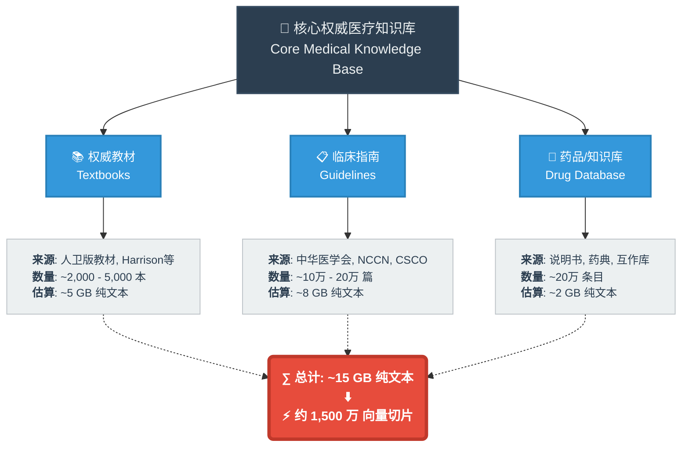
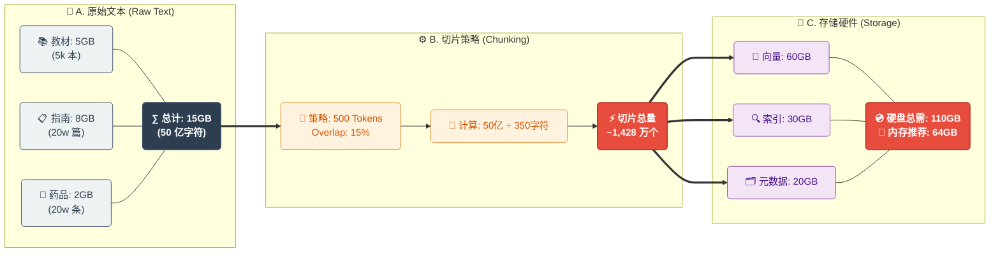

# Agentic-RAG-Medical-care-Assistant
## 这是一个目的是为用户提供
## 优势：
### 1. 更适合医疗的“多步推理 + 多轮补问”
### 医疗诊断天然不是一次问答能完成：需要补齐关键信息（起病时间、危险信号、既往史、用药史、过敏史、妊娠等）。Agent 可以把目标拆成步骤：先做分诊/危险分层→再做鉴别诊断→再决定“还缺哪些信息”并发起追问→再检索/更新结论。非 agentic 往往在信息缺口时仍会硬答，或只能靠固定模板提问，灵活性差。
### 2. 可溯源的权威引用：回答附带来源与版本信息（指南/共识/医院科普等），用户与审核方都更容易信任、复核与更新。
### 3. 更强的分诊与安全护栏：把“红旗症状、必须线下、必须追问”的规则固化成规则库，比纯模型生成更稳定、可控、可审计。
### 4. 覆盖更广且易扩展：知识以结构化文档/模块化库沉淀（症状库、疾病库、检验库、用药安全库、生活方式库），新增科室与主题成本低。
### 5. 输出更贴近用户目标：在“科普 + 生活建议 + 就医建议”上更系统，能针对用户画像（成人/儿童/孕产等）自动调整提醒重点。
### 6. 对不确定性的处理更专业：信息不足时能明确列出“还需要哪些关键信息”和“在此之前的保守建议”，减少武断结论。
### 7. 更易做质量管理：知识、规则、提示词可版本化管理（更新、回滚、灰度），比传统“模型一升级就漂移”的体验更可控。
### 8. 可演进为工具化平台：后期接入检验单解析、药品相互作用检查、挂号导流、随访记录等工具时，agent 能自然编排调用，能力呈指数级增强。
### 9. 成本与性能可优化：高频问题走检索与模板化总结，减少大模型纯生成开销，同时提升一致性与响应速度。
### 10. 更适合监管与风控落地：可实现“内容分级、敏感主题降级、强制转人工/线下”等策略，并保留决策链路与引用证据，便于审计。
### Agent 能输出或内部保留：每个结论对应的指南/文献片段与引用。为什么排除某些诊断（缺少哪些关键特征）。下一步建议的依据（何种分诊等级、何种检查/就医时限）。这对医疗合规、质控、回溯非常关键；非 agentic 往往“答案像结论陈述”，过程弱、难审计。

可以处理用户的模糊描述，逐步引导用户给出完善信息，逐步缩小可能结果的范围
可以自然地处理检索返回的结果，给出较为专业、全面，并且接地气的回答返回给用户

2) 动态检索：按“假设”驱动查证据，而不是一次性搜一堆
Agent 能围绕候选诊断逐个检索：例如“胸痛”会分别检索 ACS/肺栓塞/主动脉夹层/胃食管反流等的红旗、关键鉴别点、处置建议。
还能根据用户补充信息重新检索并调整权重（例如出现“呼吸困难+单侧下肢肿胀”就上调肺栓塞相关证据）。
非 agentic 通常一次检索定生死，容易“检索偏了就一路偏”。

3) 更强的安全性：能把“先排危急”做成硬约束流程
医疗场景核心是风险控制。Agentic RAG更容易实现：

红旗症状优先策略（先问/先判急症）：意识障碍、严重呼吸困难、紫绀、颈强直、胸痛伴出汗等。
升级路径：满足条件就直接给出“急诊/120/线下就医”而不是继续闲聊。
自检与复核：回答前可触发“是否覆盖了禁忌/相互作用/特殊人群”的检查清单。
非 agentic 可以做，但往往要堆很多 if-else 规则，扩展性差。

4) 可解释性与可审计：过程化证据链更清晰
Agent 能输出或内部保留：

每个结论对应的指南/文献片段与引用
为什么排除某些诊断（缺少哪些关键特征）
下一步建议的依据（何种分诊等级、何种检查/就医时限）
这对医疗合规、质控、回溯非常关键；非 agentic 往往“答案像结论陈述”，过程弱、难审计。

5) 工具编排能力：把“医疗工作流”串起来
Agentic RAG天然适合把多个工具/模块编排成流程，例如：

症状结构化（主诉→伴随→既往史）
风险评分/规则引擎（如部分急症评分、药物相互作用检查）
多知识库检索（指南库、药品说明书库、院内路径、科普库分开检索）
生成“面向患者的解释版 + 面向医生的摘要版”
非 agentic 多为单一知识库+单次生成，工作流能力弱。

6) 个性化与持续对话：更接近真实问诊
Agent 可以维护“患者画像/上下文记忆”（慢病、用药、过敏、既往检查结果），让后续建议更一致。
能根据用户理解程度切换表达、给出分层解释与确认问题（teach-back）。
非 agentic 更像一次性客服问答。
7) 更好的“拒答/降级”机制
医疗里必须承认不确定性。Agent 可在证据不足时：

明确当前不确定点
给出最小风险建议（观察要点、何时就医、需要补充哪些信息）
引导到线下或医生复核
非 agentic 更容易在不确定时“编一个看似完整的结论”。

## 数据源：
<!-- #region 📊 数据源 (点击左侧箭头折叠) -->

<!-- #endregion -->

### 本项目不支持理解患者影像结果（如肺部ct功能）并输出诊断结果，此功能需要多模态支持的向两库如weaviate
### 虽然本项目没有使用海量教材，但实际应用中所有这些书籍经过分块后大概会有，同时病历等
<!-- #region 📊 数据量估算 (点击左侧箭头折叠) -->

<!-- #endregion -->

对于医院的场景来说，为了降低维护成本和人才需求，使用更简易的Qdrant会是不错的选择，但出于学习目的，作者偏向使用非分布式的milvus，也就是milvus standalone作为向量库

Milvus Standalone (Docker Compose) —— 强烈推荐
这是 Milvus 的单机版，它把原本分布式的核心组件打包在了一个 Docker 容器里，但外部依赖（Etcd, MinIO）还是保留的。

优点：
API 与分布式版 100% 一致： 你写的 Python 代码，以后无缝迁移到公司的千台服务器集群上，一行代码都不用改。
简历加分： 你可以说“熟悉 Milvus 的 Docker 部署与应用开发”。
资源占用： 8GB - 16GB 内存的电脑就能流畅运行。
操作： 去 Milvus 官网下载 docker-compose.yaml (Standalone版)，一键 docker-compose up -d 即可。

1. 强迫你理解“数据模型设计” (Schema Design)
Qdrant 的做法： 类似 MongoDB。你不需要预先定义数据结构，直接往里扔 JSON（Payload）。你可以第一条数据有 age 字段，第二条没有。
结果： 开发很爽，但你容易写出“烂数据”，且对内存消耗没有概念。
Milvus 的做法： 类似 SQL 数据库。建表（Collection）前，你必须严格定义 Schema：
主键是 Int64 还是 String？
向量维度是 768 还是 1536？
标量字段有哪些？数据类型是什么？
你学到了什么？
数据规范性： 在 AI 应用中，数据清洗和规范化是核心。Milvus 逼迫你在写代码前先想清楚数据结构。
内存估算： 你会直观地感受到：多加一个 varchar(512) 字段，在 1000 万数据量下会多占多少内存。这是做高性能 AI 应用必须具备的“成本意识”。
2. 深入理解“索引算法”的本质 (Index Tuning)
这是 Milvus 最硬核的学习价值所在。

Qdrant 的做法： 默认给你用 HNSW（目前最通用的索引）。大部分参数帮你调好了，你只需要管“能不能搜到”。
Milvus 的做法： 它把底层算法赤裸裸地展示给你。
它支持 10+ 种索引类型：FLAT (暴力搜), IVF_FLAT (倒排), IVF_SQ8 (量化压缩), IVF_PQ (积库量化), HNSW (图索引), DISKANN (磁盘索引)...
每种索引都要你配置参数：nlist, nprobe, m, efConstruction。
你学到了什么？
精度 vs 速度 vs 内存的权衡：
你会亲手测试发现：用 IVF_PQ 虽然省了 70% 内存，但召回率掉了 10%（搜不到精准答案了）。
你会明白：为什么 HNSW 虽快，但构建索引极慢且吃内存。
作为 AI 工程师，当你的 RAG 系统在生产环境变慢时，懂这些参数你才能调优，而不是束手无策。
3. 理解“一致性模型” (Consistency Levels)
这是一个非常高级的分布式系统概念，Milvus 把它暴露在了 API 层面。

场景： 你刚插入一条医疗指南，立马去搜，能搜到吗？
Qdrant 的做法： 通常是“最终一致性”或通过读写参数控制，感知不强。
Milvus 的做法： 允许你在查询时指定一致性级别：
Strong（强一致）：插进去必须立马能搜到（由于要同步，速度慢）。
Bounded（有界）：允许几秒延迟（速度快）。
Eventually（最终）：只管快，数据慢慢同步。
你学到了什么？
CAP 定理的实战应用： 你会深刻理解在“数据实时性”和“系统吞吐量”之间如何做取舍。这在面试系统设计（System Design）时是绝佳的谈资。
4. 真正理解“存算分离”与“依赖管理”
即使是 Standalone 版本，Milvus 也依赖两个外部组件：

MinIO (S3)： 存数据文件。
Etcd： 存元数据（配置、节点状态）。
Qdrant 的做法： 一个二进制文件搞定，内置了存储。
Milvus 的做法： 你必须用 Docker Compose 把这三个容器编排起来。
你学到了什么？
对象存储（Object Storage）思维： 你会发现 Milvus 里的向量不是存在内存里的，而是变成了 MinIO 里的一个个 Blob 文件。这让你理解了现代云原生数据库（如 Snowflake, Neon）的架构原理。
故障排查能力： 当 Milvus 起不来时，你得去查 MinIO 的日志，看 Etcd 是否健康。这种多组件联调的能力，是把 Demo 变成 Product（产品）的关键。

这是一个非常犀利且现实的问题。

为了不误导你，我需要把 AI 应用开发工程师（AI Application Engineer） 的工作职责拆解开来看。

简单的回答是：大约 40% 是你必须处理的，60% 是你不需要碰（也没资格碰）的。

但恰恰是那 40%，决定了你是月薪 15k 的“调包侠”，还是月薪 35k+ 的“AI 系统专家”。

以下是详细的职场现实划分：

一、 ❌ 你不需要处理的（属于 DevOps/平台部门）
在稍微正规一点的公司（或者你进入大厂后），以下 Milvus 相关的工作完全不归你管，甚至你连服务器权限都没有：

组件部署与维护： Etcd 挂了、MinIO 硬盘满了、Pulsar 消息积压了、K8s 节点宕机了……这些是 SRE（站点可靠性工程师） 或 基础架构组 的活。你只需要一个连接地址（URI）和 API Key。
集群扩容： 数据从 1 亿涨到 10 亿，需要加多少个 DataNode？这是架构师和运维的事。
数据安全性与备份： 医院数据的加密存储、每日冷备份、异地容灾。这是安全合规部门的事。
结论： 如果你在死磕怎么用 Docker Compose 编排 Milvus 的高可用集群，那确实是在浪费作为“AI 应用开发”的时间。

二、 ✅ 你必须处理的（属于 AI 应用工程师的核心职责）
以下这些看似“底层”的问题，在工作中会直接变成你的 OKR（关键绩效指标） 或 KPI。如果你不懂 Milvus 的原理，你根本没法完成任务：

1. "为什么检索速度这么慢？" -> 索引参数调优
场景： 你的医疗助手上线了，用户问一个问题，转圈转了 3 秒才出结果。产品经理（PM）跑来骂你：“体验太差了，必须优化到 500ms 以内！”
你的工作： 这时候运维帮不了你。你必须懂 Milvus 的索引原理。
你得把索引从 FLAT（暴力搜）改成 HNSW。
你得调整 ef 和 M 参数，在**召回率（准不准）和性能（快不快）**之间找平衡点。
如果不学： 你只能两手一摊说：“模型就是这么慢。”然后被裁掉。
2. "为什么搜出来的全是错的？" -> Schema 设计与分块策略
场景： 医生搜“高血压”，结果出来全是“低血压”的文档。
你的工作： 这是 RAG 最核心的部分。
你必须重新设计 Schema，增加 department（科室）、source_type（指南/病例/论文）等标量字段。
你必须决定：是存 512 token 的长文本，还是 128 token 的短文本？
你必须配置 Hybrid Search（混合检索） 的权重：关键词匹配占 0.3，向量相似度占 0.7。
如果不学： 你的 RAG 系统就是一个玩具，永远无法在医院落地。
3. "服务器内存不够了，成本太高！" -> 资源估算与量化
场景： 你们公司只有 2 台 32G 内存的显卡机器，你要存 5000 万条医疗数据。老板问你：“能不能塞进去？”
你的工作：
你必须知道 Float32 向量占多少空间。
你必须懂 IVF_PQ (乘积量化) 或 Binary Quantization，把向量压缩 4 倍甚至 32 倍，以牺牲一点点精度换取 90% 的内存节省。
如果不学： 你会申请几万块的服务器预算，被老板驳回，项目搁浅。
4. "刚上传的病例怎么搜不到？" -> 一致性级别管理
场景： 医生刚录入一个病人的新数据，立马点“分析”，结果系统报错说找不到数据。
你的工作： 你得知道 Milvus 的 Consistency Level。
默认可能是 Bounded（有延迟）。你得在代码里针对“刚刚写入就查询”的场景，临时把级别调成 Strong（强一致性）。
如果不学： 你会以为是 Bug，查代码查一天都查不出来，其实只是数据还没同步。
三、 总结：你的学习策略
回到你“一台电脑、找 AI 工作”的背景：

运维部署（Deploy）： 浅尝辄止。只要能用 Docker 把 Standalone 版跑起来就行，不要去研究 K8s、Etcd 的原理。
应用开发（Develop）： 深度钻研。
Schema 设计（怎么存数据才好搜？）
索引类型选择（HNSW 还是 IVF？）
混合检索实现（怎么结合关键词？）
内存/性能权衡（怎么省钱又快？）
一句话建议：
作为一个 AI Engineer，你不需要会修汽车发动机（运维 Milvus 集群），但你必须是一个顶级赛车手，你需要懂怎么调校引擎参数（索引、Schema、一致性），才能把这辆车（RAG 系统）开得比别人快、比别人稳。

所以，拿 Milvus Standalone 练手，重点练的是**“调校”**，而不是“修理”。

cross encoding

RAG粗排+重排

医疗全学科项目问诊流程：

询问患者哪里不舒服（比如喉咙痛），先缩小可能范围，然后返回会喉咙痛的匹配病症

根据喉咙痛这一特征查找到的可能病症，统计所有病症的症状数量出现次数，找出能排除很大数量可能病症的几个症状（比如不咽口水不痛，没有发烧能排除掉很多数量的可能病症）

询问患者引导患者回答（喉咙痛：会不会只有咽口水的时候痛呀？，或是会不会咳嗽，有没有发烧），对患者的口述进行匹配，找到专业化的对应名词并暂存

重复这个过程直到必须需要检查才可以确认，或是只剩下一个，或是只剩下几个但是可以用相同的药物治疗（最后这个待定）

如果患者上传了检测报告，读取图片检测异常值

通过传统

## 向量库构建
项目使用的数据源资料中，存在大量：照片或简笔画示意图、表格、坐标图、思维导图，
对于照片或简笔画示意图的处理

对于表格的处理

对于坐标图的处理

对于思维导图的处理：
