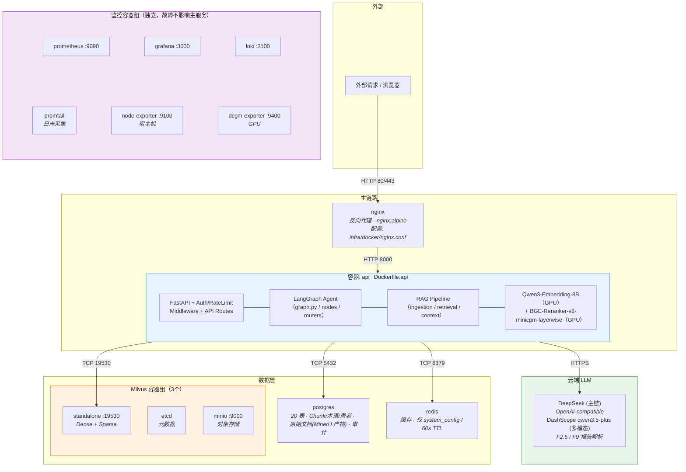
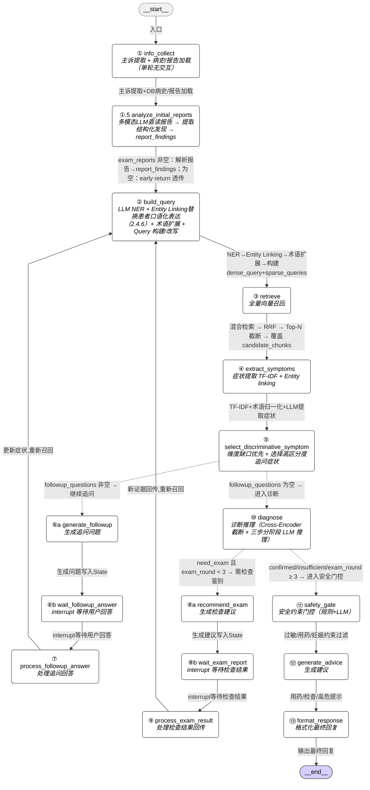
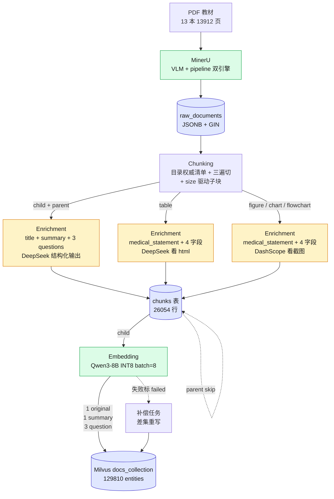
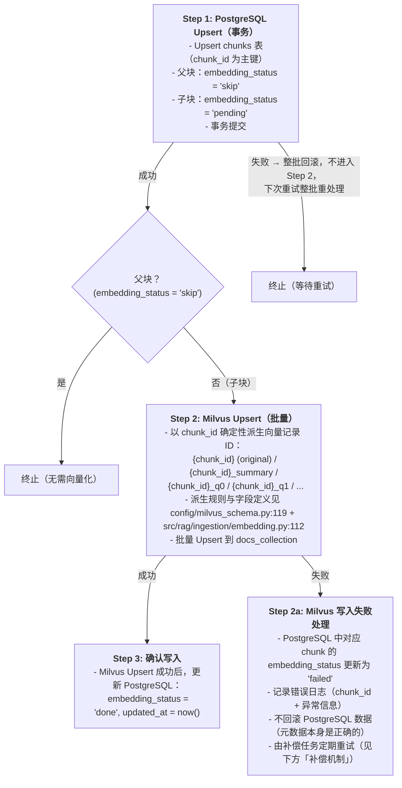
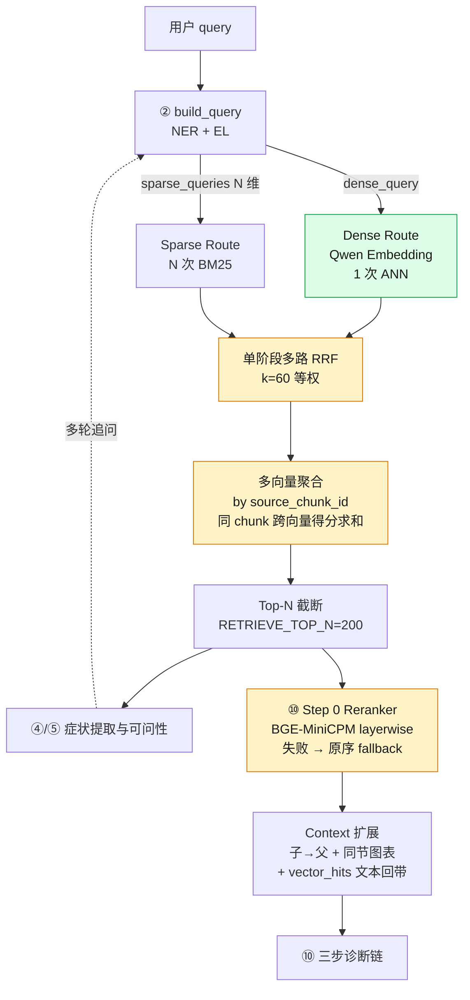

[简体中文](README.md) | [English](README.en.md)

# Agentic-RAG Medical Care Assistant

> 患者侧症状自查与分诊初诊系统 — 基于 LangGraph Agent + 多路检索 RAG。
>
> **个人练手项目**(非生产部署),涵盖数据工程 → ML 推理 → Agent 编排 → 后端 → 基础设施 → 评估的全栈端到端实现。
> 设计与实现完全 spec-driven,单一事实源:[DEV_SPEC.md](DEV_SPEC.md)(4976 行)。

---

## 目录

- [项目定位](#项目定位)
- [设计亮点](#设计亮点)
- [系统架构](#系统架构)
- [Agent 工作流](#agent-工作流)
- [RAG 流水线](#rag-流水线)
- [数据层](#数据层)
- [技术栈与选型理由](#技术栈与选型理由)
- [快速开始](#快速开始)
- [项目进度](#项目进度)
- [目录结构](#目录结构)
- [文档导航](#文档导航)
- [开发约定](#开发约定)

---

## 项目定位

**做什么**:用户用自然语言描述症状,系统通过多轮追问澄清病史、检索 13 本医学教材知识库、给出可能的诊断方向、必要时建议进一步检查、最终输出非诊断性的就医建议与风险提示。

**给谁用**:普通用户的初诊分诊指引(到底要不要去医院、挂哪个科)。**不是医生辅助诊断工具**,所有 LLM 输出都经过 `safety_gate` 节点二次过滤,严格规避诊断口吻和处方建议。

**不做什么**:影像识别、外科手术规划、儿科特化、药物剂量计算 — 这些场景下患者侧 RAG 价值有限,且需要专业模型(超出本项目范围)。

---

## 设计亮点

### 1. 全栈端到端自实现

| 层 | 我做了什么 |
|---|---|
| 数据工程 | MinerU 解析 13 本医学教材(13912 页 / 264948 block)→ 父子分块(2026-05 POC,12 本 mismatch=0)→ LLM enrichment(child + table + figure 三路 26054 chunks)→ 多向量化入 Milvus(129810 entities) |
| ML 推理 | Qwen3-Embedding-8B INT8 + BGE-Reranker-v2-minicpm INT8 共显单卡(16GB),Reranker 走 layerwise 早退,失败/超时 fallback RRF 原序 |
| Agent | LangGraph 16 节点 + 2 条件路由,内置追问 / 复检两个 `interrupt`/`resume` 闭环,纯函数路由 + 节点收敛状态变更 |
| 后端 | FastAPI + JWT + bcrypt + 滑动窗口限流(协议抽象,可切 Redis)+ 角色守卫;PostgreSQL 20 表 + Alembic 迁移 + 同事务双写审计 |
| 基础设施 | Docker Compose 13 容器编排(Milvus + PG + Redis + Prometheus + Grafana + Loki + Promtail + Node/DCGM Exporter + Nginx)+ Nginx `X-Real-IP` 透传保限流可用 |
| 工程过程 | Spec-driven 开发,4976 行 DEV_SPEC 为单一事实源;`.claude/skills/auto-coder/` 自研 skill 把 spec 转换为可执行任务;CLAUDE.md 锚定契约红线 |

### 2. 多路 RRF 自调节权重

不是常见的"先 dense 再 sparse 后 rerank"流水,而是 **单阶段多路 RRF**:

- Sparse 路按症状维度拆 — N 个症状维度词袋 = N 次独立 BM25(不是把所有词拼成 1 个 query)
- Dense 路只 1 次 ANN
- 全部展开成 (N+1) 路一起做 RRF

效果:某 chunk 命中维度越多,获得的 `1/(k+rank)` 求和越大 — **跨模态权重自调节,不需要手调 dense:sparse 比例**。详见 [DEV_SPEC §3.2.2](DEV_SPEC.md#322-召回)。

### 3. 多向量索引 + 字段召回画像

每个 chunk 入库 1 original + 1 summary + 3 hypothetical question 向量(共约 5 倍膨胀):

| vector_type | 主要捕获 | 弥合 |
|---|---|---|
| `original` | 整体语义 + BM25 关键词 | 患者描述与原文术语 |
| `summary` | 方法论 / 综述类查询 | "X 是什么 / 用来干嘛" |
| `question` × 3 | 患者口语 + 场景化代入 | "我爸爸喘得厉害爬楼困难" |

设计哲学:**单条向量的任务不是回答 query,只是让 chunk 进入 Top-200 候选池**,Reranker 看完整 `chunk_raw_text` 重排,与命中哪条向量无关。详见 [DEV_SPEC §3.1.5.1](DEV_SPEC.md#3151-字段召回画像enrichment-字段如何被召回命中)。

### 4. Small-to-Big 父子索引

医疗知识天然分层(疾病 → 亚型 → 治疗方案 → 剂量/禁忌)。小块精确命中"剂量"时禁忌可能在同节另一小块,直接送 LLM 会**危险遗漏**。本项目:

- 父块按"书的目录权威清单 + 节内三遍切【】+(一)+1."切,**不向量化**(`embedding_status='skip'`),仅作 Small-to-Big 展开 context
- 子块按 size 驱动累积切(目标 ~600 字),独立向量化
- 召回命中子块 → 按 `parent_chunk_id` 回查父块全文一并送 LLM
- **不变量**:`total_parent_len == total_child_len`(POC 验证 12 本 mismatch=0)

详见 [DEV_SPEC §3.1.2](DEV_SPEC.md#312-chunking目录权威清单--三遍切--size-驱动子块)。

### 5. 单卡共显错峰

RTX 5070 Ti 16GB 同时承载 Embedding 8B INT8(~8.5GB)+ Reranker 2.4B INT8(~2.6GB),共 ~11GB,留约 4.6GB 给推理激活值。可行性建立在 **负载天然错峰**:Embedding 在文档摄取时批跑,Reranker 在用户查询时实时跑。LLM 走云端 API(DeepSeek + DashScope)不占 GPU。详见 [DEV_SPEC §2.1 / §2.3](DEV_SPEC.md#21-embedding-模型选型)。

### 6. 多模态摄取流水线(文本 + 表格 + 图表)

不是只切文本 — `chunks` 表用 **单行多列 + chunk_type** 设计统一容纳三类:

- `child` / `parent`:正文文本(`chunk_raw_text` 主)
- `table`:caption + html + footnote(BM25)+ text LLM 看 html 生成 100-300 字 `medical_statement`(dense `original`)
- `figure`:caption + footnote(BM25)+ vision LLM 看截图生成 `medical_statement`(dense `original`)

图表 chunk 共享父块的 `heading_path_id`,在召回时通过 **同节图表跟随父块**(规则 3,封顶 5 条)的回拉机制保证图表必然被带出来。详见 [DEV_SPEC §3.1.2 / §3.2.3](DEV_SPEC.md#312-chunking目录权威清单--三遍切--size-驱动子块)。

### 7. 三层幂等 + 补偿,而非分布式事务

写库顺序 PG → Milvus 串行,**不并行**(没有共享事务协调器)。`embedding_status` 字段(`pending → done / failed / skip`)兼任两阶段状态机:

- PG 写失败 → 整批回滚,无脏数据
- Milvus 写失败 → PG 标 `failed`,补偿任务定期扫描差集重写
- chunk_id 由 `SHA256(source_id : heading_path_id : relative_chunk_index)` 生成,Milvus 派生 ID(`{chunk_id}_q{n}`),**所有 upsert 全程幂等**

详见 [DEV_SPEC §3.1.4 / §3.1.6](DEV_SPEC.md#314-幂等性设计idempotency)。

### 8. 三步诊断链 + 整链路兜底

⑩ `diagnose` 节点做的不是"一次 LLM 出诊断",而是 **三步链**:

1. `EvidenceSheet` — 从 reranked chunks 提取候选疾病及其支持/反对证据
2. `DiagnosisRanking` — 基于证据表做鉴别诊断排序 + unaskable 条件推理
3. `DiagnosisOutput` — 用原始事实交叉验证,校准概率与标签一致性

任一步重试 3 次仍失败 → 整链短路到 `insufficient` 并写 `failure_reason="step_{N}_structured_output_failed: ..."`,**不允许把部分/空的中间结果喂给下一步**。⑩ 还有 Step -1 在 `followup_round >= MAX_FOLLOWUP_ROUNDS` 时直接短路。详见 [DEV_SPEC §4.1.2 ⑩](DEV_SPEC.md#41-agent工作流) + [§9.1 / §9.3](DEV_SPEC.md#9-全局实现契约跨章节)。

### 9. Safety Gate 作为硬性安全闸

⑪ `safety_gate` 不是事后检查,而是 ⑩ → ⑫ 之间的硬性闸口:

- 规则层:`allergy_history` 直接抽取过敏原 → 禁用同类药
- LLM 兜底:判断交叉过敏、妊娠/哺乳禁忌、药物相互作用
- 失败保守追加通用警告 — **绝不让 ⑫ 在缺少 `safety_constraints` 的情况下生成用药建议**

### 10. 全链路审计 — `rag_trace` 15 字段

每轮诊断在 PG 写入一行 `rag_trace`,含:

- `retrieved_chunks` / `reranked_chunks`(JSONB)
- `final_prompt` / `llm_raw_output`(失败兜底路径才填)
- `failure_reason` / `differentiation_type`
- `token_usage`(prompt/completion/total)
- `latency_ms`(intent/retrieval/rerank/llm_call/post_process/total)
- 90 天保留,GIN 索引支持按 chunk_id 反查影响面

实现风格刻意没有装饰器/helper,每个调用点裸写 try/except + 6 个 Prometheus 指标手动 `.inc()`/`.observe()` — 让重试与失败路径在代码里**显式可见**。详见 [DEV_SPEC §9.1 / §9.6](DEV_SPEC.md#9-全局实现契约跨章节)。

### 11. 运行时常量集中管理(§9.7 `agent_limits`)

所有阈值/上限统一在 `pydantic_settings.BaseSettings`,环境变量前缀 `AGENT_`:

| 常量 | 默认值 | 用途 |
|---|---|---|
| `MAX_FOLLOWUP_ROUNDS` | 8 | 追问硬上限 |
| `MAX_EXAM_ROUNDS` | 3 | 复检硬上限 |
| `MAX_FOLLOWUP_QUESTIONS` | 5 | 单轮追问问题数 |
| `RETRIEVE_TOP_N` | 200 | RRF 后截断 |
| `ASKABLE_GAIN_THRESHOLD` | 0.15 | 可问性增益下限 |
| `ENTITY_LINKING_TIER2_THRESHOLD` | 0.92 | terms_collection cosine 阈值 |
| `RERANKER_CUTOFF_LAYERS` | None(= 全 40 层) | layerwise 早退层数 |

业务代码必须 `from config.settings import settings` 读取,**禁止模块级 `MAX_X = 8`**。调参改 `.env` 不改代码。

---

## 系统架构

> 引自 [DEV_SPEC §1.3.3](DEV_SPEC.md#133-项目层级)。



---

## Agent 工作流

> 引自 [DEV_SPEC §4.1](DEV_SPEC.md#41-agent工作流) — 实线为正常顺序边,虚线为条件路由(`should_continue` / `diagnose_router`)。



> 易错点(实现时会反复遇到):
>
> - ⑥/⑧ 拆 `a`/`b` 两半,`interrupt()` 与 LLM 调用分离,resume 时 LLM 不会重发
> - `should_continue` 是 **纯函数**,不允许写 state(cap 处理放在 ⑩ Step -1)
> - ⑩ 三步链任一步失败 → 整链短路 `insufficient` + `failure_reason`
> - `present_illness_slots` 13 维度,空槽驱动 ⑤ 维度追问

---

## RAG 流水线

### 摄取(Ingestion)— 总体流水线



### 摄取 — PG → Milvus 写入流程(放大看)

> 引自 [DEV_SPEC §3.1.6.2](DEV_SPEC.md#3162-写入流程以-batch-为单位) — `embedding_status` 字段(`pending → done / failed / skip`)兼任两阶段状态机,不需要分布式事务。



### 检索(Retrieval)



---

## 数据层

PostgreSQL 20 表按职责分四组,完整 SQL DDL 见 [DEV_SPEC §2.4](DEV_SPEC.md#24-数据存储选型及具体设计):

| 分组 | 表 | 用途 |
|---|---|---|
| 用户 / 会话 | `users` / `sessions` / `conversations` | 账号 + 多轮问诊 |
| 患者档案(8 表) | `patients` / `medical_history` / `surgical_trauma_history` / `transfusion_history` / `allergies` / `medications` / `family_history` / `menstrual_reproductive` / `exam_reports` | 八大采集规范 |
| 知识库 | `sources` / `raw_documents` / `chunks` | MinerU 产物 + chunk 元数据 |
| 审计 / 配置 | `rag_trace` / `kb_change_log` / `config_change_log` / `diagnosis_feedback` / `system_config` | 90 天保留 + 同事务双写 |

---

## 技术栈与选型理由

| 层 | 选型 | 选型理由(摘要,详细见 [DEV_SPEC §2](DEV_SPEC.md#2-技术选型)) |
|---|---|---|
| Embedding | Qwen3-Embedding-8B(INT8,4096 维) | 8B 参数容量足够编码医学术语细粒度差异;C-MTEB 73.84 远超 BGE-M3;与 LLM 同源 tokenizer |
| Reranker | BGE-Reranker-v2-minicpm-layerwise(INT8) | MiniCPM 中文医疗最佳;cross-encoder 全交互弥补与 Qwen 异源;layerwise 提供精度/速度旋钮 |
| LLM 主链 | DeepSeek(`with_structured_output` `function_calling`) | 廉价 + 14 处结构化调用稳定 |
| LLM 多模态 | DashScope qwen3.5-plus | 报告解析专用,主链 deepseek 不支持视觉 |
| 向量库 | Milvus 2.5 standalone | HNSW + 内置 BM25(中文 analyzer);2.4+ 全文检索一站式,无需 SPLADE |
| 关系库 | PostgreSQL 16 | JSONB + GIN 容纳 MinerU 异构产物;ACID 事务保障双写一致 |
| 缓存 | Redis 7 | 仅缓存 system_config(60s TTL);**RAG 响应不缓存**(state 跨调用变化,query 跨患者会冲撞) |
| 编排 | LangGraph | 内置 interrupt/resume + checkpointer + thread_id 隔离 |
| Web 框架 | FastAPI + Pydantic v2 + uvicorn | 异步 + 自动 OpenAPI;`prometheus-fastapi-instrumentator` 自动 HTTP 指标 |
| 鉴权 | PyJWT HS256 + bcrypt + 角色守卫 | `require_role(*roles)` 工厂模式;限流 key 走 `user:<sub>` 退化 `ip:<addr>`(伪造 token 落 IP 桶) |
| 限流 | 自研滑动窗口(`Protocol` 抽象) | H6 切 Redis 只换实现不动业务 |
| 解析 | MinerU 2.5 | VLM(MinerU2.5-Pro 1.2B)+ pipeline(PDF-Extract-Kit)双引擎 hybrid auto |
| 监控 | Prometheus + Grafana + Loki + Promtail + DCGM | 应用/系统/GPU/日志全栈 |
| 反代 | Nginx | `set_real_ip_from + X-Forwarded-For` 透传客户端 IP 让限流可用 |
| 包管理 | uv + Python 3.12 + PyTorch 2.7 cu128 | Blackwell sm_120 仅在 cu128+ wheel |
| 测试 | pytest 三层 | unit(全 mock)/ integration(真 docker)/ e2e(真 LLM,J 阶段) |

---

## 快速开始

主路径 = 全 docker compose 一键起。host 跑 uvicorn 仅作为热重载调试备选。

```bash
# 1. 克隆
git clone https://github.com/<your-org>/Agentic-RAG-Medical-care-Assistant.git
cd Agentic-RAG-Medical-care-Assistant

# 2. 配置环境变量
cp .env.example .env
# 必填:
#   LLM_API_KEY            (DeepSeek)
#   LLM_VISION_API_KEY     (DashScope)
#   JWT_SECRET_KEY         (openssl rand -hex 32)

# 3. 起全栈(13 容器:nginx + api + 数据层 + 监控)
#    首次 build api 镜像 ~10-15 分钟(下 PyTorch + nvidia-* wheels ~5GB)
#    需 nvidia-container-toolkit(GPU 透传给 api / dcgm-exporter)
docker compose up -d --build
docker compose ps                            # 全 healthy 才算就绪

# 4. 初始化数据库 schema(20 张表 + 索引,首次部署一次)
docker compose exec api alembic upgrade head
```

**验证**(经 nginx 80):

```bash
curl http://localhost/healthz                # {"status":"ok"}
curl -i http://localhost/readyz              # 200 + x-trace-id header
curl http://localhost/metrics | head         # Prometheus 业务指标
curl -X POST http://localhost/auth/register \
  -H 'content-type: application/json' \
  -d '{"email":"a@b.com","password":"hunter22","role":"patient"}'
# → {"access_token":"...", ...}
```

打开 `http://localhost:3000`(admin/admin)→ Dashboards → "Medical RAG" → "应用性能" / "硬件资源" 实时大盘。

**热重载开发**(改 src/ 想立刻看效果时):

```bash
# 主 compose 起依赖,api 在 host 跑(可热重载 + IDE debugger)
docker compose up -d postgres redis milvus-standalone prometheus loki grafana promtail node-exporter dcgm-exporter
uv sync
source .venv/bin/activate
uvicorn src.api.app:app --host 0.0.0.0 --port 8000 --reload

# 想用 nginx 反代到 host uvicorn(让限流 / trace_id 链路也走通):
docker compose -f docker-compose.yml -f docker-compose.demo.yml up -d nginx
```

---

## 演示

> 待补:curl 端到端调用截图 / Grafana 监控大盘截图 / (可选)前端 UI。

---

## 项目进度

详见 [DEV_SPEC.md §8.4 进度跟踪表](DEV_SPEC.md#84-进度跟踪表)。截至 2026-05-14:

| 阶段 | 内容 | 状态 |
|---|---|---|
| A | 工程骨架与基础设施基座 | 完成 |
| B | 数据层与模型客户端 | 完成 |
| C | Ingestion Pipeline | 主流程跑通(13 本灌库),production 化收口待补 |
| D | 术语库 + Entity Linking | ICD-10 灌库完成,口语词表待补 |
| E | Retrieval(Sparse / Dense / RRF / Reranker / Filter) | 完成 |
| F | Agent 工作流(16 节点 + 2 路由) | 完成 |
| G | API 层与权限系统(7 项) | 完成 |
| H | 基础设施增强(Redis / Prometheus / Grafana / Loki / DCGM) | 完成 |
| I | 评估体系(RAG / Agent / LLM Judge / 在线追踪) | 待开始 |
| J | 端到端验收与文档收口 | J0(Docker 化部署)完成,J1-J6 待开始 |

**测试覆盖**:unit 355 PASS / integration 71 PASS(真 PG + Milvus + Redis)/ e2e 留 J1-J4;skip 17(GPU 模型 + 已知 Milvus race)。

---

## 目录结构

```
.
├── DEV_SPEC.md              # 4976 行设计规范(单一事实源)
├── CLAUDE.md                # AI 协作工作流与契约红线
├── pyproject.toml           # uv 依赖,锁定 cu128 wheel index
├── docker-compose.yml       # 数据层 + 监控基础设施(13 容器)
├── docker-compose.demo.yml  # ⚠️ DEPRECATED 自 J0,仅 host 热重载调试用
├── .dockerignore            # docker build 上下文排除(J0)
├── alembic.ini              # 数据库迁移配置
│
├── src/
│   ├── agent/               # LangGraph 16 节点 + state.py + graph.py
│   │   ├── nodes/           # ① info_collect ~ ⑬ format_response
│   │   ├── routers/         # should_continue / diagnose_router
│   │   └── utils/           # patient_repo / report_parser / chunks_lookup
│   ├── rag/
│   │   ├── ingestion/       # MinerU loader / chunking / enrichment / embedding / idempotency
│   │   └── retrieval/       # query_processing / sparse / dense / fusion / reranker / metadata_filter
│   ├── api/                 # FastAPI app + routes + middleware
│   │   ├── routes/          # auth / diagnosis / patient / admin
│   │   ├── middleware/      # auth_middleware (JWT) + rate_limiter (滑动窗口)
│   │   └── schemas/         # Pydantic request/response
│   ├── db/
│   │   ├── milvus/          # docs_collection + terms_collection
│   │   └── postgres/        # ORM(20 表)+ Alembic versions/
│   ├── models/              # Embedding / Reranker / LLM 客户端封装
│   ├── prompts/             # ingestion + agent 14 prompt builders
│   └── common/              # metrics(§9.1)/ hashing / normalize
│
├── config/
│   ├── settings.py          # pydantic-settings(含 §9.7 agent_limits)
│   ├── milvus_schema.py     # 双 collection schema
│   └── logging_config.py
│
├── terms/                   # ICD-10 术语库构建(40k 条)
├── scripts/                 # MinerU 批解析 / chunking POC / DB 灌库
│   ├── METHODOLOGY.md       # Chunking POC 通用方法论
│   ├── batch_parse_pdfs.sh
│   ├── enrichment.py
│   ├── load_*.py            # PG / Milvus 灌库
│   └── poc_chunking_*/      # 12 本书 POC 切分结果
│
├── infra/
│   ├── docker/              # nginx.conf
│   ├── prometheus/
│   ├── loki/
│   └── promtail/
│
├── evaluation/              # I 阶段评估(待补)
└── tests/
    ├── unit/                # 280 PASS(全 mock)
    ├── integration/         # 71 PASS / 17 skip(真 PG + Milvus + Redis)
    └── e2e/                 # 真 LLM API(J 阶段)
```

---

## 文档导航

- [DEV_SPEC.md](DEV_SPEC.md) — 完整设计规范
  - [§1 项目总览](DEV_SPEC.md#1-项目总览)
  - [§2 技术选型](DEV_SPEC.md#2-技术选型)(Embedding / Reranker / LLM / 数据存储的 why)
  - [§3 RAG 系统设计](DEV_SPEC.md#3-rag系统设计)(摄取 / chunking / enrichment / 多向量 / 召回 / 精排)
  - [§4 Agent 设计](DEV_SPEC.md#4-agent设计)(State / 16 节点详解 / 上下文管理)
  - [§5 基础设施](DEV_SPEC.md#5-基础设施)(性能 / 监控 / 管理)
  - [§6 评估](DEV_SPEC.md#6-评估)(RAG 离线 / Agent 离线 / LLM Judge / 在线)
  - [§9 全局实现契约](DEV_SPEC.md#9-全局实现契约跨章节) — **跨章节工程契约**(LLM 调用模板 / Pydantic schema / 运行时常量 / 审计字段)
- [CLAUDE.md](CLAUDE.md) — AI 协作工作流、架构规约、契约红线
- [scripts/METHODOLOGY.md](scripts/METHODOLOGY.md) — Chunking POC 通用方法论

---

## 开发约定

1. **写代码前先定位 spec 章节**,代码 docstring 引用 `DEV_SPEC §X.Y`。无 spec 章节先与用户确认,不要凭空发明设计。
2. **触碰 LLM 调用 / Schema / 运行时常量 / 审计写入**时,先扫 §9 全局契约。详见 [CLAUDE.md](CLAUDE.md) "Sweep §9 before implementing"。
3. **修 spec 后必须跑** `python .claude/skills/auto-coder/scripts/sync_spec.py` 同步 `.claude/skills/auto-coder/references/`。**不要直接编辑** `references/*.md`,会被覆盖。
4. **添加依赖改 `pyproject.toml`** + `uv sync`,不要直接 `uv pip install`(环境不可复现)。
5. **常量集中**:业务代码 `from config.settings import settings` 读 `settings.agent_limits.X`,**禁止** `MAX_X = 8` 模块级常量。
6. **测试位置**:所有 `test_*.py` 必须在 `tests/{unit,integration,e2e}/` 下,不要散落到 `scripts/`。重资源测试用 `pytestmark = pytest.mark.skipif(...)` 不要移出 tests。

---

## License

[MIT](LICENSE)
